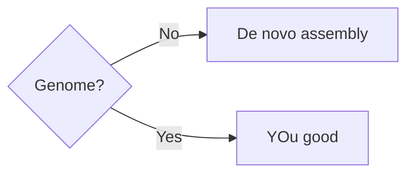
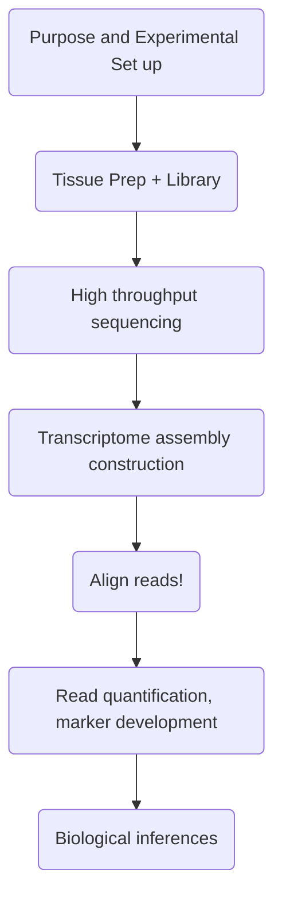
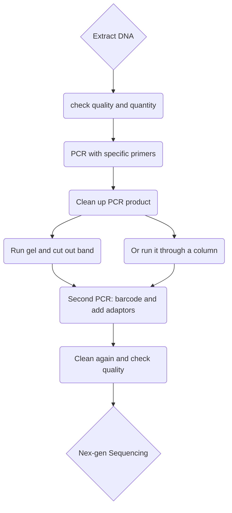
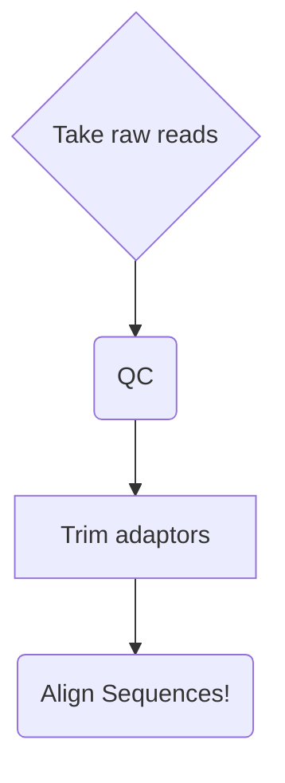
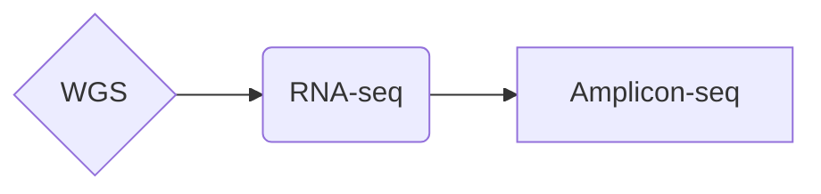
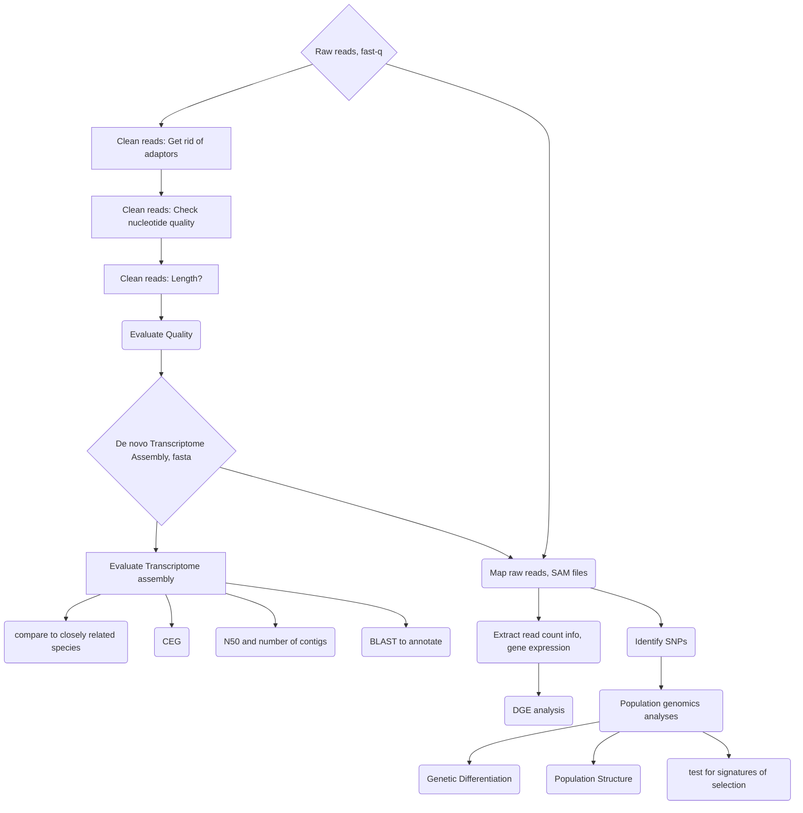
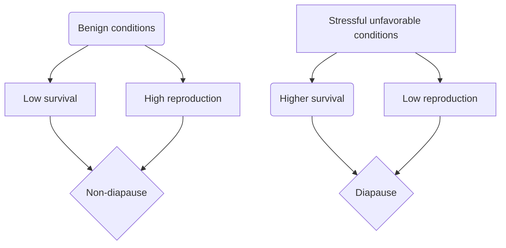
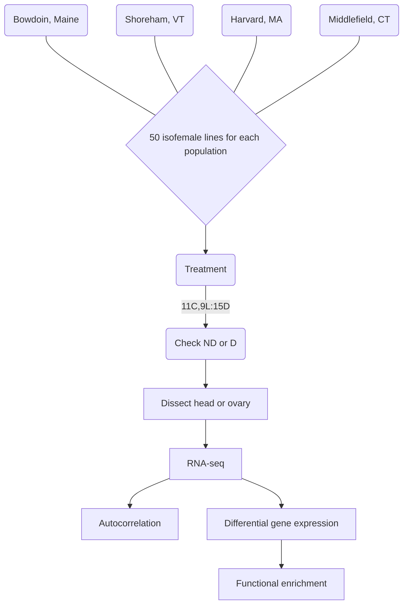
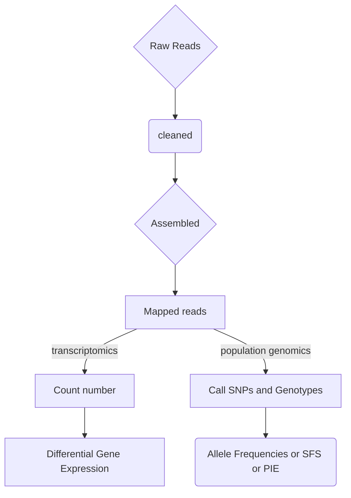

# 2017 Ecological Genomics Course

### Author: ANTdrew D. Nguyen     


## Overall Description of notebook      
I am the teaching assistant, but I will follow the tutorials and log what I've done here. 

## Date started: (2017-01-18)   
## Date end:   ongoing    

## Philosophy   
Science should be reproducible and one of the best ways to achieve this is by logging research activities in a notebook. Because science/biology has increasingly become computational, it is easier to document computational projects in an electronic form, which can be shared online through Github.    


<a rel="license" href="http://creativecommons.org/licenses/by/4.0/"></a><br />This work is licensed under a <a rel="license" href="http://creativecommons.org/licenses/by/4.0/">Creative Commons Attribution 4.0 International License</a>.  


### Table of contents for 60 entries (Format is *Page: Date(with year-month-day). Title*)        
* [Page 1: 2017-01-18](#id-section1). First class; intros
* [Page 2: 2017-01-20](#id-section2). Readings for 2017-01-23 Monday    
* [Page 3: 2017-01-23](#id-section3). Week 2, Day 2, course notes
* [Page 4: 2017-01-25](#id-section4) . Week 2, Day 3, class notes (paper discussions and student project development)
* [Page 5: 2017-01-30](#id-section5). Week 3, Day 4, class notes , Group presentations of project ideas
* [Page 6: 2017-02-01](#id-section6). Week 3, Day 5, command line stuff
* [Page 7: 2017-02-03](#id-section7). Installing trinity onto UVM cluster
* [Page 8: 2017-02-06](#id-section8). Week 4, Day 6, RNA-seq
* [Page 9: 2017-02-08](#id-section9). Week 4, Day 7, RNA-seq cont'd + paper discussion DePanis et al. 2016; MolEco
* [Page 10: 2017-02-10](#id-section10). Prepping for leading journal club discussion: 2015-02-15; Zhao et al. 2016; *MBE*
* [Page 11: 2017-02-13](#id-section11). Week 5, Day 8, RNA-seq mapping and paper discussion: Johnston et al. 2016, *Molecular Ecology*
* [Page 12: 2017-02-15](#id-section12).  Week 5, Day 9, Sam info update, ANBE paper discussion, Zhao et al. 2016; *MBE*
* [Page 13: 2017-02-22](#id-section13). Week 6, Day 10, RNA-seq and paper discussion; Dixon et al. 2016; Genomic determinants of coral heat tolerance across latitudes.
* [Page 14: 2017-02-27](#id-section14).  Week 7, Day 11, RNA-seq and paper discussion (Edwards et al. 2016; *PNAS*)-phylogeography; Scott  Edwards visit
* [Page 15: 2017-03-06](#id-section15). Week 8, Day 13, Population genomics; paper discussion- Gayral et al. 2013
* [Page 16: 2017-03-08](#id-section16). Week 8, Day 14, Population genomics part 2; Paper Discussion- [Romiguier et al. 2014](http://www.nature.com/nature/journal/v515/n7526/full/nature13685.html)
* [Page 17: 2017-03-20](#id-section17). Week 9, Day 15, Population genomics part 3; paper discussion Gompert et al. 2014
* [Page 18: 2017-03-22](#id-section18). Week 9, Day 16, Population genomics part 4; paper discussion; Inferring Demographic processes with SNPs
* [Page 19: 2017-03-27](#id-section19). Week 10, Day 17, Population genomics-detecting signatures of natural selection; selection scans; paper discussion- Laurent et al. 2016, MolEco
* [Page 20:](#id-section20).
* [Page 21:](#id-section21).
* [Page 22:](#id-section22).
* [Page 23:](#id-section23).
* [Page 24:](#id-section24).
* [Page 25:](#id-section25).
* [Page 26:](#id-section26).
* [Page 27:](#id-section27).
* [Page 28:](#id-section28).
* [Page 29:](#id-section29).
* [Page 30:](#id-section30).
* [Page 31:](#id-section31).
* [Page 32:](#id-section32).
* [Page 33:](#id-section33).
* [Page 34:](#id-section34).
* [Page 35:](#id-section35).
* [Page 36:](#id-section36).
* [Page 37:](#id-section37).
* [Page 38:](#id-section38).
* [Page 39:](#id-section39).
* [Page 40:](#id-section40).
* [Page 41:](#id-section41).
* [Page 42:](#id-section42).
* [Page 43:](#id-section43).
* [Page 44:](#id-section44).
* [Page 45:](#id-section45).
* [Page 46:](#id-section46).
* [Page 47:](#id-section47).
* [Page 48:](#id-section48).
* [Page 49:](#id-section49).
* [Page 50:](#id-section50).
* [Page 51:](#id-section51).
* [Page 52:](#id-section52).
* [Page 53:](#id-section53).
* [Page 54:](#id-section54).
* [Page 55:](#id-section55).
* [Page 56:](#id-section56).
* [Page 57:](#id-section57).
* [Page 58:](#id-section58).
* [Page 59:](#id-section59).
* [Page 60:](#id-section60).

------
<div id='id-section1'/>
### Page 1: 2016-07-18. Ecological genomics, first class

### **Steve and Melissa's intro**    
* Steve: It is a young field, trying to establish it's own identity    
  * Ecological genomics institute, KSU: emphasis on adaptation to environment   
  * Gordon Research Conference: Integrating different levels of biological organization on **ANY SYSTEM**; approach and tool focused! Field going towards new data and new analytic techniques  
  * Intro to eco genomics, oxford press; Using technology to address ecological issues such as nutrient cycling, population structure, life history vairation , trophic interaction, stress responess, and adpatation to environmental change   

* DATA driven: next gen sequencing revolutionizes biology
  * creats a new problem--large datasets!!! how to make sense? 
  * not data limited and potentially computationally limited   

* Where is the field headed    
  * Molecular Ecology Journal(flagship journal representative o the field)  
    * ALL systems:  corals, protists, daphnia, coral, lemurs, dandelions, steve studies trees 
    * model organism constraint disappearing!   
  * What types of questions are asked?  
    * How do genes correspond with circadian rythm?  
    * How does the microbiome influence the organism? 
    * How does epigenetic variation influence evolutionary responses? or contribute to phenotypic variation?  
    * What are the patterns of genetic diversity that can give us insights on population dynamics?  
    * What are constraints and tradeoffs and genetic mechanisms of traits? 

* Methods?   
  * De novo genome assembly; sequencing a DNA book from scratch!!    
    * RNA-seq; transcriptomic profiling     
  * 16 s metagenomic sequencing      
  * Rad-seq/GBS for estiamting population structure and genetic diversity     

* Proccesses studied?    
  * All evo and eco stuff; speciation, hybridization, local adaptation, genetic basis of local adaptation, genetic architecture of complex phenotypes, genes controlling host-pathogen evolutionary dynamics, pop structure, gene flow, epigenetics     

* Goals of the course!    
  1. Learn how ecology and genomes shape each other   
  2. Think creatively about major questions, and pose testable hypotheses to those questions using appropriate genomic data    
  3. Think about careful experimental design and statistical analysis---shown by reading papers   
  4. Achive working knowledge and level of comfort for bioinformatics routines for ecological genomics studies   

  ### Melissa background  

**Background, what drove Melissa and Steve to ecological genomics?**       

Melissa read a cool paper that scales from analyzing a few loci to the whole genome.   

One figure popped out at her, FST (developed by Sewell Wright) histogram.   FST of 1= complete differentiation, FST of 0 = no diff. FST described as **Alleles in space**. From this histogram, Melissa was struck by how you can separate out neutral from selective ones.  

Melissa has a data set with 96 sea stars and then the 16s microbiome. Would be cool to see if there is heritability in some bactera

### Steve background   

* Inspired by Yanis Antonivics (an **OG**)   
* At the time, just so stories: **Adaptatationist programme**    
  * Just go out and go by feeling in a natural history way and prescribe an adaptation story   
  * Janis wrote a creed to quantify the operational relationship between traits, environment, and genetics     
* Yanis was on Steve's committee and Steve was interested in adaptation with respect to invasion biology because organisms need to respond to novel environments     
  * Phenotypes can relate to the environment, but what is the genetic basis of local adaptation (in situ)? There are other confounding issues: demographic effects, plasticity     
* Steve thinks about environment-phenotype-genetics triangle. Basically a path diagram that feeds back on each other.    
  * Relationship between genes and phenotype ---GWAS (Genome wide association study)    
  * Relationship between genetics and environment --- Fst, clines between allele frequencies and environment    
* Invasion history is tough because of demographic history    
* He decided to focus on trees; large population size, straddle huge environmental gradients so the opportunity for selection is high   
  * positive relationship between Growing season length and traits    
  * Did a  reciprocal transplant of different populations to identify the extent of local adaptation in large established common gardens    
  * SK does GBS (genotype by sequencing)      
  * Problem with field: validating key gene candidates            


------
<div id='id-section2'/>
### Page 2: 2017-01-20. Readings for 2017-01-25 Monday    

First, showing how I structured the readings in the repo: 

1. In the terminal, change directory into your repo

```
cd Teaching/2017_Ecological_Genomics/
```

For fun, list the items in your repo
```
ls
01_data				Online_notebook.md
02_scripts			README.md
03_results_output		index.Rmd
04_tutorials			index.html
2017_Ecological_Genomics.Rproj	index.pdf
ANBE_notebook.md		papers

```

2. Now use tree command to extract hierarchical layout     

```
tree
.
├── 01_data
├── 02_scripts
│   └── RasterPCA_demo.Rmd
├── 03_results_output
│   └── RasterPCA_demo.html
├── 04_tutorials
├── 2017_Ecological_Genomics.Rproj
├── ANBE_notebook.md
├── Online_notebook.md
├── README.md
├── index.Rmd
├── index.html
├── index.pdf
└── papers
    └── 01_week
        └── 01_Day_Monday_2017-01-25
            ├── Ellegren_2014.pdf
            ├── Lee_gould_stinchcombe_2014_AoB_PLANTS.pdf
            └── Rockman-2012-Evolution.pdf

```

So my plan is to place my papers in the "papers" directory, within a particular week, and then within a particular day number of the course that is annotated with the actual day and date.  

### Now paper notes:    

1. Genome Sequencing and population genomics in non-model organisms ; Hans Ellegren    

   * 3 important achievements in bio over the past century: modern synthesis(evolutionary theory), mol bio, and "omics" era   
     * Good example of how biologists can get carried away with "omics" or "omes"   
     * peptidome, degradome,     
   * Basically,  because we can sequence everything we can collect, we can study non-model organisms like never before.  
   * In fact, many genomes are sequenced   
   * Bird example: Chickens were sequenced first, then zebra finch, then a bunch of others, highlighting the rapid ability to sequence genomes   
   * Genomic information is nice because it can tell you how loci are arranged. Example, recombination can be better studied by knowing the arrangement of chromosomes.   
   * Having genomic sequences allows for us to compare the repertoire of genes and the actual sequences themselves. (birth and death evolutionary procceses in homologues; tests for positive selection)

2. Identifying the genes underlying quantitative traits: a rationale for the QTP programme; Lee et al. 2014
   * QTN = quantitative trait nucleotide; associating single nucleotides with quantitative traits    
   * Critical question: What is the molecular basis for adaptation? particularly in non-model organisms
   * Response to Rockman 2012 paper    
     * Rockman's major criticisms: Effect of nucleotide on traits can be overestimated    
       * large effect variants are rare and most complex traits are polygenic    
   * Travisano and Shaw 2013 raise the criticism that you don't need QTN's to focus on the patterns and process of adaptation    
     * knowing molecular basis has not illuminated the proceess of adaptation!    
   * 5 reasons why we should care about QTNs     
     1. Vertical Integration: nucleotide to ecosystems        
     2. Parallel evolution and pleiotropy     
     3. Maintenance of standing genetic variation    
     4. Role of standing genetic variation in adaptation     
     5. Understanding the role of genomic architecture in adaptation      

------
<div id='id-section3'/>
### Page 3: 2017-01-23. Day 2, course notes      

### Course materials    
-Papers- info updates, and discussion papers; students need to sign up   	


**Add definitions as you see it**    

**Info update rubric**    
* Outline   
* 20 min   
* Learning/engaging activity   
* use board effectively   
* take home messages    
* samples from the literature   

### Glossary:     

*Reads*: a length of sequenced DNA      
	* short = 50 bps; long = 100, 150, 300, 10,000-60,000 bps     
	* could be single or pair-end ( 1 strand or both strands)    


### Melissa info update: 
1. Advances of sequencing technologies    
2. Range of Applications   
3. General workflow (usually involving building libraries to be sequenced )    
4. Sequencing by synthesis (SBS)     
5. Other technologies of SBS    
6. Learning activity    

### 1. Advances of sequencing technologies    

Good example was the human genome project:   

* finished in 2001 or 2003 or so   
* used with sanger sequencing on ABI platform   
* it took **15 years of intense effort** for 1 person's genome at the cost of $3 billion dollars

Then, Illumina released Hi seq X Ten sequencer in 2014   
* **In a single day, they could sequence 45 whole geomes for $,1000 for each!!!**   
* 90% of global data now       

* Good example of how costs went down, but data went up!     

Illumina sequencing:   
Similar to sanger but fluorescence can be observed across a whole "field".   

### 2. Range of Applications     

1. Whole genome sequencing    
2. RNAseq    
3. Chip-seq    
4. Capture-sequencing; design probes and hybridize it with sample (it is targeted)        


### 3. General workflow (usually involving building libraries to be sequenced )    

Step 1: Goal-oriented; which platform to use?   

* where genetic variation is    
  * Phenotypes     
  * number of samples
  * population    
  * individual   
  * comparative study? closely related species?    
  * model organism or not?   
* demographic history?     
* adaptive gentic variation     
* gene expression variation under common garden conditions?   


**Trade-offs in doing the actual sequencing**   
* length of reads     
  * long reads are easier to assemble(piece genomic regions together)       
* # of reads    
  * 10 million per individual?  target capture does not need too many reads    
* how read are distributed along the whole genome      


**Actual workflow now** 

1. Extract DNA or RNA(this needs to be converted into cDNA)   
2. Fragment sample (break it into smaller junks)    
3. Ligate adapters on the ends 
   * Often barcoded to identify samples/individuals      
4. Add on sequencing adaptors      
5. PCR amplification        

### 4. Sequencing by synthesis (SBS)     

1. DNA with different adapters   
2. get loaded into 1 of 8 lanes in a flowcell   
3. flowcell have oligos that match the sequencing adaptors; so DNA attaches to it! (P5 and P7)    
4. Bridge amplification: bend over and amplify, back and forth, over and over    
   * creates a clustered generation; sequence of the exact same sequence locally as a dot    
5. Incorporates labeled A T G or C, and then images are taken across the whole flowcell  

**Pac-bio's platform: Single molecule real time sequencing (SMRT)**     
1. DNA frag in a well, light penetrates in a small area to capture sequencing with long reads    

### 6. Learning activity    

1. pair with neighbor   
2. share ah-ha moments   
3. discuss some useful applications    


### Paper discussions  : Genome sequencing and population genomics in non-model organisms (Hans Ellegren )    

* Why would we use it ?    
* SK- we're generating tons of data, but what is the limit of space we can store it in ? (Short read archive)      
* NCBI, who curates the data? Wild west.      
* 10-15 gbs for 1 file of in gzip format    
* Table 1; 2200 eukaryote genomes vs 600 listed in this paper     
* How do people choose which genome to sequence? politics   
* Can people ID species based on WGS?   
* Are there multiple references genomes assembled?    
* From a single individual, do people overlay as many omics as possible? Integrate proteome, PTMs, metabolome, phenotypes, etc    

### The future! Moving forward    
* 1 week from today, do a blitz on the different library preps (4 different ones)      
  * 4 diff info updates    
* 2 volunteers to discuss QTN programme.    
* Each student, 1 discussion leader and 1 info update!   


 

------
<div id='id-section4'/>
### Page 4: 2017-01-25. Week 2, Day 3, class notes (paper discussions and student project development)

**Tasks**

One of my duties is to populate the glossary on blackboard. (I'll do it here for redundancy too.)


**Restructured course layout**: 

```
.
├── 01_data
├── 02_scripts
│   └── RasterPCA_demo.Rmd
├── 03_results_output
│   └── RasterPCA_demo.html
├── 04_tutorials
├── 2017_Ecological_Genomics.Rproj
├── ANBE_notebook.md
├── Online_notebook.md
├── README.md
├── index.Rmd
├── index.html
├── index.pdf
└── papers
    └── 01_week
        ├── Ellegren_2014.pdf
        ├── Lee_gould_stinchcombe_2014_AoB_PLANTS.pdf
        └── Rockman-2012-Evolution.pdf
 6 directories, 12 files
```

It better reflects how the reading is done throughout the week.    

### Course outline

1. Announcements: 
   * BB acceess: add through audit
   * Sign-ups   
   * Glossary: Whoever is doing info update must come up with a list of key terms!      
2. Info update ~ QTN   
3. Debate-style discussion 
4. BREAK   
5. Group project discussion!   

### 1. Info update ~ QTN 

**Q: What are QTN's (Quantitative Trait Nucleotide)?**   

* **Quantitative genetic theory of adaptive traits**   
  * Additive genetic variance and heritability 

QTN is the most reductionist you can get. The individual SNPs that contribute to the variation in a trait. Usually traits under selection and confer adaptation.  

Traits!

	1. flowering time
	2. flower color
	3. thermal tolerance 
	4. venom potency
	5. defense or secondary compounds in plants  
	6. toxin tolerance  
	7. drought tolerance 
	8. altitude tolerance (hypoxia)

They are quantitative, and are continuous. They have a mean and variance. **Not descrete phenotypes**. Discrete phenotypes are mendelian (major effect loci) .   

Modern synthesis (Fischer, Haldane, WRight).  Connect alleles with trait distribution. 

ex:  allele:trait

AA = 1

Aa = 2

aa = 3

The difference between Aa and aa = average effects or alpha (1).

AA = q^2 

Aa = 2pq

aa= p^2 

Additive genetic variance (Va) = sum of alpha * pi and qi.   pi and qi 

Vp = phenotypic variance and the Va is only a fraction. So the heritability is Va/Vp.  


**What are the genes that explain this heritability? Alpha is the effect size of the QTN**

Most populations are close to their adaptive peak. Imagine fitness as a fucntion of a trait, normal distribution.  Max fitness = intermediate trait is local adaptation. Change in environment will change the fitness peak. 

A mutation is random, and it can move the fitness of the population up or down. This is usally a small effect mutation. But if you have a large effect mutation, then changes are, you will move down, maintain, or up, but if it pushes too far, it'll go down. It is must more effecient for the population to evolve many small effect loci.  How do we detect this?

**3 main methods**

1. **QTL mapping (forward genetics)**
   * Segregating sites between 2 individuals (red vs blue) and they're diploid
   * They're homozygous (2 extremes of trait)
   * Take parents, cross to make F1—that are heterozygous
   * Take F1s, and do a series of cross to produce F2
   * The chromosomes that vary in the ancestry of different blocks(chromosome)
   * The QTL or QTN is unknown (trait based forward genetics approach)
   * Markers (microsats) and unlinks them (because of the crossing) 
   * By multiple rounds of generations, then you get variation in loci size
2. **GWAS (Genome-wide association studies) (forward genetics)**
   * Let nature do the crosses, and sample a bunch of individuals
   * genotype them, 
   * Nature has been doing a similar experiment as in the QTL mapping but there are many more parents
   * Model: Y = u + Bi x SNPi + Covariates
     * Y = Trait 
     * u = intercept
     * Bi = effect size
     * SNPi= a particular SNP
     * Covariates = population structure 
   * You get a manhattan plot, plotting -log(pvalue) against position
     * High values indicate significant SNPs 
     * usually includes several genes although it will involve many genes
3. **Selection Scans (reverse genetics)**
   * don't know trait, just zoom in on parts of the genome that have history of selection
   * Sample a bunch of individuals, with a bunch of SNPs  
   * Selective sweep, some rise in frequency and others are not  
   * Over T generations, it could fix—DECREASING diversity 
     * iF this varies among populations, then this could indicate selection and divergence (FST)
     * data shows us what genes are important when we did not know *a priori*


Additional notes: Mutations before selection are equal across loci and their effect sizes. So after selection, the frequency of effect sizes are concentrated on the small values(small effect sizes) and very little at the large effect size.  

### 3. Debate-style discussion ("QTN programme")   

2 separate groups discussions first.

**Dr. Brody leading Rockman paper**: 

* analogy: panning for gold, large nuggets already found, and now we're finding needles in a haystack 
* large effect QTLs, very few cases found, but that is not most of them  

3 main arguments

1. LARGE effect QTLs are mendelian 
2. Theory does 
3. searching for QTNs may act in the same way as large effect QTL 

Speciation example: Doug Schemsky

They speciated because they got different pollination syndromes (changed from yellow to red). It acted like a mendelian trait. Is it important in knowning speciation?  Is it common? Speciation can be neutral just by building up different genetic interactions that leads to reproductive isolation. 

**Whole group Discussion**   


### 5. Student Project development 

Melissa's dataset

Seastar wasting disease: kills stuff, **PATHOGEN UNKNOWN** 

* Some species are resistant and some rae susceptible
* it is a generalist 
* A couple days or even hours that a host goes from healthy to sick
* Sickness comes in the form of losing arms, lose turgor pressure, they become droopy
    * start off with legions and/or loss of turgor pressure
    * loss of limbs = gravity and/or behavioral (when they move,t heir body doesn't stay together)
    * turn into a puddle of white goo; ghostly shapes of sea stars ; so sad
* **Potentially Densovius is causal** (maybe)
* What factors affect the tipping point? 
* Sampled epidermal biopsy
    * total RNA isolation, polyA tail selection to get mRNA
    * 300 million paired end bp sequencing
    * took out 16s rRNA 


**Hypotheses** 

Theme: 

1. What is the genetic difference related to susceptibility
   * Int or sub tidal are more susceptible 
   * int or sub differ in gene expression 
2. What is the genetic basis for disease resistance? 
   * positive selection on genes and how they're related to health/symptoms
3. How does the microbiome contribute to seastar wasting? 
   * microbiome differ among disease/symptoms
     * diversity? abundance?
4. Is there heritable genetic variation in the microbiome? 


Course notes for next week:

1. put picture of all of our hypotheses on the screen
2. 4 corners of the room, put interests and groups will assemble
3. give half of class to think through and other half to present ideas 
4. Make students formulate questions, hypotheses, predictions, what samples
5. Technical questions: construct assembly together? separate? Give students a canonical reference (transcriptome). let students investigate if they want to separate them. 
6. Melissa and Melanie will do the assembly on the side.   
7. AN will be added as adminstrator access (permission changes and stuff); software installed, 
   * add trinity
   * AN can install 
8. Wednesday, hands on logging in on the server, Unix command lines  
   * have shell, have putty
   * connect remote machine
   * set up home directory
   * move around in the machine
   * regular expression 
   * moving , cutting, copying files
   * transfer between server and client
9. Look at wiki to see what we can add or subtract in terms how what commands to show  


Set up new webpage for course: 

1. links to tutorials
2. scripts
3. page with class members with hyperlinks to their github notebooks 
4. (**Getting set up link**)New tab with resources for markdown and online notebook and typora
5. Glossary link to blackboard


### Changing the course material to construct a website: 

```
.
├── 04_tutorials
├── 2017_Ecological_Genomics.Rproj
├── ANBE_notebook.html
├── ANBE_notebook.md
├── Class_members.Rmd
├── Class_members.html
├── Getting_started.Rmd
├── Getting_started.html
├── Instructors.Rmd
├── Instructors.html
├── Online_notebook.md
├── PBIO.BIO381_Spring2017_syllabus.pdf
├── README.md
├── Tutorials.Rmd
├── Tutorials.html
├── index.Rmd
└── index.html

1 directory, 16 files

```


```

```


------
<div id='id-section5'/>
### Page 5: 2017-01-30. Week 3, Day 4, class notes , Group presentations of project ideas


Melissa gave handoout for a general formula. This may help articulate and motivate and objectives  of the eco genom project. this approach can be applied to your other research projects, papers, or grants!


1. **The opener:** capture the attention of your audience highlighting an important area of research
2. **Current knowledge:** What is known about this area and will facilitate your work? 
3. **The Gap statement:** Where is the gap in the understanding? The critical missing bit of knowledge that prevents forward scientific progress? 
4. **Objectives:** Articulate the objectives of your research- "Here we..."
5. **Central hypothesis:** null and alternative 
6. **How will you test this hypothesis?** How will you distinguish between alternative explanations, will you have the statistical power to do so? 
7. **What are your expected results/outcomes?** 


Steve will be writing up projects on the board: 

1. **Immune-related gene expression** 
   * reverse pathology
   * looking specific classes of genes
   * a priori tests for resistance genes
     * compare individuals that stayed healthy vs those that got sick
     * looking at S-H transition 
   * **Group(Name = Sherlock):** Erin, Sam, Alex, Lauren, Dr. Brody, and 
     * Interested in reverse pathology
     * What type of pathogens are causing immune response differences? 
       * Viral specific, fungal specific, or bacterial specific
       * Focus on the transitions: HS, HH, SS
         * blocking based on time 
         * what is the workflow? 
           * ​
     * Back up Q: comapre responses to another species. 
     * Use random group of genes to use as housekeeping and control
     * make heat map or venn diagram of differential gene expression 
     * ​
2. **Intertidal vs subtidal** 
   * Genetic differences in susceptibility
   * local adaptation? 
   * gene expression differences
   * **Group discussion(Name=):** Lauren, Laura, Kattia, Dr. K
     * subtidal more susceptible than intertidal. What differences contribute to that? 
     * Focus on GXP expression between the two groups: ID, genes that are more diff expressed and do a functional enrichment analysis (immune vs general stress response; tease apart handling and susceptibility)
     * Focus on community structure of micro biome between the two groups: subtotal = more diversity? Equals more resilient to pathogen? Specific taxa associated with disease? 
       * Candidate genes in stress response? They want to do  a broad survey of genes (generalized). 3 broad categories: **stress, immune, other**. 
       * Time point? Use first time point (day3 ); potentially comparing healthy vs sick 
       * Not looking at SNP level differences 
       * Potentially associate gxp with micro biome ; mantel test. 
3. **Temporal Variation** 
   * chagnes in gene expression through time
   * changes in microbiome through time
   * temporal differences in H vs S
   * **Group discussion (Name=):**
     * change of gxp through time: compare HH vs HS (that made it to day 15)
       * ignore SS 
       * for each time point, what genes are differentially expressed between HH and HS
       * ID'ing those genes 
     * What is causing sickness? and how organisms are affected by it?(this is focus)
     * stability of gxp for HH vs HS; House keeping genes? 
     * Which ones are varying over time? 
     * **functional enrichment for varying or stable through time**
     * ​
4. **Heritability of microbiome**
   * compare microbial commuity to host individual relatedness
5. **Comparison within the intertidal group**
   * genetic differences ( 3 gropus of individual)
   * delta in microbiome
   * **Group discussion (Name=Rising starfish ):**
     * Intertidal group only: control for the handling stress
     * Want to do is access genomic differences (SNP data) between individuals that stayed healthy. HH, vs Sick
       * Differences between intertidal and subtidal 
     * Genetic basis with respect to susceptibilty 
     * Look at micro biome: microbiome composition of Healthy vs Sick
     * Microbiome changes across each time point for all of the individuals 
     * one specific group of microbes that are found in healthy that are lacking in the sick(indicator taxa)
       * aides in resilience or susceptibility 
     * Thinking about all time points(or we can start first day) 
     * How many OTUs? > 100s
     * Rare taxa might drop out? 
     * Finding diffs
       * check allele frequency differences among sick and healthy 
       * Can do PCA  or discriminant analysis (DAPC)
       * FST method

### Assignment:

*As a group, write up 1 page proposal following the guideline above. Integrate feedback. Due next Monday. We will give additional and formal feedback in the form of writing.* 

Email, MS word

List all the exact sample names too


**For wednesday:**

**First half-** We're going to do a bioblitz of library prep types. Learn more about how libraries are made and what data they produced: WGS, RNA-seq, GBS(rad-seq), Amplicon-seq. No discussion, just 4 INFO UPDATES(20 minutes each).


**Second half**- logging into the server. Unix command line stuff. Bring your computer. Have software installed (Putty in Windows). File transfer client 

### Admin stuff


**Logging into the cluster:** 


```
ssh adnguyen@pbio381.uvm.edu
```


Going in to the root: 


```
[adnguyen@pbio381 ~]$ cd /
[adnguyen@pbio381 /]$ ls
autorelabel  boot  dev  home  lib64  mnt  opt   root  sbin  sys  users  var
bin          data  etc  lib   media  nsr  proc  run   srv   tmp  usr
```


Stuff is stored on the data/ directory.  Let's look inside

```

[adnguyen@pbio381 /]$ cd data/
[adnguyen@pbio381 data]$ ls
databases     packages  project_data  temp_data
example_data  popgen    scripts       users

```

**Notes**: Stuff that needs to be installed, goes into the popgen folder


### Repeated measures anova or time series of differential gene expression 

We need to figure out how to do this. 


------
<div id='id-section6'/>
### Page 6: 2017-02-01. Week 3, Day 5, info-updates; command line unix tutorial 

## Announcements

1. <usStarters</u>
   * Send link to Github notebook to Antdrew (adnguyen@uvm.edu)
   * sign-ups (folkds sitting in , too!)
   * Project proposals due by email next ==Monday February 6th.==
   * We start transcriptomics next week!
2. <u>Info-update Blitz</u>
3. <u>Unix tutorial</u> 

### <u>2. Info Updates</u>

* <u>Whole genome sequencing</u> 
  * **applications**
    * high power and high resolution for pop gen, effective pop size, genetic relatedness, inbreeding, admixture events, conservations(monitoring or control breeding)
    * new ones too! screen for adaptive potential, inbreeding depression, impacts of genetic variation, plastic responses
    * Needs $, computational expertise (cluster, command line, python/perl)
    * ==Limitations==
      * Polymorphic genes: core genes that are highly conserved
      * Paralog 
      * Rapidly evolving genes (poor representation)
      * Large gene families
      * Using 1 individual (does not capture the diversity of the species)
      * Pool samples is a possibility
      * **Not really whole genome!!**; some parts cant be sequenced, heterochromatic regions and highly repetitive regions
  * **Prior expectations**
    * Reference genome? 
      * No = de novo assembly
      * Yes = map reads to it
  * **Methods**
    * Platforms:
      * Short reads: Illumina (150bp), Solid (50bp)
      * Longer reads: Pacific bioscience (5kb); Ion torrent (~500 bps)
    * <u>Knowing your organism!</u>
      * Genome size! (K-mer approach: unique element of DNA seq length)
      * Know repetitive content and error rates of sequencing
        * GC content too
      * Degree of Genome duplication



**More methods:** 

* Labby stuff 
  * high quality, avoid energetic active  tissue (mitochondria may mess up depth)
  * avoid gut and skin
  * Quantity: 1 -6 ug(short)
  * Library prep
    * single pair, paired end or mate-pair (shotgun sequencing) 
    * assemble contigs and map to scaffolds
* Computational stuff
  * De novo, use algorithms to maximize accuracy in assembly
  * Annotate; automate, manually


* **RNA-seq**
  * Advantages: 
    * Diff gene expression
    * Allele-specific expression from environmental response or adaptive significance
    * Gives reliable and relevent subset of the genome
    * Wider dynamic range than micro-arrays
    * Can give info on splicing events
  * ==Limitations==
    * some transcripts may not be reflected in the protein abundance
  * Workflow
    * <u>Considerations:</u>
      * prot coding or regulatory non coding?
      * ref genome?
      * alt splicing?
      * tech?
      * population or treatment specific 
      * Choice of tissue type
        * Small organisms- pool organisms
      * Biological replicates!?
    * <u>Wet lab</u>
      * RNASE free; DNASE free (nuclease free)
      * Get rid of ribosomal RNA; so enrich for poly-AAA tails
      * Single end or paired end 
    * <u>Sequencing platforms</u>
      * Roche 454 sequencing - out of date
      * Hi-seq by Illumina
      * Think about error profiles
      * coverage (100 million bps with  > 100 bps per read )
    * <u>Computational</u>
      * Programming: Unix , python, R
      * De novo assembly: consruct contigs (stretches of RNA)
      * Map to reference genome!




* **<u>Amplicon-seq</u>** (Hannah): 16s rRNA as example - IDs prokaryotes such as bacteria (18s r RNA, fungi, protozoa)
  * Methods
    * Library prep 
      * extract —> check quality and quantity —> pcr with specific primers
    * sequencing
      * 200-600 bps
    * data analysis
      * Learning activity
  * Applications


==Workflow==




* Data analysis ; where you spend most of your time!




* Applications:
  * Known sequences saves you time
  * ID species 


<u>Glossary</u>

Amplicon-seq: targeted approach for analyzing genetic variation in a specifc genomic region 

Amplicon: Targeted gene (region) to abe amplified via pca with specific primers


* *<u>GBS or Rad-seq</u>**

There is a continuum in how much sequence you can get (completeness of samples):



* Trade off between sampling and completeness. 
* GBS falls between RNA-seq and Amplicon-Seq. 
* Good for population geneticists
* Goals:
  * Lots of individuals
  * Lots of SNPs across the genome
  * Don't care about specific genes
  * Dont need complete genome sequence
* Genotyping-by-sequencing(GBS) or Restriction Assisted DNA -seqencing (RAD-seq)
* Cut up with restriction enzymes,
* Sequence with single ends


### 3. Tutorials reference [page](https://adnguyen.github.io/2017_Ecological_Genomics/Tutorials.html)

* Cluster (Shared resource): 
  * 24 CPU cores! 
  * 32 GB of RAM
  * maintained by IT
  * 1 TB harddrive 
  * THink about other people
* Logging into the server: 
  * Everybody has a home directory (~/)


* Finding out where you are?


```

```

```UNIX
[adnguyen@pbio381 ~]$ pwd
/users/a/d/adnguyen
```


* copying the data file


```
cp /data/project_data/ssw_samples.txt .
```

------
<div id='id-section7'/>
### Page 7: 2017-02-03. Installing trinity into the cluster 

Get the tar and zip file here: https://github.com/trinityrnaseq/trinityrnaseq/releases; 

[Installation instructions](https://github.com/trinityrnaseq/trinityrnaseq/wiki/Installing%20Trinity)


1. Working directory: /data/popgen
2. Used "wget"
   * Downloading the file: 

```
			wget "https://github.com/trinityrnaseq/trinityrnaseq/archive/Trinity-v2.3.2.tar.gz"
```

3. Gunzip and tar commands to get executable.

```
gunzip Trinity-v2.3.2.tar.gz
tar -xvf Trinity-v2.3.2.tar
```

4. cd'd into triniy directory and use "make"

5. make plugins

6. Check to see if it works

   ```
   cd sample_data/test_Trinity_Assembly/
   ./runMe.sh
   ```

   ​


------


<div id='id-section8'/>
### Page 8: 2017-02-06. Week 4, Day 6, RNA-seq

## Class outline:

1. info update with Melissa on RNA-seq
2. Paper discussion
3. RNA-seq pipeline through the server


## 1 .info update with Melissa on RNA-seq

Pre-overall workflow:

1. Approach
2. Experimental design
3. Library Prep
4. Sequencing facility
5. Receive data
6. Computer/server setup 
7. Processing

==Processing Workflow:==





## 2. Paper discussion: Dunning et al. 2014

Title: Divergent transcriptional responses to low temperature among populations of alpine and lowland species of New Zealand stick insects (Micrarchus).


Shared response to cold shock? Stick insects in new zealand. They all responded to cold shock differently through differential gene expression (~ 2000 unique genes). 


**Hypothesis**: We hypothesize that species with poor dispersal ability are likely to have strong phylogeographic structure as a result of genetic drift and, possibly, local adaptation.

* The resulting divergent genetic backgrounds are likely to contribute to variation in the intra- and interspecific transcriptional responses to environmental stress.

They're poor dispersers, so that you'd expect for them to be locally adapted, particularly to the environment. 


Approach: 

* They used SNPs and COI(mitochondria) to measure extent of population/species differentiation.
* De novo assembly in transcriptome
* 4 taxa; generated transcriptome data from experiment, 


What is phred quality? Quality score on the propbability of the error.  >30  chance it is "right".


What are unigenes? *Trinity components containing clusters of ‘contigs’ representing splice variants of the same locus.*


## RNA-seq tutorial

1. CD to path

   * ```UNIX
      cd project_data/fastq/
      ```
     ```

     ```

2. Files: 

   * ```UNIX
     ls
     07_5-08_S_1_R1.fq.gz  27_5-11_H_0_R2.fq.gz
     07_5-08_S_1_R2.fq.gz  27_5-14_H_0_R1.fq.gz
     07_5-11_S_4_R1.fq.gz  27_5-14_H_0_R2.fq.gz
     07_5-11_S_4_R2.fq.gz  27_5-20_H_0_R1.fq.gz
     08_5-11_S_1_R1.fq.gz  27_5-20_H_0_R2.fq.gz
     08_5-11_S_1_R2.fq.gz  28_5-08_S_1_R1.fq.gz
     08_5-14_S_1_R1.fq.gz  28_5-08_S_1_R2.fq.gz
     08_5-14_S_1_R2.fq.gz  28_5-11_S_1_R1.fq.gz
     09_5-08_H_0_R1.fq.gz  28_5-11_S_1_R2.fq.gz
     09_5-08_H_0_R2.fq.gz  28_5-17_S_2_R1.fq.gz
     09_5-14_S_2_R1.fq.gz  28_5-17_S_2_R2.fq.gz
     09_5-14_S_2_R2.fq.gz  29_5-08_S_2_R1.fq.gz
     10_5-08_H_0_R1.fq.gz  29_5-08_S_2_R2.fq.gz
     10_5-08_H_0_R2.fq.gz  29_5-11_S_2_R1.fq.gz
     10_5-11_H_0_R1.fq.gz  29_5-11_S_2_R2.fq.gz
     10_5-11_H_0_R2.fq.gz  29_5-14_S_2_R1.fq.gz
     10_5-20_S_2_R1.fq.gz  29_5-14_S_2_R2.fq.gz
     10_5-20_S_2_R2.fq.gz  31_6-21_H_0_R1.fq.gz
     15_5-17_S_3_R1.fq.gz  31_6-21_H_0_R2.fq.gz
     15_5-17_S_3_R2.fq.gz  32_6-15_H_0_R1.fq.gz
     19_5-11_H_0_R1.fq.gz  32_6-15_H_0_R2.fq.gz
     19_5-11_H_0_R2.fq.gz  32_6-18_H_0_R1.fq.gz
     19_5-17_H_0_R1.fq.gz  32_6-18_H_0_R2.fq.gz
     19_5-17_H_0_R2.fq.gz  32_6-21_H_0_R1.fq.gz
     19_5-20_S_5_R1.fq.gz  32_6-21_H_0_R2.fq.gz
     19_5-20_S_5_R2.fq.gz  33_6-12_H_0_R1.fq.gz
     20_5-14_H_0_R1.fq.gz  33_6-12_H_0_R2.fq.gz
     20_5-14_H_0_R2.fq.gz  34_6-12_H_0_R1.fq.gz
     22_5-08_S_1_R1.fq.gz  34_6-12_H_0_R2.fq.gz
     22_5-08_S_1_R2.fq.gz  34_6-18_H_0_R1.fq.gz
     22_5-11_S_1_R1.fq.gz  34_6-18_H_0_R2.fq.gz
     22_5-11_S_1_R2.fq.gz  35_6-15_H_0_R1.fq.gz
     23_5-17_S_2_R1.fq.gz  35_6-15_H_0_R2.fq.gz
     23_5-17_S_2_R2.fq.gz  35_6-18_H_0_R1.fq.gz
     24_5-08_H_0_R1.fq.gz  35_6-18_H_0_R2.fq.gz
     24_5-08_H_0_R2.fq.gz  36_6-12_S_1_R1.fq.gz
     24_5-14_H_0_R1.fq.gz  36_6-12_S_1_R2.fq.gz
     24_5-14_H_0_R2.fq.gz  36_6-15_S_2_R1.fq.gz
     24_5-17_H_0_R1.fq.gz  36_6-15_S_2_R2.fq.gz
     24_5-17_H_0_R2.fq.gz  36_6-18_S_3_R1.fq.gz
     24_5-20_H_0_R1.fq.gz  36_6-18_S_3_R2.fq.gz
     24_5-20_H_0_R2.fq.gz  38_6-18_S_2_R1.fq.gz
     26_5-08_S_2_R1.fq.gz  38_6-18_S_2_R2.fq.gz
     26_5-08_S_2_R2.fq.gz  38_6-21_H_0_R1.fq.gz
     26_5-11_S_3_R1.fq.gz  38_6-21_H_0_R2.fq.gz
     26_5-11_S_3_R2.fq.gz  38_6-24_S_5_R1.fq.gz
     27_5-08_H_0_R1.fq.gz  38_6-24_S_5_R2_fastqc.html
     27_5-08_H_0_R2.fq.gz  38_6-24_S_5_R2_fastqc.zip
     27_5-11_H_0_R1.fq.gz  38_6-24_S_5_R2.fq.gz
     ```

   * Each class member will do R1 and R2(left and right reads)

   * number relates to scale of symptoms

   * Samples I'm doing!

   * ```UNIX 
     20_5-14_H_0_R1.fq.gz & 205-14_H_0_R2.fq.gz
     ```

3. look at our files: 

   * ```UNIX
     zcat 20_5-14_H_0_R1.fq.gz | head

     ```

   * Output:

     @J00160:63:HHHT2BBXX:1:1101:27823:1244 1:N:0:TCCGGAGA+AGGCTATA

     GNGCGTTATTATATGGTTTTATCTTCATTTNTTAAATGAACTTGATCTTGAATTTTTTTTTTTTTTTTTTTGGGGGATCGGAAGAGCACACGTNTGAACTC

     +

     A#AFFAFJJJJJJJJJJJJJJJJJJJJJJJ#JJJJJJJJJJJJJJJJJJJJJJJJJJJJJJJJJJJJJJJJAAFFF-A<JFAJF<JJ-FJJJF#JF-J77A

     @J00160:63:HHHT2BBXX:1:1101:28635:1244 1:N:0:TCCGGAGA+AGGCTATA

     ANTGAGTAGAAGGAATCGGTCCACCATAAANAAGTGGAGGTTCCACATGGGCAAAGATGCCGGTACCATTCTTAACACTAGAAGAAGGAGCTTTTTCACTA

     +

     A#AFFJJJJJJJJJJJJJJJJJJJJJJJJJ#JJJJJJJJJJJJJJJJJJJJJJJJJJJJJJJJJJJJJAJJJJJJJJJJJJJJJJJJJJJJJJAFJJJJJF

     @J00160:63:HHHT2BBXX:1:1101:29244:1244 1:N:0:TCCGGAGA+AGGCTATA

     GAGGCACTCATACAGGTTACACAGCTGAGANTAATTTATATCATATACTATAATGCATAATACATGTAAGCATCTCTATTGCTACATTGCCTGGTTATACA

4. This is a fastq file

   * Unique indentifier
   * ATGC's are sequence data for the reads; same length
   * 3rd line is a plus, just an indicator; before the quality score (PHRED) for each nucleotide bases (ASCII format to have double digit value to be represented by a single character). Makes downstream processing easier
   * Letters are good quality, non-letters are not.
   * greater than 30 is usually the cutoff

5. move into my directory and save the scripts into the scripts folder

   * ```UNIX
     cd scripts/
     ```

   * ```UNIX
     cp /data/scripts/trim_example.sh .

     ```

   * ​


## Actual script to run trimmomatic

```
#!/bin/bash
      java -classpath /data/popgen/Trimmomatic-0.33/trimmomatic-0.33.jar org.usadellab.trimmomatic.TrimmomaticPE \
                -threads 1 \
                -phred33 \
                 /data/project_data/fastq/20_5-14_H_0_R1.fq.gz \
                 /data/project_data/fastq/20_5-14_H_0_R2.fq.gz \
                 /data/project_data/fastq/cleanreads/"20_5-14_H_0_R1_clean_paired.fa" \
                 /data/project_data/fastq/cleanreads/"20_5-14_H_0_R1_clean_unpaired.fa" \
                 /data/project_data/fastq/cleanreads/"20_5-14_H_0_R2_clean_paired.fa" \
                 /data/project_data/fastq/cleanreads/"20_5-14_H_0_R2_clean_unpaired.fa" \
                 ILLUMINACLIP:/data/popgen/Trimmomatic-0.33/adapters/TruSeq3-PE.fa:2:30:10 \
                 LEADING:28 \
             TRAILING:28 \
             SLIDINGWINDOW:6:28 \
             HEADCROP:9 \
             MINLEN:35 \
```


## Running script:


```
./trim_example.sh &
```


Output


```
Input Read Pairs: 13876156 Both Surviving: 11211956 (80.80%) Forward Only Surviving: 2046413 (14.75%) Reverse Only Surviving: 257037 (1.85%) Dropped: 360750 (2.60%)
TrimmomaticPE: Completed successfully
```


### Course notes and thoughts:

* Students may benefit from instructor led demonstration of implementing an electronic notebook.
  * It is also more engaging when the instructor takes notes or copy and paste code into a notebook
* Give more clear instructions for how journal club leaders should lead a paper. 
  * Students should give questions, rational, hypotheses, experimental design,
* ​

------
<div id='id-section9'/>
### Page 9: 2017-02-08. Week 4, Day 7, RNA-seq cont'd + paper discussion DePanis et al. 2016; MolEco

Transcriptomics take 2: 

## Info update by Lisa Chamberland

1. Intro
   * studying relationship between organism and environment
   * adding genomics you can look at this at a finer scale
   * observe rapid responses to the environment (gene expression)
   * advantages: can study wild systems (non-models; or non-traditional)
   * find silent genes that get expressed under novel stimuli
   * variation between individuals, within and among populations, 
   * novel transcripts without homologues in closely related organisms
   * Main methods:
     * microarrays
     * nexgen sequencing
2. Breif overview
3. Main questions
   1. How much variation is there in gene expression and how is it structured? (288 studies)
      * Heritable variation
      * Epigenetics
      * Wild populations
      * Qst-Fst comparisons
      * eQTL
      * Macroevolution
        * bottlenecks, drift, selection
   2. How do environmental stimuli affect gene expression? ( 136)
      * abiotic stress
      * environmental heterogeneity
      * host-parasite interactions
      * selective abiotic and biotic interactions
      * molecular basis of response
        * phenotypic plasticity
        * among genotypes
      * drawbacks : need to flash freeze and the transcriptome is just a snapshot
      * time course analyses
   3. how does gene expression affect phenotype? (15 studies)
      * alternative phenotypes
      * move from correlation to causation
        * transgenics, RNAi, crispr-cas9
4. future directions
   * combined microarrays and rna-seq 
   * Database for proposed ecologicla variations
   * Problems:
     * bias in signals 
     * ~~heterologous arrays~~
     * polyploidy
     * RNA pooling
     * statistical anlayses


Glossary: 


## Paper discussion

Background: Desert drosophila that grows in arid conditions. It has 2 hosts. The two cactus differ in alkyloids. 

Q: How does environment influence gene expression? 


## Coding session

Learning goals (skills):

1. scripts
   * executing scripts
2. paths
   * program
   * input
   * output
   * filenames in and out
3. moving through the directories
4. moving files
   * on the server 
   * ==from server to our computer (scp)==
5. ​

Practical:

1. Finish up our cleaning: trimmomatic
2. fastqc (visualizing)
3. make a table of # reads
4. design assembly tests
5. Start assemblies
6. Evaluate assembly


<u>Moved the trimmomatic files into this path:</u>


```
/users/a/d/adnguyen/mydata/2017-02-08_cleanread
```

<u>Ok now, run fastqc to check files</u>


```
fastqc 20*
```


<u>What do I get?</u>

```
[adnguyen@pbio381 2017-02-08_cleanreads]$ ls
20_5-14_H_0_R1_clean_paired.fa
20_5-14_H_0_R1_clean_paired.fa_fastqc.html
20_5-14_H_0_R1_clean_paired.fa_fastqc.zip
20_5-14_H_0_R1_clean_unpaired.fa
20_5-14_H_0_R1_clean_unpaired.fa_fastqc.html
20_5-14_H_0_R1_clean_unpaired.fa_fastqc.zip
20_5-14_H_0_R2_clean_paired.fa
20_5-14_H_0_R2_clean_paired.fa_fastqc.html
20_5-14_H_0_R2_clean_paired.fa_fastqc.zip
20_5-14_H_0_R2_clean_unpaired.fa
20_5-14_H_0_R2_clean_unpaired.fa_fastqc.html
20_5-14_H_0_R2_clean_unpaired.fa_fastqc.zip
```


<u>Now, I'll move it back to my computer: So in my home computer, this is my working directory.</u>


```
/Users/andrewnguyen
```


<u>Now we can move files from server to my home computer</u>

```
scp adnguyen@pbio381.uvm.edu:~/mydata/2017-02-08_cleanreads/*.html .

```

<u>This is what i get</u>

```
andrewnguyen$ ls
20_5-14_H_0_R1_clean_paired.fa_fastqc.html
20_5-14_H_0_R1_clean_unpaired.fa_fastqc.html
20_5-14_H_0_R2_clean_paired.fa_fastqc.html
20_5-14_H_0_R2_clean_unpaired.fa_fastqc.html
Applications
Desktop
Documents
Downloads
Dropbox
Google Drive
Library
Movies
Music
Pictures
Public
Sites
Teaching
bower_components
node_modules
package.json
zScience

```


**When doing an assembly. You can concatenate reads and then run fastqc.**


## Now we can run an assembly:

What can influence it?  

* number of individuals? 


instructor meeting:

* Coming up is assembly and mapping sequence reads. 


* There is a catch up day. We're ~ half a day behind. 
* Melissa make better quality assembly
  * Evaluate the assembly, 
  * Start annotation mapping (can use Trinitate; built into Trinity)
* Melissa (for Monday): finish cleaning all the samples and then make a good reference
  * Health and sick individuals; 50 million reads
  * BWA-mem; short mapping ==(by monday)==
    * students will map their own files —> sam files
    * then concatenate sam files
* for transcriptomics, they can extract read counts ffrom their sam files ==(Wednesday)==. (this involves a python script)
  * DEseq2 in R for transcriptomic analyses


------
<div id='id-section10'/>
### Page 10: 2017-02-10. Prepping for leading journal club discussion: 2015-02-15; Zhao et al. 2016; *MBE*

reference:

Zhao X, Bergland AO, Behrman EL, Gregory BD, Petrov DA, Schmidt PS. 2016. Global Transcriptional Profiling of Diapause and Climatic Adaptation in Drosophila melanogaster. Mol Biol Evol 33:707–720.


**Background + Objecives**


* Fruit flies occur across a latitudinal gradient, with northern populations experiencing more seasonality. 
* Diapause is a life history strategy characterized by inactivity and metabolic arrest—driven environmental cues including nutrient availability, temperature, photoperiod
* Diapause varies across latitude


==Goal is to understand the mechanisms that allow organisms to adapt to distinct environments==

* latitudinal gradients are great because environments differ continuously along this axis. 
* But! Not only can environments vary through space…but also time, especially, within a season. 
* Fruit flies originated in tropics of Africa, but have expanded world wide. And there are signatures of clinal varatiion in thse popualtions from australia, NA, SA, Africa. 
* Not only is there clinal variation in SNPS, but there are also seasonal SNPs too. 
* Northern lat SNPs are similar to those from SNPs associated with summer. (and vice versa)
* So you have SNPs resonding to the environment through space and time…..soooo

**Focus: Diapause phenotype**

* Induced by photoperiod and moderately low temperatures
* results in halt in reproduction
* increased lipid storage
* increased stress tolerance

Diapause varies along cline. (90% in temperate, 30% nootropics)


Fundamental lief history trade-off: somatic maintenance and reproduction. 




Candidates for diapause: 

* Dp110
* timeless
* cough potato
* circadian clock
* insulin and insulin like growth factor


## Questions 

1. What are the common underlying mechanisms of adaptation to the environment?  (gathered from intro)
2. What are the genes and transcripts that are diff expressed as a function of diapause phenotype? 
3. Are the genes previously id as being associated with variance in diapause, diff regulated in diapause vs non diapause
4. Are the DE genes segregating for SNPs that vary in frequency with latitude and season? 
5. Is there tissue specificity? 


## Hypotheses

1. Diapause is one major determinant of adaptation to spatial and temporal environmental heterogeneity in fruit flies

Prediction:

If the natural variation of diapause does play critical roles in adaptation to environmental heterogeneity, genes differentially regulated as a function of the diapause phenotype are likely under spatially and/or temporally varying selectively pressures, thus genetic polymorphisms on these genes or in vicinity of these genes are likely to show clinal and seasonal patterns as they may have distinct cis-regulatory functions that regulates gene expression in diapausing nondiapausing individuals


Basically: Variation in gene expression associated with diapause should be under selection. One way to visualize this is how these genes vary across space(latitude) and time(season)

2. Maternal epigenetic effects: They hypothesized that higher level regulatory mechanisms such as local sharing of regulatory elements and chromatin structure may also be involved in the regulation of diapause in D. melanogaster,
3. ​

Methods

1. Collected flies from 4 popoulations (northern) east coast us: sampled in october with 50 isofemale lines each orchard
   * Bowdoin maine,
   * shoreham vt
   * harvard mass
   * middlefield ct
2. Treatment: reared at 25 C 12L :12D; 11 C 9L:15D
   * dissected, scored oocytes as :
     * D = arrest before vitellogenesis (before stage 8)
     * ND = vitellogenin was observed (stage 8 or later)
3. Measured gxp for heads and ovaries ( 2 tissue types)
   * 92 flies in D_head or O_ovary; 106 flies pooled into ND_head_ND_ovary
4. Sequencing: 100bps short reads
5. Used EBSeq (empirical baysian approach) to call genes and isoforms for gene expression. Measured RPKM ( Reads Per Kilobase of transcript per Million mapped reads)
6. Analaysis: vitellogenesis and oogenesis excluded from analysis. 
7. Location dependent expression: Looked at autocorrelation in the log2 fold changes along each chromosome (used moran's I as the metric of autocorrelation). This was compared to a randomly generated chromosome arm.
8. Test if DE genes are enriched in season/clinal sets




## Results

**Fig 1.** Shows log2 fold change (D over ND) vs RPKM. So higher values of log2 fold change = diapausing individuals having more gxp. This is a plot to simply show no relationship between how highlly expressed a gene is  with expression differences. 

**thoughts**

Bad figure. What happened to the populations? That is the more interesting result.


**Table 1. Summary of gene expression level differences**

Number of genes that are differentially expressed between D and ND for head or ovary.


**Table 2. Isoform level differential expression**

Isoforms diff expressed between D and ND for head or ovary. 


**Fig2. Venn diagram of overlap between DE of genes or isoforms for head and ovary.**

* Higher number of genes with at least 1 DE isofrom in both head and ovary.
* Moderate amount of overlap
* Lowest amount of just overall DE at the gene level

**Table 3. Enriched KEGG pathways.**

* Head has more pathways than ovaries
  * more genes downregulated
* ​

**Table 4. Gene-level expression** 

Candidate genes were not differentially expressed. Why is this? 

1. cpo
2. tim
3. dp110

**Table 5. Transcript level expression**

Some of the cp, tim, and dp110 isoforms are differentially expressed. 


**Fig3. Density as a function of moran's I (autocorrelation) for each chromosome and each heard or ovary.**

* The distributions represent the null expectation in the correlation of gxp due to position on the chromosome
* It looks like all but X head chromosomes have autocorrelated gxp. 

**Table 6. Summary of overlapping genes DDE and clinal /seasonal genes**

* lots of clinal genes are differentially expressed
* less seasonal genes that are differentially expressed


**Fig 4. Enrichment of DE genes that are clinal are seasonal.**

Only downregulated in the head were enriched under clinal and seasonal. 


Take home

* Tissue specific and isoform specific expression can vary within an organism. 
* Downrgulated genes in the head are the types of genes that are related to latitude and seasonality. 
* Gene expression is autocorrelated. 

------
<div id='id-section11'/>
### Page 11: 2017-02-13. Week 5, Day 8, RNA-seq mapping and paper discussion: Johnston et al. 2016, *Molecular Ecology*

## Info update- Transcriptomics : Lauren Ash


Glossary:

1. sequence coverage: the average number of reads that align/cover known reference bases
2. read depth: total number of bases sequenced/aligned at a given reference base position
3. statistical noise: unexplained variation/randomness
4. power: probability of rejecting a false null hypothesis
5. Biological variation: natural variation in gene expression measurements due to environmental or genetic differences


1. **Background**
   * can measure differential gene expression (within population and among )
   * topics: diseases resistance, mating behavior, adaptive signfiicance 
   * connect molecular mechanisms to phenotypic/behavioral plasticity 
   * limitations: reference genomc quality, availability of genes, expense per smaple lib prep
2. **Issues**
   * under utiilization of biological replicates
   * requiring independent library preparations 
   * doesn't include pooled samples (unless pooled samples that were replicated)
     * 23/158 studies (15%) have more than 3 biological replicates
     * derive broad biological conclusions
     * prioritize sequencing depth over replication 
   * wide dynamic range can make it noisy
     1. poisson counting error (error associated with any counting experiment)
     2. non-poisson technical variance (processing, quality, different lanes, storage)
     3. biological variance (usually the largest)
3. R exercise
   * so cool, 
4. Gerenal rules of thumb
   1. more biological replicates more than increasing depth
   2. sequence more than 10 reads of depth per transcript
      * 10-20 million mapped reads per sample is sufficient
   3. Use at least 3 biological replicates per condition
   4. conduct a pilot experiment 
      1. answer 2 questions:
         * What is the and most powerful experiment that I can afford? 
         * What is the smallest fold change I can detect?
         * 7 tools in R to estimate power


## Coding: 

workflow:

1. clean adn evaluate reads (fastq)
2. Make and evaluate transcriptome assembly (fasta)
3. Map cleaned reads to transcriptome assembly (.sam files)
4. Extract data:
   1. read counts: number of reads that uniquely map to each gene
   2. get SNPs


**Transdecoder** predicts open reading frames.


## Beginning to map reads to reference transcriptome

* Using BWA to do this: Copying script

```UNIX
cp /data/scripts/bwaaln.sh .
```

* waht does the script look like? 


```
#!/bin/bash 
 
# To run from present directory and save output: ./bwaaln.sh > output.bwaaln.txt 

myLeft='20_5-14_H_0_R1_clean_paired.fa'
echo $myLeft

myRight=${myLeft/_R1.fq.gz_left/_R2.fq.gz_right}
echo $myRight

myShort=`echo $myLeft | cut -c1-11`
echo $myShort

# bwa index /data/project_data/assembly/longest_orfs.cds  # This only needs to be done once on the reference

bwa aln /data/project_data/assembly/longest_orfs.cds /data/project_data/fastq/cleanreads/$myLeft > $myLeft".sai"
bwa aln /data/project_data/assembly/longest_orfs.cds /data/project_data/fastq/cleanreads/$myRight > $myRight".sai"
bwa sampe -r '@RG\tID:'"$myShort"'\tSM:'"$myShort"'\tPL:Illumina' \
        -P /data/project_data/assembly/longest_orfs.cds $myLeft".sai" $myRight".sai" \
        /data/project_data/fastq/cleanreads/$myLeft \
        /data/project_data/fastq/cleanreads/$myRight > $myShort"_bwaaln.sam"
        
```

* Options for bwa align


```
 bwa aln

Usage:   bwa aln [options] <prefix> <in.fq>

Options: -n NUM    max #diff (int) or missing prob under 0.02 err rate (float) [0.04]
         -o INT    maximum number or fraction of gap opens [1]
         -e INT    maximum number of gap extensions, -1 for disabling long gaps [-1]
         -i INT    do not put an indel within INT bp towards the ends [5]
         -d INT    maximum occurrences for extending a long deletion [10]
         -l INT    seed length [32]
         -k INT    maximum differences in the seed [2]
         -m INT    maximum entries in the queue [2000000]
         -t INT    number of threads [1]
         -M INT    mismatch penalty [3]
         -O INT    gap open penalty [11]
         -E INT    gap extension penalty [4]
         -R INT    stop searching when there are >INT equally best hits [30]
         -q INT    quality threshold for read trimming down to 35bp [0]
         -f FILE   file to write output to instead of stdout
         -B INT    length of barcode
         -L        log-scaled gap penalty for long deletions
         -N        non-iterative mode: search for all n-difference hits (slooow)
         -I        the input is in the Illumina 1.3+ FASTQ-like format
         -b        the input read file is in the BAM format
         -0        use single-end reads only (effective with -b)
         -1        use the 1st read in a pair (effective with -b)
         -2        use the 2nd read in a pair (effective with -b)
         -Y        filter Casava-filtered sequences

```

* Run default parameters 
  * Only thing that would change is altering the maximum SNP differences  between mapping sequence to reference sequence
  * ​
* ==Should end up with `.sai` files!!!==

output:

```
ls
20_5-14_H_0_bwaaln.sam              bwaaln.sh
20_5-14_H_0_R1_clean_paired.fa.sai  trim_example.sh
20_5-14_H_0_R2_clean_paired.fa.sai
```


* ==What the header should look like:  `Transcript_Contigs::Read_ID==`

```
head 20_5-14_H_0_bwaaln.sam 
@SQ	SN:TRINITY_DN37_c0_g1::TRINITY_DN37_c0_g1_i1::g.1::m.1	LN:303
@SQ	SN:TRINITY_DN120_c0_g2::TRINITY_DN120_c0_g2_i1::g.2::m.2	LN:381
@SQ	SN:TRINITY_DN125_c0_g1::TRINITY_DN125_c0_g1_i1::g.3::m.3	LN:642
@SQ	SN:TRINITY_DN125_c0_g2::TRINITY_DN125_c0_g2_i1::g.4::m.4	LN:528
@SQ	SN:TRINITY_DN159_c0_g1::TRINITY_DN159_c0_g1_i1::g.5::m.5	LN:696
@SQ	SN:TRINITY_DN159_c0_g1::TRINITY_DN159_c0_g1_i1::g.6::m.6	LN:396
@SQ	SN:TRINITY_DN191_c0_g1::TRINITY_DN191_c0_g1_i1::g.7::m.7	LN:309
@SQ	SN:TRINITY_DN192_c0_g1::TRINITY_DN192_c0_g1_i1::g.8::m.8	LN:318
@SQ	SN:TRINITY_DN192_c0_g2::TRINITY_DN192_c0_g2_i1::g.9::m.9	LN:321
@SQ	SN:TRINITY_DN293_c0_g1::TRINITY_DN293_c0_g1_i1::g.10::m.10	LN:315
```

* ==What the tail should look like: `vim tail_version_sam.txt`==

```
J00160:63:HHHT2BBXX:4:2228:14296:49089	77	*	0	0	*	CTCTGCCCCGACGGCCGGGTATAGGCGGCACGCTCAGCGCCATCCATTTTCAGGGCTAGTTGATTCGGCAGGTGAGTTGTTACACACTCCT	JJJJJJJJJJJJJJJJJJJJJJJJJJJJJJJJJJJJJJJJJJJJJJJJJJJFJJJJJJFFJJJJJJFFJJJJJJJJ7FJJJJJJJJJFJJF	RG:Z:20_5-14_H_0
J00160:63:HHHT2BBXX:4:2228:14296:49089	141	*	0	0	*	TCGGAATCCGCTAAGGAGTGTGTAACAACTCACCTGCCGAATCAACTAGCCCTGAAAATGGATGGCGCTGAGCGTGCCGCCTATACCCGGC	FJJJAJJJJJJJJFJJFFJJJJJJJJFJJJJJJJJJJJJJJJJJJJJJJJJJ<FJJJJ-FJJJJJJJJJJAJJJJJJJFJJJJJAJJJJJF	RG:Z:20_5-14_H_0
J00160:63:HHHT2BBXX:4:2228:15026:49089	77	*	0	0	*	TTTTTCGTCACTACCTCCCCGTGTCGGGAGTGGGTAATTTGCGCGCCTGCTGCCTTCCTTGGATGTGGTAGCCGTTTCTCAAGCTCCCTC	JJJJJJJJFJJJJFJAJJJJFAJJJAJJAJ7FJJ<AJJFJFAJFAFJ<<JFAJJFJJJJJAF<AJFFJ-FJFJJFJFAJJJJFJJJFJJF	RG:Z:20_5-14_H_0
J00160:63:HHHT2BBXX:4:2228:15026:49089	141	*	0	0	*	GGTTCGATTCCGGAGAGGGAGCTTGAGAAACGGCTACCACATCCAAGGAAGGCAGCAGGCGCGCAAATTACCCACTCCCGACACGGGGAGG	JJJJJJJJJJJJJFJJJJJJJJJJJJJJJJJJJJJJJJJJJJJJJJJJJFJJJJJJJJJJJJJJJJJJJJJJJJJJJJJJJJJJJJJJJJJ	RG:Z:20_5-14_H_0
J00160:63:HHHT2BBXX:4:2228:22008:49089	83	TRINITY_DN30310_c1_g10::TRINITY_DN30310_c1_g10_i1::g.7248::m.7248	168	60	91M	=	70	-189	CCTCGCTCCCCGGGCGAAAGGGAATCGGGTCAATATTCCCGAACCCGGAGGCGGAGCCCTCCGTCTTCGTGGCGGTCCGAGCTGTAAAGCG	JJFJJJFJJJJJJJJJJJJJJJJJJJJJJJJJJJJJJJJJJJJJJJJJJJJJJJJJJJJJJJJJJJFJJJJJJJJJJJJJJJJJJJJJJJJ	RG:Z:20_5-14_H_0	XT:A:U	NM:i:SM:i:37	AM:i:37	X0:i:1	X1:i:0	XM:i:0	XO:i:0	XG:i:0	MD:Z:91
J00160:63:HHHT2BBXX:4:2228:22008:49089	163	TRINITY_DN30310_c1_g10::TRINITY_DN30310_c1_g10_i1::g.7248::m.7248	70	60	91M	=	168	189	CCATGTGAACAGCAGTTGTACATGGGTCAGTCGATCCTAAGCCCCAGGGAAGTTCCGCTCCGAGCGGAGGCGGGCGCCCCTCTCCATGTGA	FJJJJJJJJJJJJJJFFJJJJJJJJJFJJJJJJJJJJJFFJJJJJJJJJJFJFJJJJJJFFJJJJJJJJJJJJJJJJJJJFJJJJJJJFJA	RG:Z:20_5-14_H_0	XT:A:U	NM:i:SM:i:37	AM:i:37	X0:i:1	X1:i:0	XM:i:0	XO:i:0	XG:i:0	MD:Z:91
J00160:63:HHHT2BBXX:4:2228:24647:49089	77	*	0	0	*	ACGGGCGATGTGTGCGCATTCTAGGGCTTTGAGTTGTTCATGGGCATTTTCTTTTGCTCATTACTGCTGAATCCTGTTTCAAATGGGGCTA	JFJJJJFFJJJJJJJJJFJJJJJJJJJJFJJAJJJJJJJFJJJJJJJFJJJJJJJJJF<JJJJJJJFAFJJFFFJJJJJJJJJJJJJ<JJA	RG:Z:20_5-14_H_0
J00160:63:HHHT2BBXX:4:2228:24647:49089	141	*	0	0	*	GGATAAGTGAGCTACAATCATAAATATAAGAATAAAAATATGTATGAATAATGAACTGATAGCCCCATTTGAAACAGGATTCAGCAGTAAT	AAJJJJ<JJJJFFJJJJJJJJJJJJJJJJJJJFJJJJJJJJJJJFFJJJJJJJJJJ<-FFFFFAFFFAFJJJJJJJJJJJFAJFJJFJJJJ	RG:Z:20_5-14_H_0
J00160:63:HHHT2BBXX:4:2228:30168:49089	77	*	0	0	*	TCTTGAAATCTGTGGGTTTCTCGTATAGTTCAATTACAACAGGTCCTGGTTTCAACTCGTCCATTTCCATGAAGGCAAAACACTTGGTGCT	JJJFFJJJJJJJJJJJAJJJJJJJJJJJJJJJFJJJJJJJJJJJJJJJJJJJJJJJFJJJFFAFAJFJJJJFFFJJJJFFJJJJFJJJFJJ	RG:Z:20_5-14_H_0
J00160:63:HHHT2BBXX:4:2228:30168:49089	141	*	0	0	*	GAGTTTAAGCATTTCAAAGTGAAAAAGCGCACTATCAGCACCAAGTGTTTTGCCTTCATGGAAATGGACGAGTTG	JJJJJJJJJJJJJFJJAJJJJJJJJJJJJJJJJFJJJJJJJJFJJJJJJJJJJJJJJJJJJJJJJJJJJJJJFAF	RG:Z:20_5-14_H_0

```

* Melissa code hack suggestion: 
  1. `screen`
  2. `bash bwaaln.sh`
  3. control + a + d

------
<div id='id-section12'/>
### Page 12: 2017-02-15. Week 5, Day 9, Sam info update, ANBE paper discussion, Zhao et al. 2016; *MBE*


## Sam Alger; SNPs and pop genomics 

Drawbacks:

1. lots of money
2. complex data
3. functionally relevant? to organism?

Ways to get around this: SNP data from expressed sequences. 

AA==A==TGC

AA==C==TGC


**Glossary:**

SNPs- single nucleotide polymorphism

Indels - insertion deletions.

Fat: % of genetic material explaiend by differences among populations


**Workflow:** 

1. Tissue: breadth of tissue, dev stages
   * exon skipping produce splice variants
2. pool and sequence, create sequencel libraries; ~30-100 million paired end long reads
3. process raw sequence data for quality and errors
   * important for SNP detection
4. digital normalization of sequence data
   * removing high coverage reads + associated errors
   * loss of quantitative info
5. assemble your cleaned paired end reads
6. prune assembled transcripts; remove DNA contamination, non coding RNA and gene fragments
7. Use reference genome for assembly; or use COGs (conserved orthologue genomes) **Assembly evaluation**

**SNP detection:**

* Software- constant patterns of sequence variation 
* Sequence errors will have low frequency and will be removed
* artifacts caused by indels, filter SNP clusters near indels, check quality scores

**Validate SNPs**

* Confirm by designing primers and sanger sequencing
* mass spec

**Practical Application**

1. What is the genetic structure of populations?
2. How are they related? 
3. How natural selection is acting on loci?

General approaches: 

1. Using outliers
   * For a given locus, what is the level of differentiation compared to differentiation across the genome (FST)
2. Non-outlier approach: test high Fst loci for other features associated with selection 
   1. fitness
   2. enrichment for certain functional roles

> The beginning for understanding how selection can act on populations!


## Coding session

1. check your SAM file

   * Uniquly mapped reads


*  ```
   grep -c XT:A:U 20_5-14_H_0_bwaaln.sam 
   1,737,572
   ```

* ​

   * ```
     grep -c X0:i:1 20_5-14_H_0_bwaaln.sam 
     1747040

     ```

   * You can check a number of other elements, total number of reads, search for the various flags…

2. Count reads from sam file with python script

   * copy file script:  `cp /data/scripts/countxpression_PE.py .`

   * Running script: `python countxpression_PE.py 20 35 countstats.txt ../results/20_5-14_H_0_bwaaln.sam`   

   * ERROR: 

     * ```
       Traceback (most recent call last):
         File "countxpression_PE.py", line 159, in <module>
           countxpression(file, sys.argv[1], sys.argv[2], 0, 'text', file[:-4]+'_counts.txt', sys.argv[3])
         File "countxpression_PE.py", line 68, in countxpression
           contigs[cols[2]][1]+=1     #add a count to that contig for the 'top' hit for reads that optimally align to multiple contigs (all the other good hits are often not printed with current bwa settings)
       KeyError: 'TRINITY_DN30437_c4_g9::TRINITY_DN30437_c4_g9_i6::g.7687::m.7687'
       ```

     * the names are too long; need a regular expression to find and replace

     * ```
       sed -i 's/::/\_/g' 20_5-14_H_0_bwaaln.sam 
       ```

     * The `s` is search

     * the `/::/` find the colon

     * `\_` replace

     * `g` = globally

     * output

       * ```
         head 20_5-14_H_0_bwaaln.sam 
         @SQ	SN:TRINITY_DN37_c0_g1_TRINITY_DN37_c0_g1_i1_g.1_m.1	LN:303
         @SQ	SN:TRINITY_DN120_c0_g2_TRINITY_DN120_c0_g2_i1_g.2_m.2	LN:381
         @SQ	SN:TRINITY_DN125_c0_g1_TRINITY_DN125_c0_g1_i1_g.3_m.3	LN:642
         @SQ	SN:TRINITY_DN125_c0_g2_TRINITY_DN125_c0_g2_i1_g.4_m.4	LN:528
         @SQ	SN:TRINITY_DN159_c0_g1_TRINITY_DN159_c0_g1_i1_g.5_m.5	LN:696
         @SQ	SN:TRINITY_DN159_c0_g1_TRINITY_DN159_c0_g1_i1_g.6_m.6	LN:396
         @SQ	SN:TRINITY_DN191_c0_g1_TRINITY_DN191_c0_g1_i1_g.7_m.7	LN:309
         @SQ	SN:TRINITY_DN192_c0_g1_TRINITY_DN192_c0_g1_i1_g.8_m.8	LN:318
         @SQ	SN:TRINITY_DN192_c0_g2_TRINITY_DN192_c0_g2_i1_g.9_m.9	LN:321
         @SQ	SN:TRINITY_DN293_c0_g1_TRINITY_DN293_c0_g1_i1_g.10_m.10	LN:315
         ```

       * ```
         tail 20_5-14_H_0_bwaaln.sam 
         J00160:63:HHHT2BBXX:4:2228:14296:49089	77	*	CTCTGCCCCGACGGCCGGGTATAGGCGGCACGCTCAGCGCCATCCATTTTCAGGGCTAGTTGATTCGGCAGGTGAGTTGTTACACACTCCT	JJJJJJJJJJJJJJJJJJJJJJJJJJJJJJJJJJJJJJJJJJJJJJJJJJJFJJJJJJFFJJJJJJFFJJJJJJJJ7FJJJJJJJJJFJJF	RG:Z:20_5-14_H_0
         J00160:63:HHHT2BBXX:4:2228:14296:49089	141	*	TCGGAATCCGCTAAGGAGTGTGTAACAACTCACCTGCCGAATCAACTAGCCCTGAAAATGGATGGCGCTGAGCGTGCCGCCTATACCCGGC	FJJJAJJJJJJJJFJJFFJJJJJJJJFJJJJJJJJJJJJJJJJJJJJJJJJJ<FJJJJ-FJJJJJJJJJJAJJJJJJJFJJJJJAJJJJJF	RG:Z:20_5-14_H_0
         J00160:63:HHHT2BBXX:4:2228:15026:49089	77	*	TTTTTCGTCACTACCTCCCCGTGTCGGGAGTGGGTAATTTGCGCGCCTGCTGCCTTCCTTGGATGTGGTAGCCGTTTCTCAAGCTCCCTC	JJJJJJJJFJJJJFJAJJJJFAJJJAJJAJ7FJJ<AJJFJFAJFAFJ<<JFAJJFJJJJJAF<AJFFJ-FJFJJFJFAJJJJFJJJFJJF	RG:Z:20_5-14_H_0
         J00160:63:HHHT2BBXX:4:2228:15026:49089	141	*	GGTTCGATTCCGGAGAGGGAGCTTGAGAAACGGCTACCACATCCAAGGAAGGCAGCAGGCGCGCAAATTACCCACTCCCGACACGGGGAGG	JJJJJJJJJJJJJFJJJJJJJJJJJJJJJJJJJJJJJJJJJJJJJJJJJFJJJJJJJJJJJJJJJJJJJJJJJJJJJJJJJJJJJJJJJJJ	RG:Z:20_5-14_H_0
         J00160:63:HHHT2BBXX:4:2228:22008:49089	83	TRINITY_DN30310_c1_g10_TRINITY_DN30310_c1_g10_i1_g.7248_m.7248	168	60	91M	=	70	-189CCTCGCTCCCCGGGCGAAAGGGAATCGGGTCAATATTCCCGAACCCGGAGGCGGAGCCCTCCGTCTTCGTGGCGGTCCGAGCTGTAAAGCG	JJFJJJFJJJJJJJJJJJJJJJJJJJJJJJJJJJJJJJJJJJJJJJJJJJJJJJJJJJJJJJJJJJFJJJJJJJJJJJJJJJJJJJJJJJJ	RG:Z:20_5-14_H_0	XT:A:U	NM:i:0	SM:i:37	AM:i:37	X0:i:1	X1:i:0	XM:i:0	XO:i:0	XG:i:0	MD:Z:91
         J00160:63:HHHT2BBXX:4:2228:22008:49089	163	TRINITY_DN30310_c1_g10_TRINITY_DN30310_c1_g10_i1_g.7248_m.7248	70	60	91M	=	168	189	CCATGTGAACAGCAGTTGTACATGGGTCAGTCGATCCTAAGCCCCAGGGAAGTTCCGCTCCGAGCGGAGGCGGGCGCCCCTCTCCATGTGA	FJJJJJJJJJJJJJJFFJJJJJJJJJFJJJJJJJJJJJFFJJJJJJJJJJFJFJJJJJJFFJJJJJJJJJJJJJJJJJJJFJJJJJJJFJA	RG:Z:20_5-14_H_0	XT:A:U	NM:i:0	SM:i:37	AM:i:37	X0:i:1	X1:i:0	XM:i:0	XO:i:0	XG:i:0	MD:Z:91
         J00160:63:HHHT2BBXX:4:2228:24647:49089	77	*	ACGGGCGATGTGTGCGCATTCTAGGGCTTTGAGTTGTTCATGGGCATTTTCTTTTGCTCATTACTGCTGAATCCTGTTTCAAATGGGGCTA	JFJJJJFFJJJJJJJJJFJJJJJJJJJJFJJAJJJJJJJFJJJJJJJFJJJJJJJJJF<JJJJJJJFAFJJFFFJJJJJJJJJJJJJ<JJA	RG:Z:20_5-14_H_0
         J00160:63:HHHT2BBXX:4:2228:24647:49089	141	*	GGATAAGTGAGCTACAATCATAAATATAAGAATAAAAATATGTATGAATAATGAACTGATAGCCCCATTTGAAACAGGATTCAGCAGTAAT	AAJJJJ<JJJJFFJJJJJJJJJJJJJJJJJJJFJJJJJJJJJJJFFJJJJJJJJJJ<-FFFFFAFFFAFJJJJJJJJJJJFAJFJJFJJJJ	RG:Z:20_5-14_H_0
         J00160:63:HHHT2BBXX:4:2228:30168:49089	77	*	TCTTGAAATCTGTGGGTTTCTCGTATAGTTCAATTACAACAGGTCCTGGTTTCAACTCGTCCATTTCCATGAAGGCAAAACACTTGGTGCT	JJJFFJJJJJJJJJJJAJJJJJJJJJJJJJJJFJJJJJJJJJJJJJJJJJJJJJJJFJJJFFAFAJFJJJJFFFJJJJFFJJJJFJJJFJJ	RG:Z:20_5-14_H_0
         J00160:63:HHHT2BBXX:4:2228:30168:49089	141	*	GAGTTTAAGCATTTCAAAGTGAAAAAGCGCACTATCAGCACCAAGTGTTTTGCCTTCATGGAAATGGACGAGTTG	JJJJJJJJJJJJJFJJAJJJJJJJJJJJJJJJJFJJJJJJJJFJJJJJJJJJJJJJJJJJJJJJJJJJJJJJFAF	RG:Z:20_5-14_H_0

         ```

       * rerun ` python countxpression_PE.py 20 35 countstats.txt ../results/20_5-14_H_0_bwaaln.sam & `

       * output; 

         * ```
           Filename	Total#Reads	NumContigsMatched	NumUnaligned	NumAligned	NumMultiAligned	NumSingleAligned	NumQualSingles	Wrongformat	PropQualAligned
           ../results/20_5-14_H_0_bwaaln.sam	22423912	1971	19988441	2435471	697899	1737572	1735825	0	0.077
           ```

         ​


------
<div id='id-section13'/>
### Page 13: 2017-02-22. Week 6, Day 10, RNA-seq and paper discussion; Dixon et al. 2016; Genomic determinants of coral heat tolerance across latitudes. 

**Notes:**

* Steve wants me to install DADI, it has dependencies. 
* day off from info updates 

**Glossary:** 

haplotypes: tightly linked genes

KOG: 


### Coding: analysing gene expression data with DESEQ2 in R


1. Copy data files from server

```UNIX
scp adnguyen@pbio381.uvm.edu:/data/project_data/DGE/* .

```

2. path of new folder

```UNIX
2017-02-22_DEseq2_tutorial.Rmd	countsdata_trim.txt
DESeq2_exploreSSW_trim.R	countstatsummary.txt
cols_data_trim.txt		explore_expression_data.R
```

​	Data and script files

3. ​


------
<div id='id-section14'/>
### Page 14: 2017-02-27: Week 7, Day 11, RNA-seq and paper discussion (Edwards et al. 2016; *PNAS*)-phylogeography; Scott  Edwards visit.

glossary:

Coalescent- 

Reticulation

purifying/background selection-

gene trees vs species- 

recombination- 

introgression- 


incomplete lineage sorting. population size and time.

large population size and short time allows to undergo incomplete lineage sorting to be represented in a divergence event. 


t/Ne

large t/Ne = resemble species tree

small t/Ne = Incomplete lineage sorting

SKeller: genomes are collections of evolutionary history (think of the problem as a sampling problem)

* How many samples do you have to grab? Is it a finite set of solutions? 
* How many histories are there? 

Mpespeni: Is there a saturation  such athat when you sample, the more sample doesn't improve the species tree? 

Edwards: 5-10 loci is generally "good enough" to resolve species. 

Assumption: we can estimate these gene trees accurately. Rapid radiations might be tough to figure out what the gene trees actually are. 

Do we want to estimate the trees? Other statistics? Edwards likes gene trees. Hard to estimate gene trees from a SNP. How granular do you want to analyze the data? 

Kilpatrick: Radiations deep or recent in time? 

Edwards: Can detect heterogeneity in deep rapid radiations in one of his papers. You can have short branch lengths that happened a long time ago. Can you tell? Yes, with the right type of data. 


Recombination! Another kind of reticulation: Causes gene boundaries to become blurry. 


==Hudson's MS== Check this program out for coalescent modeling for SNP data. 


### Coding:

1. move new data

   * ```UNIX
     scp adnguyen@pbio381.uvm.edu:/data/project_data/DGE/* . 
     ```

2. Deseq2

   * go over 5 models

3. Your models


Cool way to sample a dataframe (I always forget)

```R
dds <- dds[sample(nrow(dds), 1200), ]
dim(dds)
>[1] 1200   77
```


So we randomly sampled a subset (10%) so we can construct models and run it more quickly. 


Sort dataset based on p-values

```R
res <- res[order(res$padj),]
```


------
<div id='id-section15'/>
### Page 15: 2017-03-6. Week 8, Day 13, Population genomics; paper discussion- Gayral et al. 2013.

**Glossary:** 

Paralog: Gene duplicate

pie: pairwise nucleotide diversity

SFS: Site frequency spectrum= histogram of allele frequencies

Ne = Effective population size


**Skeller info update: Population genomics**: 

- SNPs and lots of them (genome wide)
- Sampling unit is individuals *within species*

Questions:

1. What shapes population structure? 
2. Diversity within and among populations
3. What is the effect of selection? : synonymous and nonsynonymous mutations
   * positive or negative/purifying
4. How does recombination promote diversity?

Pipeline for analysis



### A. What are the challenges of calling SNPs?

<u>Sequencing Error (Illumina 1%) ; 1 in  100 there is a sequencing error</u>

* Apply filter: minor allele frequency 
* Apply filter: Check the depth 

### B. What are the challenges with calling genotypes?

<u>Calling homozygous (AA), heterozygous (AT), homozygous (TT)? It is a multinomial distribution</u>

* If genotype is AT heterozygous, predict A = T = 0.5

* use multinomial dsitribution to say how likely it is a heterozygoute. Each genotypic class has a probability

* | genotype | probability (referred to as genotype likelihood or genotype prob) |
  | -------- | ---------------------------------------- |
  | AA       | low                                      |
  | AT       | high                                     |
  | TT       | low                                      |

Bayesian folks: Use those probabilities and propogate those uncertainties to further analyses. (Not common but field is going that way)

<u>Another problem: paralogues; duplicated gene on separate genome or in synteny</u>

* Snps can differ between paralogues; it would predict heterozygotes, but that isnt true because there are 2 copies!


* HWE = 1 = $p^2 + 2pq + q^2$
* Look at heterozygous; it will violate HWE and get rid of them.  **NOT ACTUALLY A SNP**

### C. Diversity metrics 

* $\pi$ = expected heterozygosity
  * * for sequences $i$ and $j$, $\pi = \sum X_i * X_j * \pi_{ij}$ 
    * can be scaled by the number of sites
    * $\pi_{syn} = 4 *Ne * \mu$  (neutral genetic change)
    * $\pi_{nonsyn}$
    * $\frac{\pi_{nonsyn}}{\pi_{syn}}$ estimates the strength of selection
    * What drives Ne up and down? 


### Paper discussion: Gayral et al. 2013

Reference free population genomics study

Expectation:  

> Our expectation is that small-Ne species should show a lower pN, a lower pS, and a higher pN/pS ratio than large-Ne species. This is because genetic drift, which is enhanced in small populations, is expected to reduce the neutral and selected levels of genomic diversity, but to increase the relative probability of slightly deleterious, non-synonymous mutations (relatively to neutral, synonymous mutations) segregating at observable frequency.


Where do mutations happen? During meiosis. In a big population there is more meosis. Mice in the sewers of NYC compared to a black rhino populations. They are no where close!


Paralogue filtering: nothing to map to so it is hard to ID'ing a paralogue.

Figure 2: SFS differs in test method than standard method (samtools). New method can id more rare alleles. New method can call heterozygotes is better.  Rare alleles occur more often in heterozygote individuals. 


### 2017-03-06 coding session; Population genomics

Mistake: pseudoreplication in calling SNPs because multiple individuals are represented under varying conditions. So we need to analyze and call SNPs at the individual level and not smaple level (93)

Approach to fix:

1. take same files and merge them for every individual.
2. Call SNPs separately and then compare SNPs across replicates. 

use vcftools:

```UNIX
$ vcftools

VCFtools (0.1.14)
© Adam Auton and Anthony Marcketta 2009

Process Variant Call Format files

For a list of options, please go to:
	https://vcftools.github.io/man_latest.html

Alternatively, a man page is available, type:
	man vcftools

Questions, comments, and suggestions should be emailed to:
	vcftools-help@lists.sourceforge.net
```

move into directory with data:

```UNIX
cd /data/project_data/snps/reads2snps/
```

check out a portion of the vcf file that has called SNPs

```
head head_SSW_bamlist.txt.vcf 

##fileformat=VCFv4.0
##source=reads2snp
##phasing=unphased
##FILTER=<ID=multi,Description="At least one individual shows more than 2 alleles">
##FILTER=<ID=unres,Description="Insufficient sequencing depth or uncertain genotyping in all individuals">
##FILTER=<ID=para,Description="Suspicion of paralogy">
##INFO=<ID=N,Number=1,Type=Integer,Description="Number of genotyped individuals">
##FORMAT=<ID=GT,Number=1,Type=String,Description="Genotype">
#CHROM	POS	ID	REF	ALT	QUAL	FILTER	INFO	FORMAT	03_5-08_S_2	07_5-08_S_1	08_5-08_H_0	09_5-08_H_0	10_5-08_H_0	14_5-08_S_2	15_5-08_H_0	19_5-11_H_0	20_5-08_H_0	22_5-08_S_1	23_5-17_S_2	24_5-08_H_0	26_5-08_S_2	27_5-08_H_0	28_5-08_S_1	29_5-08_S_2	31_6-12_H_0	32_6-12_H_0	33_6-12_H_0	34_6-12_H_0	35_6-12_H_0	36_6-12_S_1	37_6-12_H_0	38_6-12_H_0
TRINITY_DN47185_c0_g1_TRINITY_DN47185_c0_g1_i2_g.24943_m.24943	1	.	unres	N=0	GT	.|.	.|.	.|.	.|.	.|.	.|.	.|.	.|.	.|.	.|.	.|.	.|.	.|.	.|.	.|.	.|.	.|.	.|.	.|.	.|.	.|.	.|.	.|.	.|.

```

unres = unresolved. 

depth filter of 10 reads per genotype call and filters out genotype prob calls less than prob of 95%.


Summarize data vcf file for us:

```UNIX
vcftools --vcf SSW_bamlist.txt.vcf 
```

output

```UNIX

VCFtools - 0.1.14
(C) Adam Auton and Anthony Marcketta 2009

Parameters as interpreted:
	--vcf SSW_bamlist.txt.vcf

After filtering, kept 24 out of 24 Individuals
After filtering, kept 7472775 out of a possible 7472775 Sites
Run Time = 22.00 seconds
```

Check number of individuals. Some are not real. 

Finding the number of unresolved:

```UNIX
 grep "unres" SSW_bamlist.txt.vcf | wc
 5631864 185851488 1028494934
```

5.6 million are unresolved!!

Check for paralogy

```UNIX
grep "para" SSW_bamlist.txt.vcf | wc
   4354  143652  795592
```

4,354 incidence of paralogy

<u>1.8 million SNPs left!!!</u>


More filtering: 

1. biallelic vs multi-allelic SNPs; filter number of alleles; min number = 2 and max = 2


```
$ vcftools --vcf SSW_bamlist.txt.vcf --min-alleles 2 --max-alleles 2

VCFtools - 0.1.14
(C) Adam Auton and Anthony Marcketta 2009

Parameters as interpreted:
	--vcf SSW_bamlist.txt.vcf
	--max-alleles 2
	--min-alleles 2

After filtering, kept 24 out of 24 Individuals
After filtering, kept 20319 out of a possible 7472775 Sites
Run Time = 19.00 seconds
```


2. Minor allele frequency (MAF):  gets rid of very rare SNPs (based on user-defined threshold)

1/48 = 0.02

```UNIX
$ vcftools --vcf SSW_bamlist.txt.vcf --maf 0.02

VCFtools - 0.1.14
(C) Adam Auton and Anthony Marcketta 2009

Parameters as interpreted:
	--vcf SSW_bamlist.txt.vcf
	--maf 0.02

After filtering, kept 24 out of 24 Individuals
After filtering, kept 5656584 out of a possible 7472775 Sites
Run Time = 70.00 seconds
```

retained 5.6 million SNPs

3. Proportion of missing data. Get rid of sites fewer than 80% of our samples have data. Allow 20% of missing data.

```UNIX
$ vcftools --vcf SSW_bamlist.txt.vcf --max-missing 0.80

VCFtools - 0.1.14
(C) Adam Auton and Anthony Marcketta 2009

Parameters as interpreted:
	--vcf SSW_bamlist.txt.vcf
	--max-missing 0.8

After filtering, kept 24 out of 24 Individuals
After filtering, kept 100219 out of a possible 7472775 Sites
Run Time = 68.00 seconds
```

**OK! Now we can combine filters!** and output it into a file

```UNIX
$ vcftools --vcf SSW_bamlist.txt.vcf --min-alleles 2 --max-alleles 2 --maf 0.02 --max-missing 0.8 --recode --out ~/mydata/2017-03-06_SNPcallfilter

VCFtools - 0.1.14
(C) Adam Auton and Anthony Marcketta 2009

Parameters as interpreted:
	--vcf SSW_bamlist.txt.vcf
	--maf 0.02
	--max-alleles 2
	--min-alleles 2
	--max-missing 0.8
	--out /users/a/d/adnguyen/mydata/2017-03-06_SNPcallfilter
	--recode

After filtering, kept 24 out of 24 Individuals
Outputting VCF file...
```

Output of file

```UNIX
2017-03-06_SNPcallfilter.log
2017-03-06_SNPcallfilter.recode.vcf
```


What the files look like: 

```UNIX
head 2017-03-06_SNPcallfilter.recode.vcf 
##fileformat=VCFv4.0
##source=reads2snp
##phasing=unphased
##FILTER=<ID=multi,Description="At least one individual shows more than 2 alleles">
##FILTER=<ID=unres,Description="Insufficient sequencing depth or uncertain genotyping in all individuals">
##FILTER=<ID=para,Description="Suspicion of paralogy">
##INFO=<ID=N,Number=1,Type=Integer,Description="Number of genotyped individuals">
##FORMAT=<ID=GT,Number=1,Type=String,Description="Genotype">
#CHROM	POS	ID	REF	ALT	QUAL	FILTER	INFO	FORMAT	03_5-08_S_2	07_5-08_S_1	08_5-08_H_0	09_5-08_H_0	10_5-08_H_0	14_5-08_S_2	15_5-08_H_0	19_5-11_H_0	20_5-08_H_0	22_5-08_S_1	23_5-17_S_2	24_5-08_H_0	26_5-08_S_2	27_5-08_H_0	28_5-08_S_1	29_5-08_S_2	31_6-12_H_0	32_6-12_H_0	33_6-12_H_0	34_6-12_H_0	35_6-12_H_0	36_6-12_S_1	37_6-12_H_0	38_6-12_H_0
TRINITY_DN45147_c0_g1_TRINITY_DN45147_c0_g1_i3_g.18680_m.18680	2127	.	PASS	.	GT	0|0	0|0	0|0	0|0	.	0|0	0|1	0|0	0|0	0|0	0|0	.	0|0	0|0	0|0	0|0	0|0	0|0	0|0	0|0	.	0|0	0|0

```


Looking at hardy weinburg equilibrium

```UNIX
$ vcftools --vcf 2017-03-06_SNPcallfilter.recode.vcf --hardy

VCFtools - 0.1.14
(C) Adam Auton and Anthony Marcketta 2009

Parameters as interpreted:
	--vcf 2017-03-06_SNPcallfilter.recode.vcf
	--hardy

After filtering, kept 24 out of 24 Individuals
Outputting HWE statistics (but only for biallelic loci)
	HWE: Only using fully diploid SNPs.
After filtering, kept 1180 out of a possible 1180 Sites
Run Time = 0.00 seconds
```

stored as:

```U
out.hwe
out.log
```


What out.hwe would look like:

```UNIX
head out.hwe 
CHR	POS	OBS(HOM1/HET/HOM2)	E(HOM1/HET/HOM2)	ChiSq_HWE	P_HWE	P_HET_DEFICIT	P_HET_EXCESS
TRINITY_DN45147_c0_g1_TRINITY_DN45147_c0_g1_i3_g.18680_m.18680	4566	23/1/0	23.01/0.98/0.011.086464e-02	1.000000e+00	1.000000e+00	1.000000e+00
TRINITY_DN45147_c0_g1_TRINITY_DN45147_c0_g1_i3_g.18680_m.18680	4665	21/3/0	21.09/2.81/0.091.066667e-01	1.000000e+00	1.000000e+00	9.361702e-01
TRINITY_DN46874_c5_g2_TRINITY_DN46874_c5_g2_i2_g.23776_m.23776	978	23/1/0	23.01/0.98/0.011.086464e-02	1.000000e+00	1.000000e+00	1.000000e+00
TRINITY_DN46874_c5_g2_TRINITY_DN46874_c5_g2_i2_g.23776_m.23776	1404	23/1/0	23.01/0.98/0.011.086464e-02	1.000000e+00	1.000000e+00	1.000000e+00
TRINITY_DN46874_c5_g2_TRINITY_DN46874_c5_g2_i2_g.23776_m.23776	1722	20/4/0	20.17/3.67/0.171.983471e-01	1.000000e+00	1.000000e+00	8.737589e-01
TRINITY_DN46874_c5_g2_TRINITY_DN46874_c5_g2_i2_g.23776_m.23776	3426	23/1/0	23.01/0.98/0.011.086464e-02	1.000000e+00	1.000000e+00	1.000000e+00
TRINITY_DN46874_c5_g2_TRINITY_DN46874_c5_g2_i2_g.23776_m.23776	3729	21/3/0	21.09/2.81/0.091.066667e-01	1.000000e+00	1.000000e+00	9.361702e-01
TRINITY_DN46874_c5_g2_TRINITY_DN46874_c5_g2_i2_g.23776_m.23776	3912	19/5/0	19.26/4.48/0.263.244997e-01	1.000000e+00	1.000000e+00	7.943262e-01
TRINITY_DN46347_c1_g3_TRINITY_DN46347_c1_g3_i1_g.21992_m.21992	115	19/5/0	19.26/4.48/0.263.244997e-01	1.000000e+00	1.000000e+00	7.943262e-01

```

Can do R in the command line!

```R
b<-read.table("out.hwe",header=TRUE)
```

Structure of data:

```R
> str(b)
'data.frame':	442 obs. of  8 variables:
 $ CHR               : Factor w/ 111 levels "TRINITY_DN35598_c0_g1_TRINITY_DN35598_c0_g1_i1_g.5802_m.5802",..: 65 65 100 100 100 100 100 100 88 88 ...
 $ POS               : int  4566 4665 978 1404 1722 3426 3729 3912 115 141 ...
 $ OBS.HOM1.HET.HOM2.: Factor w/ 27 levels "10/11/3","11/0/13",..: 27 22 27 27 20 27 22 18 18 27 ...
 $ E.HOM1.HET.HOM2.  : Factor w/ 16 levels "10.01/10.98/3.01",..: 14 12 14 14 11 14 12 10 10 14 ...
 $ ChiSq_HWE         : num  0.0109 0.1067 0.0109 0.0109 0.1983 ...
 $ P_HWE             : num  1 1 1 1 1 1 1 1 1 1 ...
 $ P_HET_DEFICIT     : num  1 1 1 1 1 1 1 1 1 1 ...
 $ P_HET_EXCESS      : num  1 0.936 1 1 0.874 ...

```

Which ones have heterozygous excess?

```R
> b[which(b$P_HET_EXCESS < 0.001 ),]
[1] CHR                POS                OBS.HOM1.HET.HOM2. E.HOM1.HET.HOM2.  
[5] ChiSq_HWE          P_HWE              P_HET_DEFICIT      P_HET_EXCESS      
<0 rows> (or 0-length row.names)

```

Go into the rows and tell us the rows that satisfy some criteria


Let's look at deficit

```R
> b[which(b$P_HET_DEFICIT < 0.01 ),]
                                                                 CHR POS
277 TRINITY_DN45155_c27_g2_TRINITY_DN45155_c27_g2_i2_g.18743_m.18743 216
291 TRINITY_DN45155_c27_g1_TRINITY_DN45155_c27_g1_i1_g.18742_m.18742  99
293 TRINITY_DN45155_c27_g1_TRINITY_DN45155_c27_g1_i1_g.18742_m.18742 138
401     TRINITY_DN39079_c3_g1_TRINITY_DN39079_c3_g1_i1_g.8354_m.8354 244
406     TRINITY_DN39696_c4_g1_TRINITY_DN39696_c4_g1_i1_g.8926_m.8926 283
    OBS.HOM1.HET.HOM2. E.HOM1.HET.HOM2. ChiSq_HWE        P_HWE P_HET_DEFICIT
277             22/0/2  20.17/3.67/0.17        24 1.418440e-03  1.418440e-03
291            11/0/13  5.04/11.92/7.04        24 9.114786e-08  9.114786e-08
293             19/0/5  15.04/7.92/1.04        24 6.498371e-06  6.498371e-06
401            13/0/11  7.04/11.92/5.04        24 9.114786e-08  9.114786e-08
406            13/0/11  7.04/11.92/5.04        24 9.114786e-08  9.114786e-08
    P_HET_EXCESS
277            1
291            1
293            1
401            1
406            1
```

Evidence of non-random mating; inbreeding


**Linkage equilibrium**

Association of SNPs at one locus with SNPS at another.

Too many pairs; so you can set windows. 

--geno-r2

genotypes of different loci

```UNIX
$ vcftools --vcf 2017-03-06_SNPcallfilter.recode.vcf --geno-r2

VCFtools - 0.1.14
(C) Adam Auton and Anthony Marcketta 2009

Parameters as interpreted:
	--vcf 2017-03-06_SNPcallfilter.recode.vcf
	--max-alleles 2
	--min-alleles 2
	--geno-r2

After filtering, kept 24 out of 24 Individuals
Outputting Pairwise LD (bi-allelic only)
	LD: Only using diploid individuals.
After filtering, kept 1180 out of a possible 1180 Sites
Run Time = 3.00 seconds

```

look at file

```
head out.geno.ld 
CHR	POS1	POS2	N_INDV	R^2
TRINITY_DN45147_c0_g1_TRINITY_DN45147_c0_g1_i3_g.18680_m.18680	2127	2217	19	0.00653595
TRINITY_DN45147_c0_g1_TRINITY_DN45147_c0_g1_i3_g.18680_m.18680	2127	2235	19	0.00308642
TRINITY_DN45147_c0_g1_TRINITY_DN45147_c0_g1_i3_g.18680_m.18680	2127	2244	19	0.00308642
TRINITY_DN45147_c0_g1_TRINITY_DN45147_c0_g1_i3_g.18680_m.18680	2127	2276	19	0.00308642
TRINITY_DN45147_c0_g1_TRINITY_DN45147_c0_g1_i3_g.18680_m.18680	2127	2277	19	0.00308642
TRINITY_DN45147_c0_g1_TRINITY_DN45147_c0_g1_i3_g.18680_m.18680	2127	2535	20	0.0557276
TRINITY_DN45147_c0_g1_TRINITY_DN45147_c0_g1_i3_g.18680_m.18680	2127	2805	19	0.00308642
TRINITY_DN45147_c0_g1_TRINITY_DN45147_c0_g1_i3_g.18680_m.18680	2127	2970	20	0.00277008
TRINITY_DN45147_c0_g1_TRINITY_DN45147_c0_g1_i3_g.18680_m.18680	2127	2994	20	0.0430622

```


Bring file into R

```R
> LD<-read.table("out.geno.ld",header=TRUE)
> names(LD)
[1] "CHR"    "POS1"   "POS2"   "N_INDV" "R.2"   
```

Look at distance between pos 1 and 2

```R
> LD$dist<-abs(LD$POS1 - LD$POS2)
> names(LD)
[1] "CHR"    "POS1"   "POS2"   "N_INDV" "R.2"    "dist"  
```

Can the distance predict LD? 


------
<div id='id-section16'/>
### Page 16: 2017-03-08. Week 8, Day 14, Population genomics part 2; Paper Discussion- [Romiguier et al. 2014](http://www.nature.com/nature/journal/v515/n7526/full/nature13685.html)


Kattia info update: Rate of evolution


1. effective pop size
2. mutation
   * substitution
   * 5 types
   * variation
   * mutation rate
3. effective pop size + linkage
4. NERR + spatiotemporal variation


**Effective population size**

Ne= effective population size; number of individuals that exchange genes; estimate inside the genome

S= selection coefficient

4 methods to estimate NE:

1. From species life history- $Ne= \frac{4 * males * females}{males + females}$
2. From variance in allele frequences between genotypes (needs at least 2 generations sampled); look at amount of drift from earlier to later generation; the amount of drift relates to the number of individuals that are reproducing; salman biologists try to use this 
3. Genetic polymorphism
4. Correlated trait  (Body size ~ Ne)

Ne vary across genomes: depending on genetic hitchhiking, background selection, sex chromosomes and autosomes number ()

genetic hitchhiking is also known as selecive sweep. 

Males have a higher mutation rate than females. 

Hitchhiking and background selection is in the absence of recombination. 


**Mutation can occur at 2 levels:** 

1. whole gene or chromosome 
   * duplication
   * inversion
   * deletion
   * translocation
2. base level = point mutation
   * substitution rate
     * transition - changes between purine to purine or pyrimidine to pyrimidine
     * transversion - purine to pyrimidine
   * synonymous - silent sites; amino acid does not change
   * non-synonymous - replacement mutations; results in a change in amino acid
3. classes taht fit into syn and non-syn
   * neutral -  $\omega = 0 , < \frac{1}{Ne}$; no natural selection, drift, more common in large genomes
   * slightly deleterious; small effect on fitness $\omega$
     * depends on ploidy, ie. $n = \frac{1}{Ne}$
     * $2n = \frac{1}{2Ne}$
   * slightly advantage
   * deleterious; negative on $\omega$; lower substitution rate
   * advantageous

**mutation rate $\mu$** influenced by

1. generation time- short generation time = higher mutation
2. selection; reduces mutation rate (controversial)


**Effect of linkage?** 

Ne and sub rate could be influenced by:

1. selective sweeps
2. clonal interference (2 diff individuals have unique mutations and they compete for increasing in frequency)


**Skeller adding:**

$\Theta = Ne * \mu $  in bacteria

for diploid hemaphrotidic

$\Theta = 2Ne * \mu $  

for diploid separate sex it is 

$\Theta = 4Ne * \mu $  


How do you estimate $\Theta$?

Grab neutral sites!

$\pi_{syn} = \Theta$

then rearrange:

$\pi_{syn} = 4* Ne * \mu$

$Ne = \frac{\pi_{syn}}{4* \mu}$


### Paper discussion

Coding session:

change directory into where data are: 

```UNIX
cd /data/project_data/snps/reads2snps/
```


------
<div id='id-section17'/>
### Page 17: 2017-03-20. Week 9, Day 15, Population genomics part 3; paper discussion Gompert et al. 2014


Info update: Dr. Kilpatrick:


Global ancestry

Local ancestry; chromosome is a mosaic. Which ancestry each of these segments come from? 


Model based: 

1. STRUCTURE (global)- bayesian program; allelic frequency distribution and ; under assumption of HWE and linkage equilibirum. Does not explicitly model linkage diequilibrium. 
2. ADMIXTURE: ML approach; similar model in model. Assign populations or clusters or ancestors and their allelic frequencies. Difference—optimizes 2 matrices; ancestry matrix and gene flow matrix. 


Waterson's theta = richness

expected heterozygosity = evenness


$\theta$ and pi diverge when populations are expanding and bottlenecks

$\theta$ is higher when populations are expanding; but smaller when in bottlenecks (double check this)

### coding:

1. get final vcf data ; n=24
2. Filtering
3. output to home directory
4. Estimate allele frequencies between healthy and sick individuals (raw differences; $f$(H)-$f$(S))
   * Find SNPs that deviate from Healthy and sick
   * another way to cacluate is FST
5. Output to local machine and analyze in R 
6. estimate $\pi_{syn}$, $\pi_{nonsyn}$,
7. ​


------


<div id='id-section18'/>

### Page 18: 2017-03-22. Week 9, Day 16, Population genomics part 4; paper discussion

**Glossary:**

Ascertainment bias- bias introduced by sampling design that induces a nonrandom sample

Sympatric speciation- presence of gene flow, via diversifying selection; alleles under selection are divergent; neutral alleles appear homogenous

Allopatric Speciation-absence of gene flow; physical isolation

Islands of differntiation: genomic regions with increased diff due to natural selection

Allele frequency spectrum- dist of counts of snps with an observed frequency (histogram of allele frequencies)

Gene flow- transfer of genes from one population to another

Diversifying selection- seleciton that favors different alleles in different parts of the species range

**Info update from Erin Keller:** Inferring history of divergence

<u>Genomic scans:</u> 

1. distribution of differentiation in the genome   
   * High fst  —> region under selection
   * extended to island models and metapopulations


2. gene vs population trees
   * compare assumed pop trees to gene trees
   * compare differnt gene trees
   * measure introgression: D-statistic determines introgression
     * ABBA-BABA approach: 
     * D=0 means no introgression
     * D =/= 0
   * Limitations- throws out data, requires many genomes, same value multiple explanations


<u>Model-based methods:</u>

Shape of Allele frequency spectrum(AFS) can get a sense of population processes. 

| Sample | 1    | 2    | 3    | 4    | 5    |
| ------ | ---- | ---- | ---- | ---- | ---- |
| 1      | 0    | 1    | 1    | 0    | 1    |

etc…to create AFS

Assumptions:

* All alleles/snps are independent
* free recombination among snps
* mutation rates are equal

Limitations:

* computationally challenging
* lose lots of data
* expensive for models with more than 3 populations


<u>Geneology sampling</u>

* multiple regions sampled to produce 1 tree
  * estimates Ne, migration, admixture

Assumptions:

* Free recombination among different genes
* complete linkage within a gene
* mutations can differ among snps
* no major recombination at the most recent common ancestor


<u>Likelihood-free method</u>

ABC- approximate bayesian comp. Use simulations under models of interest. 


<u>Historical gene flow and LD patterns</u>

Distribution of haplotype lengths: Assumes a haplotype as a migrant and enters a population of interest. Over time, these genomes recombine and see the slow shortening of sequence lenght. Based on lengths of original mirgrant, you can get a sense of time of when migrant entered populations. Recombination leads to smaller fragments over time. Many demographic events can produce similar pattern. Problems with identifying migrant. 

Skeller: single genome- look at blocks of heterozygosity and homozygosity and gives an estimate population size during a recent history. 


Approximation of conditional likelihood: Ancestral recombination graphs (ARGs). Gene tree that bifurcates based on recombination. estimate migration and coalescent events. 

Limitations: complex-difficult to estimate recombination rates. Multiple completing recombination trees

```
Advantages of whole genome: recombination rates, lots of information, large "area" for genome scans

Limitations of next gen: ascertainment bias, throw out data
```


**Paper discussion:**


**Coding session: Population genomics part 4**

finish part 3 first

output: 

> cat SSW_bamlist.txt.sum 
>
> \################################################################################
>
> \#                              Biological Summary                              #
>
> \################################################################################
>
> Selected ingroup species: sp
>
> Number of analyzed individual: 24 (from 1 population(s))
>
> Total number of contig used for sequence analysis: 1113
>
> Total number of SNPs: 5040
>
> - Biallelic: 4991
>
>   - Triallelic: 49
>
>   - Quadriallelic: 0
>
> Fit:
>
> Average Fit: -0.0507419 [-0.06817; -0.031933]
>
> (Fit calculated in 902 contigs)
>
> Weir & Cockerham Fit (Evolution 1984):
>
> Average Weir & Cockerham Fit: 0.00703754 [-0.017669; 0.032047]
>
> (Fit calculated in 902 contigs)
>
> piN/piS ratio:
>
> Average piS in focal species: 0.00585312 [0.005172; 0.006598]
>
> Average piN in focal species: 0.00154546 [0.00133; 0.001782]
>
> Average piN / average piS: 0.264041 [0.223914; 0.310575]
>
> (piS and piN calculated in 902 contigs of average length 50)

FIT is similar to FST but accounts for inbreeding. It ranges from 0-1, whereby 1 = more homozygosity. This number is low, so it suggests no inbreeding and may hint at little or no population structure. 


------
<div id='id-section19'/>
### Page 19: 2017-03-27. Week 10, Day 17, Population genomics-detecting signatures of natural selection; selection scans; paper discussion- Laurent et al. 2016, MolEco

Separate out neutral processes(demography,bottlenecks) and selection. Selection acts locally on the genome, whereas neutral processes act across the whole genome. 

<u>Glossary:</u>

Selective sweep: pattern whereby a single adaptive allele sweeps through population(goes to near fixation)

hard sweeps: single adaptive allele in common genetic background

soft sweep: > 1 adaptive alleles in diff genetic backgrounds

<u>Dr. Brody Info Update: Selective Sweeps</u>

Big picture questioN: What maintains variation or produces variation? What reduces genetic variation amongm embers of populations. How do we discover those patterns and what do those patterns mean? 

Why do we care?  Heuristic perspective. Who else might care? Conservation, human population, We care about selection and other poplations evolve. HOw do we interpret those signatures? Predict when they might occur. 


### Selective sweeps

Not only do adaptive alelles become favored, but the genes linked to it are increasing in the population. Linked genes that may not be adaptive are refereed to as hitchhiking genes. 

Pleuni Pennings: Stanford University. Her phd students have 2 minute youtube videos for each of their papers.

<u>Sweeps can be hard on a local scale but soft on a global scale!!!</u>

$\theta$ is a rate in which a mutation enters a population

$\theta = 2*Ne* \mu$

What influences the ability for alleles to become fixed? 

* Population size
* Fitness effects

Small populations should fix alleles more rapidly.


Suppose we see differences in alleles in gene regions among populations. Populations are habitat or healthy and sick. 

<u>What are alternative hypotheses?</u> Limitations?

* Drift!
* Functional differences may be neutral
* Cause and effect


<u>Steven leading discussion</u>

Think about genetic targets of adaptation (local adaptaiton). How do selective sweeps happen and how are they distinguished?

*Tajima's D*: 

D = 0 = neutrally evolving

D = negative =  all alleles are recent and rare within the population (We expect this under selection)

D = positive = rare mutations are missing relative to what we expect from a random mutation processs. 


 


------
<div id='id-section20'/>
### Page 20:
------
<div id='id-section21'/>
### Page 21:
------
<div id='id-section22'/>
### Page 22:
------
<div id='id-section23'/>
### Page 23:
------
<div id='id-section24'/>
### Page 24:
------
<div id='id-section25'/>
### Page 25:
------
<div id='id-section26'/>
### Page 26:
------
<div id='id-section27'/>
### Page 27:
------
<div id='id-section28'/>
### Page 28:
------
<div id='id-section29'/>
### Page 29:
------
<div id='id-section30'/>
### Page 30:
------
<div id='id-section31'/>
### Page 31:
------
<div id='id-section32'/>
### Page 32:
------
<div id='id-section33'/>
### Page 33:
------
<div id='id-section34'/>
### Page 34:
------
<div id='id-section35'/>
### Page 35:
------
<div id='id-section36'/>
### Page 36:
------
<div id='id-section37'/>
### Page 37:
------
<div id='id-section38'/>
### Page 38:
------
<div id='id-section39'/>
### Page 39:
------
<div id='id-section40'/>
### Page 40:
------
<div id='id-section41'/>
### Page 41:
------
<div id='id-section42'/>
### Page 42:
------
<div id='id-section43'/>
### Page 43:
------
<div id='id-section44'/>
### Page 44:
------
<div id='id-section45'/>
### Page 45:
------
<div id='id-section46'/>
### Page 46:
------
<div id='id-section47'/>
### Page 47:
------
<div id='id-section48'/>
### Page 48:
------
<div id='id-section49'/>
### Page 49:
------
<div id='id-section50'/>
### Page 50:
------
<div id='id-section51'/>
### Page 51:
------
<div id='id-section52'/>
### Page 52:
------
<div id='id-section53'/>
### Page 53:
------
<div id='id-section54'/>
### Page 54:
------
<div id='id-section55'/>
### Page 55:
------
<div id='id-section56'/>
### Page 56:
------
<div id='id-section57'/>
### Page 57:
------
<div id='id-section58'/>
### Page 58:
------
<div id='id-section59'/>
### Page 59:
------
<div id='id-section60'/>
### Page 60:

------
