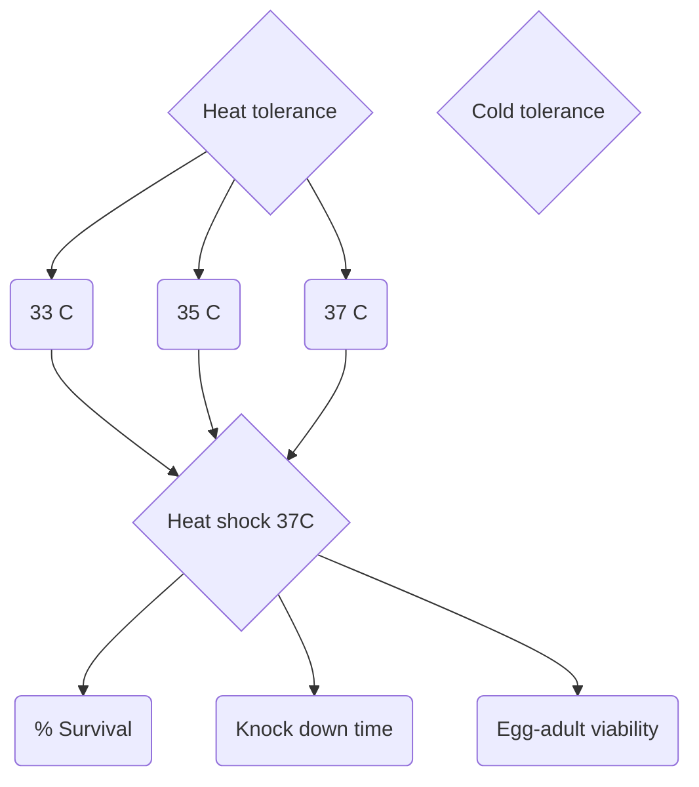
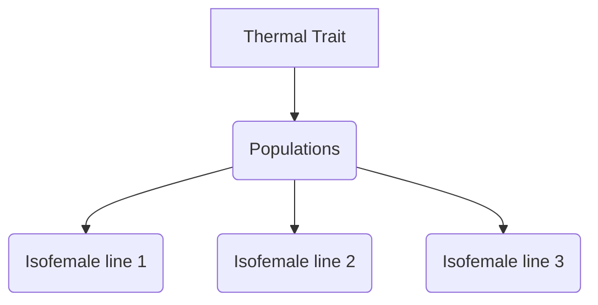
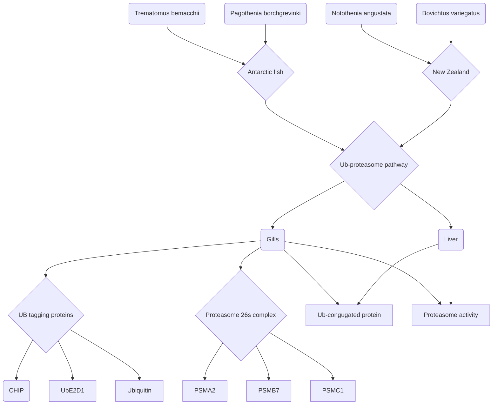
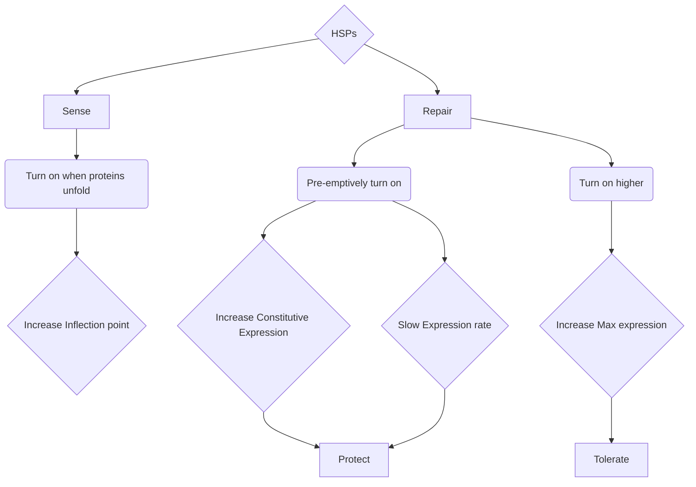
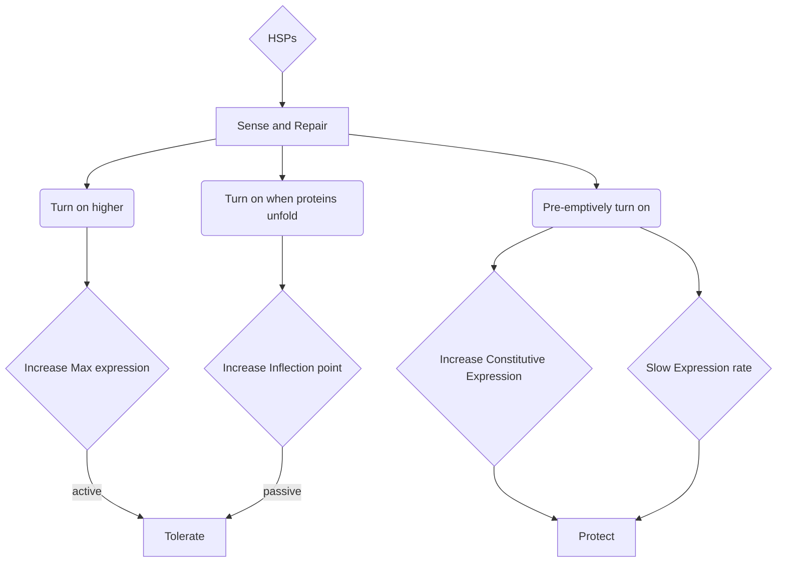
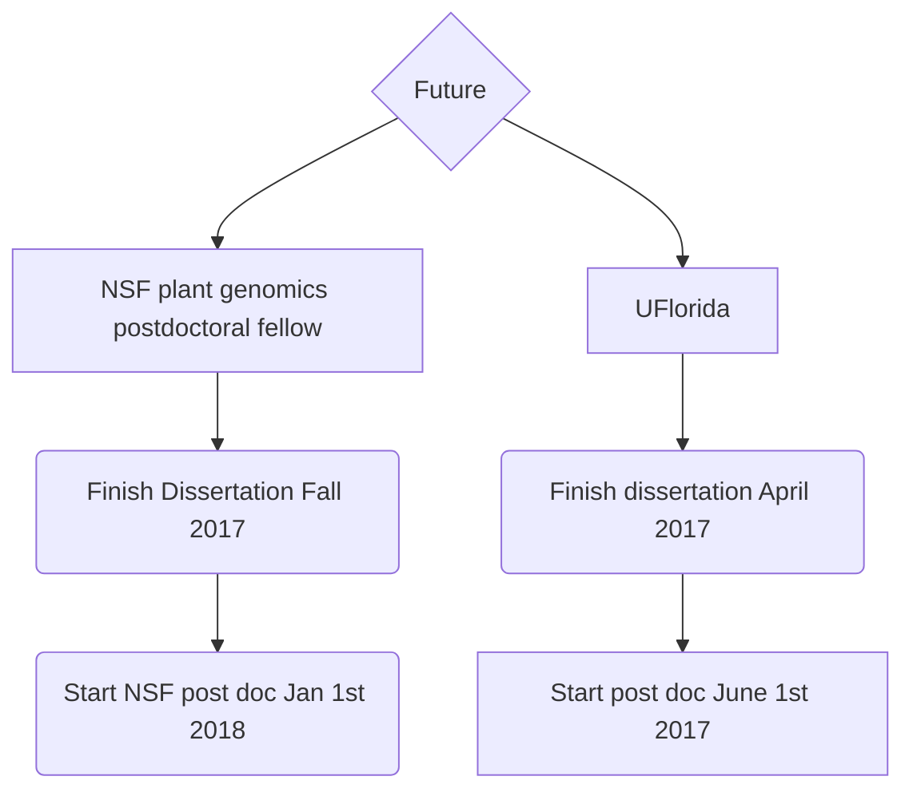
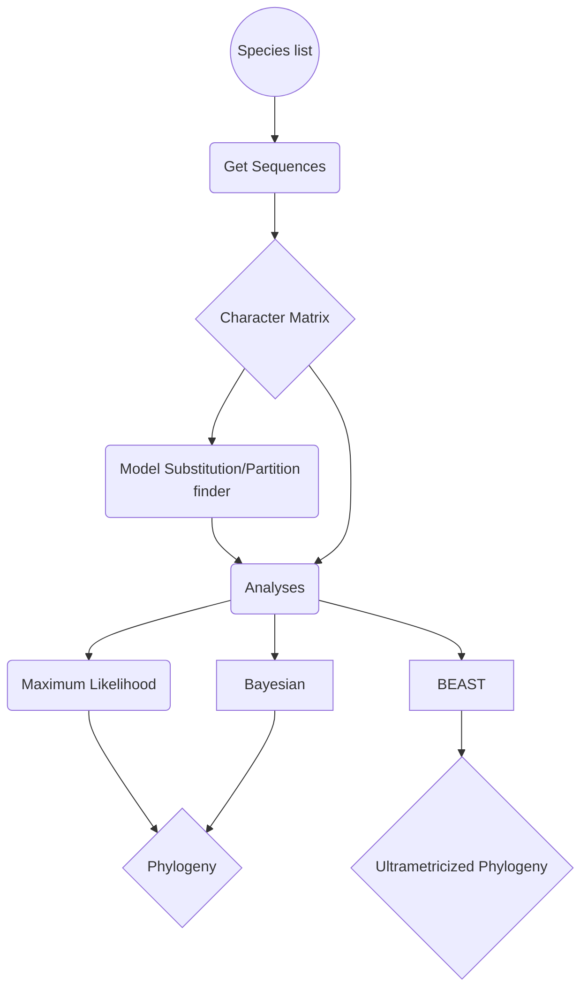
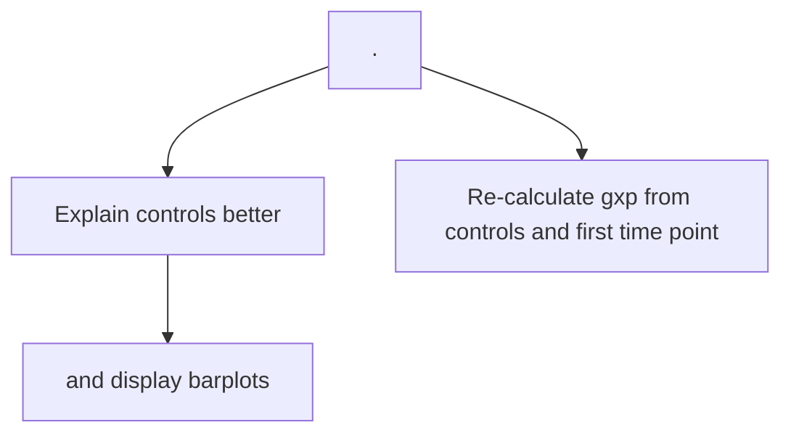
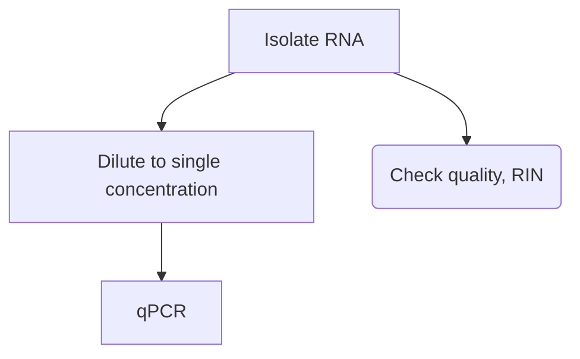
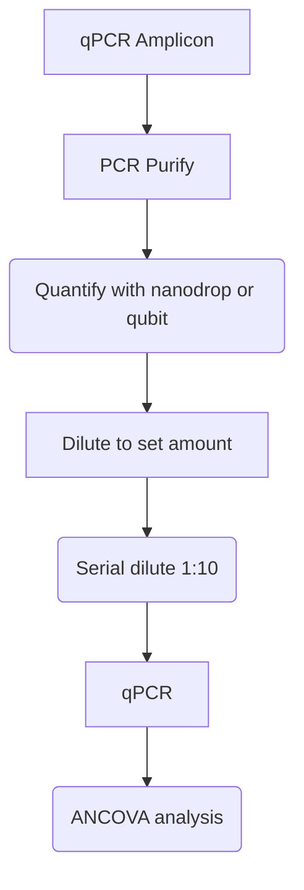

# 2017 General Notebook

### Author: Andrew D. Nguyen, [Evolutionary Physiologist](https://adnguyen.github.io)      
### Affiliation: Biology Department, University of Vermont      
### Contact: anbe642@gmail.com     

### Date started: 2017-01-01    
### Date end (last modified): ongoing   

<a rel="license" href="http://creativecommons.org/licenses/by/4.0/"></a><br />This work is licensed under a <a rel="license" href="http://creativecommons.org/licenses/by/4.0/">Creative Commons Attribution 4.0 International License</a>.    

### General Lab protocols found [here for heat shocks and RNA related experiments](https://github.com/adnguyen/Notebooks_and_Protocols/blob/master/2016_ANBE_protocols.md) and [here for protein related experiments](https://github.com/adnguyen/2016_Protein_stability_evolution/blob/master/Documents/Protocols/Protocols.md).     


**Introduction:**    
Notebook for 2017 new year. It'll log the rest of my dissertation and potentially new post doc ideas and/or projects

## List of projects and description   
* Hsp rxn norm: Understanding how the local thermal environment shapes thermal tolerance and stress response (using Hsps as a proxy for stress) in forest ants of the genus *Aphaenogaster*. CTmax and rxn norm of Hsp expression measured across forest ants from Fl to Maine.   
* Range limits: Identifying the factors/forces that set range limits in common forest ants (*Aphaenogaster picea*). Modelling + measured their cold physiology in forest ants of Maine and Vt.  
* Multiple stressors: Understanding how progressive desiccation and starvation impacts thermal tolerances in *A. picea*. We pre-treated with desiccation and starvation and then measured KO-time. We also measured the stress response.        
* Thermal niche paper: Collaborative paper understanding how the environment shapes the ability to withstand cold and hot temperatures. In field and in a common garden, we measured upper and lower thermal limits of ants from GA-Maine (2 species).    
* Stress in nature: Are ants stressed under experimental warming that projects climate change? Ants were collected from warming chambers (0-5 C increase from ambient) and we measured their stress response.    
* ​

### Table of Contents (Layout follows Page number: Date. Title of entry)    
* [Page 1: 2017-01-01](#id-section1). SICB meeting
* [Page 2: 2017-01-03](#id-section2). Yearly goals
* [Page 3: 2017-01-10](#id-section3). Status of projects
* [Page 4: 2017-01-17](#id-section4). Displaying hierarchical structure of a repo or set of directories in the terminal with tree command
* [Page 5: 2017-01-17](#id-section5). Project idea: The impact of temperature variation on ant colonly level performance.
* [Page 6: 2017-01-17](#id-section6). Tutorial for making fancy documents(Cover letters) in latex and rendering into pdf!
* [Page 7: 2017-01-19](#id-section7). Making sense of reviewer comment; multiple stressors ms
* [Page 8: 2017-01-19](#id-section8). Notes from SICB
* [Page 9: 2017-01-20](#id-section9). Status of projects
* [Page 10: 2017-01-26](#id-section10). **Hoffmann et al. 2013**, Functional Ecology Paper notes ; Constraints on upper thermal limits
* [Page 11: 2017-01-26](#id-section11). Notes on teaching statements
* [Page 12: 2017-01-26.](#id-section12). SHC lab meeting, organizational
* [Page 13: 2017-01-26](#id-section13). **Bubliy & Loeschke 2005** paper notes; comparisons of selection on stress resistance
* [Page 14: 2017-01-26.](#id-section14). **Mitchell & Hoffmann 2010** paper notes, Functional Ecology; Thermal ramping influences evolutionary potential
* [Page 15: 2017-01-27.](#id-section15) Embedding a calendar into your webpage
* [Page 16: 2017-01-31](#id-section16). **Sørensen et al. 2003**; Ecology letters, The Evolutionary and ecological role of heat shock proteins; paper notes
* [Page 17: 2017-01-31](#id-section17). List of Adaptive Variation in Hsps lit table. 
* [Page 18: 2017-01-31](#id-section18). Statuf of projects: writing
* [Page 19: 2017-01-31](#id-section19). SHC lab meeting reading: Ranga et al. 2017; Evol Ecol: Sibling Drosophila species (Drosophila leontia and Drosophila kikkawai) show divergence for thermotolerance along a latitudinal gradient
* [Page 20: 2017-02-02](#id-section20). SHC lab meeting: reading Ranga et al. 2017; lab discussion
* [Page 21: 2017-02-03](#id-section21).**Todgham et al. 2017**; JEB, The effect of temperature adaptation on the ubiquitin-proteasome pathway in notothenioid fishes
* [Page 22: 2017-02-06](#id-section22). **Tomanek & Somero 2002**; JEB, Paper notes
* [Page 23: 2017-02-06](#id-section23). **Tomanek 2010;** JEB, paper notes
* [Page 24: 2017-02-06](#id-section24). **Parcel & Lindquist 1994;** cold spring harbor , paper notes
* [Page 25: 2017-02-07](#id-section25). How far down do Aphaenogaster colonies go in the winter?
* [Page 26: 2017-02-07](#id-section26).  A definition of a trade-off
* [Page 27: 2017-02-09](#id-section27). SHC lab meeting: Practice talk for biolunch and dissertation defense
* [Page 28: 2017-02-14](#id-section28). Status of projects + PHD Progress
* [Page 29: 2017-02-15.](#id-section29) **Aphaenogaster, Hsp rxn norm paper stats revisited**: regression without open habitat;Sampling info ; PCA effective number of dimensions calculation for Hsps
* [Page 30: 2017-02-20](#id-section30). prep for committee meeting 2017-02-24, 2:00PM
* [Page 31: 2017-02-21](#id-section31). Measuring evolutionary rates in darwins and haldanes  
* [Page 32: 2017-02-22](#id-section32). Resistance vs Tolerance strategies to stress; paper notes-**Núñez-Farfán et al. 2007**; The Evolution of Resistance and Tolerance to Herbivores; Annu. Rev. Ecol. Evol. Syst.
* [Page 33: 2017-02-23](#id-section33).  Multiple regression models testing effect of Hsp parameters on Ctmax
* [Page 34: 2017-02-23](#id-section34). SHC lab meeting: Going over hxp rxn norm paper. 
* [Page 35: 2017-02-23](#id-section35). What are Evolutionary Innovations? 
* [Page 36: 2017-02-24](#id-section36). Last biolunch and committee meeting notes
* [Page 37: 2017-02-27](#id-section37). Mappies in R for Zamira
* [Page 38: 2017-02-28](#id-section38). Questions to think about from SHC
* [Page 39: 2017-02-28](#id-section39). More analyses for hsp rxn norm paper
* [Page 40: 2017-03-04](#id-section40). Visit at UF; feedback on dissertation talk
* [Page 41: 2017-03-07](#id-section41). To do.
* [Page 42: 2017-03-09](#id-section42). General reading notes
* [Page 43: 2017-03-09](#id-section43). Dissertation format check with Sean M.
* [Page 44: 2017-03-10](#id-section44). General phylogenetics workflow
* [Page 45: 2017-03-10](#id-section45). SHC lab schedule 
* [Page 46: 2017-03-13](#id-section46). Meeting with SHC for dissertation timeline
* [Page 47: 2017-03-13](#id-section47).  SHC analysis suggestion hsp rxn norm paper
* [Page 48: 2017-03-14](#id-section48). Reading notes- Armstrong et al. 2011; hsp70 and neurophysiology
* [Page 49: 2017-03-16](#id-section49). Writing notes
* [Page 50: 2017-03-17](#id-section50). Writing notes
* [Page 51: 2017-03-20](#id-section51). Writing notes
* [Page 52: 2017-03-21](#id-section52). Writing notes
* [Page 53: 2017-03-22](#id-section53). Prepping for oral defense, reading notes
* [Page 54: 2017-03-23](#id-section54). To do list
* [Page 55: 2017-3-24](#id-section55). multiple stressors reviewer comments
* [Page 56: 2017-03-28](#id-section56). Definition of phenotypic plasticity
* [Page 57: 2017-03-28](#id-section57). Meeting with new lab tech, KB
* [Page 58: 2017-03-31](#id-section58). Making thesis fixes, notes
* [Page 59: 2017-03-31](#id-section59). To do list
* [Page 60: 2017-04-07](#id-section60). Project updates    
* [Page 61: 2017-04-10](#id-section61). To do and project updates
* [Page 62: 2017-04-11](#id-section62). Hsp rxn norm project: Species efficiency curves  
* [Page 63: 2017-04-13](#id-section63). Hsp rxn norm proj: amplicon quant
* [Page 64: 2017-04-14](#id-section64). Hsp rxn norm project: Species efficiency curves cont'd    
* [Page 65:](#id-section65).
* [Page 66:](#id-section66).
* [Page 67:](#id-section67).
* [Page 68:](#id-section68).
* [Page 69:](#id-section69).
* [Page 70:](#id-section70).
* [Page 71:](#id-section71).
* [Page 72:](#id-section72).
* [Page 73:](#id-section73).
* [Page 74:](#id-section74).
* [Page 75:](#id-section75).
* [Page 76:](#id-section76).
* [Page 77:](#id-section77).
* [Page 78:](#id-section78).
* [Page 79:](#id-section79).
* [Page 80:](#id-section80).
* [Page 81:](#id-section81).
* [Page 82:](#id-section82).
* [Page 83:](#id-section83).
* [Page 84:](#id-section84).
* [Page 85:](#id-section85).
* [Page 86:](#id-section86).
* [Page 87:](#id-section87).
* [Page 88:](#id-section88).
* [Page 89:](#id-section89).
* [Page 90:](#id-section90).
* [Page 91:](#id-section91).
* [Page 92:](#id-section92).
* [Page 93:](#id-section93).
* [Page 94:](#id-section94).
* [Page 95:](#id-section95).
* [Page 96:](#id-section96).
* [Page 97:](#id-section97).
* [Page 98:](#id-section98).
* [Page 99:](#id-section99).
* [Page 100:](#id-section100).
* [Page 101:](#id-section101).
* [Page 102:](#id-section102).
* [Page 103:](#id-section103).
* [Page 104:](#id-section104).
* [Page 105:](#id-section105).
* [Page 106:](#id-section106).
* [Page 107:](#id-section107).
* [Page 108:](#id-section108).
* [Page 109:](#id-section109).
* [Page 110:](#id-section110).
* [Page 111:](#id-section111).
* [Page 112:](#id-section112).
* [Page 113:](#id-section113).
* [Page 114:](#id-section114).
* [Page 115:](#id-section115).
* [Page 116:](#id-section116).
* [Page 117:](#id-section117).
* [Page 118:](#id-section118).
* [Page 119:](#id-section119).
* [Page 120:](#id-section120).
* [Page 121:](#id-section121).
* [Page 122:](#id-section122).
* [Page 123:](#id-section123).
* [Page 124:](#id-section124).
* [Page 125:](#id-section125).
* [Page 126:](#id-section126).
* [Page 127:](#id-section127).
* [Page 128:](#id-section128).
* [Page 129:](#id-section129).
* [Page 130:](#id-section130).
* [Page 131:](#id-section131).
* [Page 132:](#id-section132).
* [Page 133:](#id-section133).
* [Page 134:](#id-section134).
* [Page 135:](#id-section135).
* [Page 136:](#id-section136).
* [Page 137:](#id-section137).
* [Page 138:](#id-section138).
* [Page 139:](#id-section139).
* [Page 140:](#id-section140).
* [Page 141:](#id-section141).
* [Page 142:](#id-section142).
* [Page 143:](#id-section143).
* [Page 144:](#id-section144).
* [Page 145:](#id-section145).
* [Page 146:](#id-section146).
* [Page 147:](#id-section147).
* [Page 148:](#id-section148).
* [Page 149:](#id-section149).
* [Page 150:](#id-section150).
* [Page 151:](#id-section151).
* [Page 152:](#id-section152).
* [Page 153:](#id-section153).
* [Page 154:](#id-section154).
* [Page 155:](#id-section155).
* [Page 156:](#id-section156).
* [Page 157:](#id-section157).
* [Page 158:](#id-section158).
* [Page 159:](#id-section159).
* [Page 160:](#id-section160).
* [Page 161:](#id-section161).
* [Page 162:](#id-section162).
* [Page 163:](#id-section163).
* [Page 164:](#id-section164).
* [Page 165:](#id-section165).
* [Page 166:](#id-section166).
* [Page 167:](#id-section167).
* [Page 168:](#id-section168).
* [Page 169:](#id-section169).
* [Page 170:](#id-section170).
* [Page 171:](#id-section171).
* [Page 172:](#id-section172).
* [Page 173:](#id-section173).
* [Page 174:](#id-section174).
* [Page 175:](#id-section175).
* [Page 176:](#id-section176).
* [Page 177:](#id-section177).
* [Page 178:](#id-section178).
* [Page 179:](#id-section179).
* [Page 180:](#id-section180).
* [Page 181:](#id-section181).
* [Page 182:](#id-section182).
* [Page 183:](#id-section183).
* [Page 184:](#id-section184).
* [Page 185:](#id-section185).
* [Page 186:](#id-section186).
* [Page 187:](#id-section187).
* [Page 188:](#id-section188).
* [Page 189:](#id-section189).
* [Page 190:](#id-section190).
* [Page 191:](#id-section191).
* [Page 192:](#id-section192).
* [Page 193:](#id-section193).
* [Page 194:](#id-section194).
* [Page 195:](#id-section195).
* [Page 196:](#id-section196).
* [Page 197:](#id-section197).
* [Page 198:](#id-section198).
* [Page 199:](#id-section199).
* [Page 200:](#id-section200).


------

 <div id='id-section1'/> 

### Page 1: 2017-01-01. Society for Integrative and Comparative Physiology (SICB) meeting in New Orleans       


### Table of talks I'd like to attend       


| Date            | Time        | Room                   | Speaker                          | Title                                    |
| :-------------- | :---------- | :--------------------- | :------------------------------- | :--------------------------------------- |
| Wednesday, Jan4 | 19:30       | Hilton Ballroom        | Swalla                           | Follow the Yellow Brick Road: An Odyssey from Myoplasm to Marine Biology to Genomics |
| Thursday, Jan5  | 8:00        | 217                    | Kelly                            | Protein coding and regulatory variation contribute to heat adaptation in the copepod Tigriopus californicus. |
| Thursday, Jan5  | 8:15        | 217                    | Logan                            | The evolutionary potential of a global insect invader in the face of rapid environmental change |
| Thursday, Jan5  | 8:30        | 217                    | Campbell                         | Urban heat islands and temperature-mediated physiological shifts between populations of the Puerto Rican crested anole |
| Thursday, Jan5  | 8:30        | 221                    | Charbonneau                      | Who Are the ‘Lazy’ Ants? Inter-worker Variation Gives Insight into Potential Functions of Inactivity |
| Thursday, Jan5  | 9:00        | 217                    | Ferris                           | The genomics of rapid adaptation to climatic extremes in house mice across the Americas |
| Thursday, Jan5  | 9:15        | 214                    | Geyman                           | Temperature Effects on Parasite Larval Size Over Time and Across Multiple Life Stages |
| Thursday, Jan5  | 9:30        | 214                    | Genovese                         | Plasticity in thermal tolerance of early life history stages of marine invertebrate larvae |
| Thursday, Jan5  | 9:30        | 217                    | Jangjoo                          | Gene expression associated with dispersal ability under different temperature conditions in the alpine butterfly, Parnassius smintheus |
| Thursday, Jan5  | 11:45       | 211-213                | Gough                            | Physical Properties and Anisotropy in the Central Tissue Layer of Cetacean Tail Flukes |
| Thursday, Jan5  | 11:45       | 214                    | Debiasse                         | Testing the effect of ocean acidification on a sponge-coral species interaction |
| Thursday, Jan5  | 13:00       | 215-216                | Flynn                            | Response of Amphibian Gut Microbiome to Coal Combustion Waste |
| Thursday, Jan5  | 13:30       | 224                    | Tangwancharoen                   | Divergence in cis-regulatory elements and HSPB1 gene expression along a temperature cline in the copepod Tigriopus californicus |
| Thursday, Jan5  | 13:45       | 219                    | Kingsolver                       | Inconstancy is informative: Estimating performance curves in fluctuating environments |
| Thursday, Jan5  | 14:00       | 219                    | Howey                            | Effect of Temperature on Snake Locomotion and the Interpretation of Thermal Performance Curves |
| Thursday, Jan5  | 15:15       | 214                    | Tielens                          | Geological age and host polymorphism affect functional diversity and community composition in plant-insect interactions across a space-for-time chronosequence on the Hawaiian Islands. |
| Thursday, Jan5  | 19:00       | 208                    | Sheriff                          | Integrating physiology, behavior, and ecology to understand the mechanisms that regulate and limit animal populations |
| Thursday, Jan5  | 15:30-17:30 | Exhibit Hall (posters) | Brueggemann                      | The effect of cholesterol and _-tocopherol on cold tolerance, post-cold performance, and rapid cold hardening |
| Thursday, Jan5  | 15:30-17:30 | Exhibit Hall (posters) | Chan                             | Taking the heat: High thermal tolerance of larval and adult mangrove snails |
| Friday, Jan6    | 7:50        | 206                    | Ragland; Williams                | Introduction to Evolutionary Impacts of Seasonality symposium |
| Friday, Jan6    | 8:15        | 211-213                | Gilbert                          | Natural Selection on Thermal Preference and Performance over a Rapid Timescale |
| Friday, Jan6    | 8:30        | 215-216                | Nourabadi                        | Fitness consequences of pH adaptation in an experimentally evolved beneficial symbiosis |
| Friday, Jan6    | 9:00        | 210                    | Obrien                           | The metabolic costs of animal weapons    |
| Friday, Jan6    | 9:30        | 206                    | Buckley; Kingsolver              | Insect Development, Thermal Plasticity and Fitness Implications in Changing, Seasonal Environments |
| Friday, Jan6    | 9:30        | 211-213                | Riddell                          | Potential responses to climate change are improved by physiological acclimation of water loss |
| Friday, Jan6    | 10:30       | 221                    | Clay                             | Transcriptomics of salamander tail tips reveal potential biomarkers of stress. |
| Friday, Jan6    | 11:00       | 221                    | Holden                           | Preparing for winter dormancy: Early-life experience affects condition, metabolism, and hormonal response to cold temperatures in the checkered garter snake, Thamnophis marcianus |
| Friday, Jan6    | 11:30       | 215-216                | Tanner; stillmann                | Locally adapted Phyllaplysia taylori populations in Central California show higher thermal plasticity potential |
| Friday, Jan6    | 11:45       | 215-216                | Oyen                             | Common garden experiments reveal local adaptation in critical thermal limits of bumblebees (Apidae, Bombus) over short geographic distances |
| Friday, Jan6    | 13:45       | 214                    | Norin                            | Plasticity, performance, and pace of life: individual differences in physiological and behavioural flexibility towards daily changes in temperature and oxygen availability |
| Friday, Jan6    | 14:00       | 214                    | Smith                            | Assessing the protein and metabolic costs of a trade-off between reproduction and immunity |
| Friday, Jan6    | 14:00       | 220                    | Crickenberger                    | Do temperature and competition interact to set a range limit? |
| Friday, Jan6    | 14:15       | 219                    | Kenny                            | How temperature influences the viscosity of hornworm hemolymph |
| Friday, Jan6    | 14:15       | 223                    | Refsnider                        | Plasticity in Behavioral Thermoregulation by Lizards on an Elevational Gradient: A Reciprocal Transplant Experiment |
| Friday, Jan6    | 14:45       | 214                    | Jaumann                          | Nutritional Stress Decreases Fecundity and Choosiness in a Butterfly |
| Friday, Jan6    | 15:00       | 206                    | Williams; Ragland                | Evolutionary impacts of seasonality: synthesis and directions forward |
| Friday, Jan6    | 15:00       | 214                    | Triedel; Williams                | The effect of diet nutrient composition on development and life history traits of a wing polymorphic cricket, Gryllus lineaticeps |
| Friday, Jan6    | 19:30       | 215-216                | Sosik                            | Life in the Plankton, Stories from automated submersible microscopy and flow cytometry |
| Friday, Jan6    | 15:30-17:30 | Exhibit Hall (posters) | Kornegay                         | Methylation and chromatin remodeling complex from sponges to humans |
| Saturday, Jan7  | 8:45        | 215-216                | Robberts;Rank;Stillman; Williams | The effects of snow cover on overwinter physiology of a montane insect |
| Saturday, Jan7  | 9:30        | 211-213                | Wada                             | A potential link between organismal adrenocortical responses and cellular heat shock responses |
| Saturday, Jan7  | 10:15       | 219                    | Stoehr                           | Temperature, Photoperiod and Nutrients Affect Phenotypically Plastic Wing Patterns in the Cabbage White Butterfly |
| Saturday, Jan7  | 10:45       | 215-216                | Allen                            | Diet-by-temperature interactions on a sexually selected trait and sexual dimorphism |
| Saturday, Jan7  | 10:45       | 220                    | Bryant                           | Uncoupling Proteins and Thermal Acclimation and Adaptation in Atlantic killifish, Fundulus heteroclitus |
| Saturday, Jan7  | 11:00       | 215-216                | Mikucki                          | Seasonal Differences in Diapause Induction in a Vermont Population of Pieris rapae Butterflies |
| Saturday, Jan7  | 11:00       | 220                    | Novarro                          | Geographic patterns of thermal tolerance in a widespread lungless salamander |
| Saturday, Jan7  | 11:30       | 211-213                | Finger                           | The Effect of Heat Shock on Constitutive and Inducible Heat Shock Proteins and Corticosterone in the Zebra Finch |
| Saturday, Jan7  | 11:30       | 215-216                | Lockwood                         | Molecular targets of thermal stress during early development in Drosophila melanogaster |
| Saturday, Jan7  | 11:45       | 215-216                | Niedojadlo                       | Daily Energy Expenditure, but Not Self-Maintenance Costs, Are Related to Hematological Variables in Response to Temperature Acclimation |
| Saturday, Jan7  | 13:30       | 215-216                | Lisovski                         | Biologically Significant Dimensions of Seasonality |
| Saturday, Jan7  | 13:45       | 217                    | Lozier                           | Population Genomics of Color Pattern Variation in a Widespread North American Bumble Bee |
| Saturday, Jan7  | 14:00       | 215-216                | Betini                           | Fitness Trade-off Between Seasons Causes Multigenerational Cycles in Phenotype and Population Size |
| Saturday, Jan7  | 14:00       | 220                    | Mitchell                         | Do covariances between maternal behavior and embryonic physiology drive sex-ratio evolution under environmental sex determination? |
| Saturday, Jan7  | 14:15       | 225-226                | Ceja                             | Ecologically modeling the distribution of an intertidal crab concerning global change |
| Saturday, Jan7  | 15:30-17:30 | Exhibit Hall (posters) | Pigg; Williams                   | Effects of ambient temperature on the organization of lipids of the avian stratum corneum |
| Sunday, Jan8    | 8:00        | 220                    | McGee                            | Machine learning predicts cichlid feeding kinematics from craniofacial morphology |
| Sunday, Jan8    | 8:30        | 217                    | Newman                           | The Influence of the Early-life Environment on Stress Physiology and Fitness in the Wild |
| Sunday, Jan8    | 8:30        | 224                    | Irvine                           | Proteomic Changes Due to Elevated Temperature in Ascidian Ovaries |
| Sunday, Jan8    | 8:45        | 214                    | Matoo; Montooth                  | Role of Genetic Variation on the Ontogeny of Metabolism during Development. |
| Sunday, Jan8    | 8:45        | 224                    | Hurley                           | The Heat is On: Decrease in Avian Sperm Functionality at High Ambient Temperatures |
| Sunday, Jan8    | 9:15        | 215-216                | Soda; Slice                      | Vector autoregressive-moving average models as tools to visualize differences in shape trajectories |
| Sunday, Jan8    | 9:15        | 218                    | Diamond                          | Rapid evolution of ant thermal tolerance within an urban heat island |
| Sunday, Jan8    | 9:30        | 214                    | Neel; Mcbrayer                   | Thermal dependence of sprint performance and critical thermal limits in ecologically distinct populations of a small ectotherm |
| Sunday, Jan8    | 9:30        | 217                    | Graham                           | Evolutionary history matters: Maternal hormonal response to a natural stressor and effects on offspring growth and behavior |
| Sunday, Jan8    | 9:30        | 218                    | Hall; Warner                     | Thermal Spikes Caused by the Urban Heat Island Effect Result in Differential Egg Survival of a Non-native Lizard ( Anolis cristatellus ) |
| Sunday, Jan8    | 10:00       | 221                    | Dormio                           | Staying Active for Life: Investigating the Covariance Between Behavioral and Physiological Trade-offs in Treefrogs |
| Sunday, Jan8    | 10:15       | 217                    | Vitousek                         | Do Brief, Acute Stressors Have Lasting Effects on Phenotype? |
| Sunday, Jan8    | 10:30       | 214                    | Shah;Ghalambor                   | Does Climate Variability Predict Thermal Tolerance? A Comparison of Thermal Breadths in Aquatic Insects Across Elevation & Latitude |
| Sunday, Jan8    | 10:45       | 218                    | Balaban                          | Elastic energy storage and thermal performance in fence lizards |
| Sunday, Jan8    | 10:45       | 224                    | Mccue                            | Repeated exposure to food limitation earlier in life enables rats to spare lipid stores during prolonged starvation |
| Sunday, Jan8    | 11:00       | 224                    | Mcternan                         | Resting metabolism comparisons among populations of a subspecies of lizard differing in climate and vegetation types |
| Sunday, Jan8    | 11:30       | 217                    | Senner                           | The Stress Response of Peromyscus Mice to Experimental High Elevation Conditions |
| Sunday, Jan8    | 11:45       | 214                    | Nguyen                           | Constraints on cold tolerance and hardening ability limit the distribution of forest ants at its northern range boundary. |
| Sunday, Jan8    | 11:45       | 222                    | Crall                            | A Neonicotinoid Pesticide Disrupts Nest Behavior and Social Interactions in Bumblebee Colonies |
| Sunday, Jan8    | 13:30       | 210                    | Harrison                         | Hypometric scaling of metabolic rate arises from size-dependent natural selection on ATP demand |
| Sunday, Jan8    | 13:45       | 214                    | Clark; Williams                  | A Genetic Polymorphism for a Hormonal Circadian Rhythm is Associated With a Shift in Metabolic Fuel Use in Flight-Capable but not Flightless Crickets |
| Sunday, Jan8    | 13:45       | 210                    | Salin                            | How Does Mitochondrial Functioning Constrain Energy Efficiency? |
| Sunday, Jan8    | 14:00       | 222                    | Cirino                           | Effects of male quality and territory quality on female preference of varying condition |
| Sunday, Jan8    | 14:15       | 214                    | Braciszewsi                      | Relatedness and differential disease resistance in eastern Pacific Haliotids |
| Sunday, Jan8    | 14:15       | 224                    | Boothby                          | How do Tardigades Survive Extremes? Disordered Proteins as Mediators of Tardigrade Stress Tolerance |
| Sunday, Jan8    | 14:30       | 221                    | Miles                            | Desert tortoises race against climate change: past, present and future |
| Sunday, Jan8    | 14:45       | 220                    | Schoenle                         | Why Does Malaria Infection Reduce Fitness in Wild Birds?: A Test of Physiological Mechanisms |
| Sunday, Jan8    | 15:00       | 222                    | Leary                            | Acute Stress is a Target of Intra- and Intersexual Selection in the Green Treefrog, Hyla cinerea: Implications for Fitness, Honest Signals, and the Evolution of Endocrine-based Acoustic Armaments |

------

 <div id='id-section2'/> 

### Page 2: 2017-01-03. Yearly Goals  


1. Submit and Publish 3 manuscripts: range limits, Hsp rxn norm, and multiple stressors (also thermal niche paper).    
2. Get a post doc. This'll probably involve learning a new study system. And also sending out tons of applications.      
3. Learn and build a shiny app.    
4. Learn and become more proficient in statistics (Machine learning?, Baysian, predictive modelling, mixed effects modelling, eigentensor analyses).     
   * Quantitative genetics: more statistical genetics   

5. Form new collaborations? It'd be awesome to work with Brent Sinclair, Brent Lockwood, Joel Kingsolver, Caroline Williams, Jon Stillman, Alex Gunderson.     
6. Participate in a meta-analysis? Would be cool. 
7. Learn more physiology: Q10, metabolism related topics, lipid membranes, metabolites.   

------

 <div id='id-section3'/> 

### Page 3: 2017-01-10. Status of Projects      


1. Project updates:    
    * **Hsp gene expression + Ctmax project:**
        * rewrite results, intro and send out to NJG and SHC  (methods done)    
        * Submit to PNAS  
    * **Multiple stressors ms:**   
        * In SHC's hands, due 2017-02-14

    * **Range limits ms**: SHC lab gave verbal edit, still need to incorporate     
        * **Thermal niche ms:** Lacy to check intro, and add refs.    	
    * **Stressed in nature MS: Samples to rerun.**       
        * update: Curtis can no longer work+ write on project   
        * **There are 74 samples: 3 days of RNA isolation + cDNA synthesis. 4 gene targets ran in duplicates is 2 plates per gene = 8 plates total.  2 days for 8 plates.**           
    * **Proteome stability project:**    
        * **~130 proteins for rudis, ~250 proteins for pogos**(we got 500 proteins last time); labelling is ok
          * Rerun mass spec, but loading more proteins (Bethany)

2. **Thesis related**  [FORMS FOUND HERE](http://www.uvm.edu/~gradcoll/?Page=Forms.html)  
    * Formatting:    
      * Introduction (> 3 pages), manuscripts, then synthesis/conclusion (~3 pages) ; SHC and NJG agree
        * started outline   
    * [Deadlines](http://www.uvm.edu/~gradcoll/pdf/Timetable%20for%20defense%202016-17-2.pdf):    
      1. Intent to graduate: February 1st for May.   
      2. Send defense committe form to grad college---now   
      3. Graduate college format check March 4th
      4. Defense notice 3 weeks before defense  (oral defense by March 24th).   
      5. Final thesis April 7th.  


------

 <div id='id-section4'/> 

### Page 4: 2017-01-17. Displaying hierarchical structure of a repo or set of directories in the terminal with tree command  


1. In the terminal, [install the tree command](https://rschu.me/list-a-directory-with-tree-command-on-mac-os-x-3b2d4c4a4827#.wk0u34bpj)
   * You may have to install the [homebrew](http://brew.sh/)    
2. use the tree command in the terminal

```
2017_Ecological_Genomics andrewnguyen$ tree
.
├── 2017_Ecological_Genomics.Rproj
├── Online_notebook.md
├── README.md
├── RasterPCA_demo.Rmd
├── RasterPCA_demo.html
├── index.Rmd
├── index.html
└── index.pdf

0 directories, 8 files
```

------

 <div id='id-section5'/> 

### Page 5: 2017-01-17. Project idea: The impact of temperature variation on ant colonly level performance.       


**Background**   
Ant colonies experience temperature fluctuations throughout the day and season. In response to temperature variation, ants must be able to forage under cool and hot conditions. One way to achieve high performance in the face of temperature variation is for the colony to match individual level performance with shifting temperatures. For example, for colonies with diverse genetic structures, some genotypes may forage better under cool or hot conditions. Multiply mated queens (*Pogonomyrmex*) will produce offspring with more phenotypic variation in traits, compared to singly mated queens (*Aphaenogaster*).     

**Notes:** Need to actually verify that foraging efficiency differs throughout the day in a colony, aka need to know more natural history. Look up Deborah Gordon's work. How will you address the confounding issue of demographic effects? Meaning what if there is genetic clumping of sperm and it corresponds to age polyethism, leading to the covariance between age and genotype. Also, the age structure of the colony itself may covary with genotype.       

**Question**   

1. Is the amount of physiological variation in upper thermal limits reflected in the number of fathers?    
2. Do ant colonies utilize different genotypes to forage throughout the day and season?    

or

Do ants display seasonal adaptation in forager performance?   

**Hypotheses**  

1. The number of fathers increases the amount of phenotypic variatnce in upper thermal limits.    
2. There is genetic structuring in the foragers throughout the day and season.    

**Predictions**    

1. Additive genetic variance in upper thermal limits will be proportional to the number of fathers.     
2. Thermally tolerant genotypes perform during the warmest parts of the day and vice versa for more cool tolerant genotypes.    
3. The more thermally tolerant genotypes start off at low frequency early on in the season, but increase in frequency at peak summer, then decrease again.    

**Experimental Design**   

I should do a power analysis to see how many ants and colonies I'd need to sample. Sam Scarpino has an R package for this I think.   

1. Document the natural history of 10 pogo colonies, to tune for sampling   
2. If there is like 10 foraging bouts, or 10 time slices through the day, sample ~30 ants for each colony at each time slice.   
3. Phenotype each ant: measure morphology (head width, leg lengths, alitrunk length, etc), number of ovarioles?, hydrocarbons, desiccation resistance, measure upper thermal limit   
4. Pool ants at each time slice, isolate DNA, and then pool-seq (capture-seq, but chatting with April, it sounds like biased sampling because only the portion of the first exon and promoter are sequenced.)     

**Critical Results or Alternative outcomes**  

1. Positive relationship between parentage and phenotypic variance.    
2. Structuring of alleles throughout the day or season. Some start off low, increase, then decrease in frequence.  This would indicate seasonal adaptation of foragers!     

It is possible that we won't find anything at all. But maybe because we're pool-sequencing, we can pick up the microbiome? And maybe that is structured diurnally or throughout the season.    

### Another idea: Compare parasite load between ant colonies with high and low number of fathers.    


Quick and dirty: One of the benefits of a diverse genetic background in a colony is disease resistance. So, test this by pool-seq experiment and measuring the parasite loads for ~30 individuals, potentially across a whole phylogeny of ants that vary in number of daddys and number of queens. Parasite load from different taxanomic groups (fungus, nemotodes, bacteria, viruses) can be mapped onto the phylogeny!

------

 <div id='id-section6'/> 

### Page 6: 2017-01-17. Tutorial for making fancy documents(Cover letters) in latex and rendering into pdf!  


I took this [cool template](https://www.sharelatex.com/templates/cover-letters/awesome-cv-cover-letter) for making a cover letter, which was in ".tex" format. Then converted the tex file into pdf using [this tutorial](http://economistry.com/2013/01/installing-and-using-latex-for-mac/), which involve installing mactex, sublime text 2, and skim. 

------

 <div id='id-section7'/> 

### Page 7: 2017-01-19. Making sense of reviewer comment; multiple stressors ms     


**Is there any direct evidence that heat shock proteins prevent heat knockdown?**    

Calabria et al. 2012 find differences in basal hsp70 protein expression but not heat-induced hsp70 expression between 3 genotypes of fruit flies( they differ in chromosomal structure). These differences were reflected in the fast ramp (0.1 C/min ramp), but not slow ramp(0.6 C/min ramping). 

3 genotypes:

1. O(3+4)/O(3+4): higher hsp70 basal expression and thermal tolerance under fast ramp;       
2. O(3+4+8)/O(3+4+8)    
3. O(st)/O(st): lower hsp70 basal expression and thermal tolerance under fast ramp;   

### References:      


1. Calabria G, Dolgova O, Rego C, et al (2012) Hsp70 protein levels and thermotolerance in Drosophila subobscura: a reassessment of the thermal co-adaptation hypothesis. Journal of Evolutionary Biology 25:691–700. doi: 10.1111/j.1420-9101.2012.02463.x


------

 <div id='id-section8'/> 

### Page 8: 2017-01-19. Notes from SICB      


**2017-01-05; Met with Joel Kingsolver**    

Met and talked about range limits project, selection gradient idea, and hsp rxn norm gxp project.      
* For my ancestral trait reconstruction of CTmax, I excluded the outgroup, suggests to include it      
* For multi-panel figure with parameters on x axis and ctmax on y axis; try partial regression      
* If I don't get into PNAS, try Proc B    
* For looking at shifts in trade-offs between multiple stressors look up Nancy Emory, central cali, she is a plant evo ecologist   
* Selection gradient proj idea; JK asks what has been done in well known systems? ie. Arapidopsis (sp?), check Andy Schidth   

**2017-01-06; met with Ray Huey**    

Showed hsp rxn norm paper stuff:     
* Are parameters correlated- he was worrieda bout this.    
* Try fitting splines and extracting parameters     
* Selection on graits; linear or quadratic? non-parametric?       

**2017-01-07 Met with Dan Hahn and Greg Ragland**      

Went over data and Dan liked how Iparsed out all the predictions for the shifts in reaction norms of hsp gxp expression.    
* Finger example highlights the differences between resistance and tolerance    
* Pressing two fingers together without moving = **resistance**       
* When 1 finger moves the other finger but can move back = **tolerance**     

------

 <div id='id-section9'/> 

### Page 9: 2017-01-20. Status of projects  


1. Project updates:    
    * **Hsp gene expression + Ctmax project:**
        * Have intro, discussion mostly complete by today, meet with NJG Monday (2017-01-23)
        * Submit to PNAS in May?   
    * **Multiple stressors ms:**   
        * In SHC's hands, due 2017-02-14
    * **Range limits ms**: SHC lab gave verbal edit, still need to incorporate     
        * **Thermal niche ms:** Lacy to check intro, and add refs.    	
    * **Stressed in nature MS: Samples to rerun.**       
        * **There are 74 samples: 3 days of RNA isolation + cDNA synthesis. 4 gene targets ran in duplicates is 2 plates per gene = 8 plates total.  2 days for 8 plates.**           
    * **Proteome stability project:**    
        * **~130 proteins for rudis, ~250 proteins for pogos**(we got 500 proteins last time); labelling is ok
          * Rerun mass spec, but loading more proteins (Bethany)

2. **Thesis related**   
    * **Defense talk: Have first version by Jan 31st**    
      * Required defense talk in biolunch: Feb 24 (Friday)     
    * Working title: Evolutionary Innovations of Ants to Thermally Stressful Environments     
    * Formatting:    
      * Introduction (> 3 pages), manuscripts, then synthesis/conclusion (~3 pages) ; SHC and NJG agree
        * started outline   
    * [Deadlines](http://www.uvm.edu/~gradcoll/pdf/Timetable%20for%20defense%202016-17-2.pdf):    
      1. Intent to graduate: February 1st for May.   
      2. Send defense committe form to grad college---**done**
      3. Graduate college format check March 4th
      4. Defense notice 3 weeks before defense  (oral defense by March 24th).   
      5. Final thesis April 7th.  


------

 <div id='id-section10'/> 

### Page 10: 2017-01-26. Hoffmann et al. 2013, Functional Ecology Paper notes      


Starting off intro with constraints on upper thermal limits. 


**What can constraint upper thermal limits?**

1. low plasticity (stillmann paper shows this in crabs)
2. low adaptive potential (heritability)   
   * low variation in upper compared to lower thermal limits
3. Phylogenetic constraints inferred from strong phylogenetic signal. 
   * high lambda in PGLS for insects, lizards + snakes  

Some definitions: 

* heritability: degree of phenotypic variation in a trait that is genetic 
* evolvability: extent to which the trait's mean can shift under selection, which depends on the amount of genetic variation and mean values.  

Paper argues that mid-latitude species are most prone to heat stress (presently and to the future). Why? And what is mid-latitude? 

  


------

 <div id='id-section11'/> 

### Page 11: 2017-01-26. Notes on teaching statements     


This science [article](http://www.sciencemag.org/careers/2006/04/writing-teaching-statement) has interesting advice. The teaching statement is usually a writing filter to weed out applicants who have not thought stuff through. Illuminates the character of the writer. It should be 1-2 pages. 


1. **Cater teaching statement to the institution**
2. **Demonstrate a real commitment to teaching** 
   * Low expectations on unique ways of teaching, but just show commitment (usually a sentence or two)
   * cite evidence, but be brief
3. Avoid presenting teaching as a 2nd priority
4. *Show us you care, but make it short and to the point* 
5. echo teachign interests in the cover letter, 1-2 sentences
6. Write about courses you'd like to teach!  For me, it'd be evolutionary physiology, evolution, computational biology?, ecological genomics 
   * cater this to the institution
   * display ideas, but don't be too ambitious
7. Teaching statement also indicates to the search committee how the applicant sees themselves in 
   * don't limit yourself to advanced courses, but also include beginners!
8. Display willingness to learn, pay attention, and change to reflect open mindedness and eagerness; shows you're not limited by what you are now
9. **Draw on your experieences as a student, a scholar, and human being** 
10. Don't promise too much

A good quote: 

`I used to assume that any student who did not get an "A" on an exam wasn't trying, until it occurred to me that no matter how hard I try in dance classes, I rarely excel. Becoming less critical of my students--while still maintaining high standards--has made me a better teacher.`


------

 <div id='id-section12'/> 

### Page 12: 2017-01-26. SHC lab meeting, organizational      


### Write down 3 concrete goals and timeline for the semester:   


1. Publish the multiple stressors manuscript
   * deadline is Feb 12 to submit revisions
2. Get a post doctoral position or real job by end of semester
   * NSF, should know by Feb 9th
   * Hibbitt fellow, no clue, but should be soon
   * prepping application for data scientist position
3. Have submittable version of hsp rxn norm paper to PNAS
   * Part of thesis, so should be accomplished by April 7th

Benchmark goals

1/3- Wait for SHC to give back feedback and take 2 days to submit it, prior to Feb12. Keep writing on PNAS paper, have introduction, discussion done. Results and methods are mostly complete but could be tweaked. Post doc stuff is passive

2/3- get notified from NSF, hibbit. For Hibbitt, if they're interested, they'll interview on site. For PNAS paper, shape up ms.

3/3- Constant revisions on PNAS paper

### Set schedule   


I have a biolunch talk (dissertation requirement talk) February 24th. Give practice talk February 10th. 

Tentative: Thursdays 4-5PM

------

 <div id='id-section13'/> 

### Page 13: 2017-01-26. Bubliy & Loeschke 2005 paper notes  


**Correlated response to selection for stress resistance.** 


Fruit fly paper doing a selection experiment on: 

1. cold (CS) in units of survival rate
   * chilled 5 C, recover 24 hours
2. heat (HS) in units of survival rate
   * hardened 30 min at 36C, recover 20 hours at 25 C, then heat shocked 38C 1 hour
3. desiccation (DS)
4. starvation (SS)
5. Heat knockdown time (KS) -in units of time (minutes)
   * KO at 40C
6. Lifespan (LS)

* And then they checked all of the traits from each selected line relative to controls. 
* 21 generations


1. Cold shock resistance (CS)
   * CS, HS, and DS all increased
2. Heat shock resistance (HS)
   * HS, KS, DS all responded
3. Heat knockdown resistance  (KS)
   * only KS responded

KS and SS increased developmental time. 


Upper and lower thermal limits can equally respond to selection after X generations in fruit flies. IN this experiment, there isn't necessarily a trade off betwween the two (except in cold shock resistance). 


------

 <div id='id-section14'/> 

### Page 14: 2017-01-26. Mitchell & Hoffmann 2010, Functional Ecology; Thermal ramping influences evolutionary potential  


In fruit flies, they measured upper thermal limits as knockdown time in a static and ramping experiment. They did this in  a quantitative genetic design, so they could estimate the narrow-sense heritability (partition out variation to the additive genetic component).  They also measured this for ~11 species.  (looks like a lot of work)


**Methods:**

Slow ramp: 0.06 C/min

Fast, static HS: 38C preset temp


Fast and slow show a postive relationship. 


Set up a model to partition out variation Va (additive genetic variance), Vp (phenotypic variance), and Ve (environmental variance) and presented models for their coefficient of variation.


**Results**: 

* Ramping had low heritability(not sig different than 0), but static had high heritability (sig different than 0)
* Ramping had more environmental variance, but do the data need to be standardized first, such that the mean is 0 and variance i 1? No, the units are the same for both traits
* Ramping had higher phenotypic variance


**THoughts**

This paper contrasts a little bit with van Heraawarden & Sgrò paper, where they focus one 1 species. But they find that ramping, fast HS, and hardening all significantly correlate. But there is an additive genetic axis where


------

 <div id='id-section15'/> 

### Page 15: 2017-01-27. Embedding calender into webpage  


[Followed this tutorial](http://denisecase.github.io/2015/07/10/add-calender-to-site/): 

1. Create a  calender in google (gmail)
2. Go to settings
3. click calendars
4. go down to where it says embed this calendar, it is in html code, so copy that
5. tutorial goes through yml, but I just used the html code to make a new webpage with my calender in it and created a link in the navigation bar

[Here it is](https://adnguyen.github.io/calendar.html), useful for me to access my calender wherever I am now!   


### 2017-01-31 Update    


Calendar doesn't show up on my iphone or ipad (safari), what is the point? Taking the calendar out. 


------

 <div id='id-section16'/> 

### Page 16: 2017-01-31. Sørensen et al. 2003; Ecology letters, The Evolutionary and ecological role of heat shock proteins  


Trying to get a handle on how this paper frames the role of Hsps with upper thermal limits. From the abstract, they mention it as a resistance mechanism. 


1. **Defining stress:**  a condition that disturbs the normal function of the biological system or a condition that decreases fitness (Hoffmann & Parsons 1991; Bijlsma & Loeschcke 1997)
   * I like part of the definition. I'd define stress **as a perturbation to a biological system that decreases fitness.** Or, a force acting on a biological system that decreases fitness. 
   * These forces can be *extrinsic* (environmental) and *intrinsic* (genetics, inbreeding, deleterious mutations, ageing).


2. **Hsp natural history** (cite Ritossa 1962 as first discovering heat shock response through chromosome puffs(which had Hsps on it))
3. **Protein quality control system (PQC)**: importance increases upon exposrue to environmental /genetic stresses
   * function is 2 fold: correct folding and to assist in degradation of denatured or aggregated proteins
   * not very informative
4. Stress as an ecoogical and evo force (Don't agree with the framing)
   * types of responses:
     * move, alter physiological state through hibernation or diapause
     * adapt or acclimate
     * fail and die
   * Adaptive change in Hsp over days (Nguyen et al. 1994; Ferguson et al. 1998) or over seasons (Fader et al. 1994; Hofmann & Somero 1995; Pyza et al. 1997; Miner et al. 2000) and natural populations(no citations, what?)
5. Effects of stress on rates of evolution
   * ​
6. **Costs of Hsp expression**
   * unclear whether reduced fitness is due to cost of acclimation or reared under poor conditions. Why would we tease these apart? 
   * Benefits of acclimation (stress /longevity) can be separated from costs
     * ex: Hercus et al. 2003: repeated mild stress lowered fertility and fecundity in the short term but not long term
     * One way to separte out costs and benefits is by altering acclimation treatments (Scott et al. 1997; Hoffmann & HewaKapuge 2000; Thomson et al. 2001; Wilson & Franklin 2002)
   * lowers fertility fecundity, energy, development, and survival 
   * Direct costs measured by Krebs & Feder 1998: hardened flies at different stages (1-3rd instar) in 4isofemale lines. Multiple heat exposures reduced survival but did not affect development time. Expression of Hsp70 was not correlated with survival, suggesting differences in expression cannot explain survival effects. 
   * said this already but high hsps lower growth and cell division (Feder et al. 1992; Krebs & Feder 1997, reduced reproduction (Krebs & Loeschcke 1994; Silbermann & Tatar 2000))
     * Silbermann & Tatar 2000 showed heat induced hsp expression reduced egg hatching of moms in fruit flies. 
     * Krebs & Loeschcke 1994 found reduced fecundity
7. **The role of Hsps for adaptation** 
   * Improved heat resistance of insects after hsp expression in **insects** ( (Gehring & Wehner 1995; Dahlgaard et al. 1998), **fish**(Basu et al. 2002) , plants (Sun et al. 2002), **mammals** (Ulmasov et al. 1993; Matz
     et al. 1996a). 
   * Some of the first data on the possible ecological relevance of Hsp expression comes from selection studies. In
     different species of Drosophila, it was shown that (contrary to predictions at that time) expression of Hsp70 was lower in lines frequently, or continuously exposed to severe stress (Bettencourt et al. 1999; Sørensen et al. 1999; Lansing et al 2000)
     * interpretation = costs of Hsp in pops exposed to stress outweighs benefits and adaptation is achieved through some other means
   * Density dependence might drive hsp expression 
   * Age will influence hsp expression
   * Life stages may differe in stressors exposed
     * Stage specific Hsp expression and resistance - no citation
     * not much support (Sørensen et al. 1999)
   * In adults, Hsp70 down regulated with decreasing heat stress resistance (Sørensen & Loeschcke 2002a)
8. **Conclusions and future prospectives**
   * ```However, new results show that Hsp expression is highly fine-tuned (not being only an on–off mechanism) and that Hsps are also continuously expressed after mild chronic stress exposure.```
   * Hsps as biomarkers of stress
   * ```However, local adaptation and selection for other kinds of adaptive mechanisms may disturb the evaluation of the results. The results by Sørensen et al. (1999, 2001) and Ko¨hler et al. (2000) showing that there is selection against Hsp expression in populations being exposed to chronic stress clearly demonstrates this problem.```


This is a pretty old study. Looking up papers that cite it that look cool/interesting:

1. T. Esperk, A. Kjærsgaard, R. J. Walters, D. Berger, W. U. Blanckenhorn, **Plastic and evolutionary responses to heat stress in a temperate dung fly: negative correlation between basal and induced heat tolerance?**, Journal of Evolutionary Biology, 2016, 29, 5
2. Ramadoss Dineshram, Kondethimmanahalli Chandramouli, Ginger Wai Kuen Ko, Huoming Zhang, Pei-Yuan Qian, Timothy Ravasi, Vengatesen Thiyagarajan, **Quantitative analysis of oyster larval proteome provides new insights into the effects of multiple climate change stressors**, Global Change Biology, 2016, 22, 6
3. L.Ye. Kozeko, D.B. Rakhmetov, **Variation in dynamics of the heat shock proteins HSP70 synthesis in Malva sylvestris and M. pulchella (Malvaceae) in connection with tolerance to high temperature, flooding and drought,** Ukrainian Botanical Journal, 2016, 73, 2, 194
   * constitutive and inducible; for thermal and drought tolerant plants
4. Delphine Cottin, Natacha Foucreau, Frédéric Hervant, Christophe Piscart, **Differential regulation of hsp70 genes in the freshwater key species Gammarus pulex (Crustacea, Amphipoda) exposed to thermal stress: effects of latitude and ontogeny**, Journal of Comparative Physiology B, 2015, 185, 3, 303
   * good ref, added to my table
5. Jennifer A. Jost, Emily N. Soltis, Marshall R. Moyer, Sarah S. Keshwani, **Linking zebra mussel growth and survival with two cellular stress indicators during chronic temperature stress**, Invertebrate Biology, 2015, 134, 3
6. D Porcelli, R K Butlin, K J Gaston, D Joly, R R Snook, **The environmental genomics of metazoan thermal adaptation,** Heredity, 2015, 114, 5, 502


### Overall thoughts:  


Not very informative in terms of what Hsps are actually doing and how they relate to upper thermal limits. What is the difference between protection and resistance? Tolerance? Some consistent wording would be nice. The paper focused too much on costs and benefits rather than adaptive variation. This is nice to know but what aspect of the thermal ecology do Hsps relate to? I would have hoped there would be a better discussion fo basal vs induced hsps. 

------


 <div id='id-section17'/> 

### Page 17: 2017-01-31. List of Adaptive Variation in Hsps lit table  


| Author           | Year | Journal                                  | Taxa                     | Life.Stage    | Hsp                | Expression.type | Comparison    | Basal.warm.vs.cold.adapted.    | Induction..warm.vs.cold.adapted.       | Trade.off.between.basal.induc | HS_assay     | notes                                    |
| :--------------- | ---: | :--------------------------------------- | :----------------------- | :------------ | :----------------- | :-------------- | :------------ | :----------------------------- | :------------------------------------- | :---------------------------- | :----------- | :--------------------------------------- |
| Dietz & Somero   | 1992 | PNAS                                     | fish                     | adults        | hsp90              | protein         | interspecific | NA                             | induce higher max                      | NA                            | static       | focused on acclimaiton                   |
| Gehring & Wehner | 1995 | PNAS                                     | ants                     | adults        | hsp70              | protein         | interspecific | NA                             | higher                                 | NA                            | static       |                                          |
| Feder            | 1996 | JEB                                      | Fruit flies              | larvae, pupae | hsp70              | protein         | intraspecific | hard to tell                   | higher with copy number                |                               | static       | varried copy number                      |
| Feder            | 1997 | Functional Ecology                       | Fruit flies              | larvae        | hsp70              | protein         | intraspecific |                                |                                        |                               | static       | compare field and lab Hsp 70induciton    |
| Krebs & Feder    | 1997 | Evolution                                | fruit flies              | larvae, adult | hsp70              | protein         | intraspecific |                                |                                        |                               |              | trade off between hsp expression and survival |
| Bosch            | 1998 | PNAS                                     | Hydra                    | Polyps        | hsp60              | protein         | intraspecific | NA                             | higher; low tolerant ones don't induce |                               | static       |                                          |
| Krebs            | 1999 | Cell Stress & Chaperones                 | Fruit flies              | larvae        | hsp70              | protein         | interspecific | NA                             | right shifted; lower max               |                               | static       |                                          |
| Dahlhoff & Rank  | 2000 | PNAS                                     | beetles                  | adults        | hsp70              | gene or protein | intraspecific | lower                          | induce at higher temps, similar max    |                               | static       | higher overall expression in warmer populations in the field |
| Tomanek & Somero | 2000 | Physiological and Biochemical Zoology    | marine snails            | adult         | hsp83              | protein         | interspecific | NA                             | higher max                             |                               | static       | complex results, some paralogues switch over in induction patterns |
| Tomanek & Somero | 2000 | Physiological and Biochemical Zoology    | marine snails            | adult         | hsp70              | protein         | interspecific | NA                             | higher max                             |                               | static       |                                          |
| Boshoff          | 2000 | CMLS                                     | humans                   | blood cells   |                    | protein         | blood cells   |                                |                                        | Yes; expontential decay       | static       |                                          |
| Zatsepina        | 2001 | JEB                                      | Fruit flies              | adult         | hsp70              | protein         | intraspecific | NA                             | lower                                  |                               | static       |                                          |
| Tomanek & Somero | 2002 | JEB                                      | marine snails            | adult         | hsp70              | protein         | interspecific | NA                             | higher                                 |                               | static       |                                          |
| Tomanek & Somero | 2002 | JEB                                      | marine snails            | adult         | hsp90              | protein         | interspecific | NA                             | higher                                 |                               | static       |                                          |
| Hofmann          | 2002 | Integ. & Comp. Biol.                     | urchins                  | tube feet     | hsp70              | protein         |               |                                | higher overall                         | nature                        |              |                                          |
| Dahlgaard        | 2002 | Functional Ecology                       | Fruit flies              | adults        | hsp70              | proteins        | intraspecific |                                |                                        |                               | static       | no correspondance with survival          |
| Garbuz           | 2003 | JEB                                      | Fruit flies              | adults        | hsp70              | protein         | interspecific | NA                             | higher                                 |                               | static       |                                          |
| Place            | 2005 | Polar biology                            | Antarctic fish           | adult         | hsp70              | gene            |               |                                |                                        |                               | static       | figures are almost uninterprettable      |
| Huang            | 2007 | Journal of Insect Physiology             | pea leafminer            | adults        | all                | gene            | intraspecific |                                |                                        |                               |              |                                          |
| Laayouni         | 2007 | BMC evo bio                              | Drosophila subobscura    | larvae        | hsp26              | gene            | intraspecific | NA                             |                                        |                               | static       | experimental evoluiton                   |
| Laayouni         | 2007 | BMC evo bio                              | Drosophila subobscura    | larvae        | hsp68              | gene            | intraspecific | NA                             |                                        |                               | static       | experimental evoluiton                   |
| Bettencourt      | 2008 | BMC Biology                              | Fruit flies              | Larvae        |                    | gene            | intraspecific |                                |                                        |                               | static       |                                          |
| Dong             | 2008 | Biol Bull                                | Limpets                  | adults        | hsp70              | protein         | interspecific | higher                         | higher max in some cases               | No                            | static       |                                          |
| Elekonich        | 2009 | Cell stress and chaperones               | honey bees               | adults        | hsp70              | gene            | tissues       | higher in thorax of older bees |                                        |                               | static       |                                          |
| Jensen           | 2009 | Journal of Experimental Zoology          | Fruit flies              | adult         | hsp70              | protein         | intraspecific | NA                             | no difference                          |                               | static       |                                          |
| Lockwood         | 2010 | JEB                                      | Mytilus                  | gill          | hsp70              | gene            | interspecific | no difference                  | no difference                          |                               | static       |                                          |
| Lockwood         | 2010 | JEB                                      | Mytilus                  | gill          | hsp24              | gene            | interspecific | NA                             | higher                                 |                               | static       |                                          |
| Mizrahi          | 2010 | Cell Stress & Chaperones                 | land snails              | adult         | hsp70              | protein         | interspecific | revisit                        |                                        |                               |              |                                          |
| Tomanek          | 2010 | JEB                                      | mussels                  | adult         | hsp70              | protein         | interspecific | NA                             | right shifted                          |                               | static       |                                          |
| Franssen         | 2011 | PNAS                                     | seagrass                 | grass         | 27 hsps            | gene            | intraspecific |                                | 2/27 differences                       |                               | static       |                                          |
| Carmel           | 2011 | Heredity                                 | Fruit flies              | adults        | hsp40              | protein         | intraspecific | higgher                        | higher                                 | No                            | static       |                                          |
| Carmel           | 2011 | Heredity                                 | Fruit flies              | adults        | sHsps              | protein         | intraspecific | no difference                  | no difference                          | No                            | static       |                                          |
| Calabria         | 2012 | J. Experimental Biology                  | Drosophila subobscura    | adults        | hsp70              | protein         | intraspecific | higher                         | no difference                          | Yes                           | static       |                                          |
| Madeira          | 2012 | Cell Stress & Chaperones                 | crab                     | haemolyph     | hsp70              | protein         | intraspecific | NA                             | higher in coastal                      |                               | static       |                                          |
| Graham           | 2012 | Journal of Heredity                      | Drosophila pseudoobscura | adults        |                    |                 |               |                                |                                        |                               |              |                                          |
| Bedulina         | 2013 | Molecular Ecology                        | Amphipods                | Adults        | hsp70              | gene            | interspecific | higher; hsp70                  | lower                                  | Yes                           | static; LT50 |                                          |
| Cottin           | 2014 | Journal of Comparative Physiology B      | Amphipods                | adult         | hsp70              | gene            | intraspecific | lower                          | lower                                  |                               | static       |                                          |
| Cottin           | 2014 | Journal of Comparative Physiology B      | Amphipods                | adult         | hsc70              | gene            | intraspecific | lower                          | no difference                          |                               | static       |                                          |
| Cottin           | 2014 | Journal of Comparative Physiology B      | Amphipods                | early         | hsp70              | gene            | intraspecific | no difference                  | no difference                          |                               | static       | Southern population(warmer) has lower thermal sensitivity |
| Cottin           | 2014 | Journal of Comparative Physiology B      | Amphipods                | early         | hsc70              | gene            | intraspecific | no difference                  | no difference                          |                               | static       |                                          |
| Franssen         | 2014 | Marine Genomics                          | seagrass                 | shoots        | 28                 | gene            | interspecific | higher                         | no difference; double check            |                               | static       |                                          |
| Madeira          | 2015 | Comparative Biochemistry and Physiology, Part A | shrimp                   | muscle        | hsp70              | protein         | interspecific | no difference                  | no difference                          |                               | static       | no diffeence in CTMAX                    |
| Nguyen           | 2016 | BMC Evo Bio                              | ants                     | adults        | hsp70 (hsc70-4 h1) | gene            | interspecific | higher                         | higher                                 | No                            | static       |                                          |
| Nguyen           | 2016 | BMC Evo Bio                              | ants                     | adults        | hsp70 (hsc70-4 h2) | gene            | interspecific | no difference                  | higher                                 | No                            | static       |                                          |
| Nguyen           | 2016 | BMC Evo Bio                              | ants                     | adults        | hsp83              | gene            | interspecific | no difference                  | higher                                 | No                            | static       |                                          |
| Nguyen           | 2016 | BMC Evo Bio                              | ants                     | adults        | hsp40              | gene            | interspecific | lower                          | higher                                 | No                            | static       |                                          |

------

 <div id='id-section18'/> 

### Page 18: 2017-01-31. Status of projects: writing  


1. Project updates:    
   - **Hsp gene expression + Ctmax project:**
     - Met with NJG yesterday, revised intro, reread, should be ready to review with NJG 2017-02-06; Monday
     - Meeting with NJG 2017-02-03, Friday 1PM to go over results, figure legends, figures. 
     - Submit to PNAS in May?   
   - **Multiple stressors ms:**   
     - ==In SHC's hands, due 2017-02-14==
   - **Range limits ms**: SHC lab gave verbal edit, still need to incorporate     
     - **Thermal niche ms:** Lacy to check intro, and add refs.    	
   - **Stressed in nature MS: Samples to rerun.**       
     - **There are 74 samples: 3 days of RNA isolation + cDNA synthesis. 4 gene targets ran in duplicates is 2 plates per gene = 8 plates total.  2 days for 8 plates.**           
   - **Proteome stability project:**    
     - **~130 proteins for rudis, ~250 proteins for pogos**(we got 500 proteins last time); labelling is ok
       - Rerun mass spec, but loading more proteins (Bethany)
2. **Thesis related**   
   - **Defense talk:** 
     - Giving practice talk ==February 9th== (Thursday in lab meeting, 4PM)
       - Need to write out script by  ==Feb 7th==  
     - Required defense talk in biolunch: ==Feb 24 (Friday)==     
   - Working title: Evolutionary Innovations of Ants to Thermally Stressful Environments     
   - Formatting:    
     - Introduction (> 3 pages), manuscripts, then synthesis/conclusion (~3 pages) ; SHC and NJG agree
       - started filling in introduction, eta? No clue, working on in the background   
   - Deadlines: 
     1. Intent to graduate: February 1st for May.   —**done**
     2. Send defense committe form to grad college—**done**
     3. ==Graduate college format check March 4th==
     4. Defense notice 3 weeks before defense  (oral defense by March 24th—*flexible*).   
     5. Final thesis April 7th.  


------

 <div id='id-section19'/> 

### Page 19: 2017-01-31. SHC lab meeting reading: Ranga et al. 2017; Evol Ecol: Sibling Drosophila species (Drosophila leontia and Drosophila kikkawai) show divergence for thermotolerance along a latitudinal gradient  


This study compares the different aspects of lower and upper thermal limits between two closely related species (*Drosophila*) in India across a wide climate gradient (8 -32 degrees north): 

1. *D. leontia*
2. *D. kikkawai*

==Measurements:==

1. **Upper thermal limits**
   * Heat knockdown time: 39 C treatment in water bath, measured time where they could not stand
   * Survival: 24 hour survey of flies 100% dead when treated at 39C over time (10-80min)
   * Hardening:
2. **Lower thermal limits**
   * Chill coma recovery time
     * 0C treatment for 8 hour then recover at room temp (22C); measured time they could stand upright
   * Cold survival 
     * 0 C treatment for 8 -96 hours, measured survival after 24hours
3. **Absolute hardening capacity (AHC)**
   * AHC = KT - C 
   * KT = thermotolerance after hardening
     * warm: (33, 35 or 37 C)
     * cool: (0, 2 or 4 C)
   * C = basal thermo-tolerance
4. **Relative hardening capacity**
   * RHC = (KT – C)/C
5. **Egg-to-adult viability**
   * Hot: eggs subected to 39 C 1 hour
   * Cold: eggs subjected to 0 C 12 hours
   * transferred to 22C 65% RH

## Results 

(Fig 2)

1. *D. leontia* ==lower plasticity==
   * Clinal variation in Upper thermal limits (KD time, heat survival)
     * No benefit from hardening
   * No clinal variation in lower thermal limits ( CCRT, cold survival)
     * No benefit from hardening
2. *D. kikkawai* —==higher plasticity==
   * Clinal variation in Upper thermal limits (KD time, heat survival)
     - Benefit from hardening
   * Clinal variation in lower thermal limits ( CCRT, cold survival)
     - Benefit from hardening

Table 2: They did anova for each trait, testing the effect of each population

Why not do an ANCOVA:

```R
aov(Thermal trait~ Latitude * Species)
```


**Fig 3: Egg-to-Adult viability**

1. *D. leontia ==lower plasticity==*
   * Southern pop had higher viability under controls, heat stressed, but not cold stress. 
   * **Notes** *makes sense because they have no relationship to cold* 
   * ​
2. *D. kikkawai ==higher plasticity==*
   * Southern pop had higher viability under heat stress but lower under controls and cold stress.

**Fig 4: Mortality**

1. *D. leontia* ==lower plasticity==
   * **HS:** No diff in mortality between hardening and controsl (consistent with fig 2)
   * **HS:** Southern had lower mortality  than north
   * **CS:** No diff between hardening and controls and pops
2. *D. kikkawai* ==higher plasticity==
   * **HS** higher mortality in control than hardened, makes sense; southern has lower mortality
   * **CS:**  Northern have lower mortality than south ; hardening has lower mortality

**Fig 5: AHC (Absolute hardening capacity) and RHC relative hardening capacity**: Same direction

1. *D. leontia* ==lower plasticity==
   * no sig hardening between northern and southern pops
2. *D. kikkawai* ==higher plasticity==
   * Upper thermal limits: positive plasticity
     * Northern pops have higher upper thermal limits
   * Lower thermal limits: 
     * CCRT: northern have faster recovery time
     * survival: northern have higher survival


**Fig 6: Hardening vs pretreatment temperatures**

1. Upper thermal limits:
   * *D. kikkawai* ==higher plasticity== had higher hardening than *D. leontia* ==lower plasticity== for both KD time and survival
2. Lower thermal limits: 
   * *D. kikkawai* ==higher plasticity==  has higher cold tolerance than *D. leontia* ==lower plasticity==

**Fig 7 looks the same, wtf**


**Figure 8** Focus on the climate variables each species experiences 

- North is more variable, south less variable (A)
- Tave and RH negatively related to latitude

1. *D. leontia* ==lower plasticity==
   * higher abundance at the warm end
2. *D. kikkawai* ==higher plasticity== 
   * higher abundance at the cold end 

## Thoughts 

* What is the demographic history? I ask because it can explain some of the results. 


* Optimal temp for D. leontia is the south and D. kikkawai is in the north. So D. leontia could be moving south to north and D. kikkawai could be moving north to south. 
* Painful read, could have analyzed the data differently. 


------

------


 <div id='id-section20'/> 

### Page 20: 2017-02-02. SHC lab meeting: reading Ranga et al. 2017; lab discussion  


Preliminary stuffY:

* SHC needs to quickly read multiple stressors ms


Katie miller wants to draw out stuff




Not exactly the experimental design….


Model construction for testing the effects of lines and populations on thermal traits: Nested ANOVA





------

 <div id='id-section21'/> 

### Page 21: 2017-02-03. Todgham et al. 2017; JEB, The effect of temperature adaptation on the ubiquitin-proteasome pathway in notothenioid fishes  


Ref: Todgham AE, Crombie TA, Hofmann GE. 2016. The effect of temperature adaptation on the ubiquitin-proteasome pathway in notothenioid fishes. The Journal of Experimental Biology:jeb.145946.


**Background**

Ubiquitin tags proteins for degradation through the proteasome(protein chomper). In the face of heat stress, different species can adaptively modulate this pathway to cope with the deleterious effects of protein damage. 
 <u>Antarctic species live in -1.9C while new zealand species live in 10C .</u> 


**Objective:** Understand the thermal compensation of Ub-proteasome pathway in antarctic fish vs ones form warmer climates.

## Approach and workflow

**Compared ubiquitin ,proteasome activity and expression between 2 tissues (gill and liver) for 4 different fish species.** 



**Figure 1: UB conjugated proteins**

Antarctic and N. angustata have higher ubiquitin tagged proteins than B. variegatus for both liver and gill. 


**FIgure 2. Protasome activity** 

Antactic have higher proteasome activity at 0 and 10 C for both gill and liver. The magnitidue of differences were higher in the gills. This may be why they focused only on the gills for gene expression 


**Figure 3: Gill gxp for UB related genes**

  General pattern as Fig 1. where antarctic fish and N. angustata have higher expression of UB realted gene expression than B. variegatus. But N. angustata had higher expression than the antarctic fish. There could be different dynamics that would be captured with a reaction norm approach. 


**Figure 4: Gil gxn for proteasome complex related genes.** 

Similar result as figure 1. (exxcept top panel) . But here we see categorical differences between Antarctic and new zealand. Antarctic fish have higher expression. 


## Thoughts:

 It looks like cold tolerant species up-regulate their protein degradation pathway. It fits the model that if proteins are too damaged, they're clear those proteins. 


Cool method to test for proteasome activity: (Coux et al., 1996)

1.  chymotrypsin-like activities, which cleaves after large hydrophobic residues
2.  trypsin-like activities, which cleaves after basic residues
3.  peptidylglutamylpeptide hydrolyzing activities, which cleaves after acidic residues .

------

 <div id='id-section22'/> 

### Page 22: 2017-02-06. **Tomanek & Somero 2002**; JEB Paper notes  


Reference:   

Tomanek L, Somero GN. 2002. Interspecific- and acclimation-induced variation in levels of heat-shock proteins 70 (hsp70) and 90 (hsp90) and heat-shock transcription factor-1 (HSF1) in congeneric marine snails (genus Tegula): implications for regulation of hsp gene expression. J Exp Biol 205:677–685.


## Rational/Objectives/Questions

How do species adaptively vary in their stress response?


Species differ in vertical distribution

1. *Tegula brunnea* = subtidal 
2. *T. montereyi* = subtidal to low intertidal zones
3. *T. funerals* = low to mid intertidal zone (with wider latitudinal distribution) 
   * ==experiences the highest heat stress==


## Methods

1. Collected mid july and treated 13, 18 and 23 C for 30-34 days
2. Dissected tissues and isolated proteins
3. They measured protein levels of Hsp70/90/40, HSF with western blots.


## Take homes

*Our results indicate that the cellular thermometer model can account for intraspecific but not interspecific variation in Ton  and that the relative levels of expression of different isoforms of hsp70 may provide a better measure of heat stress than the total expression of all hsp70 isoforms.*


Figures are uninterpretable.

------


 <div id='id-section23'/> 


### Page 23: 2017-02-06. Tomanek 2010; JEB  


Reference:

Tomanek L. 2010. Variation in the heat shock response and its implication for predicting the effect of global climate change on species’ biogeographical distribution ranges and metabolic costs. J Exp Biol 213:971–979.


This is one of the few papers that compare the thermal reaction norms of Hsp  protein expression among 3 different species. These species vary in the thermal environment


Species: *Chlorostoma* formerly *Tegula*

1. C. funebralis = warm tolerance
2. C. brunnea = intermediate tolerance
3. C. montereyi = low to intermediate tolerance


Figure 1.

These species shift the reaction norm of Hsp protein expression to the right, in support for the tolerance mechanism. And C. funebralis shifts their max expression upwards at the higher temperature. 


Some species lack HSR:

1. Hydra lack a HSR (Bosch et al. 1988)
   * mRNA gets rapidly degraded
2. antarctic marine organisms have little HSR
   * lacks inducibility of HSPs


**Argues that the variation in the thermal reaction norms of Hsp expression is related to the temperature variation different taxanomic groups experience.**

------

 <div id='id-section24'/> 

### Page 24: 2017-02-06. **Parcel & Lindquist 1994;** cold spring harbor , paper notes   


 <u>Title: Heat Shock proteins and stress tolerance</u> 


* ​
* Protection (resistance) and tolerance are assumed to be the same (conflated). 
* Induced thermotolerance = heat hardening; when exposed to sublethal stress and Hsps increase , it can confer resistance to future temperature threats
* *Nutrient availability, o x y g e n tension, diurnal rhythms, and a host of other variables exert highly reproducible effects on thermotolerance.*
* *In general terms, hsps function by preventing the accumulation of stress-damaged proteins.*
* ​

How does heat stress damage cells?

* Heat damages a wide variety of cellular structures and metabolic proc e s s e s (for detailed reviews, see Nover 1991; Laszlo 1992).*
* *In higher eukaryotes, one of the most immediate effects of heat shock is extensive disruption of the cytoskeleton (Falkner et al. 1981; Coss et al. 1982; Glass et al. 1985; Welch and Suhan 1985; Iida et al. 1 9 8 6 ) .*
* The golgi gets fragmented and number  of lysosomes increase.
* Mitochondria swell and decrease in number— decrease in oxidative phosphorylation
* influence gene expression; reduced
* DNA synthesis is slowed; inhibit chromatn assembly; DNA becomes unstable
* *The total protein content of the nucleus also increases with heat shock (Laszlo 1992).*
* changes lipid membranes; increased fluidity of bilayer and aggregation of integral membrane proteins

What is  the response?

* *In many cases, mild heat pretreatments, which induce hsp synthesis, either reduce the extent of these perturbations or speed their repair.*
* *Unfortunately, although we know that hsps have a central role in thermotolerance and have learned a great deal about the general biochemical functions of these proteins, w e still do not k n ow which heatinduced cellular perturbations are responsible for lethality or w h i c h lethal lesions are the most susceptible to repair by hsps.*

## Hsp70 function in stress tolerance (so this paper frames in term of tolerance)

* *early experiments showed a c l o s e correlation between their induction and the induction of tolerance to high temperatures (Li and Werb 1982; Li and Laszlo 1985; Subjeck and Shyy 1986).*
  * Li & Werb 1982 compare thermal tolerance with Hsp protein expression

Where is hsp70 localized during HS?

* concentrated in membrane, nuclei, and nucleoli (*Pelham 1984; Pelham et al. 1984; Velazquez and Lindquist 1984; Welch and Feramisco 1984*)


**In a f ew experiments, differences in thermotolerance among cultivars have been correlated with differences in hsp synthesis (Ougham and Stoddart 1986; Howarth 1989; Krishnan et al. 1989). **


**In o n e case, however, where the cosegregation of hsp polymorphisms and thermotolerance polymorphisms was examined, no simple correlation was observed (Fender and O'Connell 1989). **


------

 <div id='id-section25'/> 

### Page 25: 2017-02-07. How far down do Aphaenogaster colonies go in the winter?  


Lubertazzi 2012 has the answer. 


```
4.1.4.Winter. In winter months colonies avoid freezing temperatures
by maintaining their nests below ground. Talbot
[24] found the average depth of 5 winter colonies inMissouri
to be 25 cm. Colonies in Connecticut appear to prefer deeper
nests, to a depth of at least 50 cm. Developmental processes
enter a diapause and worker activity within the nest is
minimal.

```

==Depending on where they are, 25-50 cm!!!==


reference: 

Lubertazzi D. 2012. The Biology and Natural History of *Aphaenogaster rudis*. Psyche: A Journal of Entomology [Internet] 2012. Available from: http://www.hindawi.com/journals/psyche/2012/752815/abs

------

 <div id='id-section26'/> 

### Page 26: 2017-02-07. A definition of a trade-off.  


Reading Saltz et al. 2017, Trait Correlations in the Genomics Era; published in *TREE*


I like this: 


```
However, predictions about the evolutionary dynamics of trait correlations go beyond heritability: often we
are interested in why traits are correlated, whether the correlation evolved under selection, and
whether it is possible for selection or drift to change the magnitude or direction of trait
correlations.
```


Trade-off definition:

==Trade-offs occur when functional relationships among traits prevent evolution of optimum values for all traits simultaneously.==


or…when the relationships among traits prevent the evolution of optimal values for all traits simultaneously. 


or

when the correlational structure of functional traits are at odds with selection such that the suite of traits are not optimized.


## Thoughts

Should there be a distinction between a negative correlation among traits as a ==functional trade off==, vs how selection operates on traits to limit trait values in the next generation as an ==evolutionary trade off==?  Because if seleciton operates in the same direction of traits that are negatively correlated, then trait values are optimized. If seleciton operates perpendicular, then that'd be a trade off. 


I like this too:


```
Quantitative genetics theory suggests that identifying genetic loci underlying trait correlations can contribute to answering these questions. Specifically, quantitative trait loci can produce trait correlations through pleiotropy, in which a single locus causally affects two or more traits,
or through linkage, in which two or more loci each affect different traits, but are in linkage disequilibrium (LD) and therefore are inherited together (Box 1). This distinction is important because trait correlations caused by pleiotropy are expected to evolve (adaptively and by drift) differently than trait correlations caused by LD. In general, because LD is expected to erode
through recombination, trait correlations generated by LD are expected to be transient and therefore have a limited scope for contributing to evolutionary change. Similarly, if a trait correlation is caused by LD, each trait might be produced by distinct functional mechanisms
```

reference

  Saltz JB, Hessel FC, Kelly MW. 2017. Trait Correlations in the Genomics Era. Trends in Ecology & Evolution [Internet] 0. Available from: http://www.cell.com/trends/ecology-evolution/abstract/S0169-5347(16)30242-7


------

 <div id='id-section27'/> 

### Page 27: 2017-02-09. SHC lab meeting: Practice talk for biolunch and dissertation defense  


SHC : overall intro is fine, you'll give it better every time you do it. you'll get smoother. 


==SHC has problem with question:==

What types of adaptations are needed to evolve into different environments?

What types of adaptations are needed to colonize different environments? (might want to be more specific, "thermally extreme environments")


SHC wants me to avoid, performance is physiology/ behavior. performance relates to fitness. They are not the same thing. 

In slide 8; I'm showing TPC's across a temperature gradient. The whole thing is shifting, but what im saying is that only ctmax is changing. thinka bout this. display diff


slide 9: there is an issue with me only presenting 1 option. There are other ways!!! don't necessarily talk about other ways. 

Slide 11: Engage with the figure: Here are the 3 heat shock proteins, but if i have a pathway, i better show how it works. Rethink. 


Slide 17: this is vague. I mean that the "dynamics of how they are used". This is what i want to stress. "Temperature selection" is too vague and I can say something more specific. 


Slide 18: this is confusing: too fast, both slide 18 and 19 have positive slopes and how ar they different? 

SHC suggestion: I want to get across, how do i use hsps to be better protected? Have them there all the time! Get across in plain english

Slide 19: Tolerance: when you do get damage, you repair it , turn on when needed and turn on stronger.

==Went too fast; and with graphs, it is hard for audience to get it==. Bar graph instead to give people the words (SHC is not sure)


If HSPs are contributing to thermal limits, how are they doing it? SHC confused as to why upper thermal limits is on y axis

==get rid of slide 20==


Slide 21: title is bad, instead: ants live in different environments. colonized environments from extremely cold to extremely hot!

Slide 22: Question 2 needs adjustments. How implies that it assumed they already adaptively vary. "relate" is vague, be more precise. 

Question 3 is awkward. SHC is not sure, think about how to frame it . How do upper thermal limits interact with other elements of physiology that relates to or influence species survival. or where species occur or performance 


slide 24: NOt clear that i used drosophila for blast search. Which ones in fruit flies are heat inducible? 

SHC suggestion: Save housekeeping business for this slide. Some are for heat response and some are for housekeeping function. Use fruit flies as a reference. Adds to story about shifts taht have gone on in these proteins used in ants as opposed to other insects. it is dynamic. 

==KM suggestions==

conclusions for each chapter was unclear:

multiple stressors: symbols for desiccation and starved were the same. change colors!

----

Slide 25: give a road map for the first time when i present hsp83 gene trees and regulatory elements. diverse group….some might not understand how you can infer duplication on a gene tree. 

**Slide 27: call it hsc70-4  instead of hsp70.**

What is going on with bombus? 


==Slide 30: have contrasting slide, meaning show hsp orthologues not heat inducible!==

Slide 31: Flat title. Conservation and innovation——say something about the evolutionary dynamics of hsps….they are conserved in fucntion, but there is alot of opportunity for innovation. Switch between housekeeping to inducible. There is more to be explored….i.e. subfunctionalization. Not a simple answer, there is a complex answer. Conserved function but the individual players is not static!


One time to make general statements about the implications of the work Im doing. Generalize so you can make general comments about biology. dont overstate but think critically!

Slide 33: both hypotheses don't belong on the same slide

Ask…whether there are adpative shifts in upper thermal limits when ants colonize novel environments. 

==This is what i want to know….==

Extension or enhancement of thermal limits. If you live in a warmer place, can you withstand higher temperatures.  

==if so, how do you do it?== Are hsps involved, how!?

**important**

Then go to the clade. species are structured along the cline. colonieze east coast over X million years. and they have colonized open environments. 

==Bonnie comments==

When i go into the predictions, make it explicit that they are predictions. 

Four main questions was confusing. I only have 3 points, but bonnie was expecting 4. 

Make sure im' clear on DW and FW

**MIstake** : I'm assuming that everybody will understand a phylogenetically informed appraoch. Give overview of approach! What is the phylogeny doing? Set up the audience to understand. More important to be understandable than lenght. 

Slide 35-40 I need to use titles!1


==Conclusion to CTmax part: I set up conflict, but my conclusion does not resolve the conflict.== Needs to be in plain english. 

Are the differences in CTmax explained by differences in how Hsps are used? 

**How does graded protection help/work?**


Tolerance mechanism is not a driver, it's a response to something else that is reducing the incidence of protein denaturing. 

Max is more about repair. 

three possibilities: 

1. protection - active
2. repair - active
3. tolerance - passive

Frame your question! Think about this to tell a precise story. 


RXN norm slides: connect it to something. Issue with how people study this. ANOVA approaches misses elements of adaptive changes in responses 


DW buffer thermal environment compared to FW.  Use data to decide whether i focus on habitat differences or to include cline in ctmax. 


For cahpter 2 conclusion: wrap up the whole chapter…thermal limits and hsp. Evolutionary lability or flexibilty in how hsps are used can lead or ability to colonize new habitats. LInk hsps back to habitat. integrate the data better

Natural shift to last question: The data i have might suggest, in the framework of climat change….DF species might be more protected because they dont get exposed to extremes. HOWEVER, climate change is not about change in temprature….but the constellation of chagnes associated with climate change . INcreases in temperature, other things are changing….other stressors can lead species to become more vulnerable. 

**Goals instead of topics.** Last part could be integrating my results with current climate chagne patterns. 


Slide 68: hypothesis slide for multiple stressors section

I have "or", split up the hypothesis

Slide 70: x axis in predictions could be severity. Overall, predictions are abstract. Explain cross protection or susceptibility mechanisms. ie extra stressor improves or reduces them. NO need for complex prediction slides. Why would another stressor can ever help you? (link back to HSPs…but don't need to add the data;; but you need the explanation)

You need methods: treatments, knockdown time explanation. All results need statistics.  Play with overall conclusion. 





### 2017-02-15: Alternative way of displaying to get at passive vs active for tolerance  





------

 <div id='id-section28'/> 

### Page 28: 2017-02-14. Status of projects + PHD Progress  


Updated again: 2017-02-16

1. Project updates:    
   - **Hsp gene expression + Ctmax project:**
     - NJG made comments 2017-02-13, and I fixed them today 
     - Send out for SHC lab meeting 2017-02-16 to go over next week (2017-02-23)
     - Submit to PNAS in May?   
   - **Multiple stressors ms:**   
     - Resubmitted 2017-02-13; in review (today)
   - **Range limits ms**: SHC lab gave verbal edit, still need to incorporate     
     - **Thermal niche ms:** Lacy to check intro, and add refs.    
   - **Stressed in nature MS: Samples to rerun.**       
     - There are 74 samples: 3 days of RNA isolation + cDNA synthesis. 4 gene targets ran in duplicates is 2 plates per gene = 8 plates total.  2 days for 8 plates.           
   - **Proteome stability project:**    
     - **~130 proteins for rudis, ~250 proteins for pogos**(we got 500 proteins last time); labelling is ok
       - Rerun mass spec, but loading more proteins (Bethany)
2. **Thesis related**   
   - **Defense talk:** 
     - Required defense talk in biolunch: ==Feb 24 (Friday)==     
     - Working title: Evolutionary Innovations of Ants to Thermally Stressful Environments     
   - Formatting:    
     - Introduction (> 3 pages), manuscripts, then synthesis/conclusion (~3 pages) ; SHC and NJG agree
       - CH1. Introduction — started filling in outline
       - **CH2. Hsp functional diversity paper — done (published)**; in thesis now
       - CH3. Hsp rxn norm paper - 
       - **CH4. Multiple stressors paper — done (In review)**; in thesis now
       - CH5. Conclusion — have outline
   - Deadlines: 
     1. Intent to graduate: February 1st for May.   —**done**
     2. Send defense committe form to grad college—**done**
     3. ==Graduate college format check March 4th==
     4. Defense notice 3 weeks before defense  (oral defense by March 24th—*flexible*).   
     5. Final thesis April 7th.  

------

 <div id='id-section29'/> 

### Page 29: 2017-02-15. Aphaenogaster, Hsp rxn norm paper stats revisited:   


From previous analysis, I've found that there is a main effect of Tmax and Habitat type on CTmax in Aphaenogaster. 

```R
library(MASS)
#constructing model
umod<-lm(KO_temp_worker~bio5*habitat_v2+I(bio5^2),data=Aph.dat)
#model selection
summary(stepAIC(umod,direction="both"))

Coefficients:
                       Estimate Std. Error t value
(Intercept)          -4.4102626 12.5885230  -0.350
bio5                  0.2990131  0.0862737   3.466
habitat_v2flat woods  1.5151487  0.2472431   6.128
I(bio5^2)            -0.0004877  0.0001469  -3.320
                     Pr(>|t|)    
(Intercept)          0.726851    
bio5                 0.000792 ***
habitat_v2flat woods 1.96e-08 ***
I(bio5^2)            0.001275 ** 
---
Signif. codes:  
0 ‘***’ 0.001 ‘**’ 0.01 ‘*’ 0.05 ‘.’ 0.1 ‘ ’ 1

Residual standard error: 0.8192 on 96 degrees of freedom
Multiple R-squared:   0.47,	Adjusted R-squared:  0.4534 
F-statistic: 28.37 on 3 and 96 DF,  p-value: 3.191e-13
```


Ok, what if I take out flat woods species, do I still get clinal variation? 

```R
#subset data
aphsub<-subset(Aph.dat,Aph.dat$habitat_v2!="flat woods")
#construct model without habitat, sinece only focusing on deciduous forest species
umod2<-lm(KO_temp_worker~bio5+I(bio5^2),data=aphsub)
#model selection
summary(stepAIC(umod2),direction="both")

Coefficients:
              Estimate Std. Error t value Pr(>|t|)   
(Intercept) -3.1939844 13.5824985  -0.235  0.81468   
bio5         0.2905107  0.0931214   3.120  0.00251 **
I(bio5^2)   -0.0004730  0.0001586  -2.982  0.00379 **
---
Signif. codes:  
0 ‘***’ 0.001 ‘**’ 0.01 ‘*’ 0.05 ‘.’ 0.1 ‘ ’ 1

Residual standard error: 0.8754 on 81 degrees of freedom
Multiple R-squared:  0.208,	Adjusted R-squared:  0.1885 
F-statistic: 10.64 on 2 and 81 DF,  p-value: 7.893e-05
```


## General info on sampling 

**Species numbers**

```R
table(droplevels(Aph.dat$rad_seq_species))

     ashmeadi     floridana         fulva 
            9             9             9 
  lamellidens      miamiana         picea 
            4            13            26 
        rudis tennesseensis 
           28             2 
```

**Habitat numbers**

```R
table(droplevels(Aph.dat$habitat_v2))

deciduous forest       flat woods 
              84               16 
```

**Number of sites:**

```R
 length(unique(Aph.dat$site))
[1] 34
```

**Range of Tmax * 10**

```R
 range(Aph.dat$bio5)
[1] 249 333
```


### For pca of hsp parameters:  


```R
> pchsp$sdev
   Comp.1    Comp.2    Comp.3    Comp.4    Comp.5 
2.1385967 1.3517804 1.0759241 1.0023266 0.8465922 
   Comp.6    Comp.7    Comp.8    Comp.9   Comp.10 
0.8464922 0.7749836 0.6587774 0.5320244 0.4468818 
  Comp.11   Comp.12 
0.3442608 0.2738906 
```

Here are the eigenvalues, and I want to get the number of dimensions $\frac{\lambda_{total}}{\lambda_{1}}$

```R
sum(pchsp$sdev)/pchsp$sdev[1]
4.81275 
```

Closer to 1 means that most of the variation mong these traits is captured by first pc. The larger the number, more PCs capture most of the variation among these traits. 

My session:

```R
> sessionInfo()
R version 3.3.1 (2016-06-21)
Platform: x86_64-apple-darwin13.4.0 (64-bit)
Running under: OS X 10.12.2 (Sierra)

locale:
[1] en_US.UTF-8/en_US.UTF-8/en_US.UTF-8/C/en_US.UTF-8/en_US.UTF-8

attached base packages:
[1] stats     graphics  grDevices utils     datasets 
[6] methods   base     

other attached packages:
[1] MASS_7.3-45   ggplot2_2.2.1 raster_2.5-8 
[4] sp_1.2-4     

loaded via a namespace (and not attached):
 [1] Rcpp_0.12.9      lattice_0.20-34  assertthat_0.1  
 [4] grid_3.3.1       plyr_1.8.4       nlme_3.1-131    
 [7] gtable_0.2.0     scales_0.4.1     lazyeval_0.2.0  
[10] tools_3.3.1      munsell_0.4.3    colorspace_1.3-2
[13] knitr_1.15.1     tibble_1.2   
```


------

 <div id='id-section30'/> 

### Page 30: 2017-02-20. prep for committee meeting 2017-02-24, 2:00PM     


### Layout and progress of my chapters  


* 
   <u>Abstract:</u> 
    (3/4 page)


* 
   <u>CH1:  Introduction</u> 
    (3-6 pages)

  ​

* 
   <u>CH2: The evolution of heat shock protein sequences, cis-regulatory elements, and expression profiles in the eusocial Hymenoptera</u> 
    (==published BMC Evolutionary Biology==)

  ​

* 
   <u>Ch3: Molecular adaptations of protection and tolerance predict upper thermal limits in eastern forest ants</u> 
    (==aiming to submit to PNAS==)

* writing in pnas format but will need to reformat for thesis layout?


* 
   <u>CH4: Effects of desiccation and starvation on thermal tolerance and the heat shock response in forest ants</u> 
    (==In 2nd round of reviews, Journal of Comparative Physiology B==)


* 
   <u>CH5: Conclusions and future directions</u> 
    (3 pages)


### Timeline for completing my dissertation this term.    


Important dates: 

* Oral defense: March 24th is latest, but can be later, ==March 27th-31st.== 
  * Send out abstract and notification of oral defense 3 weeks prior
* ==Thesis due April 7th.==

### Set a date for my oral defense. Please bring your calendars.  


### Future post doc plans  





------

 <div id='id-section31'/> 

### Page 31: 2017-02-21. Measuring evolutionary rates in darwins and haldanes    


I thought this was [cool](http://www.biology.ualberta.ca/courses.hp/biol606/OldLecs/rateunits.html):

a darwin ($d$): a change by a factor $e$ per million years


$$rate (d) =  \frac{ln(x_2)- ln(x_1)}{\Delta t}$$


* $ln(x_1)$ and $ln(x_2)$ are two sample means of natural logarthms of measurements
* $\Delta t$ is the time difference between the two samples in millions of years


a haldane (h): a change by a factor of one standard deviation per generation

$$rate(h) = \frac{\frac{lnx_2}{Sln_x}-\frac{lnx_1}{Slnx}}{t_2 - t_1}$$

* $ln(x_1)$ and $ln(x_2)$ are two sample means of natural logarthms of measurements
* $Slnx$ is the pooled standard deviation of $lnx_1$ and $lnx_2$ values
* $t_2 - t_1$ is the time difference between two samples, measured in generations


------

 <div id='id-section32'/> 

### Page 32: 2017-02-22. Resistance vs Tolerance strategies to stress; paper notes-**Núñez-Farfán et al. 2007**; The Evolution of Resistance and Tolerance to Herbivores; Annu. Rev. Ecol. Evol. Syst.  


I want to get a sense of how the herbivore-plant literature uses certain words for responding to stress and potentially adopt that framework in temperature stress. 

1. **Resistance:** Constitutive or induced response of plants against herbivory to avoid or reduce the amount of damage
2. **Tolerance:**  Response of plants induced after consumption to buffer the negative fitness effect of damage. 

These definitions seem inter-related. For example, an induced response that can avoid or reduce damage could also buffer the negative effects of damage. So, a molecule (secondaryy compound) can participate in both resistance and tolerance. I think the difference is the timing of herbivory. Meaning, if a molecule turns on early, it is acting to resist herbivory damage. But if a molecule turns on after herbivory, then it's action will tolerate the damage already done. 

In the coral literature, they like to use ["frontloading"](http://www.pnas.org/content/110/4/1387.full) as another term for resistance. 

```
ref: Barshis DJ, Ladner JT, Oliver TA, et al (2013) Genomic basis for coral resilience to climate change. PNAS 110:1387–1392. doi: 10.1073/pnas.1210224110
```

**In Fineblum and Rausher 1995;** they explain tolerance as the amount of reduced fitness for a given amount of damage, but resistance is the amount of damage a plant experiences for a given abundance of herbivores. 

```
ref:   Fineblum WL, Rausher MD (1995) Tradeoff between resistance and tolerance to herbivore damage in a morning glory. Nature 377:517–520. doi: 10.1038/377517a0
```

**A diff expalantion of tolerance and resistance by Mauricio et al. 1997:**


 <u>Resistance:</u> 
 Traits that reduce the amount of damage a plant experienced. 


 <u>Tolerance:</u> 
 Ability of plant to sustain a fixed amount of herbivore damage without reduction in fitness.

A gem in this paper for the definition of a trade off:

> For example, a negative correlation between two characters, both within and across species, is often taken to indicate the existence of tradeoffs between those characters (Cheverud 1984, Tilman 1990).

```
ref:   Mauricio R, Rausher MD, Burdick DS (1997) Variation in the Defense Strategies of Plants: Are Resistance and Tolerance Mutually Exclusive? Ecology 78:1301–1311. doi: 10.1890/0012-9658(1997)078[1301:VITDSO]2.0.CO;2
```


In a diff system, but another [paper's definition](http://journals.plos.org/plosbiology/article?id=10.1371/journal.pbio.1000150): 

>  Two routes to decreasing susceptibility to infection are resistance (the ability to clear pathogens) and tolerance (the ability to limit damage in response to pathogens).

```
ref:   Ayres JS, Schneider DS (2009) The Role of Anorexia in Resistance and Tolerance to Infections in Drosophila. PLOS Biology 7:e1000150. doi: 10.1371/journal.pbio.1000150
```

Makes no sense….clearing pathogens limits the damage…And clearing a pathogen involves sensing and then responding to pathogens. 

> The first, resistance, is the ability of the host to reduce pathogen levels. The second, tolerance, is the ability to limit the impact of infections.

This makes more sense. 

**Thoughts:** 

I think there are two distinct parts of stress:

1. Whether you encounter it at all. This should involve resistance because there can be ways for organisms to avoid or reduce the amount of stress
2. What do you do when you encounter stress? You can limit the damage caused by it. 

But there is a continuum right? Especially for temperature. 

### How would I define resistance or tolerance in terms of thermal stress biology? Or more generally?    


Resistance is a response (either induced or already present) that impedes disruption of a complex trait/biological system from a perturbation. 

Tolerance is a response that mitigates the disruption of a complex trait/biological system from a perturbation. 

Not sure about these definitions. In real biology, how would this work?

```
		 resistance
		|-----
		|	  \
		|	   \
fitness  |		 \
		|		   -------
		|           tolerance
		______________________
		      leaf damage
```

The amount of leaf damage that does not decrease fitness is resistance. The part where the curve begins to change is tolerance. Can use a breakpoint analysis. 

```
		 
		|		--------
		|	   /  		 \
		|	 /	   		  \
fitness  |	/	 			\
		|/
		|           
		______________________
		      Temperature
```

The slope at the ends would indicate tolerance. But the width of topt may be resistance. 

Not sure this works. 


### Update: 2017-03-09  


Another paper with a definition to think about:

> Plant defence against any type of stress may involve resistance (traits that reduce damage) or tolerance (traits that reduce the negative fitness impacts of damage).

ref:   Agrawal AA, Conner JK, Stinchcombe JR (2004) Evolution of plant resistance and tolerance to frost damage. *Ecology Letters*, **7**, 1199–1208.


------

 <div id='id-section33'/> 

### Page 33: 2017-02-23. Multiple regression models testing effect of Hsp parameters on Ctmax  


Doing a multiple regression as requested by SHC.

> Could you do the straight-up regression?  The PCA does a good job showing a single axis along which expression profiles vary, but the first most basic question is whether hsps are telling you the main story about CTmax.
>
> Sara


Data structure:

```R
'data.frame':	41 obs. of  81 variables:
 $ n                  : int  1 2 3 4 5 6 7 8 9 10 ...
 $ colony.id2         : Factor w/ 41 levels "ALA1","ALA4",..: 1 2 3 4 5 6 7 8 9 10 ...
 $ hsc70              : num  23 22.1 22.5 22.9 23.8 ...
 $ hsp83              : num  22.4 22.1 22.3 22.4 21.6 ...
 $ hsp40              : num  24.4 24 25.1 25.2 25.4 ...
 $ FC_hsc70_1468_max  : num  47.6 29.1 17 30.2 43.7 ...
 $ FC_hsc70_1468_slope: num  1.026 1.071 1.01 0.391 0.909 ...
 $ FC_hsc70_1468_Tm   : num  37.2 36.3 36.5 35.6 36.1 ...
 $ FC_hsp40_541_max   : num  8.5 4.62 21.96 5.79 7.06 ...
 $ FC_hsp40_541_slope : num  2.4311 1.3566 2.6054 0.8119 0.0455 ...
 $ FC_hsp40_541_Tm    : num  37.3 35.3 40.9 35.3 33.1 ...
 $ FC_Hsp83_279_max   : num  5.8 6.46 8.86 7.61 4.3 ...
 $ FC_Hsp83_279_slope : num  2.0964 1.2968 1.757 0.0497 1.0885 ...
 $ FC_Hsp83_279_Tm    : num  37 35 35.1 33.1 34.7 ...
 $ Collection.date    : int  20141011 20141013 20150614 20150622 20140626 20140626 20140626 20140626 20140626 20140626 ...
 $ site               : Factor w/ 16 levels "Alachua Co","Avon",..: 1 1 2 3 4 4 4 4 4 4 ...
 $ state              : Factor w/ 8 levels "FL","MA","MD",..: 1 1 4 4 3 3 3 3 3 3 ...
 $ queen_satus        : Factor w/ 4 levels "","?","QL","QR": 4 3 1 1 4 4 4 4 4 4 ...
 $ location           : Factor w/ 16 levels "ALA","AVON","BING",..: 1 1 2 3 4 4 4 4 4 4 ...
 $ lat                : num  29.7 29.7 44.8 45 39 ...
 $ lon                : num  -82.4 -82.4 -70.3 -69.9 -77.2 ...
 $ genus              : Factor w/ 1 level "Aphaenogaster": 1 1 1 1 1 1 1 1 1 1 ...
 $ species            : Factor w/ 10 levels "?","ashmeadi",..: 7 7 8 8 4 9 9 4 9 4 ...
 $ rad_seq_species    : Factor w/ 8 levels "ashmeadi","floridana",..: 5 5 6 6 3 7 7 3 7 3 ...
 $ colony.id          : Factor w/ 41 levels "Ala1","Ala4",..: 1 2 3 4 5 6 7 8 9 10 ...
 $ Alt_names          : Factor w/ 41 levels "ALA1","ALA4",..: 1 2 3 4 5 6 7 8 9 10 ...
 $ KO_temp_worker     : num  42 41.8 40.4 41.3 40.9 ...
 $ mean_ind_weight_mg : num  0.664 0.509 NA NA 0.936 ...
 $ habitat            : Factor w/ 7 levels "deciduous forest",..: 2 2 4 4 1 1 1 1 1 1 ...
 $ habitat_v2         : Factor w/ 2 levels "deciduous forest",..: 1 1 1 1 1 1 1 1 1 1 ...
 $ nest.location      : Factor w/ 4 levels "log","sand","soil",..: 3 3 1 3 1 1 1 4 4 4 ...
 $ collectors         : Factor w/ 10 levels "ANBE","ANBE, KM, Lloyd Davis",..: 9 10 7 7 6 6 6 6 6 6 ...
 $ bio1               : int  204 204 47 53 125 125 125 125 125 125 ...
 $ bio2               : int  131 131 122 126 119 119 119 119 119 119 ...
 $ bio3               : int  47 47 29 29 33 33 33 33 33 33 ...
 $ bio4               : int  5357 5357 9908 10071 8523 8523 8523 8523 8523 8523 ...
 $ bio5               : int  329 329 249 259 304 304 304 304 304 304 ...
 $ bio6               : int  55 55 -164 -164 -51 -51 -51 -51 -51 -51 ...
 $ bio7               : int  274 274 413 423 355 355 355 355 355 355 ...
 $ bio8               : int  268 268 1 7 212 212 212 212 212 212 ...
 $ bio9               : int  173 173 -74 -70 12 12 12 12 12 12 ...
 $ bio10              : int  268 268 170 178 233 233 233 233 233 233 ...
 $ bio11              : int  132 132 -87 -84 12 12 12 12 12 12 ...
 $ bio12              : int  1336 1336 1102 1052 1038 1038 1038 1038 1038 1038 ...
 $ bio13              : int  202 202 113 106 102 102 102 102 102 102 ...
 $ bio14              : int  56 56 69 64 70 70 70 70 70 70 ...
 $ bio15              : int  41 41 12 13 12 12 12 12 12 12 ...
 $ bio16              : int  547 547 305 291 292 292 292 292 292 292 ...
 $ bio17              : int  189 189 231 211 221 221 221 221 221 221 ...
 $ bio18              : int  547 547 296 286 291 291 291 291 291 291 ...
 $ bio19              : int  277 277 243 229 221 221 221 221 221 221 ...
 $ Axis.1             : num  0.0182 0.0223 0.02 0.0241 -0.2567 ...
 $ Axis.2             : num  0.0222 0.0285 0.0254 0.032 -0.0406 ...
 $ Axis.3             : num  -0.00426 -0.00794 -0.00581 -0.00954 -0.03383 ...
 $ Axis.4             : num  -2.54e-03 -2.59e-03 -6.49e-04 -5.45e-04 -6.64e-05 ...
 $ Axis.5             : num  1.84e-02 2.04e-02 -4.40e-02 -4.99e-02 2.88e-05 ...
 $ Axis.6             : num  0.030309 0.030923 -0.002887 -0.00572 0.000598 ...
 $ Axis.7             : num  -1.59e-02 -2.35e-02 6.21e-05 -4.11e-03 7.34e-04 ...
 $ Axis.8             : num  -4.06e-05 -6.81e-04 4.91e-05 -3.62e-04 6.84e-05 ...
 $ Axis.9             : num  2.55e-04 -2.88e-03 -2.03e-05 -1.81e-03 1.54e-04 ...
 $ Axis.10            : num  9.55e-03 -2.53e-02 2.81e-04 1.53e-03 -1.75e-05 ...
 $ Axis.11            : num  -5.18e-04 4.02e-03 1.38e-03 2.43e-03 9.36e-05 ...
 $ Axis.12            : num  4.51e-04 -5.99e-04 2.49e-03 1.36e-02 -5.69e-06 ...
 $ Axis.13            : num  -2.00e-04 1.58e-04 -3.37e-05 -3.96e-05 -1.12e-06 ...
 $ Axis.14            : num  3.96e-03 -2.98e-03 1.20e-04 3.63e-06 -1.76e-05 ...
 $ Axis.15            : num  1.55e-02 -5.38e-03 2.16e-04 4.29e-04 -1.33e-06 ...
 $ Axis.16            : num  6.07e-03 1.51e-02 -1.57e-04 -1.69e-04 4.88e-06 ...
 $ Axis.17            : num  -6.39e-04 4.58e-04 3.19e-04 -2.48e-04 -2.03e-05 ...
 $ Axis.18            : num  2.72e-03 -1.99e-03 -1.47e-03 1.22e-03 9.44e-05 ...
 $ Axis.19            : num  0.001861 -0.000881 -0.003553 0.006455 0.000168 ...
 $ Axis.20            : num  1.30e-04 -4.88e-05 -5.60e-04 1.14e-03 1.80e-05 ...
 $ Comp.1             : num  -3.711 -3.711 3.836 3.629 0.736 ...
 $ Comp.2             : num  -0.252 -0.252 0.376 0.955 -0.848 ...
 $ rRNA18s            : num  10.87 9.64 9.82 10.18 9.86 ...
 $ n.y                : int  1 2 4 5 7 8 9 10 11 12 ...
 $ hsc70.1            : num  12.1 12.5 12.7 12.7 13.9 ...
 $ hsp83.1            : num  11.6 12.4 12.5 12.2 11.8 ...
 $ hsp40.1            : num  13.6 14.3 15.2 15 15.5 ...
```


Calculating basal expression. Subtracting ct values of hsp83,hsc70-4, and hsp40 from 18srRNA ct values. And then log2 transforming the data to get a measure of basal expression 

```R
basalxp<-log2(jj[,3:5] - jj[,74])
jj<-data.frame(jj,basalxp)
```


Constructing the multiple regression model:

```R
regmod<-lm(KO_temp_worker~hsc70.1+hsp83.1+hsp40.2+FC_hsc70_1468_max+FC_hsc70_1468_slope+FC_hsc70_1468_Tm+FC_hsp40_541_max+FC_hsp40_541_slope+FC_hsp40_541_Tm+FC_Hsp83_279_max+FC_Hsp83_279_slope+FC_Hsp83_279_Tm,data=jj)
```

Model selection based on AIC in both directions (forward and backwards):

```R
summary(stepAIC(regmod,direction="both"))
#output
Call:
lm(formula = KO_temp_worker ~ hsp40.2 + FC_hsc70_1468_max + FC_hsp40_541_slope + 
    FC_hsp40_541_Tm + FC_Hsp83_279_max + FC_Hsp83_279_slope, 
    data = jj)

Residuals:
     Min       1Q   Median       3Q      Max 
-0.92378 -0.28655  0.00972  0.25208  0.97126 

Coefficients:
                    Estimate Std. Error t value Pr(>|t|)    
(Intercept)        37.809870   2.777111  13.615 2.53e-15 ***
hsp40.2            -1.429154   0.673488  -2.122  0.04120 *  
FC_hsc70_1468_max   0.042233   0.006797   6.213 4.56e-07 ***
FC_hsp40_541_slope -0.336009   0.127642  -2.632  0.01266 *  
FC_hsp40_541_Tm     0.224272   0.049786   4.505 7.46e-05 ***
FC_Hsp83_279_max   -0.063139   0.022459  -2.811  0.00813 ** 
FC_Hsp83_279_slope  0.251070   0.109254   2.298  0.02784 *  
---
Signif. codes:  0 ‘***’ 0.001 ‘**’ 0.01 ‘*’ 0.05 ‘.’ 0.1 ‘ ’ 1

Residual standard error: 0.4913 on 34 degrees of freedom
Multiple R-squared:   0.69,	Adjusted R-squared:  0.6353 
F-statistic: 12.61 on 6 and 34 DF,  p-value: 1.926e-07
```


### Model averaging with mumin package  


```R
selmod<-dredge(regmod)
selmod
```

* top 2 models

```R
summary(model.avg(selmod[1:2]))
#output
(conditional average) 
                    Estimate Std. Error Adjusted SE z value Pr(>|z|)    
(Intercept)        36.527394   3.299388    3.371523  10.834  < 2e-16 ***
FC_hsc70_1468_max   0.041943   0.006899    0.007150   5.866  < 2e-16 ***
FC_hsp40_541_slope -0.329519   0.129646    0.134355   2.453  0.01418 *  
FC_hsp40_541_Tm     0.218131   0.051123    0.052921   4.122 3.76e-05 ***
FC_Hsp83_279_max   -0.062754   0.022766    0.023598   2.659  0.00783 ** 
FC_Hsp83_279_slope  0.252757   0.110742    0.114788   2.202  0.02767 *  
hsp40.2            -1.429154   0.673488    0.698325   2.047  0.04070 *  
---
Signif. codes:  0 ‘***’ 0.001 ‘**’ 0.01 ‘*’ 0.05 ‘.’ 0.1 ‘ ’ 1

Relative variable importance: 
                     FC_hsc70_1468_max FC_hsp40_541_slope
Importance:          1.00              1.00              
N containing models:    2                 2              
                     FC_hsp40_541_Tm FC_Hsp83_279_max FC_Hsp83_279_slope
Importance:          1.00            1.00             1.00              
N containing models:    2               2                2              
                     hsp40.2
Importance:          0.73   
N containing models:    1   
```


* Top 10 models

```R
summary(model.avg(selmod[1:10]))
#output
(conditional average) 
                     Estimate Std. Error Adjusted SE z value Pr(>|z|)    
(Intercept)         36.694206   3.447945    3.544068  10.354  < 2e-16 ***
FC_hsc70_1468_max    0.040852   0.007579    0.007834   5.215    2e-07 ***
FC_hsp40_541_slope  -0.323397   0.136255    0.141024   2.293 0.021836 *  
FC_hsp40_541_Tm      0.217875   0.055173    0.057078   3.817 0.000135 ***
FC_Hsp83_279_max    -0.059538   0.023868    0.024679   2.413 0.015842 *  
FC_Hsp83_279_slope   0.252246   0.113812    0.117985   2.138 0.032522 *  
hsp40.2             -1.446654   0.685537    0.711032   2.035 0.041893 *  
FC_hsc70_1468_Tm     0.139557   0.128507    0.132953   1.050 0.293870    
hsc70.1              0.071127   0.087273    0.090593   0.785 0.432381    
hsp83.1              0.056570   0.095056    0.098671   0.573 0.566426    
FC_hsc70_1468_slope  0.103600   0.201892    0.209571   0.494 0.621065    
FC_Hsp83_279_Tm     -0.030072   0.072190    0.074936   0.401 0.688195    
FC_hsp40_541_max    -0.008143   0.019715    0.020465   0.398 0.690716    
---
Signif. codes:  0 ‘***’ 0.001 ‘**’ 0.01 ‘*’ 0.05 ‘.’ 0.1 ‘ ’ 1

Relative variable importance: 
                     FC_hsc70_1468_max FC_hsp40_541_slope FC_hsp40_541_Tm FC_Hsp83_279_max hsp40.2
Importance:          1.00              1.00               1.00            1.00             0.89   
N containing models:   10                10                 10              10                9   
                     FC_Hsp83_279_slope FC_hsc70_1468_Tm hsc70.1 hsp83.1 FC_hsc70_1468_slope
Importance:          0.87               0.15             0.09    0.07    0.07               
N containing models:    8                  2                1       1       1               
                     FC_Hsp83_279_Tm FC_hsp40_541_max
Importance:          0.06            0.06            
N containing models:    1               1                 
```


* Delta 4 AICc criterion

```R
summary(model.avg(selmod, subset = delta < 4))

(conditional average) 
                     Estimate Std. Error Adjusted SE z value Pr(>|z|)    
(Intercept)         36.694206   3.447945    3.544068  10.354  < 2e-16 ***
FC_hsc70_1468_max    0.040852   0.007579    0.007834   5.215    2e-07 ***
FC_hsp40_541_slope  -0.323397   0.136255    0.141024   2.293 0.021836 *  
FC_hsp40_541_Tm      0.217875   0.055173    0.057078   3.817 0.000135 ***
FC_Hsp83_279_max    -0.059538   0.023868    0.024679   2.413 0.015842 *  
FC_Hsp83_279_slope   0.252246   0.113812    0.117985   2.138 0.032522 *  
hsp40.2             -1.446654   0.685537    0.711032   2.035 0.041893 *  
FC_hsc70_1468_Tm     0.139557   0.128507    0.132953   1.050 0.293870    
hsc70.1              0.071127   0.087273    0.090593   0.785 0.432381    
hsp83.1              0.056570   0.095056    0.098671   0.573 0.566426    
FC_hsc70_1468_slope  0.103600   0.201892    0.209571   0.494 0.621065    
FC_Hsp83_279_Tm     -0.030072   0.072190    0.074936   0.401 0.688195    
FC_hsp40_541_max    -0.008143   0.019715    0.020465   0.398 0.690716    
---
Signif. codes:  0 ‘***’ 0.001 ‘**’ 0.01 ‘*’ 0.05 ‘.’ 0.1 ‘ ’ 1

Relative variable importance: 
                     FC_hsc70_1468_max FC_hsp40_541_slope FC_hsp40_541_Tm FC_Hsp83_279_max hsp40.2
Importance:          1.00              1.00               1.00            1.00             0.89   
N containing models:   10                10                 10              10                9   
                     FC_Hsp83_279_slope FC_hsc70_1468_Tm hsc70.1 hsp83.1 FC_hsc70_1468_slope
Importance:          0.87               0.15             0.09    0.07    0.07               
N containing models:    8                  2                1       1       1               
                     FC_Hsp83_279_Tm FC_hsp40_541_max
Importance:          0.06            0.06            
N containing models:    1               1            
```


### Correlation between predictors:   


```R
knitr::kable(round(cor(data.frame(jj[,6:14],basalxp)),3))
```

|                     | FC_hsc70_1468_max | FC_hsc70_1468_slope | FC_hsc70_1468_Tm | FC_hsp40_541_max | FC_hsp40_541_slope | FC_hsp40_541_Tm | FC_Hsp83_279_max | FC_Hsp83_279_slope | FC_Hsp83_279_Tm |  hsc70 |  hsp83 | hsp40 |
| :------------------ | ----------------: | ------------------: | ---------------: | ---------------: | -----------------: | --------------: | ---------------: | -----------------: | --------------: | -----: | -----: | ----: |
| FC_hsc70_1468_max   |             1.000 |               0.522 |            0.599 |            0.425 |              0.289 |           0.295 |            0.645 |              0.216 |           0.453 |  0.271 |  0.165 | 0.117 |
| FC_hsc70_1468_slope |             0.522 |               1.000 |            0.507 |            0.331 |              0.378 |           0.368 |            0.310 |              0.363 |           0.195 |  0.081 |  0.126 | 0.069 |
| FC_hsc70_1468_Tm    |             0.599 |               0.507 |            1.000 |            0.416 |              0.340 |           0.617 |            0.500 |              0.425 |           0.783 |  0.262 |  0.119 | 0.233 |
| FC_hsp40_541_max    |             0.425 |               0.331 |            0.416 |            1.000 |              0.648 |           0.665 |            0.543 |              0.442 |           0.396 |  0.291 |  0.261 | 0.199 |
| FC_hsp40_541_slope  |             0.289 |               0.378 |            0.340 |            0.648 |              1.000 |           0.609 |            0.280 |              0.380 |           0.223 |  0.286 |  0.312 | 0.070 |
| FC_hsp40_541_Tm     |             0.295 |               0.368 |            0.617 |            0.665 |              0.609 |           1.000 |            0.477 |              0.401 |           0.661 |  0.225 |  0.265 | 0.222 |
| FC_Hsp83_279_max    |             0.645 |               0.310 |            0.500 |            0.543 |              0.280 |           0.477 |            1.000 |              0.474 |           0.630 |  0.170 |  0.216 | 0.113 |
| FC_Hsp83_279_slope  |             0.216 |               0.363 |            0.425 |            0.442 |              0.380 |           0.401 |            0.474 |              1.000 |           0.491 | -0.062 | -0.031 | 0.044 |
| FC_Hsp83_279_Tm     |             0.453 |               0.195 |            0.783 |            0.396 |              0.223 |           0.661 |            0.630 |              0.491 |           1.000 |  0.218 |  0.086 | 0.282 |
| hsc70               |             0.271 |               0.081 |            0.262 |            0.291 |              0.286 |           0.225 |            0.170 |             -0.062 |           0.218 |  1.000 |  0.728 | 0.146 |
| hsp83               |             0.165 |               0.126 |            0.119 |            0.261 |              0.312 |           0.265 |            0.216 |             -0.031 |           0.086 |  0.728 |  1.000 | 0.059 |
| hsp40               |             0.117 |               0.069 |            0.233 |            0.199 |              0.070 |           0.222 |            0.113 |              0.044 |           0.282 |  0.146 |  0.059 | 1.000 |


### Another set of analyses:   


> Also, can you test the relationship between the PCs and CTmax without the open habitat species?  This is to see if the same axis of variation also underlies CTmax variation without the big jump associated with the habitat shift.


Assembling dataset with pcs of hsp params with original data:

```R
jj3<-data.frame(jj,hspparams)

summary(jj3$habitat_v2)
#deciduous forest       flat woods 
 #             32                9 

noop<-subset(jj3,jj3$habitat_v2!="flat woods")
#summary(lm(KO_temp_worker~pc1+pc2+pc3,data=noop))
summary(lm(KO_temp_worker~pc1,data=noop))

Coefficients:
            Estimate Std. Error t value Pr(>|t|)    
(Intercept) 41.36600    0.09696 426.630  < 2e-16 ***
pc1         -0.16944    0.06017  -2.816  0.00852 ** 
---
Signif. codes:  0 ‘***’ 0.001 ‘**’ 0.01 ‘*’ 0.05 ‘.’ 0.1 ‘ ’ 1

Residual standard error: 0.4823 on 30 degrees of freedom
Multiple R-squared:  0.2091,	Adjusted R-squared:  0.1827 
F-statistic: 7.929 on 1 and 30 DF,  p-value: 0.008515

```


### Rational for determining how many PCs to include in analysis  


Found a source [here](http://strata.uga.edu/8370/lecturenotes/principalComponents.html):

> Because reduction of dimensionality is a goal of principal components analysis, several criteria have been proposed for determining how many PCs should be examined and how many should be ignored. One common criteria is to ignore principal components at the point at which the next PC offers little increase in the total explained variation. A second criteria is to include all those PCs up to a predetermined total percent explained variation, such as 90%. A third standard is to ignore components whose explained variation is less than 1 when a correlation matrix is used or less than the average variation explained when a covariance matrix is used, with the idea being that such a PC offers less than one variable’s worth of information. A fourth standard is to ignore the last PCs whose explained variation is all roughly equal.


------

 <div id='id-section34'/> 

### Page 34: 2017-02-23. SHC lab meeting: Going over hxp rxn norm paper.   


Announcements

2017 lab refresher

==ssh in into the gotelli lab server==

Overall feedback:

* Add Katie Miller in the acknowledgements
* ​


Introduction


Results


Discussion


Methods


------

 <div id='id-section35'/> 

### Page 35: 2017-02-23. What are Evolutionary Innovations?   


Reading this paper:   

Hunter JP. 1998. Key innovations and the ecology of macroevolution. Trends in Ecology & Evolution 13:31–36.

Different definitions: 

Miller 1949: 

> key adjustments in the morphological and physiological mechanism which are essential to the origin of new major groups

I like this definition because it describes the emergence of traits with a diversification of a clade. 


**Van Valen 1981:** 

> A key character, in the adaptive sense, is a structure or element of physiology that makes a taxon more or less committed to a way of life different from, or appreciably more efficient  than, that of its ancestors. 

I like how this definition highlights the traits in a new species do better than ancestral ones. So there is a time aspect. 

**Levinton 1988:**

> key innovation is necessary,but not sufficient for a subsequent radiation

**Baum & Larson 1991:**

>  a trait that greatly modifies the selective regime of the linearge in which it evolves

Don't think this is exactly right. Modifies does not have a direction of effect. 

**Rosenzweig & McCord 1991:**

> a key adaptation is a change in the mathematical rule governing a trade-off constraint so taht after the change, the trade-off is less severe

I wouldnt call this a key innovation. Instead, I'd call it breaking a trade off.

**Erwin 1992:** 

> Key Innovations characterize particular clades and are both necessary and sufficient to explain diversification within the clade

What the...

**Heard and Hauser 1995:**

> An evolutionary change in individual trats that causally linked to an increased diversification rate in the resulting clade (for which it is a synapomorphy)

But this definition excludes new species(forms) that have been able to persist in new environments, but have low diversification rates. 

This paper also proposes 3 mechanisms:

1. allowing escape from competition via invasion into a new adaptive zone
2. decreasing probability of extinction by increasing population density via increased individual fitness
3. favoring reproduction or ecological specialization

I think point 3 captures point 1 and 2 simultaneously. 


My own words:

Evolutionary Innovations: 

1. Critical adaptations that facilitate the emergence of new species. 
2. The evolution of critical traits that have enabled species to diversify
3. Adaptations that have enabled species to diversify
4. Evolutionary change in a characteristic that enhances persistance in a new species compared to ancestors


------

 <div id='id-section36'/> 

### Page 36: 2017-02-24. Last biolunch and committee meeting notes.  


### Last biolunch  


Nate:

* Ants are still here…problem with yesterday's adaptation is today's constraint
  * go through argument: yesterday's adaptation is today's constraint—generalizable to the whole clade? ; cross susceptibility, 
* Ants should be resilient

Aimee: 

* Range limits question; can't they move? Then, they'd be resilient.

Melanie Lloyd: 

* I should change fold induction as delta delta CT

Brent's comments:

* semantics; evolutionary innovations makes it sound like something is novel, but it is tweaking an already established molecular mechanism. 
  * careful if you're using evo inn for a paper
* fitting lines to HSR; what I'm looking at is the kinetics of the heat sohck response. How does that change across evo time and diff time
* describing HSR; summarize it a little quicker(i had 3 slides) it could be more succinct so you can get into your experiments. 
* motivation for importance: showing some data that actually substantiates that Hsps are important for thermal tolerance. (good example in drosophila). Hsps are not just a biomarker of stress. Higher hsps = confers greater heat tolerance.  Link Hsp with upper thrmal limits better.
* Setting up predictions for protective vs tolerance: show previously published data showing each protection /tolerance….but tell everybody that people dont systematically look at Hsps and it's role in upper thermal limits. Protection (George's papers; Dong Millers in limpets 2008 or 2009 ish).
* Presenting Hsps gene phylogneies: make it clear which paralogues and orthologues correspond with each species 
* 1st chapter is less well rounded; I went too fast. 
* Why use thermal performance curves? Take it out? 
* At the very end; safety margins but I never plot safety margins. I have my own data, plot it out! And describe it
* "I don't believe it". Small heat shock proteins , ants have small hsps.  A matter of miscommunication


NJG:

* Change his picture 
* Too many "um"s
* I can start with climate change and ants have adaptations to buffer it's effects. 

Melissa's comments:

* Ants are everywhere and can adapt to anything; but it doesn't show finer scale phylogenetic relationshps on that 
* There is constraint based on evo history and that may limit future adaptive potential 
* Have broad map; and then have differences in species ranges and some species dont have a large range; some are secluded. 
  * show map of ant species distributions (show number); they're not all everywhere
* set audiance up for conclusion;by showing in differences in how species inhabit the world ; there is potential for specialization and diversification 
* Spent a long time on Hsps and HSEs without us knowing where it is going. It is nice to have outline for 2 stories. Suggest brief outline slide
* Tighten up what I say about HSE and Hsps. Make it shorter.
* General comment: Innovations. Not the right word. Morphological trait based thing. 
* =="I'd like to tackle" in my dissertation: Say , the question that "I have addressed"==
* Don't call them chapters: talk for 3 questions. "Call it my research" or refer to it that way. 
* for multiple stressors part: there is a biotic and abiotic effect on species
* in multiple stressors part: say sequentially so that people know. 
* When people interrupt me: Say "Great" instead of, where was I? 
* Conclusion: These results suggest that if species didnt adapt in a warm environment they may face exctintion. 
* ==Set up why this idea of yesterday's adaptation is today's constraint is a novel conclusion==
* Make habitat pictures up front. Make pictures the same size. 
* describe the word passive in slide 63; be more explicit in what the Tm shift means
* Show the people what journey they're about to go on. 
  * Tell them what you're about to tell them
  * Tell them
  * Tell them what you told them
* ​


Committee meeting:

* SHC wants me to add proteome stability work if I get NSF. 
* Send out multiple stressors manuscript
* Date set as March 29th


------

 <div id='id-section37'/> 

### Page 37: 2017-02-27. MapPies in R for Zamira  


[mapPies syntax](http://rgraphgallery.blogspot.com/2013/04/rg-plot-bar-or-pie-chart-over-world-map.html)   

Libraries:

```R
#for data parsing
library(dplyr)
library(tidyr)
library(reshape2)
library(plyr)
#phylogenetics packages
library(ape) 
library(geiger) 
library(ade4) 
library(adephylo)
library(phytools)
library(MPSEM)
#for grabbing data from worldclim
library(raster) 
libaray(maps)
library(sp) 
library(dismo) 

#Statistics
library(vegan) # variance partitioning function 
library(MASS)
library(MuMIn)
options(na.action = "na.fail")
#Dealing with matrices
#library(spaa)
```


```R
w <- getData('worldclim', var='bio', res=2.5)
dbio1 <- extract(w, ant_dat[,c("lon","lat")])
ant_dat_clim <- cbind(ant_dat, dbio1[,1:19])
str(ant_dat_clim) #data structure
>'data.frame':	115 obs. of  39 variables:
 $ n                 : int  1 2 3 4 5 6 7 8 9 10 ...
 $ Collection.date   : int  20140520 20140520 20140520 20140616 20140616 20140616 20140616 20140616 20140616 20140617 ...
 $ site              : Factor w/ 45 levels "Alachua Co","Avon",..: 36 36 36 22 22 22 22 22 22 25 ...
 $ state             : Factor w/ 17 levels "","AZ","CA","FL",..: 12 12 12 4 4 4 4 4 4 4 ...
 $ queen_satus       : Factor w/ 4 levels "","?","QL","QR": 4 4 4 3 3 4 3 4 4 4 ...
 $ location          : Factor w/ 42 levels "ALA","AVON","BF",..: 34 34 34 20 20 20 20 20 20 23 ...
 $ lat               : num  40.4 40.4 40.4 29.8 29.8 ...
 $ lon               : num  -75.2 -75.2 -75.2 -82 -82 ...
 $ genus             : Factor w/ 7 levels "Aphaenogaster",..: 1 1 1 1 1 1 1 1 1 1 ...
 $ species           : Factor w/ 16 levels "","?","ashmeadi",..: 14 14 15 7 7 7 3 3 3 7 ...
 $ rad_seq_species   : Factor w/ 15 levels "","ashmeadi",..: 14 14 14 7 7 7 2 2 2 7 ...
 $ colony.id         : Factor w/ 115 levels "Ala1","Ala2",..: 101 102 103 57 58 59 60 61 62 86 ...
 $ colony.id2        : Factor w/ 115 levels "09-A","10-A",..: 92 93 94 58 59 60 61 62 63 77 ...
 $ Alt_names         : Factor w/ 115 levels "09-A","10-A",..: 103 104 105 61 62 63 64 65 66 90 ...
 $ KO_temp_worker    : num  42 41.9 41.6 42.5 42.4 ...
 $ mean_ind_weight_mg: num  1.369 0.969 0.784 1.289 1.206 ...
 $ habitat           : Factor w/ 10 levels "","city","deciduous forest",..: 3 3 3 9 9 9 8 8 8 6 ...
 $ habitat_v2        : Factor w/ 4 levels "city","deciduous forest",..: 2 2 2 4 4 4 4 4 4 4 ...
 $ nest.location     : Factor w/ 5 levels "","log","sand",..: 2 2 2 3 3 3 3 3 3 3 ...
 $ collectors        : Factor w/ 18 levels "ANBE","ANBE, KM, Lloyd Davis",..: 1 1 1 2 2 2 2 2 2 2 ...
 $ bio1              : num  108 108 108 202 202 202 202 202 202 205 ...
 $ bio2              : num  114 114 114 125 125 125 125 125 125 127 ...
 $ bio3              : num  31 31 31 46 46 46 46 46 46 47 ...
 $ bio4              : num  8758 8758 8758 5361 5361 ...
 $ bio5              : num  293 293 293 326 326 326 326 326 326 327 ...
 $ bio6              : num  -67 -67 -67 56 56 56 56 56 56 61 ...
 $ bio7              : num  360 360 360 270 270 270 270 270 270 266 ...
 $ bio8              : num  197 197 197 266 266 266 266 266 266 268 ...
 $ bio9              : num  -8 -8 -8 171 171 171 171 171 171 174 ...
 $ bio10             : num  219 219 219 266 266 266 266 266 266 268 ...
 $ bio11             : num  -8 -8 -8 129 129 129 129 129 129 134 ...
 $ bio12             : num  1162 1162 1162 1319 1319 ...
 $ bio13             : num  116 116 116 196 196 196 196 196 196 191 ...
 $ bio14             : num  74 74 74 58 58 58 58 58 58 57 ...
 $ bio15             : num  12 12 12 42 42 42 42 42 42 41 ...
 $ bio16             : num  327 327 327 533 533 533 533 533 533 537 ...
 $ bio17             : num  250 250 250 197 197 197 197 197 197 195 ...
 $ bio18             : num  323 323 323 533 533 533 533 533 533 537 ...
 $ bio19             : num  250 250 250 259 259 259 259 259 259 262 ...
dim(ant_dat_clim) # dimensions
>[1] 115  39
#grabbing summary of sampling
samples<-as.data.frame(summary(ant_dat_clim$rad_seq_species),rownames=T);samples$species<-rownames(samples)
names(samples)<-c("number","species")
knitr::kable(samples)

```

|               | number | species       |
| :------------ | -----: | :------------ |
|               |      2 |               |
| ashmeadi      |      9 | ashmeadi      |
| barbatus      |      3 | barbatus      |
| caespetum     |      1 | caespetum     |
| Camponotus    |      1 | Camponotus    |
| Crematogaster |      1 | Crematogaster |
| floridana     |      9 | floridana     |
| Formica       |      1 | Formica       |
| fulva         |     10 | fulva         |
| lamellidens   |      4 | lamellidens   |
| miamiana      |     13 | miamiana      |
| pergandei     |      4 | pergandei     |
| picea         |     26 | picea         |
| rudis         |     29 | rudis         |
| tennesseensis |      2 | tennesseensis |


MapPies

```R
dpar<-ddply(ant_dat_clim,.(rad_seq_species,site),summarize,total=length(rad_seq_species))

widepar<-dcast(dpar,site~rad_seq_species)[,-2]
gh<-ant_dat_clim[!duplicated(ant_dat_clim$site),]
gh1<-gh[order(gh$site),]

widepar$lat<-gh1$lat
widepar$lon<-gh1$lon
widepar[is.na(widepar)]<-0
head(widepar)
widepar<-widepar[,-3:-6]
widepar<-widepar[,-4]
widepar<-widepar[,-7]

library(rworldmap)
plot(w, 5, xlim=c(-85,-67), ylim=c(25,47.5),col="white", axes=TRUE, legend=F,main="",box=FALSE)
map("state", c('florida', 'south carolina', 'north carolina', 'georgia', 'virginia', 'west virginia', 'maryland', 'delaware', 'new jersey', 'rhode island', 'new york', 'connecticut', 'massachusetts', 'pennyslvania', 'vermont', 'new hampshire', 'maine', 'alabama', 'tennessee', 'kentucky', 'ohio','iowa','illinois','arkansas','missouri','minnesota','wisconsin','michigan','louisiana','mississippi',"texas","arizona","illinois","california","oregon","utah","washington","kansas","new mexico","montana","idaho","wyoming","north dakota","south dakota","nebraska","oklahoma"), add = TRUE)

mapPies(widepar,nameX="lon",nameY="lat",nameZs=c("picea","fulva","rudis","floridana","ashmeadi","tennesseensis","miamiana","lamellidens"),zColours=c("blue","purple","orange","red","darkred","darkorchid1","darksalmon","goldenrod"),xlim=c(-85,-67), ylim=c(25,47.5),landCol="gray50",addCatLegend = TRUE,add=TRUE,font=3)
#mapBars(widepar,nameX="lon",nameY="lat",nameZs=c("picea","fulva","rudis","floridana","ashmeadi","tennesseensis","miamiana","lamellidens"),zColours=c("blue","purple","orange","red","darkred","darkorchid1","darksalmon","goldenrod"),xlim=c(-85,-67), ylim=c(25,47.5),landCol="gray50",addCatLegend = TRUE,add=TRUE)
```


------

 <div id='id-section38'/> 

### Page 38: 2017-02-28. Questions to think about from SHC  


In regards to a new paper in JEB finding that cataglyphis ants have higher constitutive protection than induced response. 


SHC

> A good opportunity for you to think about why you found the results that you did – desert Cataglyphis show a shift from induced to constitutive protection, while the Aphaenogaster you surveyed do not.  What might be going on? 

 me:

> One possibility is genetic assimilation where an inducible response evolved into a constitutive one. In other words, evolving into an extremely hot environment requires constant protection from protein damage, while Aphaenogaster turns on Hsps when they encounter protein damage.

SHC

> That’s a mechanistic process, not an explanation for *why* Cataglyphis would make this change while Aphaenogaster would not. 

me:

> Disagree. I explained the why. Maybe you’re looking for this: Temperature variation shapes the plasticity in the heat shock response. If Aphaenogaster live in a more variable environment, then the HSR should be more plastic, while Cataglyphis lives in constant, extreme heat has a less plastic HSR and is constantly on to cope with heat stress. 

SHC:

> Yes, that is in fact better – your first answer was genetic assimilation, with the why partially implied in a follow-up sentence.  But genetic assimilation is a how answer, not a why.  Your PNAS discussion paragraphs will need to have the topics of discussion clearly separated out, not combined into one. ==Do you think you might have seen constitutively higher levels of Hsps if you had included the western members of the genus, or members of the outgroup?  What is the value of looking at the set of species you’ve included instead of (or in addition to) looking at species inhabiting environmental extremes?==

 

 


------

 <div id='id-section39'/> 

### Page 39: 2017-02-28. More analyses for hsp rxn norm paper  


From SHC:

> Another question for you regarding the PNAS analyses.  I am wondering whether the significant effect of “phylogeny” you are picking up is really just a significant effect of species (ie conspecifics are really genetically similar, much more so than species are to one another, and really phenotypically similar and live in really similar environments).  I know the independent contrasts was pretty sparse, but perhaps you could color the points on your scatterplot by species and add best-fit lines to show 1) whether the species differ, and 2) whether there are relationships between environment and CTmax within species.  Just to have a look at it. 


Constructed a model to test the interaction of Tmax and species id(factor), Tmax and habitat type:

```R
umod2<-lm(KO_temp_worker~bio5*habitat_v2+bio5*rad_seq_species,data=Aph.dat)
summary(stepAIC(umod2,direction="both"))
>Coefficients:
                             Estimate Std. Error t value Pr(>|t|)    
(Intercept)                  42.80833    0.26831 159.546  < 2e-16 ***
rad_seq_speciesfloridana     -0.03981    0.37945  -0.105  0.91666    
rad_seq_speciesfulva         -1.79611    0.37945  -4.733 7.97e-06 ***
rad_seq_specieslamellidens   -0.71458    0.48371  -1.477  0.14301    
rad_seq_speciesmiamiana      -1.85706    0.34904  -5.320 7.25e-07 ***
rad_seq_speciespicea         -2.30737    0.31131  -7.412 5.91e-11 ***
rad_seq_speciesrudis         -1.47025    0.30843  -4.767 6.98e-06 ***
rad_seq_speciestennesseensis -2.05833    0.62925  -3.271  0.00151 ** 
---
Signif. codes:  0 ‘***’ 0.001 ‘**’ 0.01 ‘*’ 0.05 ‘.’ 0.1 ‘ ’ 1

Residual standard error: 0.8049 on 92 degrees of freedom
Multiple R-squared:  0.5096,	Adjusted R-squared:  0.4723 
F-statistic: 13.66 on 7 and 92 DF,  p-value: 5.403e-12
```

Results: It looks like ashmeadi is the reference and all species differ except lamellidens and floridana. I should just do an ANOVA and do a post hoc test to see which ones are diff. 

```R
summary(aov(KO_temp_worker~rad_seq_species,data=Aph.dat))
                Df Sum Sq Mean Sq F value  Pr(>F)    
rad_seq_species  7  61.94   8.848   13.66 5.4e-12 ***
Residuals       92  59.61   0.648                    
---
Signif. codes:  0 ‘***’ 0.001 ‘**’ 0.01 ‘*’ 0.05 ‘.’ 0.1 ‘ ’ 1
```


### OK, let's see the pairwise comparisons:  


```R
TukeyHSD(aov(KO_temp_worker~rad_seq_species,data=Aph.dat))
  Tukey multiple comparisons of means
    95% family-wise confidence level

Fit: aov(formula = KO_temp_worker ~ rad_seq_species, data = Aph.dat)

$rad_seq_species
                                 diff        lwr         upr     p adj
floridana-ashmeadi        -0.03981481 -1.2168021  1.13717250 1.0000000
picea-ashmeadi            -2.30737179 -3.2729871 -1.34175651 0.0000000
rudis-ashmeadi            -1.47025119 -2.4269575 -0.51354490 0.0001832
miamiana-ashmeadi         -1.85705641 -2.9397273 -0.77438555 0.0000196
lamellidens-ashmeadi      -0.71458333 -2.2149536  0.78578698 0.8174237
fulva-ashmeadi            -1.79611111 -2.9730984 -0.61912380 0.0002086
tennesseensis-ashmeadi    -2.05833333 -4.0101460 -0.10652069 0.0312332
picea-floridana           -2.26755698 -3.2331723 -1.30194170 0.0000000
rudis-floridana           -1.43043638 -2.3871427 -0.47373009 0.0003020
miamiana-floridana        -1.81724160 -2.8999125 -0.73457074 0.0000314
lamellidens-floridana     -0.67476852 -2.1751388  0.82560180 0.8573138
fulva-floridana           -1.75629630 -2.9332836 -0.57930899 0.0003129
tennesseensis-floridana   -2.01851852 -3.9703312 -0.06670587 0.0373589
rudis-picea                0.83712060  0.1571201  1.51712110 0.0057326
miamiana-picea             0.45031538 -0.3977942  1.29842501 0.7206279
lamellidens-picea          1.59278846  0.2518094  2.93376752 0.0088873
fulva-picea                0.51126068 -0.4543546  1.47687597 0.7234944
tennesseensis-picea        0.24903846 -1.5830877  2.08116465 0.9998835
miamiana-rudis            -0.38680522 -1.2247575  0.45114704 0.8401083
lamellidens-rudis          0.75566786 -0.5789103  2.09024602 0.6506387
fulva-rudis               -0.32585992 -1.2825662  0.63084637 0.9639642
tennesseensis-rudis       -0.58808214 -2.4155286  1.23936427 0.9736163
lamellidens-miamiana       1.14247308 -0.2851081  2.57005430 0.2161909
fulva-miamiana             0.06094530 -1.0217256  1.14361616 0.9999997
tennesseensis-miamiana    -0.20127692 -2.0977077  1.69515385 0.9999782
fulva-lamellidens         -1.08152778 -2.5818981  0.41884254 0.3406000
tennesseensis-lamellidens -1.34375000 -3.5060138  0.81851376 0.5358888
tennesseensis-fulva       -0.26222222 -2.2140349  1.68959042 0.9998923
```


### Figures:  


Points and linear model fits are colored by species


Figure with points colored gray but lines are by species


Barplot option:


**SDiamond suggested I do include species as a random effect:** 

umod3  = additive model between tmax and habitat

umod4= interaction between tmax and habitat

Used anova to compare models

```R
library(lmerTest) # gives p-values for lmer model
umod3<-lmer(KO_temp_worker~bio5+habitat_v2+(1|rad_seq_species),data=Aph.dat)
umod4<-lmer(KO_temp_worker~bio5*habitat_v2+(1|rad_seq_species),data=Aph.dat)

anova(umod3,umod4)
>refitting model(s) with ML (instead of REML)
Data: Aph.dat
Models:
object: KO_temp_worker ~ bio5 + habitat_v2 + (1 | rad_seq_species)
..1: KO_temp_worker ~ bio5 * habitat_v2 + (1 | rad_seq_species)
       Df    AIC    BIC  logLik deviance  Chisq Chi Df Pr(>Chisq)
object  5 259.29 272.31 -124.64   249.28                         
..1     6 259.85 275.48 -123.92   247.85 1.4396      1     0.2302
```


**Results: models dont differ so go with simpler one (umod3)**

```R
summary(umod3)
>Linear mixed model fit by REML t-tests use Satterthwaite approximations to degrees
  of freedom [lmerMod]
Formula: KO_temp_worker ~ bio5 + habitat_v2 + (1 | rad_seq_species)
   Data: Aph.dat

REML criterion at convergence: 260.2

Scaled residuals: 
    Min      1Q  Median      3Q     Max 
-4.5651 -0.3550  0.1815  0.5893  1.2790 

Random effects:
 Groups          Name        Variance Std.Dev.
 rad_seq_species (Intercept) 0.1556   0.3944  
 Residual                    0.6672   0.8168  
Number of obs: 100, groups:  rad_seq_species, 8

Fixed effects:
                      Estimate Std. Error        df t value Pr(>|t|)    
(Intercept)          36.942002   1.979357  7.224000  18.664 2.23e-07 ***
bio5                  0.014058   0.006477  7.811000   2.171   0.0626 .  
habitat_v2flat woods  1.050133   0.379272  9.094000   2.769   0.0216 *  
---
Signif. codes:  0 ‘***’ 0.001 ‘**’ 0.01 ‘*’ 0.05 ‘.’ 0.1 ‘ ’ 1

Correlation of Fixed Effects:
            (Intr) bio5  
bio5        -0.995       
hbtt_v2fltw  0.243 -0.284
```

Results: We find a significnat effect of habitat type and Tmax is marginally significant. I also included a quadratic term which made no difference.       


------

 <div id='id-section40'/> 


### Page 40: 2017-03-04. Visit at UF; feedback on dissertation talk.      


Reflecting on visit at UF. 

**Dissertation talk:**

Clancy- part of habitat shifts I see may be due to fire disturbance in flat woods.

Leigh- "I don't believe that the CTmax shifts are related to temperature differences"

In the same vain…some PI named Rob that I met at "zoocial" suggested that I just use land cover. I think I'll use this: https://www.mrlc.gov/nlcd2011.php (this is land cover)

[tree cover data](https://catalog.data.gov/dataset/nlcd-2011-percent-tree-canopy-cartographic)


I got a ton of questions on migration…what the…I didnt focus on this or research this at all. Hmm maybe it would be nice to include pop gen data? Is there viability selection on colony founding among different habitats? 

**Individual meetings:**

Brett: Thought my data were interesting. Suggested to follow up with a biology letters paper by including range size for each species. 

Dan Holt: Consider the effects of both abiotic and biotic interactions in setting range limits. You should read one of his old papers. Also, comparing regression tree with maxent models would be a small paper. He tries to publish in American Naturalist every year. It is his favorite journal too.

Bryony: Being more computational will help you. 

Michael: BAMM still up in the air. 

Christine Miller: Quant gen of sexual selection. males have fancy legs and compete for mates. Doing a phylogenetic approach- reconstructing ancestral states of host plants and morphological innovations.

Baer: mutation accumulation in C. elegans. Has done some networks on metabolites. Odd way to plot things, should try fitness on y and metabolite on x. 


### Getting tree canopy cover data  


NLCD 2011 Percent Tree Canopy (Cartographic) [data download](https://catalog.data.gov/dataset/nlcd-2011-percent-tree-canopy-cartographic)

> The National Land Cover Database 2011 (NLCD2011) USFS percent tree canopy product was produced through a cooperative project conducted by the Multi-Resolution Land Characteristics (MRLC) Consortium (www.mrlc.gov). The MRLC Consortium is a partnership of federal agencies, consisting of the U.S. Geological Survey, the National Oceanic and Atmospheric Administration, the U.S. Environmental Protection Agency, the U.S. Department of Agriculture (USDA) National Agricultural Statistics Service, the U.S. Forest Service, the National Park Service, the U.S. Fish and Wildlife Service, the Bureau of Land Management, NASA, and the U.S. Army Corps of Engineers. One of the primary goals of the project was to generate current, consistent, and seamless national land cover, percent tree canopy, and percent impervious cover at medium spatial resolution. This product is the cartographic version of the NLCD2011 percent tree canopy cover dataset for CONUS at medium spatial resolution (30 m). It was produced by the USDA Forest Service Remote Sensing Applications Center (RSAC). Tree canopy values range from 0 to 100 percent. The analytic tree canopy layer was produced using a Random Forests? regression algorithm. The cartographic product is a filtered version of the regression algorithm output.

Sessioninfo

```R
attached base packages:
[1] stats     graphics  grDevices utils     datasets 
[6] methods   base     

other attached packages:
[1] dismo_1.1-4  raster_2.5-8 sp_1.2-4    

loaded via a namespace (and not attached):
 [1] Rcpp_0.12.9      lattice_0.20-34  assertthat_0.1  
 [4] grid_3.3.1       plyr_1.8.4       gtable_0.2.0    
 [7] scales_0.4.1     ggplot2_2.2.1    lazyeval_0.2.0  
[10] rpart_4.1-10     rgdal_1.2-5      tools_3.3.1     
[13] munsell_0.4.3    yaml_2.1.14      colorspace_1.3-2
[16] knitr_1.15.1     tibble_1.2      
```


```R
x<-raster("nlcd_2011_USFS_tree_canopy_2011_edition_2014_03_31/cartographic_product/nlcd2011_usfs_treecanopy_cartographic_3-31-2014.img")

plot(x)
b<-read.csv("20160517_ANBE_ant_sampling.csv",skip=6) # original dataset
b<-b[-87,] #getting rid of only NA
```


Linking coords with image projections

```R

coords <- b[, c("lon", "lat")]

names(coords) <- c("x", "y")
coordinates(coords) <- ~x + y
proj4string(coords) <- CRS("+proj=longlat +ellps=WGS84 +datum=WGS84")
crs_args <- x@crs@projargs
sites_transformed <- spTransform(coords, CRS(crs_args))


  #extract land cover data for each point, given buffer size
#Landcover <- extract(x, sites_transformed, buffer=30)
Landcover <- extract(x, sites_transformed, buffer=20)

Landcover
b$tree_canopy_20<-unlist(lapply(Landcover, `[[`, 1))

```


------

 <div id='id-section41'/> 

### Page 41: 2017-03-07. To do.  


1. Hsp rxn norm analyses: Is there a way to include intraspecific variation? 
   * I should include species as a random effect in my regression models with CTmax and Hsp parameters
   * Try the jive model: [dryad](http://datadryad.org/resource/doi:10.5061/dryad.n4vp0/1) and [paper](https://academic.oup.com/sysbio/article-lookup/doi/10.1093/sysbio/syw010)
   * I could try [phylocurve](https://cran.r-project.org/web/packages/phylocurve/phylocurve.pdf) for my analyses of CTmax and Hsp rxn norms. 

- [x] KGribble itinerary march 20th
- [ ] format check for thesis
- [x] Thermal niche paper edits
- [ ] ​


Formatting dissertation:

> **Word did not find any entries for your table of
> contents.**
>
> In your document, select the words to include in the table of contents, and
> then on the Home tab, under Styles, click a heading style. Repeat for each
> heading that you want to include, and then insert the table of contents in your
> document. To manually create a table of contents, on the Document Elements tab,
> under Table of Contents, point to a style and then click the down arrow button.
> Click one of the styles under Manual Table of Contents, and then type the
> entries manually.The caption here should match
> that in the body of the document exactly.


Questions to ask and things to go over with Sean for thesis format check.

1. What do I need? Print out of thesis?
2. Double check format for papers in review and already published one
3. Go over defense notice
4. Go over formatting for 3rd chapter, hsp rxn norms
5. ​


------


 <div id='id-section42'/> 


### Page 42: 2017-03-09. General reading notes:       


ref:   Huey RB, Kearney MR, Krockenberger A *et al.* (2012) Predicting organismal vulnerability to climate warming: roles of behaviour, physiology and adaptation. *Philosophical Transactions of the Royal Society B: Biological Sciences*, **367**, 1665–1679.

> Williams et al. [5] developed an integrative framework for assessing traits that promote vulnerability. They proposed that the vulnerability of a species depends on its sensitivity to environmental change, its exposure to that change, its resilience or ability to recover from perturbations and its potential to adapt to change.


A general framework to think about organismal response to climate warming: 

1. thermal sensitivity
2. exposure
3. recovery  or resiliency
4. adaptive potential

How do yo measure these things? 

1. thermal performance curves
2. location, properties of TPCs, behavioral reg, look at life stages
3. ?
4. adaptive potential, additive genetic variance


**Looking for good ref for responding to climate change by acclimation, adaptation, and/or migration.**

refs:

  Moritz C, Agudo R (2013) The Future of Species Under Climate Change: Resilience or Decline? *Science*, **341**, 504–508.

  Wiens JJ (2016) Climate-Related Local Extinctions Are Already Widespread among Plant and Animal Species. *PLOS Biology*, **14**, e2001104.

  Chen I-C, Hill JK, Ohlemüller R, Roy DB, Thomas CD (2011) Rapid Range Shifts of Species Associated with High Levels of Climate Warming. *Science*, **333**, 1024–1026. (range shifts)


**Papers on action potentials and CTmax**

refs: 

  Miller NA, Stillman JH (2012) Neural Thermal Performance in Porcelain Crabs, Genus Petrolisthes. *Physiological and Biochemical Zoology*, **85**, 29–39.


What is K+ conductance doing? 

>For insects, it has been demonstrated that increasing temperature in Locusta migratoria increases the K conductance.of neurons, resulting in nerve transmission failures; that similar failures can be induced by adding K to the extracellular fluid (simulating increased K conductance; Money et al. 2009); and that such failures can be prevented by pharmacologically blocking K channels (Wu et al. 2001).


Hhigher survival to heat stress is associated with decrease nerve membrane K+ conductance

> Additionally, increased survival after sublethal heat stress has also been associated with a decrease in nerve membrane K conductance (Ramirez et al.1999; Money et al. 2009).


Review of action potentials:

> High permeability indicates that particle *mass* moves easily through a membrane. High conductance indicates that electrical *charge* moves easily through a membrane.

Conductance is the inverse of electrical resistance. If conductance is low, then the resistance of that ion to move across the membrane is high. 

K+ more concentrated inside cells. 


------


 <div id='id-section43'/> 


### Page 43: 2017-03-09. Dissertation format check with Sean M.      


1. fix citation page
   * Citation page needs page number "ii"
   * need periods between names
2. some of the pages looked messed up at the bottom, can lower page margin at the bottom of page
3. Upon defense, sign defense form, scan and upload alongside thesis online. 
   * be vigilante for emails because you'll get follow up emails to verify that the formatting is ok


------


 <div id='id-section44'/> 


### Page 44: 2017-03-09. SHC Lab agenda.       


| Date       | Agenda                                   |
| :--------- | :--------------------------------------- |
| Jan. 26th  | Organizational meeting                   |
| Feb. 2nd   | Paper or Data                            |
| Feb. 9th   | Andrew practice talk (actual talk on Feb. 24th) |
| Feb. 16th  | Katie practice talk (actual talk on Mar. 3rd) |
| Feb. 23rd  | Andrews PNAS feedback                    |
| Mar. 2nd   | Lab field trip                           |
| Mar. 9th   | Julias presentation on thesis research   |
| Mar. 16th  | Spring Break!!                           |
| Mar. 23rd  | Caleb Research update                    |
| Mar. 29th  | Andrews Dissertation Defense _ 3pm Jeffords 234 |
| Mar. 30th  | Julia feedback on honors thesis proposal writing review |
| April 6th  | Katies first thesis chapter              |
| April 13th | Paper or Data                            |
| April 20th | Student Research Conference practice poster/talks |
| April 27th | Paper or Data                            |


------


 <div id='id-section45'/> 


### Page 45: 2017-03-10. General phylogenetics workflow      


Drew this up for Emily M. a while ago and just sticking it here for future reference. 




------


 <div id='id-section46'/> 


### Page 46: 2017-03-13: Meeting with SHC for dissertation timeline.      


Does SHC need to read over every piece before I send out? 

Make sure committe members ar ok with me sending stuff out a week out of defene dat. 

I should send out my thesis 2 weeks ahead of time. Send out March 15th? 17th? 20th? 


 <u>Layout:</u> 


* Abstract: (3/4 page)
  * SHC needs to read
* CH1: Introduction (3-6 pages)
  * 5 pages with references
  * SHC needs to read
* CH2: The evolution of heat shock protein sequences, cis-regulatory elements, and expression profiles in the eusocial Hymenoptera (published BMC Evolutionary Biology)
* Ch3: Molecular adaptations of protection and tolerance predict upper thermal limits in eastern forest ants (aiming to submit to PNAS)
  * go over title, 
  * SHC needs to read the whole thing (abstract, intro, results, discussion, methods)
  * I still need to tweak the introduction and discussion
* CH4: Effects of desiccation and starvation on thermal tolerance and the heat shock response in forest ants (In 2nd round of reviews, Journal of Comparative Physiology B)
* CH5: Conclusions and future directions (3 pages)
  * ~ 1 page, have outline, need to fill out


**Go over dissertation talk.**

Are there any glaring things I need to fix? 

Biggest worry: PHylogenetic, PNAS chapter. ==Conclusions felt short, stilted and peices didnt stitch together.== 

Treat phylogenetic part of statistics ; using species as a random effect—not over-ascribing effects of phylogeny. Random effect- there is an independent effect of habitat and temperature. Change in stats might change how I told the story. 

In the ms itself, for reference:

> Colonies within different lineages differed in CTmax between forest habitats (β=1.37 ± 0.253; t=5.38, p <0.001) and with the local thermal extremes (Tmax, β=0.013 ± 0.003; t=3.52, p <0.001; Full model: F2,97=33.58; R2=0.40, p<0.001; Fig 2B). 


Need to change to random effects model

Changed sentence to: 

> When including species as a random effect, colonies within different lineages differed in CTmax between forest habitats (β=1.05 ± 0.379; t=2.76, p <0.05) and with the local thermal extremes (Tmax, β=0.014 ± 0.006; t=2.17, p <0.001;Fig 2B). 


Amanda suggestion: Broader implications? What types of changes we'd expect to see? turnover? certain populations within a species go extinct. Focus on turnover, different areas where ants are locally adapted to climate. Stick with a consistent flow. Specific—>meaning for ants on a large scale. What else do we need to understand? Expecting to hear a broad statement, but didnt hear it and came to a conclusion on it's own. 


My own notes: 

* incorporate ch1 and2 better…dynamic shifts at the gene copy level, and also how they are regulated. 
* Hsps are absoltuely critical for coping with heat stress. 
* hsps can be adaptively tuned over relatively short to broad evolutionary time scales. 
* Evolution of tolerance may make sense because Hsps are costly, and always activating them slows growth, so they should be only turned on when stress is encountered. 
* To respond to climate change, species will need to turn on Hsps all the time? 


------


 <div id='id-section47'/> 


### Page 47: 2017-03-13. SHC analysis suggestion hsp rxn norm paper      


SHC:

> Can you try separating out the deciduous forest species and graph CTmax against PC1, and in a second graph make a box plot comparison of PC1 for deciduous versus pine forest) to show that variation along PC1 significantly explains both patterns of CTmax variation?

Subset, plot, and construct model:

```R
decj<-subset(jj3,jj3$habitat_v2=="deciduous forest") #subset
ggplot(decj,aes(x=pc1,y=KO_temp_worker))+geom_point(size=5,col="darkgray")+T+stat_smooth(method="lm",colour="black",size=2.5)+xlab("PC1 scores")+ylab("CTmax (°C)") # figure
summary(lm(KO_temp_worker~pc1,data=decj)) # model

>Call:
lm(formula = KO_temp_worker ~ pc1, data = decj)

Residuals:
     Min       1Q   Median       3Q      Max 
-1.17476 -0.33930  0.08233  0.34954  0.80763 

Coefficients:
            Estimate Std. Error t value Pr(>|t|)    
(Intercept) 41.36600    0.09696 426.630  < 2e-16 ***
pc1         -0.16944    0.06017  -2.816  0.00852 ** 
---
Signif. codes:  0 ‘***’ 0.001 ‘**’ 0.01 ‘*’ 0.05 ‘.’ 0.1 ‘ ’ 1

Residual standard error: 0.4823 on 30 degrees of freedom
Multiple R-squared:  0.2091,	Adjusted R-squared:  0.1827 
F-statistic: 7.929 on 1 and 30 DF,  p-value: 0.008515
```


Figure with CTmax v pc1 for deciduous species only.

Looks funky, let's double check:

```R
> decj$rad_seq_species
 [1] miamiana      miamiana      picea         picea        
 [5] fulva         rudis         rudis         fulva        
 [9] rudis         fulva         rudis         rudis        
[13] lamellidens   fulva         lamellidens   picea        
[17] picea         miamiana      rudis         tennesseensis
[21] picea         rudis         rudis         rudis        
[25] rudis         rudis         rudis         rudis        
[29] rudis         rudis         tennesseensis rudis  
```


Ok, no floridana and ashmeadi. 


Species as a random effect (deciduous species)

```R
summary(lmer(KO_temp_worker~pc1+(1|rad_seq_species),data=decj))
Linear mixed model fit by REML t-tests use Satterthwaite
  approximations to degrees of freedom [lmerMod]
Formula: KO_temp_worker ~ pc1 + (1 | rad_seq_species)
   Data: decj

REML criterion at convergence: 48.1

Scaled residuals: 
    Min      1Q  Median      3Q     Max 
-2.3133 -0.5270  0.1981  0.5917  1.1821 

Random effects:
 Groups          Name        Variance Std.Dev.
 rad_seq_species (Intercept) 0.06714  0.2591  
 Residual                    0.19680  0.4436  
Number of obs: 32, groups:  rad_seq_species, 6

Fixed effects:
            Estimate Std. Error       df t value Pr(>|t|)    
(Intercept) 41.41169    0.15293  3.72800 270.791 3.84e-09 ***
pc1         -0.16222    0.05958 29.70000  -2.723   0.0107 *  
---
Signif. codes:  0 ‘***’ 0.001 ‘**’ 0.01 ‘*’ 0.05 ‘.’ 0.1 ‘ ’ 1

Correlation of Fixed Effects:
    (Intr)
pc1 -0.385
```


### **Second part of email:** Ok I need to show from the original dataset, the difference in pc1 between forest types:  


```R
ggplot(jj3,aes(x=habitat_v2,y=pc1,fill=habitat_v2))+T+geom_boxplot()+xlab("Forest Type")+ylab("PC1")+scale_fill_manual(name = "", values = c("royalblue3","red"))

summary(aov(pc1~habitat_v2,data=jj3))
            Df Sum Sq Mean Sq F value   Pr(>F)    
habitat_v2   1   85.9   85.90   32.96 1.18e-06 ***
Residuals   39  101.6    2.61                     
---
Signif. codes:  0 ‘***’ 0.001 ‘**’ 0.01 ‘*’ 0.05 ‘.’ 0.1 ‘ ’ 1
```


Species as a random effect: testing diff in pc1 between habitats (spmo1)

```R
summary(lmer(pc1~habitat_v2+(1|rad_seq_species),data=jj3))
Linear mixed model fit by REML t-tests use Satterthwaite
  approximations to degrees of freedom [lmerMod]
Formula: pc1 ~ habitat_v2 + (1 | rad_seq_species)
   Data: jj3

REML criterion at convergence: 153.7

Scaled residuals: 
    Min      1Q  Median      3Q     Max 
-1.5600 -0.7065 -0.2086  0.8903  1.7499 

Random effects:
 Groups          Name        Variance Std.Dev.
 rad_seq_species (Intercept) 0.06065  0.2463  
 Residual                    2.56500  1.6016  
Number of obs: 41, groups:  rad_seq_species, 8

Fixed effects:
                     Estimate Std. Error      df t value
(Intercept)            0.8154     0.3120  2.2230   2.614
habitat_v2flat woods  -3.5297     0.6448  4.3620  -5.474
                     Pr(>|t|)   
(Intercept)            0.1082   
habitat_v2flat woods   0.0042 **
---
Signif. codes:  0 ‘***’ 0.001 ‘**’ 0.01 ‘*’ 0.05 ‘.’ 0.1 ‘ ’ 1

Correlation of Fixed Effects:
            (Intr)
hbtt_v2fltw -0.484

```

Species as a random effect: testing effect of habitats and Tmax on pc1 (spmo2)

```R
summary(spmo2)
Linear mixed model fit by REML t-tests use Satterthwaite
  approximations to degrees of freedom [lmerMod]
Formula: pc1 ~ habitat_v2 + bio5 + (1 | rad_seq_species)
   Data: jj3

REML criterion at convergence: 160.3

Scaled residuals: 
    Min      1Q  Median      3Q     Max 
-1.5469 -0.6572 -0.1900  0.8795  1.6959 

Random effects:
 Groups          Name        Variance Std.Dev.
 rad_seq_species (Intercept) 0.1626   0.4032  
 Residual                    2.5805   1.6064  
Number of obs: 41, groups:  rad_seq_species, 8

Fixed effects:
                       Estimate Std. Error         df t value
(Intercept)           0.9865287  4.3710242  6.3260000   0.226
habitat_v2flat woods -3.5514575  0.7964546  4.1000000  -4.459
bio5                 -0.0004003  0.0145931  6.6500000  -0.027
                     Pr(>|t|)  
(Intercept)            0.8286  
habitat_v2flat woods   0.0106 *
bio5                   0.9789  
---
Signif. codes:  0 ‘***’ 0.001 ‘**’ 0.01 ‘*’ 0.05 ‘.’ 0.1 ‘ ’ 1

Correlation of Fixed Effects:
            (Intr) hbt_2w
hbtt_v2fltw  0.427       
bio5        -0.997 -0.464
```


Ok, let's compare models: 1 with habitat, 1 with habitat and tmax

```R


anova(spmo1,spmo2)
refitting model(s) with ML (instead of REML)
Data: jj3
Models:
object: pc1 ~ habitat_v2 + (1 | rad_seq_species)
..1: pc1 ~ habitat_v2 + bio5 + (1 | rad_seq_species)
       Df    AIC    BIC  logLik deviance Chisq Chi Df
object  4 161.57 168.42 -76.784   153.57             
..1     5 163.57 172.14 -76.784   153.57     0      1
       Pr(>Chisq)
object           
..1        0.9955
```


Temperature range:

```R
range(Aph.dat$bio5)/10
[1] 24.9 33.3
```


Notes from SHC for the discussion:


> - Samepattern of change associated with change in thermal stress within deciduousforest as with shift to more open habitat – common regulatory control such that response can be tuned up or down in a coordinated fashion  in response to selection?  
> - Studyof extreme thermophiles suggests a shift from induced to constitutiveprotection, but this may not be representative of thermal diversification in seasonalenvironments (or less extreme? Or non-desert?). Why not?
> - Protectionis usually thought of in terms of baseline levels, but important to rememberthat this can also be achieved through the induction response via graded orearly-onset protection.  Shift to a moregraded response suggests a change in trigger of Hsp gene expression (fromdirect feedback from denatured proteins to some other temperature sensor –something like HSR1 non-coding RNA?)


Taking out a part of my intro:

> Therefore, the patterns of Hsp gene expression may reveal evolutionary adaptations for
> coping with high temperature (Somero 2011). Evidence for the protection
> mechanism would be elevated levels of Hsp gene expression at relatively benign
> temperatures such that organisms are prepared for future lethal temperatures.
> For example, experimentally elevating Hsps at sublethal levels in fruit flies increased
> survival to extreme heat shock (Cavicchi et al. 1995). Evidence for the
> tolerance mechanism would be the increase of Hsp gene expression in concert
> with temperature increases. For example, the onset of Hsp induction positively
> corresponds with thermal limits in marine snails species (Lars and Somero 2002).

This paragrpah doesn't make that much sense but it has good citations:

> Among studies, evidence supporting the protection and
> tolerance mechanism by is mixed. For example, in controlled heat-shock
> experiments warm-climate populations or species may express Hsps at lower (Dahlhoff
> and Rank 2000; Bedulina et al. 2013) or higher levels (Dietz and Somero 1992;
> Tomanek and Somero 2000). In some cases, warm- and -cool adapted populations or
> species lack adaptive variation in Hsp expression altogether (Madeira et al.
> 2015; Lockwood et al. 2010; Jensen et al. 2010), which might imply no role for Hsps
> in extending upper thermal limits. Moreover, Hsps participate in many other
> biological processes unrelated to heat (Sørensen et al. 2003). For example,
> Hsps can induce in response to oxidative, desiccation, and osmotic stress (Morris
> et al. 2013). However, detailed knockout studies definitively show that thermally
> responsive Hsps are required for mounting a heat shock response (Bettencourt et
> al. 2008). Perhaps adaptive tuning of Hsp gene induction is not possible with rapid
> temperature selection (Sikkink et al. 2014) or in quickly diversifying clades. 


2017-03-14: Plopping my discussion here for reference. A lot of it has to be re-written.  

> Thetransition from closed canopy forests (deciduous) to open canopy pine/oaksavanna, supported by phylogenetic reconstruction and ancestral trait analyses(Fig ), was accompanied by increased upper thermal limits (CTmax; Fig ). The extensionof CTmax was associated with differences in the reaction norms of Hspexpression that reflected both protection and tolerance mechanisms. In supportof the protection mechanism, colonies with higher CTmax had higher expressionat the low end of the temperature gradient simply by slowing expression ratesfor *hsp70* and *hsp40*. In support of the tolerance mechanism, colonies with higher CTmaxexpressed all three Hsps at a higher temperature (Tm) and also to a highermagnitude (maximum expression). Out of the parameters that significantlyexplained variation in CTmax, six out of twelve parameters diverged betweenforest type (Fig). The adaptive modification of Hsps altogether highlightscomplex and non-linear patterns of gene expression.  
>
> ​            The structure of habitats is known alterthe thermal experiences of ectotherms (Brett et al. 2014). For temperate forestants, local environmental temperatures and habitat type have shaped thevariation in thermal traits (Fig ). Deciduous forests species are significantlybuffered from thermal stress than flat woods species due to higher canopy cover(Supplemental), especially over the growing season where foraging activity ishighest. These species are known to utilize behavioral thermal regulation suchas migrating to new nesting locations when they experience unsuitableenvironments and workers may maintain optimal body temperatures by avoidingsolar radiation in the leaf litter, also known as the Bogert effect (Bogert1945). Despite these behavioral activities, forest ants still experienceselection from the thermal environment because there was still clinal variationin Ctmax (Fig 2). In contrast to deciduous forest species, flat woods speciesnest near the surface (13-92 cm in depth; Tschinkel 2011) and are not known tomigrate whole at all (), which subjects them to thermal stress because surfacesoil can become superheated (Porter and Gates 1969; Angilletta 2009). Ifforagers navigate through superheated surface boundary layers, they must rely physiologicalmechanisms to withstand heat stress (). Thermal extremes are known to structurethe diversity of upper thermal limits in ant communities even within the samelocation (Kaspari 2015). For example, in the tropics, ants possess greaterCTmax in the canopy and experience more heat bouts than ants in the leaf litter(Kaspari 2015).
>
> ​            The phenotypic divergence of CTmax inforest ants were explained by 68% of the variation in parameters that representthe sigmoidal shape of Hsp expression. The parameters themselves are correlatedshow large amounts of independent axes of variation for which selection canoperate upon and in fact, we find roughly five effective numbers of dimensionsfrom a PCA analysis (λtotal/λPC1; supplemental). Perhaps high dimensionality is reflected bythe fact that Hsps play other critical roles in the cell (Morris et al. 2013)and are highly pleiotropic. However, only the first PC, which best captured thecorrelation between slope, Tm, max, but not basal gene expression, related themost to CTmax. Each parameter of the Hsp reaction norm captures the non-linearaspect of Hsp gene expression where detection of adaptive variation or lack thereofdepends on the sampled temperature. For example, when sampled at a singletemperature slice along the temperature gradient, differences in Hsp reactionnorms between open and closed forest habitats showed lower, higher, or nodifference at all in Hsp expression. Therefore, sampling dictates where onefinds adaptive variation of a trait without a function-valued approach. This isone of the first studies to our knowledge, to empirically capture thenon-linear process of Hsp gene induction as a function-valued trait(Stinchecombe).
>
> ​            The net effect of shifts in Hsp expressionparameters suggests that colonies with higher CTmax can better maintain proteinhomeostasis in subtle ways that are highly dynamic. For 2/3 Hsps, we foundevidence for protection through graded, but not constitutive means.Constitutive protection may strictly be modulated under different acclimationtemperatures (Helms Cahan et al. 2017), which was kept constant (25 °C) in our study, but greater thermal extremes may be neededfor species to evolve elevated Hsp expression (Willot et al. 2017). On theother hand, graded protection allows for pre-emptive Hsp expression byelevating expression at the lower end of the temperature gradient when the expressionrate is slower. Interestingly, slower expression rate also results in lowerexpression values before reaching maximum expression levels (Fig 1). However,colonies with higher Ctmax compensate by simultaneously elevating maximumexpression to add greater repair at lethal temperatures. Because Hsps act as asensor for protein denaturation (Richter et al. 2010; Craig and Gross 1991), enhancedtolerance (Tm) suggests that the whole proteome is robust to denaturing forspecies in open canopy forests. Very few amino acid changes are needed toevolve greater protein stability (Somero 2004; Lockwood and Somero 2012),however, these changes need to be distributed across many proteins across thewhole proteome (Field 2001). Another route to greater protein stabilityinvolves changing osmolytes and their concentrations to enable higher meltingtemperatures across all proteins (Stillman and Somero 2001). 
>
> ​            Protein homeostasis


------


 <div id='id-section48'/> 


### Page 48: 2017-03-14. Reading notes- Armstrong et al. 2011; hsp70 and neurophysiology        


reference:

  Armstrong GAB, Xiao C, Krill JL *et al.* (2011) Glial Hsp70 Protects K+ Homeostasis in the Drosophila Brain during Repetitive Anoxic Depolarization. *PLoS ONE*, **6**, e28994.


**Objective:** Interesting paper where these authors wanted to understand the role of hsp70 in the ion homeostasis of neurons. 

**Hypothesis:** Hsp70 help maintain K+ ion balance in the brain

**Methods:** To test for the role of hsp70, they began by manipulating fruit flies by treating them with ouabain, which caused loss of electrical activity in neurons. Ouabain is an inhibitor of Na/K ATPase pump.K gets pumped into cells, and NA gets pumped out. So if it is inhibited, K+ will accumulate outside of cells.  Another way they disrupted ion balance was that they put the flies under anoxic conditions (by $N_2$ gas). Their main read out was K+ outside of the cells. Then they measured hsp70 expression in the brain. 

**Results:** Their oubain treatment worked. In hsp70 null background, there were more surges (K+ spikes). The surges were less when Hsp70 was induced in the brain relative to controls. 


------


 <div id='id-section49'/> 


### Page 49: 2017-02-16. Writing notes        


A little tidbit I wrote up that ended up not fitting in with the paragraph:

> To diminish the cost of protein denaturation, irreversibly damaged proteins are degraded by the 26S proteasome when marked with ubiquitin (Ronai
> 2016). Ubiquitination and 26S proteasome activity is higher in cold tolerant compared
> to warm tolerant species under temperature increases (Hofmann and Somero 1996;
> Todgham et al. 2016). In cold tolerant species Higher temperature sensitivity
> to protein damage matches with Hsp expression occurring at lower temperatures
> and further supports that they have less stable proteomes. Therefore clearance
> of denatured proteins is not likely a source of stress resistance. Instead, the stability of the proteome itself
> most likely provides stress resistance because unfolding at higher temperatures
> does not require any additional repair (Hsp) and breakdown (26S proteasome)
> responses that are costly (Hoekstra and Montooth 2013).

I couldn't fix it so I took it out, but it has good ideas and refs.


 <u>Interesting paper that compares the metabolome under different stressors:</u> 


ref:   Robert Michaud M, Benoit JB, Lopez-Martinez G *et al.* (2008) Metabolomics reveals unique and shared metabolic changes in response to heat shock, freezing and desiccation in the Antarctic midge, Belgica antarctica. *Journal of Insect Physiology*, **54**, 645–655.

They measured the metabolome of antarctic midge under desiccation, heat shock, cold shock, and controls. The clustering looks like (newick format):

(desiccation,(cold,(control,heat)))


 <u>last paragraph of dissertation conclusion:</u> 


oberg or pelini paper on ctmax and water weight figure suggests that there is a trade off in 1 subfamily but not another.

cool idea to measure adaptive potential or trade offs between stressors across a whole clade. 

also need to understand how the environment influences thermal experiences


------


 <div id='id-section50'/> 


### Page 50: 2017-03-17. Writing notes  


For the conclusion of my thesis, my thoughts are a little scattered. I took this part out:

> Not only can the HSF-HSE cascade participate in responding to heat stress, but also it appears to be important for development (Gonsalves et al. 2011; Li et al. 2016) and may be critical for otherbiological processes. HSF-HSE binding is associated with transcriptionally active regions that are independent of bound chromatin locations under heat shock (Li et al. 2016), suggesting that the HSF has additional function outside the HSR. In fact, HSF binding can co-localize with the E2F transcription factor, which is known to permit development in insects and is influenced by nutritional stress (Britton and Edgar 1998). It is possible for social insects to utilize the cooperation between HSF and E2F to produce alternative reproductive phenotypes, which are in large part driven by environmental cues (Smith et al. 2008). If stressors besides temperature alter the chromatin structure to enforce a closed (heterochromatin) state to deny HSF-HSE binding. Therefore, even if proteins become unfolded under desiccation or starvation,Hsp may not be able to become induced which may explain the cross-susceptibility to coping with heat stress. 

Hard to fit this in. 


For my hsp rxn discussion, I need to rewrite it, starting with a re-outline for each paragraph:

First part: Focus on CTmax

1. Summary of findings for CTmax and forest types, evolutionary transitions
2. How forest types alter the thermal experiences and in turn, selective regimes. But I need to tie this back to clinal vaariation that I found too
3. Flat woods forests—SHC had problems with examples at the end. Hmmm tie back to selective regimes?


Second part: Focus on hsp rxn norms

4. The transition into flat woods and increase in CTmax were accompanied by dynamic changes in Hsp expression profiles that were captured with a function-valued approach. 

   * function valued approach allowed for novel approach to quantify different strategies for hsp expression that correlate with upper thermal limits 
   * THis is a novel approach over traditional comparisons of typical constitutive and induced expression because
   * Hsp parameters can evolve separately, but the first pc explained 40% of the variation in CTmax

   - give overall relationship, slower expression rate, higher Tm and higher maximum values
   - hsp paramters explained 40% of the variation
   - Furthermore, these parameters can evolve independently

5. Active part of Hsps

   * induced instead of constitutive proteciton, simply by altering expression rate
     * may not be the most important mechanism
     * interestingly, slower expression rate causes higher expression at the low end of the gradient, but lower expression at the higher end of the gradient before reaching max expression values.
   * Instead higher expression or enhanced response shows investment into active repair for flat woods forests species

6. Passive parts of Hsps: 

   * hsps are sensors and the higher onset of induction suggests they can resist protein unfolding
   * ​

7. Conclusion: 


Taking out a part, has good ideas, but poorly organized:


> Hsps expression responds to the thermal sensitivities of enzyme kinetics (Dahlhoff
> and Rank 2000) and protein aggregation (Willot et al. 2016). Very few amino
> acid changes are needed to evolve greater protein stability (Somero
> 2004;Lockwood and Somero 2012) and are enriched in charged amino acids (Leuenberger
> et al. 2017). However, amino acid changes need to be distributed across many
> proteins across the whole proteome (Field 2001), which is extremely difficult
> because many mutations are deleterious and requires high mutation rates. A more
> attainable route to greater proteome stability involves increasing osmolytes
> that which can non-specifically extend melting temperatures across all proteins
> (Stillman and Somero 2001). For example, trehalose is known to act as a
> chaperone and can stabilize proteins (Richter et al. 2010). 


------


 <div id='id-section51'/> 


### Page 51: 2017-03-20. Writing notes.      


Some more writing notes: basically stuff I'm taking out of my discussion. 


> Traditional approaches with comparisons between constitutive and induced responses may miss the subtle responses found in our study because of unsampled variation. For example, a single measurement of Hsp expression at the middle of the temperature gradient reveals no evidence for adaptive variation between forest types. 


------


 <div id='id-section52'/> 


### Page 52: 2017-03-21. Writing notes       


The part that the reviewer wanted me to take out in my discussion because it was too fruit fly focused in my first paper (Nguyen et al. 2016; *BMC Evo Biol*)

>Among different species of *Drosophila*, the primacy of *hsp70*'s role in the heat shock response is
>achieved through an evolutionary increase in copy number from 2 to 5 [16,20]. We
>detected minimal copy number variation in either *hsp83* or *hsc70*, although
>it is important to note that lack of detailed manual annotation of non-*Drosophila* genomes may make it difficult
>to detect highly similar copies should they be present.  Nevertheless, this suggests that Hymenopteran
>(and other insect) Hsps may be recruited to the heat shock response primarily through
>expansions in cis-regulatory HSEs across the entire promoter region, along with
>transcriptional enhancement associated with introns that are lacking in *D. melanogaster *(Additional files 7-8: Figures
>S4-5)[23-25,54-55]. 

**Hsp rxn norm paper**

Took this out of my discussion, couldn't fit it in...

> Broadly in ants, the divergence in upper thermal limits is associated with open to forested habitats and nesting locations (Diamond et al. 2012). However, within our study, we were able to recover divergence in upper thermal limits within forest types that differ in canopy cover. 

Part of discussion I'm saving:

> Acclimation temperature in natural populations change within a season and Hsps are known to track seasonal fluctuations (Dietz and Somero 2004; Banerjee et al. 2014).             


Another part: This is at the end of the proteome stability part

> Therelative contribution of all of these mechanisms are unknown and typically
> studied in isolation. Nonetheless, resisting heat stress as inferred from the
> onset of Hsp induction appears to be a critical feature of Hsp expression
> profiles that is associated with shifts in upper thermal limits.

Maybe I don't even want to pop off on how proteomes can be stable:

> Higher proteome stability can be achieved by expressing more thermally stable isoforms (Mastrangelo et al. 2012), protein-protein interactions (Storey and Wu 2013), accumulation of protective osmolytes (Hottiger et al. 1994; Somero 2003), and evolved differences in amino acid sequence (Lockwood[ and Somero 2012; Fields et al. 2015). 


SHC comments and outline for discussion: 

> - Primarymode of action of Hsps is enhanced response to damage – how much more?  
>
> - Butalso evidence that more heat-tolerant species are better able to toleratethermal stress through other means: protein sequence evolution, osmolyteconcentrations, metabolic depression and gene expression downregulation(Stanton-Geddes).  Because Hsps areexpensive, the more frequent the heat stress, the more costly active responseis.  
>
> - Protectionless important contributor to higher thermal tolerance.  Protection is usually thought of in terms ofbaseline levels, but important to remember that this can also be achievedthrough the induction response via graded or early-onset protection.  Shift to a more graded response suggests achange in trigger of Hsp gene expression (from direct feedback from denaturedproteins to some other temperature sensor – something like HSR1 non-codingRNA?)
>
> - Studyof extreme thermophiles suggests a shift from induced to constitutiveprotection, but this may not be representative of evolved thermal strategies inseasonal environments (or less extreme? Or non-desert?).  Probably not the case that the elevation isoccurring in genes other than the ones sampled here – positive associationbetween inducibility and baseline elevation in hot—desert vs. temperate antcomparison (other literature on the likelihood that non-inducible forms areinvolved in heat-associated chaperoning?) . Why not?  Energetically costly andretards enzyme activity, slowing growth. Most useful when stress is chronic or predictable – typical of speciesliving in predictably extreme environments such as hot deserts (in ants:  Pogonomyrmex and Cataglyphis, desert flies,other taxa).  For temperate species,stress is predictable on timescales that are shorter than the individual’slifetime, making baseline shifts more profitable as a plastic acclimationstrategy.  Evidence that this is whatoccurs in Aphaenogaster (JCB paper), loads of other literature on seasonalacclimation.  
>
> - Samepattern of change associated with change in thermal stress within deciduousforest as with shift to more open habitat – common regulatory control such thatresponse can be tuned up or down in a coordinated fashion  in response to selection?  Any idea of a model that would explainpattern?  HSF binding affinity, etc.?


SHC comment on my conclusion:

> Do you have anything to say about this?  Is there evidence from your work of local
> adaptation to environmental conditions *within*
> species?  

in response to this sentence:

> Further adaptive modifications in the heat shock response will depend on the adaptive
> potential of Hsp expression (Huey et al. 2012; Tedeschi et al. 2016; Diamond
> 2016). 


2017-03-22: taking the significance out before I submit thesis.

> The types evolutionary changes expected for species to persist in a warming world
> are poorly understood. We found that surviving upper thermal extremes involves
> coping with the deleterious effects of heat stress by protecting against and
> tolerating it. 


------


 <div id='id-section53'/> 

### Page 53: 2017-03-22. Prepping for oral defense, reading notes 

Submitted thesis to committee. What types of questions will I get for my defense? 


1. What types of mechanisms increase proteome stability? Why does a proteome need to be stable? 

ref:   Fields PA (2001) Review: Protein function at thermal extremes: balancing stability and flexibility. *Comparative Biochemistry and Physiology Part A: Molecular & Integrative Physiology*, **129**, 417–431.

> Stability is needed to ensure the appropriate geometry for ligand binding, as well as to avoid denaturation, while flexibility is necessary to allow catalysis at a metabolically appropriate rate

a. A stable protein is needed to bind a substrate but also not unfold and aggregate. 

b. Flexibilty is needed for catalysis because it involves domains in the protein to move. 

Stability is defined as the distribution of microstates considered to be in the native form—not sure I like this definition


2. What facilitates protein folding?
   * Hsps 
   * protein-solvant interactions
   * it is a challenge to refold proteins because the number of microstates outnumbers the atoms in the universe
   * hydrophobic effect—non-polar residues are usually in the interior of globular proteins

3. How far do Aphaenogaster migrate? 
   * deciduous forest ones move around a lot, but less than 1 meter
   * ​

4. Across the whole clade, is there evidence for phylogenetic niche conservatism?
   * potentially, the western clade is a bit reversed. There is more diversity in open canopy species and 1 or 2 closed canopy species. 

5. What is the geographical history of NA Aphaenogaster?
   * There is evidence for a diversification event from asia to na. A. japonica is loacted in japan and is sister to all of NA aphaenogaster species and this split occurred ~ 16 may, roughly the same timing as the bering strait. 
   * Part of the Stenamini tribe, and Myrmecine subfamily
   * Genus is polyphyletic and needs to include Messor.

6. What about membrane stability? 
   * Adaptive to shift phospholipid head groups, enrich for PC and lipid saturation to confer stability
   * Under heat stress, lipids melt and become more fluid like, so organisms respond by becoming more rigid

   ​

   ​

   2017-3-24 cont'd:

7. What can pass through a lipid bilayer(pure)? 

   * Things that can pass
     * hydrophobic molecules such as gas, steroids
     * small uncharged polar molecules: urea, water, glycerol, ethanol
   * Things that CANT pass
     * Large uncharged polar molecules: sugars
     * Ions cannot pass (NA+, K+, H+, CA2+)
       * In active transport: 3 NA+ goes out, 2 K+ goes in and produces a negative membrane potential
       * ​


------

------

 <div id='id-section54'/> 

### Page 54: 2017-03-23. To do list  

1. Dissertation defense talk:
   * write out script for parts where I changed the slides (done, need to practice)
2. Multiple stressor ms reivisions
   * SHC-do waht the reveiwers say; so they want relative expression to the initial timepoint
3. Ecological genomics overall hw feedback (sent to MP and SK 2017-03-24)
4. ​


------

 <div id='id-section55'/> 

### Page 55: 2017-03-24. multiple stressors reviewer comments  

On putting stuff online, NJG:

> Well, the reviews are certainly confidential at all times (even after publication) when you are a reviewer. But the reviews are not confidential once the journal gives them to you as an author, so I don't see any harm in having the on your webpage. However, if any of the reviews were signed (the authors revealed their identity), I would not post those because the authors might not appreciate it.


Reviewer comments:

> Reviewer #2: The authors have thoroughly addressed the
> review comments, and in my opinion the manuscript reads much better. The water
> content results and effects of starvation on dry weight are nice additions. I
> only have a couple of minor comments to consider before revision:
>
> 
>
> 1.      Be careful with tense. When discussing the current
>       results, past tense is typically used, when discussing published results, the
>       present tense is typically used. For example, in line 39, "impairs"
>       should read "impaired," and in line 86 "reduced" should be
>       "reduces." Those were the only two that stuck out to me, but make
>       sure tense is consistent.
>
>
>
> 2.      Line 143: Change "2" to "two"
>
>
>
> 3.      Line 148: Space needed after "used"
>
>
>
> 4.      Line 167: Comma needed after "status"
>
>
>
> 5.      In Figures 2 and 4, it would be helpful to clearly
>       indicate in the caption which group is serving as the reference for the 2-ΔΔCt
>       calculations. Also, the authors might want to consider plotting the control
>       groups on the gene expression figures. That is, the control group can be
>       included by setting the mean = 1 scaling the variance accordingly. It is also
>       unclear whether there was a single reference/control group for the induction
>       experiments, or whether each time point had its own room temperature control
>       that served as a reference. If it was the latter, connecting the points with
>       lines is somewhat misleading, because each point is relative to a different
>       control group. Personally, I think it makes sense to use a single reference
>       group (for example, room temperature controls after the first time point), then
>       express everything relative to that group.


Basically I see two approaches to addressing #5, which was the most important suggestion: 





------

 <div id='id-section56'/> 

### Page 56: 2017-03-28.  Definition of phenotypic plasticity  and general paper reading   

Scheiner 1993; *Annual Review of Ecology and Systematics*

  Scheiner SM (1993) Genetics and Evolution of Phenotypic Plasticity. *Annual Review of Ecology and Systematics*, **24**, 35–68.

Scheiner defines phenotypic plasticity as the general effect of the environment on phenptypes, including when the effect is 0. 

One way to represent phenotypic plasticity is a *norm of reaction* or *reaction norm*. He refers to the reaction norm as the specific form of that(environmental) effect. These terms can be interchangable he argues. Plasticity itself is the specific change in a trait with respect to the environment, regardless of the genotype. 

Angilletta 2009 defines plasticity as the derivative of a reaction norm. He cites a good reference for how plasticity is defined: Debat and David 2001. 

ref: Debat V, David P (2001) Mapping phenotypes: canalization, plasticity and developmental stability. Trends in Ecology & Evolution, 16, 555–561.


I like this quote:    

> The relationship between genotype and phenotype is not one to one.

Hard to understand:   
> This duality is the basis of ‘genetic assimilation’, the process by which a response to unusual environments can be converted by selection into a permanent, genetically determined, phenotypic change.

The response can be genetic itself. Poor definition. I'd define genetic assimilation as the evolution of a plastic response into a fixed one.   

Wow, this dude named Woltereck made up the term "reaction norm" in 1909.     

Definitions of plasticity from this paper:

1. Bradshaw 1965: Plasticity is shown by a genotype when its expression is able to be atlered by environmental influences. This may or many not be adaptive.    

other definitions are junk. They don't include Scheiner into this paper...what the....


### Making sense of JSG's paper:   

JSG discusses 3 potential mechanisms of temperature adaptation that is mediated by the transcriptome:   

1. Enhanced response hypothesis    
* Inducing a stronger transcriptional response to provide protection.    
  * Prediction: cool adapted species strongly upregulate genes at low temperature and down regulate at higher temps

2. Tolerance hypothesis     
* Not really framed as a hypothesis....

> proposes that existing inducible stress responses become insufficient or prohibitively costly as environmental stressors increase in frequency, resulting in a shift away from induced response in favor of structural changes    

What the...does this mean? 

	* I think the hypothesis is this: A shift away from induced response in favor of structural changes.  Makes no sense to me...    
	* This hypothesis predicts adaptation to stress to be associated with lower transcriptional responsiveness and less sensitivity to temperature perturbations. 
	*  I'd describe this as resistance.   

3. Genetic Assimilation hypothesis 
* Selection shifts inducible expression to constitutive expression of stress related genes.   


------

 <div id='id-section57'/> 

### Page 57: 2017-03-28. Meeting with new lab tech, KB.   

Curtis' project needs to be finished. 

Status: 

- **There are 74 samples: 3 days of RNA isolation + cDNA synthesis. 4 gene targets ran in duplicates is 2 plates per gene = 8 plates total.  2 days for 8 plates.**  


Workflow




1. ==Stressed in nature project==
   * RNA isolations
   * qPCR , measuring gene expression
   * data analysis and reproducible science
     * Github, tracks different versions and facilitates online sharing
     * R, main software for data analysis
2. Maintenance of website
3. Protein related assays
   * protein isolations
   * unfolding curves troubleshooting
   * ​
4. Proteome stability data analysis 
5. ==Lab orientation and lab safety.== 


Monday, Tuesday, Wednesdays. Wednesday leave at 3:45PM. Maybe Fridays. 

Plan for  April 3rd-5th: 

1. Lab orientation and safety
2. Set up github account
3. Set up R and R studio
4. Organize samples. Find them and place them all in a known location. Prepare for RNA isolations. 
   * Let's print out the protocol

April 10th

Begin isolations Monday and Tuesday 

------

 <div id='id-section58'/> 

### Page 58: 2017-03-31. Making thesis fixes, notes  

Adding notes from JPreston and Blockwood for Hsp rxn norm chapter.

<u>JP:</u>

*In contrast, increases in the inflection point indicates later onset of protein damage (stress resistance; Fig. 1C*

> Does this mean there is another mechanism that stops protein damage at moderate temperatures OR that Hsps can evolve to bemore potent at lower levels?

*If thermal tolerance is achieved via greater responsiveness to protein damage, this should be reflected in higher peak expression levels….*

> **To test this don't you need to know how muchprotein damage there is? What if protein damage is the same between two speciesat a moderate temperature, but one of the species (the more tolerant species) takes longer to ramp up Hsps? Doesn't this mean that the tolerant species is less responsive to protein damage at least at moderate temperatures?

I'll add Brent's later.

<u>Blockwood:</u>

For the intro

2nd paragraph in intro

> It would be good to include a statement and reference to studies that justify the protective effect of the HSR *in vivo*, i.e. Welte, et al. 1993, Feder et al. 1995, etc. wherein Hsp over expression was engineered with transgenic constructs and increases in whole-organism heat tolerance were measured. This is important because many in the field are confused by thinking of the HSR as a “stress” response and thus see Hsps as bioindicators of stress rather than the protective molecular “heroes” that they are. 

3rd paragraph in intro:

> You need to cite Brian Bettencourt’s work. He tracked alleles of Hsp70 that corresponded to high and low expression in the Australian Drosophila. So, you could probably say something more than just “currently unclear” because we do know something about natural populations. There’s also the copepod work out of Ron Burton’s lab that has done quite a lot to address this question in recent years.

In response to:

*Hsp gene expression usuallyfollows a non-linear, logistic function (Kingsolver & Woods 2016);...*

> Is this really the only reference for this statement? Is this based off of insects only? Or do they cite more broadly into the marine literature? One of the best references for timecourse of hsp expression is Buckley and Somero 2006

For the discussion

> Two major considerations: First, I think you need a set of statements about other mechanisms of thermal tolerance. Your hsp expression explains 40% of the variation, but what about the other 60%? It’s not all about proteins. This is particularly an important consideration for anyone who appreciates the physiology that underlies CTmax, which likely has a neural (membrane) basis. Further, for aerobic eukaryotes, the membranes of the mitochondria are an important factor. This sort of relates to the OCCLT hypothesis by Portner too. Check out Dahlhoff and Somero 1991 (abalone mitochondria) as well as Stillman and Somero 1999 (porcelain crab heat tolerance). Second, you should briefly discuss the obvious alternative
> hypothesis that the evolution of CTmax may not have accompanied or been driven
> by the colonization of different habitats, but rather the species had different
> CTmax prior to sorting themselves based on their thermal preferences.


------

 <div id='id-section59'/> 

### Page 59: 2017-03-31. To do list; project update    

Project updates:    

- **Hsp gene expression + Ctmax project:**
  - Lot of it has to be reviewed and rewritten
    - For intro and discussion: take Brent's comments and rewrite adding refs
    - Methods need to be shrunk for PNAS format
    - Need to do an analysis that can account for intra and interspecific variation
    - ​
  - Submit to PNAS  
- ==**Multiple stressors ms:**==   
  - In SHC's hands
- **Range limits ms**: SHC lab gave verbal edit, still need to incorporate     
  - focus on 1 end of thermal niche breadth(although it is nice to mention it because CTmin decreases across lat)--CTmin. 
  - Dicussion needs to talk about cold adaptation; why trade-offs?
  - Walk through results better
- **Thermal niche ms:** 
  - ?? Lacy's hands	
- ==**Stressed in nature MS: Samples to rerun.**==       
  - <u>There are 74 samples: 3 days of RNA isolation + cDNA synthesis. 4 gene targets ran in duplicates is 2 plates per gene = 8 plates total.  2 days for 8 plates.</u>        
    - I need to find the samples and organize them! Half of the samples are in the chest freezer, half are in our own -80C. 
    - qPCR
    - Analyze the data   
- **Proteome stability project:**    
  - **~130 proteins for rudis, ~250 proteins for pogos**(we got 500 proteins last time); labelling is ok
    - Rerun mass spec, but loading more proteins (Bethany)


------

 <div id='id-section60'/> 

### Page 60: 2017-04-07. Project updates      


Project updates:    

- **Hsp gene expression + Ctmax project:**
  - Lot of it has to be reviewed and rewritten
    - For intro and discussion: take Brent's comments and rewrite adding refs
    - Methods need to be shrunk for PNAS format
    - Need to do an analysis that can account for intra and interspecific variation
  - Submit to PNAS  
  
- **Multiple stressors ms:**   
  - In SHC's hands

- **Range limits ms**: SHC lab gave verbal edit, still need to incorporate     
  - focus on 1 end of thermal niche breadth(although it is nice to mention it because CTmin decreases across lat)--CTmin. 
  - Dicussion needs to talk about cold adaptation; why trade-offs?
  - Walk through results better

- **Thermal niche ms:** 
  - ?? Lacy's hands	
  
- ==**Stressed in nature MS: Samples to rerun.**==       
  - <u>There are 74 samples: 3 days of RNA isolation + cDNA synthesis. 6 gene targets ran in duplicates is 2 plates per gene = 12 plates total</u>        

    
- **Proteome stability project:**    
  - **~130 proteins for rudis, ~250 proteins for pogos**(we got 500 proteins last time); labelling is ok
    - Rerun mass spec, but loading more proteins
    - Need gapdh values


------

 <div id='id-section61'/> 

### Page 61: 2017-04-10. To do and project updates    

I'm meeting with Wai today at proteomics facility. Ask about:

1. Gapdh values   
2. redoing runs: We only found 120-200 proteins, but last time we found 500 proteins.    

**Organize stressed in nature project.** 

* Input RNA values into spreadsheet.   
* Curtis diluted cDNA 1/10 before qpcr; threshold on the machine is 0.5 I think; 
	* So I need to dilute cDNA to prep for qpcrs. 
 

------

 <div id='id-section62'/> 

### Page 62: 2017-04-11. Hsp rxn norm project: Species efficiency curves    

### Workflow




### Species list   

|species       |hsp70   |hsp40   |hsp83_279 |
|:-------------|:-------|:-------|:---------|
|ashmeadi      |FB2     |LPR4    |LPR4      |
|barbatus      |PB17-10 |PB17-10 |PB17-10   |
|crematogaster |x       |x       |X         |
|floridana     |FB1     |KH7     |KH7       |
|fulva         |CJ6     |CJ6     |DUKE7     |
|lamellidens   |DUKE8   |DUKE9   |DUKE9     |
|miamiana      |ALA1    |ALA4    |ALA4      |
|pergandei     |EXIT    |        |EXIT      |
|picea         |AVON    |TED4    |PHIL      |
|rudis         |POP1    |LEX13   |POP2      |
|tenn.         |        |SR45    |LEX9      |   


### PCR purify amplicons    

Used Qiagen pcr purify kit according to manufacturer's instructions:

1. took 20 uL of amplicon and added 100 uL (5 vol) of PB buffer    
2. Transferred to column, spun top speed 1 min   
3. wash with PE buffer 750 uL, spin top speed 1 min
4. Spin again, top speed 1 min
5. Place column in new tubes (with labels) and elute
6. Eluted by adding 30 uL h20 into center of column and waiting 1 min; spun top speed 1 min


| ISOLATION_ORDER|HSP70   |HSP40   |HSP83         |
|---------------:|:-------|:-------|:-------------|
|               1|FB2     |LPR4    |DUKE9         |
|               2|PB17-10 |PB17-10 |LPR4          |
|               3|x       |x       |PHIL          |
|               4|FB1     |KH7     |KH7           |
|               5|CJ6     |CJ6     |ALA4          |
|               6|DUKE8   |DUKE9   |CREMATOGASTER |
|               7|ALA1    |ALA4    |LEX9          |
|               8|EXIT    |        |DUKE7         |
|               9|AVON    |TED4    |EXIT          |
|              10|POP1    |LEX13   |PB17-10       |
|              11|        |SR45    |POP2          |    


Next I should quantify and then load set amount for first dilution step. THen dilute 1:10 8 times. 

------

 <div id='id-section63'/> 

### Page 63: 2017-4-13. Hsp rxn norm proj: amplicon quant  

RNA quant and 1:10 dilution calculations    

|Species      |Colony        |Gene  | ampliconDNAconc| X10ngcDNA| h20cDNA|
|:------------|:-------------|:-----|---------------:|---------:|-------:|
|ashmeadi     |FB2           |HSP70 |            8.34|      1.20|   98.80|
|barbatus     |PB17-10       |HSP70 |            6.12|      1.63|   98.37|
|crematogster |CREMATOGASTER |HSP70 |            4.65|      2.15|   97.85|
|floridana    |FB1           |HSP70 |            8.50|      1.18|   98.82|
|fulva        |CJ6           |HSP70 |            6.71|      1.49|   98.51|
|lamellidens  |DUKE8         |HSP70 |            2.64|      3.79|   96.21|
|miamiana     |ALA1          |HSP70 |            6.37|      1.57|   98.43|
|pergandei    |EXIT          |HSP70 |            6.37|      1.57|   98.43|
|picea        |AVON          |HSP70 |            5.25|      1.90|   98.10|
|rudis        |POP1          |HSP70 |            5.13|      1.95|   98.05|
|tenn.        |              |HSP70 |              NA|        NA|      NA|
|ashmeadi     |LPR4          |HSP40 |            2.06|      4.85|   95.15|
|rudis        |LEX13         |HSP40 |            2.82|      3.55|   96.45|
|miamiana     |ALA4          |HSP40 |            2.35|      4.26|   95.74|
|tenn.        |SR45          |HSP40 |            2.48|      4.03|   95.97|
|lamellidens  |DUKE9         |HSP40 |            2.45|      4.08|   95.92|
|fulva        |CJ6           |HSP40 |            0.97|     10.33|   89.67|
|barbatus     |PB17-10       |HSP40 |            4.77|      2.10|   97.90|
|pergandei    |              |HSP40 |              NA|        NA|      NA|
|floridana    |KH7           |HSP40 |            2.46|      4.07|   95.93|
|picea        |TED4          |HSP40 |            2.77|      3.61|   96.39|
|crematogster |CREMATOGASTER |HSP40 |            6.26|      1.60|   98.40|
|lamellidens  |DUKE9         |HSP83 |            7.36|      1.36|   98.64|
|ashmeadi     |LPR4          |HSP83 |           12.50|      0.80|   99.20|
|picea        |PHIL          |HSP83 |            9.50|      1.05|   98.95|
|floridana    |KH7           |HSP83 |            9.69|      1.03|   98.97|
|miamiana     |ALA4          |HSP83 |            4.77|      2.10|   97.90|
|crematogster |CREMATOGASTER |HSP83 |            6.12|      1.63|   98.37|
|tenn.        |LEX9          |HSP83 |           11.10|      0.90|   99.10|
|fulva        |DUKE7         |HSP83 |            9.25|      1.08|   98.92|
|pergandei    |EXIT          |HSP83 |            8.14|      1.23|   98.77|
|barbatus     |PB17-10       |HSP83 |            8.07|      1.24|   98.76|
|rudis        |POP2          |HSP83 |            7.64|      1.31|   98.69| 


Dilute 1: 10 = 0.1ng /uL. Then dilute 1:10  (=0.01ng/uL)for first well for efficiency curve.  Dilute by adding 10 uL of sample with 90 uL of water.

### Dilute step for efficiency curve (in concentration of ng/uL)   

1. 0.01
2. 0.001
3. 0.0001
4. 0.00001
5. 0.000001
6. 0.0000001
7. 0.00000001
8. h20

or....

1. 1 E-2
2. 1 E-3
3. 1 E-4
4. 1 E-5
5. 1 E-6
6. 1 E-7
7. 1 E-8
8. h20
 
### qPCR     

Set up hsp70, hsp40, and hsp83 qpcr plates. I made master mix for 100 rxns:   

| Reagent             | Inital conc. | Final conc. | uL for 1 rxn | 100 rxn set up |
| ------------------- | ------------ | ----------- | ------------ | ------------- |
| Power sybr green    | 2x           | 1x          | 5            | 500            |
| Forward Primer      | 10 uM        | 250 nM      | .25          | 25           |
| Reverse Primer      | 10 uM        | 250 nM      | .25          | 25           |
| nuclease free water | na           | na          | .5           | 50             |
| cDNA                | 0.25 ng/ul   | .1 ng/uL    | 4            | na            |
| Total               |              |             | 10           | 600              |    

Loaded 6 uL master mix into plate and then added 4 uL of template (DNA).    

Loaded dilutions for each species H-A. Each species is a row.   


* qpcr steps   
  1. 95 C, 10 minutes     
  2. 40 cycles of: 95 C for 15s, 55 C for 60 seconds and then 70 C for fluorescence acquisition,         

* Melt curve analysis    
  1. Reactions were heated to 95C 15 s    
  2. From 60 C, slowly heat up and measure fluoresence   
  

### Results: Hsp70    

**0.5 fluoresence threshold**

It looks like the dilution didn't work for crematogaster and floridana (Fb1). I didn't mix well for initial 1:10 dilution.

I still need to run hsp40 and hsp83.  

Plate layout: 

Species are loaded as columns:

1. FB2
2. PB17-10
3. CREMATO
4. FB1
5. CJ6
6. DUKE8
7. ALA1
8. EXIT
9. AVON
10. POP11  

Dilution steps are rows: 

H. 1 E-2   

G. 1 E-3   
F. 1 E-4   
E. 1 E-5   
D. 1 E-6    
C. 1 E-7   
B. 1 E-8    
A. h20    

### hsp70 melt curves   


Looks like a single product. 

------

 <div id='id-section64'/> 

### Page 64: 2017-4-14. Hsp rxn norm project: Species efficiency curves cont'd    

### qPCR: Hsp83 279prim   


Species are loaded as columns:

1. DUKE9   
2. LPR4
3. PHIL
4. KH7
5. ALA4
6. CREMATOGASTER
7. LEX9
8. DUKE7
9. EXIT
10. PB17-10
11. POP2  

Dilution steps are rows: 

H. 1 E-2   
G. 1 E-3   
F. 1 E-4   
E. 1 E-5    
D. 1 E-6    
C. 1 E-7    
B. 1 E-8    
A. h20     

### hsp83 melt curve    


### Hsp83 effieciency curve


**stats**    

```R
str(hsp83)

'data.frame':	77 obs. of  6 variables:
 $ Well_letter: Factor w/ 7 levels "B","C","D","E",..: 7 6 5 4 3 2 1 7 6 5 ...
 $ Well_num   : int  5 5 5 5 5 5 5 6 6 6 ...
 $ Sample.Name: Factor w/ 11 levels "ALA4","CREMATOGASTER",..: 1 1 1 1 1 1 1 2 2 2 ...
 $ Ct         : num  6.77 10.33 13.8 17.46 20.65 ...
 $ Dilution   : num  1e-02 1e-03 1e-04 1e-05 1e-06 1e-07 1e-08 1e-02 1e-03 1e-04 ...
 $ log_dil    : int  -2 -3 -4 -5 -6 -7 -8 -2 -3 -4 ...
 
mod2<-aov(Ct~log_dil*Sample.Name,data=hsp83)
summary(mod2)

Df Sum Sq Mean Sq   F value   Pr(>F)
log_dil              1   3497    3497 36481.640  < 2e-16
Sample.Name         10      5       1     5.730 7.82e-06
log_dil:Sample.Name 10      1       0     0.728    0.695
Residuals           55      5       0                   
                       
log_dil             ***
Sample.Name         ***
log_dil:Sample.Name    
Residuals              
---
Signif. codes:  
0 ‘***’ 0.001 ‘**’ 0.01 ‘*’ 0.05 ‘.’ 0.1 ‘ ’ 1

```

------

 <div id='id-section65'/> 

### Page 65:  

------

 <div id='id-section66'/> 

### Page 66:  

------

 <div id='id-section67'/> 

### Page 67:  

------

 <div id='id-section68'/> 

### Page 68:  

------

 <div id='id-section69'/> 

### Page 69:  

------

 <div id='id-section70'/> 

### Page 70:  

------

 <div id='id-section71'/> 

### Page 71:  

------

 <div id='id-section72'/> 

### Page 72:  

------

 <div id='id-section73'/> 

### Page 73:  

------

 <div id='id-section74'/> 

### Page 74:  

------

 <div id='id-section75'/> 

### Page 75:  

------

 <div id='id-section76'/> 

### Page 76:  

------

 <div id='id-section77'/> 

### Page 77:  

------

 <div id='id-section78'/> 

### Page 78:  

------

 <div id='id-section79'/> 

### Page 79:  

------

 <div id='id-section80'/> 

### Page 80:  

------

 <div id='id-section81'/> 

### Page 81:  

------

 <div id='id-section82'/> 

### Page 82:  

------

 <div id='id-section83'/> 

### Page 83:  

------

 <div id='id-section84'/> 

### Page 84:  

------

 <div id='id-section85'/> 

### Page 85:  

------

 <div id='id-section86'/> 

### Page 86:  

------

 <div id='id-section87'/> 

### Page 87:  

------

 <div id='id-section88'/> 

### Page 88:  

------

 <div id='id-section89'/> 

### Page 89:  

------

 <div id='id-section90'/> 

### Page 90:  

------

 <div id='id-section91'/> 

### Page 91:  

------

 <div id='id-section92'/> 

### Page 92:  

------

 <div id='id-section93'/> 

### Page 93:  

------

 <div id='id-section94'/> 

### Page 94:  

------

 <div id='id-section95'/> 

### Page 95:  

------

 <div id='id-section96'/> 

### Page 96:  

------

 <div id='id-section97'/> 

### Page 97:  

------

 <div id='id-section98'/> 

### Page 98:  

------

 <div id='id-section99'/> 

### Page 99:  

------

 <div id='id-section100'/> 

### Page 100:  

------

 <div id='id-section101'/> 

### Page 101:  

------

 <div id='id-section102'/> 

### Page 102:  

------

 <div id='id-section103'/> 

### Page 103:  

------

 <div id='id-section104'/> 

### Page 104:  

------

 <div id='id-section105'/> 

### Page 105:  

------

 <div id='id-section106'/> 

### Page 106:  

------

 <div id='id-section107'/> 

### Page 107:  

------

 <div id='id-section108'/> 

### Page 108:  

------

 <div id='id-section109'/> 

### Page 109:  

------

 <div id='id-section110'/> 

### Page 110:  

------

 <div id='id-section111'/> 

### Page 111:  

------

 <div id='id-section112'/> 

### Page 112:  

------

 <div id='id-section113'/> 

### Page 113:  

------

 <div id='id-section114'/> 

### Page 114:  

------

 <div id='id-section115'/> 

### Page 115:  

------

 <div id='id-section116'/> 

### Page 116:  

------

 <div id='id-section117'/> 

### Page 117:  

------

 <div id='id-section118'/> 

### Page 118:  

------

 <div id='id-section119'/> 

### Page 119:  

------

 <div id='id-section120'/> 

### Page 120:  

------

 <div id='id-section121'/> 

### Page 121:  

------

 <div id='id-section122'/> 

### Page 122:  

------

 <div id='id-section123'/> 

### Page 123:  

------

 <div id='id-section124'/> 

### Page 124:  

------

 <div id='id-section125'/> 

### Page 125:  

------

 <div id='id-section126'/> 

### Page 126:  

------

 <div id='id-section127'/> 

### Page 127:  

------

 <div id='id-section128'/> 

### Page 128:  

------

 <div id='id-section129'/> 

### Page 129:  

------

 <div id='id-section130'/> 

### Page 130:  

------

 <div id='id-section131'/> 

### Page 131:  

------

 <div id='id-section132'/> 

### Page 132:  

------

 <div id='id-section133'/> 

### Page 133:  

------

 <div id='id-section134'/> 

### Page 134:  

------

 <div id='id-section135'/> 

### Page 135:  

------

 <div id='id-section136'/> 

### Page 136:  

------

 <div id='id-section137'/> 

### Page 137:  

------

 <div id='id-section138'/> 

### Page 138:  

------

 <div id='id-section139'/> 

### Page 139:  

------

 <div id='id-section140'/> 

### Page 140:  

------

 <div id='id-section141'/> 

### Page 141:  

------

 <div id='id-section142'/> 

### Page 142:  

------

 <div id='id-section143'/> 

### Page 143:  

------

 <div id='id-section144'/> 

### Page 144:  

------

 <div id='id-section145'/> 

### Page 145:  

------

 <div id='id-section146'/> 

### Page 146:  

------

 <div id='id-section147'/> 

### Page 147:  

------

 <div id='id-section148'/> 

### Page 148:  

------

 <div id='id-section149'/> 

### Page 149:  

------

 <div id='id-section150'/> 

### Page 150:  

------

 <div id='id-section151'/> 

### Page 151:  

------

 <div id='id-section152'/> 

### Page 152:  

------

 <div id='id-section153'/> 

### Page 153:  

------

 <div id='id-section154'/> 

### Page 154:  

------

 <div id='id-section155'/> 

### Page 155:  

------

 <div id='id-section156'/> 

### Page 156:  

------

 <div id='id-section157'/> 

### Page 157:  

------

 <div id='id-section158'/> 

### Page 158:  

------

 <div id='id-section159'/> 

### Page 159:  

------

 <div id='id-section160'/> 

### Page 160:  

------

 <div id='id-section161'/> 

### Page 161:  

------

 <div id='id-section162'/> 

### Page 162:  

------

 <div id='id-section163'/> 

### Page 163:  

------

 <div id='id-section164'/> 

### Page 164:  

------

 <div id='id-section165'/> 

### Page 165:  

------

 <div id='id-section166'/> 

### Page 166:  

------

 <div id='id-section167'/> 

### Page 167:  

------

 <div id='id-section168'/> 

### Page 168:  

------

 <div id='id-section169'/> 

### Page 169:  

------

 <div id='id-section170'/> 

### Page 170:  

------

 <div id='id-section171'/> 

### Page 171:  

------

 <div id='id-section172'/> 

### Page 172:  

------

 <div id='id-section173'/> 

### Page 173:  

------

 <div id='id-section174'/> 

### Page 174:  

------

 <div id='id-section175'/> 

### Page 175:  

------

 <div id='id-section176'/> 

### Page 176:  

------

 <div id='id-section177'/> 

### Page 177:  

------

 <div id='id-section178'/> 

### Page 178:  

------

 <div id='id-section179'/> 

### Page 179:  

------

 <div id='id-section180'/> 

### Page 180:  

------

 <div id='id-section181'/> 

### Page 181:  

------

 <div id='id-section182'/> 

### Page 182:  

------

 <div id='id-section183'/> 

### Page 183:  

------

 <div id='id-section184'/> 

### Page 184:  

------

 <div id='id-section185'/> 

### Page 185:  

------

 <div id='id-section186'/> 

### Page 186:  

------

 <div id='id-section187'/> 

### Page 187:  

------

 <div id='id-section188'/> 

### Page 188:  

------

 <div id='id-section189'/> 

### Page 189:  

------

 <div id='id-section190'/> 

### Page 190:  

------

 <div id='id-section191'/> 

### Page 191:  

------

 <div id='id-section192'/> 

### Page 192:  

------

 <div id='id-section193'/> 

### Page 193:  

------

 <div id='id-section194'/> 

### Page 194:  

------

 <div id='id-section195'/> 

### Page 195:  

------

 <div id='id-section196'/> 

### Page 196:  

------

 <div id='id-section197'/> 

### Page 197:  

------

 <div id='id-section198'/> 

### Page 198:  

------

 <div id='id-section199'/> 

### Page 199:  

------

 <div id='id-section200'/> 

### Page 200:  


