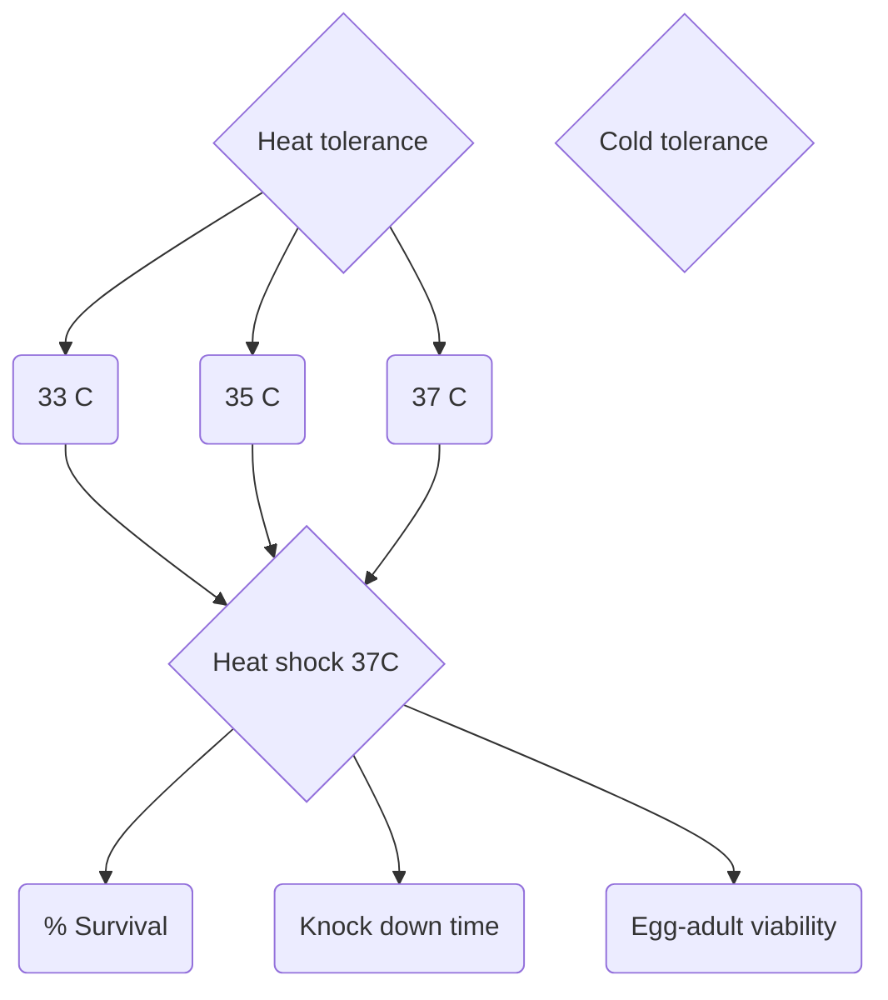
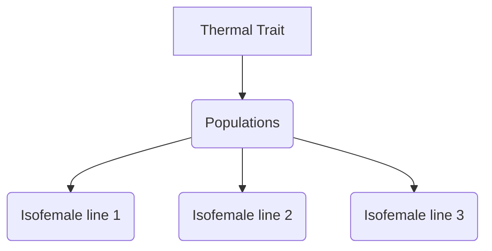
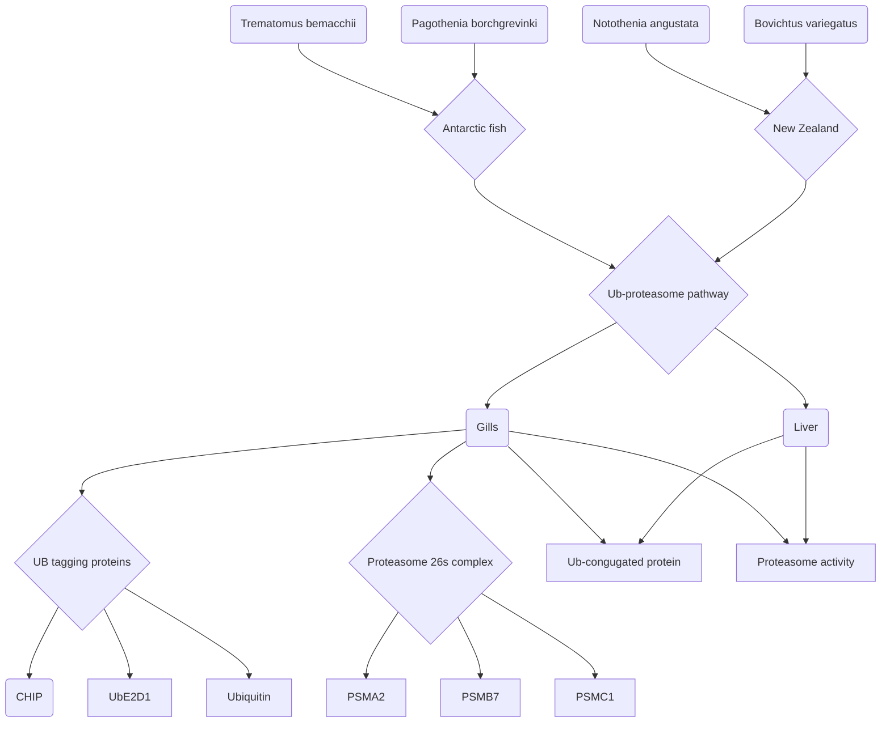

# 2017 General Notebook

### Author: Andrew D. Nguyen, [Evolutionary Physiologist](https://adnguyen.github.io)      
### Affiliation: Biology Department, University of Vermont      
### Contact: anbe642@gmail.com     

### Date started: 2017-01-01    
### Date end (last modified): ongoing   

<a rel="license" href="http://creativecommons.org/licenses/by/4.0/"></a><br />This work is licensed under a <a rel="license" href="http://creativecommons.org/licenses/by/4.0/">Creative Commons Attribution 4.0 International License</a>.    

###General Lab protocols found [here for heat shocks and RNA related experiments](https://github.com/adnguyen/Dissertation_temperature_adaptation_ants/blob/master/ANBE_protocols.md) and [here for protein related experiments](https://github.com/adnguyen/2016_Protein_stability_evolution/blob/master/Documents/Protocols/Protocols.md).     


**Introduction:**    
Notebook for 2017 new year. It'll log the rest of my dissertation and potentially new post doc ideas and/or projects

## List of projects and description   
* Hsp rxn norm: Understanding how the local thermal environment shapes thermal tolerance and stress response (using Hsps as a proxy for stress) in forest ants of the genus *Aphaenogaster*. CTmax and rxn norm of Hsp expression measured across forest ants from Fl to Maine.   
* Range limits: Identifying the factors/forces that set range limits in common forest ants (*Aphaenogaster picea*). Modelling + measured their cold physiology in forest ants of Maine and Vt.  
* Multiple stressors: Understanding how progressive desiccation and starvation impacts thermal tolerances in *A. picea*. We pre-treated with desiccation and starvation and then measured KO-time. We also measured the stress response.        
* Thermal niche paper: Collaborative paper understanding how the environment shapes the ability to withstand cold and hot temperatures. In field and in a common garden, we measured upper and lower thermal limits of ants from GA-Maine (2 species).    
* Stress in nature: Are ants stressed under experimental warming that projects climate change? Ants were collected from warming chambers (0-5 C increase from ambient) and we measured their stress response.    
* ​

###Table of Contents (Layout follows Page number: Date. Title of entry)    
* [Page 1: 2017-01-01](#id-section1). SICB meeting
* [Page 2: 2017-01-03](#id-section2). Yearly goals
* [Page 3: 2017-01-10](#id-section3). Status of projects
* [Page 4: 2017-01-17](#id-section4). Displaying hierarchical structure of a repo or set of directories in the terminal with tree command
* [Page 5: 2017-01-17](#id-section5). Project idea: The impact of temperature variation on ant colonly level performance.
* [Page 6: 2017-01-17](#id-section6). Tutorial for making fancy documents(Cover letters) in latex and rendering into pdf!
* [Page 7: 2017-01-19](#id-section7). Making sense of reviewer comment; multiple stressors ms
* [Page 8: 2017-01-19](#id-section8). Notes from SICB
* [Page 9: 2017-01-20](#id-section9). Status of projects
* [Page 10: 2017-01-26](#id-section10). Hoffmann et al. 2013, Functional Ecology Paper notes ; Constraints on upper thermal limits
* [Page 11: 2017-01-26](#id-section11). Notes on teaching statements
* [Page 12: 2017-01-26.](#id-section12). SHC lab meeting, organizational
* [Page 13: 2017-01-26](#id-section13). Bubliy & Loeschke 2005 paper notes; comparisons of selection on stress resistance
* [Page 14: 2017-01-26.](#id-section14). Mitchell & Hoffmann 2010 paper notes, Functional Ecology; Thermal ramping influences evolutionary potential
* [Page 15: 2017-01-27.](#id-section15) Embedding a calendar into your webpage
* [Page 16: 2017-01-31](#id-section16). Sørensen et al. 2003; Ecology letters, The Evolutionary and ecological role of heat shock proteins; paper notes
* [Page 17: 2017-01-31](#id-section17). List of Adaptive Variation in Hsps lit table. 
* [Page 18: 2017-01-31](#id-section18). Statuf of projects: writing
* [Page 19: 2017-01-31](#id-section19). SHC lab meeting reading: Ranga et al. 2017; Evol Ecol: Sibling Drosophila species (Drosophila leontia and Drosophila kikkawai) show divergence for thermotolerance along a latitudinal gradient
* [Page 20: 2017-02-02](#id-section20). SHC lab meeting: reading Ranga et al. 2017; lab discussion
* [Page 21: 2017-02-03](#id-section21).Todgham et al. 2017; JEB, The effect of temperature adaptation on the ubiquitin-proteasome pathway in notothenioid fishes
* [Page 22:](#id-section22).
* [Page 23:](#id-section23).
* [Page 24:](#id-section24).
* [Page 25:](#id-section25).
* [Page 26:](#id-section26).
* [Page 27:](#id-section27).
* [Page 28:](#id-section28).
* [Page 29:](#id-section29).
* [Page 30:](#id-section30).
* [Page 31:](#id-section31).
* [Page 32:](#id-section32).
* [Page 33:](#id-section33).
* [Page 34:](#id-section34).
* [Page 35:](#id-section35).
* [Page 36:](#id-section36).
* [Page 37:](#id-section37).
* [Page 38:](#id-section38).
* [Page 39:](#id-section39).
* [Page 40:](#id-section40).
* [Page 41:](#id-section41).
* [Page 42:](#id-section42).
* [Page 43:](#id-section43).
* [Page 44:](#id-section44).
* [Page 45:](#id-section45).
* [Page 46:](#id-section46).
* [Page 47:](#id-section47).
* [Page 48:](#id-section48).
* [Page 49:](#id-section49).
* [Page 50:](#id-section50).
* [Page 51:](#id-section51).
* [Page 52:](#id-section52).
* [Page 53:](#id-section53).
* [Page 54:](#id-section54).
* [Page 55:](#id-section55).
* [Page 56:](#id-section56).
* [Page 57:](#id-section57).
* [Page 58:](#id-section58).
* [Page 59:](#id-section59).
* [Page 60:](#id-section60).
* [Page 61:](#id-section61).
* [Page 62:](#id-section62).
* [Page 63:](#id-section63).
* [Page 64:](#id-section64).
* [Page 65:](#id-section65).
* [Page 66:](#id-section66).
* [Page 67:](#id-section67).
* [Page 68:](#id-section68).
* [Page 69:](#id-section69).
* [Page 70:](#id-section70).
* [Page 71:](#id-section71).
* [Page 72:](#id-section72).
* [Page 73:](#id-section73).
* [Page 74:](#id-section74).
* [Page 75:](#id-section75).
* [Page 76:](#id-section76).
* [Page 77:](#id-section77).
* [Page 78:](#id-section78).
* [Page 79:](#id-section79).
* [Page 80:](#id-section80).
* [Page 81:](#id-section81).
* [Page 82:](#id-section82).
* [Page 83:](#id-section83).
* [Page 84:](#id-section84).
* [Page 85:](#id-section85).
* [Page 86:](#id-section86).
* [Page 87:](#id-section87).
* [Page 88:](#id-section88).
* [Page 89:](#id-section89).
* [Page 90:](#id-section90).
* [Page 91:](#id-section91).
* [Page 92:](#id-section92).
* [Page 93:](#id-section93).
* [Page 94:](#id-section94).
* [Page 95:](#id-section95).
* [Page 96:](#id-section96).
* [Page 97:](#id-section97).
* [Page 98:](#id-section98).
* [Page 99:](#id-section99).
* [Page 100:](#id-section100).
* [Page 101:](#id-section101).
* [Page 102:](#id-section102).
* [Page 103:](#id-section103).
* [Page 104:](#id-section104).
* [Page 105:](#id-section105).
* [Page 106:](#id-section106).
* [Page 107:](#id-section107).
* [Page 108:](#id-section108).
* [Page 109:](#id-section109).
* [Page 110:](#id-section110).
* [Page 111:](#id-section111).
* [Page 112:](#id-section112).
* [Page 113:](#id-section113).
* [Page 114:](#id-section114).
* [Page 115:](#id-section115).
* [Page 116:](#id-section116).
* [Page 117:](#id-section117).
* [Page 118:](#id-section118).
* [Page 119:](#id-section119).
* [Page 120:](#id-section120).
* [Page 121:](#id-section121).
* [Page 122:](#id-section122).
* [Page 123:](#id-section123).
* [Page 124:](#id-section124).
* [Page 125:](#id-section125).
* [Page 126:](#id-section126).
* [Page 127:](#id-section127).
* [Page 128:](#id-section128).
* [Page 129:](#id-section129).
* [Page 130:](#id-section130).
* [Page 131:](#id-section131).
* [Page 132:](#id-section132).
* [Page 133:](#id-section133).
* [Page 134:](#id-section134).
* [Page 135:](#id-section135).
* [Page 136:](#id-section136).
* [Page 137:](#id-section137).
* [Page 138:](#id-section138).
* [Page 139:](#id-section139).
* [Page 140:](#id-section140).
* [Page 141:](#id-section141).
* [Page 142:](#id-section142).
* [Page 143:](#id-section143).
* [Page 144:](#id-section144).
* [Page 145:](#id-section145).
* [Page 146:](#id-section146).
* [Page 147:](#id-section147).
* [Page 148:](#id-section148).
* [Page 149:](#id-section149).
* [Page 150:](#id-section150).
* [Page 151:](#id-section151).
* [Page 152:](#id-section152).
* [Page 153:](#id-section153).
* [Page 154:](#id-section154).
* [Page 155:](#id-section155).
* [Page 156:](#id-section156).
* [Page 157:](#id-section157).
* [Page 158:](#id-section158).
* [Page 159:](#id-section159).
* [Page 160:](#id-section160).
* [Page 161:](#id-section161).
* [Page 162:](#id-section162).
* [Page 163:](#id-section163).
* [Page 164:](#id-section164).
* [Page 165:](#id-section165).
* [Page 166:](#id-section166).
* [Page 167:](#id-section167).
* [Page 168:](#id-section168).
* [Page 169:](#id-section169).
* [Page 170:](#id-section170).
* [Page 171:](#id-section171).
* [Page 172:](#id-section172).
* [Page 173:](#id-section173).
* [Page 174:](#id-section174).
* [Page 175:](#id-section175).
* [Page 176:](#id-section176).
* [Page 177:](#id-section177).
* [Page 178:](#id-section178).
* [Page 179:](#id-section179).
* [Page 180:](#id-section180).
* [Page 181:](#id-section181).
* [Page 182:](#id-section182).
* [Page 183:](#id-section183).
* [Page 184:](#id-section184).
* [Page 185:](#id-section185).
* [Page 186:](#id-section186).
* [Page 187:](#id-section187).
* [Page 188:](#id-section188).
* [Page 189:](#id-section189).
* [Page 190:](#id-section190).
* [Page 191:](#id-section191).
* [Page 192:](#id-section192).
* [Page 193:](#id-section193).
* [Page 194:](#id-section194).
* [Page 195:](#id-section195).
* [Page 196:](#id-section196).
* [Page 197:](#id-section197).
* [Page 198:](#id-section198).
* [Page 199:](#id-section199).
* [Page 200:](#id-section200).


------
<div id='id-section1'/>
### Page 1: 2017-01-01. Society for Integrative and Comparative Physiology (SICB) meeting in New Orleans     

### Table of talks I'd like to attend     

| Date            | Time        | Room                   | Speaker                          | Title                                    |
| :-------------- | :---------- | :--------------------- | :------------------------------- | :--------------------------------------- |
| Wednesday, Jan4 | 19:30       | Hilton Ballroom        | Swalla                           | Follow the Yellow Brick Road: An Odyssey from Myoplasm to Marine Biology to Genomics |
| Thursday, Jan5  | 8:00        | 217                    | Kelly                            | Protein coding and regulatory variation contribute to heat adaptation in the copepod Tigriopus californicus. |
| Thursday, Jan5  | 8:15        | 217                    | Logan                            | The evolutionary potential of a global insect invader in the face of rapid environmental change |
| Thursday, Jan5  | 8:30        | 217                    | Campbell                         | Urban heat islands and temperature-mediated physiological shifts between populations of the Puerto Rican crested anole |
| Thursday, Jan5  | 8:30        | 221                    | Charbonneau                      | Who Are the ‘Lazy’ Ants? Inter-worker Variation Gives Insight into Potential Functions of Inactivity |
| Thursday, Jan5  | 9:00        | 217                    | Ferris                           | The genomics of rapid adaptation to climatic extremes in house mice across the Americas |
| Thursday, Jan5  | 9:15        | 214                    | Geyman                           | Temperature Effects on Parasite Larval Size Over Time and Across Multiple Life Stages |
| Thursday, Jan5  | 9:30        | 214                    | Genovese                         | Plasticity in thermal tolerance of early life history stages of marine invertebrate larvae |
| Thursday, Jan5  | 9:30        | 217                    | Jangjoo                          | Gene expression associated with dispersal ability under different temperature conditions in the alpine butterfly, Parnassius smintheus |
| Thursday, Jan5  | 11:45       | 211-213                | Gough                            | Physical Properties and Anisotropy in the Central Tissue Layer of Cetacean Tail Flukes |
| Thursday, Jan5  | 11:45       | 214                    | Debiasse                         | Testing the effect of ocean acidification on a sponge-coral species interaction |
| Thursday, Jan5  | 13:00       | 215-216                | Flynn                            | Response of Amphibian Gut Microbiome to Coal Combustion Waste |
| Thursday, Jan5  | 13:30       | 224                    | Tangwancharoen                   | Divergence in cis-regulatory elements and HSPB1 gene expression along a temperature cline in the copepod Tigriopus californicus |
| Thursday, Jan5  | 13:45       | 219                    | Kingsolver                       | Inconstancy is informative: Estimating performance curves in fluctuating environments |
| Thursday, Jan5  | 14:00       | 219                    | Howey                            | Effect of Temperature on Snake Locomotion and the Interpretation of Thermal Performance Curves |
| Thursday, Jan5  | 15:15       | 214                    | Tielens                          | Geological age and host polymorphism affect functional diversity and community composition in plant-insect interactions across a space-for-time chronosequence on the Hawaiian Islands. |
| Thursday, Jan5  | 19:00       | 208                    | Sheriff                          | Integrating physiology, behavior, and ecology to understand the mechanisms that regulate and limit animal populations |
| Thursday, Jan5  | 15:30-17:30 | Exhibit Hall (posters) | Brueggemann                      | The effect of cholesterol and _-tocopherol on cold tolerance, post-cold performance, and rapid cold hardening |
| Thursday, Jan5  | 15:30-17:30 | Exhibit Hall (posters) | Chan                             | Taking the heat: High thermal tolerance of larval and adult mangrove snails |
| Friday, Jan6    | 7:50        | 206                    | Ragland; Williams                | Introduction to Evolutionary Impacts of Seasonality symposium |
| Friday, Jan6    | 8:15        | 211-213                | Gilbert                          | Natural Selection on Thermal Preference and Performance over a Rapid Timescale |
| Friday, Jan6    | 8:30        | 215-216                | Nourabadi                        | Fitness consequences of pH adaptation in an experimentally evolved beneficial symbiosis |
| Friday, Jan6    | 9:00        | 210                    | Obrien                           | The metabolic costs of animal weapons    |
| Friday, Jan6    | 9:30        | 206                    | Buckley; Kingsolver              | Insect Development, Thermal Plasticity and Fitness Implications in Changing, Seasonal Environments |
| Friday, Jan6    | 9:30        | 211-213                | Riddell                          | Potential responses to climate change are improved by physiological acclimation of water loss |
| Friday, Jan6    | 10:30       | 221                    | Clay                             | Transcriptomics of salamander tail tips reveal potential biomarkers of stress. |
| Friday, Jan6    | 11:00       | 221                    | Holden                           | Preparing for winter dormancy: Early-life experience affects condition, metabolism, and hormonal response to cold temperatures in the checkered garter snake, Thamnophis marcianus |
| Friday, Jan6    | 11:30       | 215-216                | Tanner; stillmann                | Locally adapted Phyllaplysia taylori populations in Central California show higher thermal plasticity potential |
| Friday, Jan6    | 11:45       | 215-216                | Oyen                             | Common garden experiments reveal local adaptation in critical thermal limits of bumblebees (Apidae, Bombus) over short geographic distances |
| Friday, Jan6    | 13:45       | 214                    | Norin                            | Plasticity, performance, and pace of life: individual differences in physiological and behavioural flexibility towards daily changes in temperature and oxygen availability |
| Friday, Jan6    | 14:00       | 214                    | Smith                            | Assessing the protein and metabolic costs of a trade-off between reproduction and immunity |
| Friday, Jan6    | 14:00       | 220                    | Crickenberger                    | Do temperature and competition interact to set a range limit? |
| Friday, Jan6    | 14:15       | 219                    | Kenny                            | How temperature influences the viscosity of hornworm hemolymph |
| Friday, Jan6    | 14:15       | 223                    | Refsnider                        | Plasticity in Behavioral Thermoregulation by Lizards on an Elevational Gradient: A Reciprocal Transplant Experiment |
| Friday, Jan6    | 14:45       | 214                    | Jaumann                          | Nutritional Stress Decreases Fecundity and Choosiness in a Butterfly |
| Friday, Jan6    | 15:00       | 206                    | Williams; Ragland                | Evolutionary impacts of seasonality: synthesis and directions forward |
| Friday, Jan6    | 15:00       | 214                    | Triedel; Williams                | The effect of diet nutrient composition on development and life history traits of a wing polymorphic cricket, Gryllus lineaticeps |
| Friday, Jan6    | 19:30       | 215-216                | Sosik                            | Life in the Plankton, Stories from automated submersible microscopy and flow cytometry |
| Friday, Jan6    | 15:30-17:30 | Exhibit Hall (posters) | Kornegay                         | Methylation and chromatin remodeling complex from sponges to humans |
| Saturday, Jan7  | 8:45        | 215-216                | Robberts;Rank;Stillman; Williams | The effects of snow cover on overwinter physiology of a montane insect |
| Saturday, Jan7  | 9:30        | 211-213                | Wada                             | A potential link between organismal adrenocortical responses and cellular heat shock responses |
| Saturday, Jan7  | 10:15       | 219                    | Stoehr                           | Temperature, Photoperiod and Nutrients Affect Phenotypically Plastic Wing Patterns in the Cabbage White Butterfly |
| Saturday, Jan7  | 10:45       | 215-216                | Allen                            | Diet-by-temperature interactions on a sexually selected trait and sexual dimorphism |
| Saturday, Jan7  | 10:45       | 220                    | Bryant                           | Uncoupling Proteins and Thermal Acclimation and Adaptation in Atlantic killifish, Fundulus heteroclitus |
| Saturday, Jan7  | 11:00       | 215-216                | Mikucki                          | Seasonal Differences in Diapause Induction in a Vermont Population of Pieris rapae Butterflies |
| Saturday, Jan7  | 11:00       | 220                    | Novarro                          | Geographic patterns of thermal tolerance in a widespread lungless salamander |
| Saturday, Jan7  | 11:30       | 211-213                | Finger                           | The Effect of Heat Shock on Constitutive and Inducible Heat Shock Proteins and Corticosterone in the Zebra Finch |
| Saturday, Jan7  | 11:30       | 215-216                | Lockwood                         | Molecular targets of thermal stress during early development in Drosophila melanogaster |
| Saturday, Jan7  | 11:45       | 215-216                | Niedojadlo                       | Daily Energy Expenditure, but Not Self-Maintenance Costs, Are Related to Hematological Variables in Response to Temperature Acclimation |
| Saturday, Jan7  | 13:30       | 215-216                | Lisovski                         | Biologically Significant Dimensions of Seasonality |
| Saturday, Jan7  | 13:45       | 217                    | Lozier                           | Population Genomics of Color Pattern Variation in a Widespread North American Bumble Bee |
| Saturday, Jan7  | 14:00       | 215-216                | Betini                           | Fitness Trade-off Between Seasons Causes Multigenerational Cycles in Phenotype and Population Size |
| Saturday, Jan7  | 14:00       | 220                    | Mitchell                         | Do covariances between maternal behavior and embryonic physiology drive sex-ratio evolution under environmental sex determination? |
| Saturday, Jan7  | 14:15       | 225-226                | Ceja                             | Ecologically modeling the distribution of an intertidal crab concerning global change |
| Saturday, Jan7  | 15:30-17:30 | Exhibit Hall (posters) | Pigg; Williams                   | Effects of ambient temperature on the organization of lipids of the avian stratum corneum |
| Sunday, Jan8    | 8:00        | 220                    | McGee                            | Machine learning predicts cichlid feeding kinematics from craniofacial morphology |
| Sunday, Jan8    | 8:30        | 217                    | Newman                           | The Influence of the Early-life Environment on Stress Physiology and Fitness in the Wild |
| Sunday, Jan8    | 8:30        | 224                    | Irvine                           | Proteomic Changes Due to Elevated Temperature in Ascidian Ovaries |
| Sunday, Jan8    | 8:45        | 214                    | Matoo; Montooth                  | Role of Genetic Variation on the Ontogeny of Metabolism during Development. |
| Sunday, Jan8    | 8:45        | 224                    | Hurley                           | The Heat is On: Decrease in Avian Sperm Functionality at High Ambient Temperatures |
| Sunday, Jan8    | 9:15        | 215-216                | Soda; Slice                      | Vector autoregressive-moving average models as tools to visualize differences in shape trajectories |
| Sunday, Jan8    | 9:15        | 218                    | Diamond                          | Rapid evolution of ant thermal tolerance within an urban heat island |
| Sunday, Jan8    | 9:30        | 214                    | Neel; Mcbrayer                   | Thermal dependence of sprint performance and critical thermal limits in ecologically distinct populations of a small ectotherm |
| Sunday, Jan8    | 9:30        | 217                    | Graham                           | Evolutionary history matters: Maternal hormonal response to a natural stressor and effects on offspring growth and behavior |
| Sunday, Jan8    | 9:30        | 218                    | Hall; Warner                     | Thermal Spikes Caused by the Urban Heat Island Effect Result in Differential Egg Survival of a Non-native Lizard ( Anolis cristatellus ) |
| Sunday, Jan8    | 10:00       | 221                    | Dormio                           | Staying Active for Life: Investigating the Covariance Between Behavioral and Physiological Trade-offs in Treefrogs |
| Sunday, Jan8    | 10:15       | 217                    | Vitousek                         | Do Brief, Acute Stressors Have Lasting Effects on Phenotype? |
| Sunday, Jan8    | 10:30       | 214                    | Shah;Ghalambor                   | Does Climate Variability Predict Thermal Tolerance? A Comparison of Thermal Breadths in Aquatic Insects Across Elevation & Latitude |
| Sunday, Jan8    | 10:45       | 218                    | Balaban                          | Elastic energy storage and thermal performance in fence lizards |
| Sunday, Jan8    | 10:45       | 224                    | Mccue                            | Repeated exposure to food limitation earlier in life enables rats to spare lipid stores during prolonged starvation |
| Sunday, Jan8    | 11:00       | 224                    | Mcternan                         | Resting metabolism comparisons among populations of a subspecies of lizard differing in climate and vegetation types |
| Sunday, Jan8    | 11:30       | 217                    | Senner                           | The Stress Response of Peromyscus Mice to Experimental High Elevation Conditions |
| Sunday, Jan8    | 11:45       | 214                    | Nguyen                           | Constraints on cold tolerance and hardening ability limit the distribution of forest ants at its northern range boundary. |
| Sunday, Jan8    | 11:45       | 222                    | Crall                            | A Neonicotinoid Pesticide Disrupts Nest Behavior and Social Interactions in Bumblebee Colonies |
| Sunday, Jan8    | 13:30       | 210                    | Harrison                         | Hypometric scaling of metabolic rate arises from size-dependent natural selection on ATP demand |
| Sunday, Jan8    | 13:45       | 214                    | Clark; Williams                  | A Genetic Polymorphism for a Hormonal Circadian Rhythm is Associated With a Shift in Metabolic Fuel Use in Flight-Capable but not Flightless Crickets |
| Sunday, Jan8    | 13:45       | 210                    | Salin                            | How Does Mitochondrial Functioning Constrain Energy Efficiency? |
| Sunday, Jan8    | 14:00       | 222                    | Cirino                           | Effects of male quality and territory quality on female preference of varying condition |
| Sunday, Jan8    | 14:15       | 214                    | Braciszewsi                      | Relatedness and differential disease resistance in eastern Pacific Haliotids |
| Sunday, Jan8    | 14:15       | 224                    | Boothby                          | How do Tardigades Survive Extremes? Disordered Proteins as Mediators of Tardigrade Stress Tolerance |
| Sunday, Jan8    | 14:30       | 221                    | Miles                            | Desert tortoises race against climate change: past, present and future |
| Sunday, Jan8    | 14:45       | 220                    | Schoenle                         | Why Does Malaria Infection Reduce Fitness in Wild Birds?: A Test of Physiological Mechanisms |
| Sunday, Jan8    | 15:00       | 222                    | Leary                            | Acute Stress is a Target of Intra- and Intersexual Selection in the Green Treefrog, Hyla cinerea: Implications for Fitness, Honest Signals, and the Evolution of Endocrine-based Acoustic Armaments |

------
<div id='id-section2'/>
### Page 2: 2017-01-03. Yearly Goals

1. Submit and Publish 3 manuscripts: range limits, Hsp rxn norm, and multiple stressors (also thermal niche paper).    
2. Get a post doc. This'll probably involve learning a new study system. And also sending out tons of applications.      
3. Learn and build a shiny app.    
4. Learn and become more proficient in statistics (Machine learning?, Baysian, predictive modelling, mixed effects modelling, eigentensor analyses).     
   * Quantitative genetics: more statistical genetics   

5. Form new collaborations? It'd be awesome to work with Brent Sinclair, Brent Lockwood, Joel Kingsolver, Caroline Williams, Jon Stillman, Alex Gunderson.     
6. Participate in a meta-analysis? Would be cool. 
7. Learn more physiology: Q10, metabolism related topics, lipid membranes, metabolites.   

------
<div id='id-section3'/>
### Page 3: 2017-01-10. Status of Projects    

1. Project updates:    
    * **Hsp gene expression + Ctmax project:**
        * rewrite results, intro and send out to NJG and SHC  (methods done)    
        * Submit to PNAS  
    * **Multiple stressors ms:**   
        * In SHC's hands, due 2017-02-14

    * **Range limits ms**: SHC lab gave verbal edit, still need to incorporate     
        * **Thermal niche ms:** Lacy to check intro, and add refs.    	
    * **Stressed in nature MS: Samples to rerun.**       
        * update: Curtis can no longer work+ write on project   
        * **There are 74 samples: 3 days of RNA isolation + cDNA synthesis. 4 gene targets ran in duplicates is 2 plates per gene = 8 plates total.  2 days for 8 plates.**           
    * **Proteome stability project:**    
        * **~130 proteins for rudis, ~250 proteins for pogos**(we got 500 proteins last time); labelling is ok
          * Rerun mass spec, but loading more proteins (Bethany)

2. **Thesis related**  [FORMS FOUND HERE](http://www.uvm.edu/~gradcoll/?Page=Forms.html)  
    * Formatting:    
      * Introduction (> 3 pages), manuscripts, then synthesis/conclusion (~3 pages) ; SHC and NJG agree
        * started outline   
    * [Deadlines](http://www.uvm.edu/~gradcoll/pdf/Timetable%20for%20defense%202016-17-2.pdf):    
      1. Intent to graduate: February 1st for May.   
      2. Send defense committe form to grad college---now   
      3. Graduate college format check March 4th
      4. Defense notice 3 weeks before defense  (oral defense by March 24th).   
      5. Final thesis April 7th.  


------
<div id='id-section4'/>
### Page 4: 2017-01-17. Displaying hierarchical structure of a repo or set of directories in the terminal with tree command

1. In the terminal, [install the tree command](https://rschu.me/list-a-directory-with-tree-command-on-mac-os-x-3b2d4c4a4827#.wk0u34bpj)
   * You may have to install the [homebrew](http://brew.sh/)    
2. use the tree command in the terminal

```
2017_Ecological_Genomics andrewnguyen$ tree
.
├── 2017_Ecological_Genomics.Rproj
├── Online_notebook.md
├── README.md
├── RasterPCA_demo.Rmd
├── RasterPCA_demo.html
├── index.Rmd
├── index.html
└── index.pdf

0 directories, 8 files
```

------
<div id='id-section5'/>
### Page 5: 2017-01-17. Project idea: The impact of temperature variation on ant colonly level performance.     

**Background**   
Ant colonies experience temperature fluctuations throughout the day and season. In response to temperature variation, ants must be able to forage under cool and hot conditions. One way to achieve high performance in the face of temperature variation is for the colony to match individual level performance with shifting temperatures. For example, for colonies with diverse genetic structures, some genotypes may forage better under cool or hot conditions. Multiply mated queens (*Pogonomyrmex*) will produce offspring with more phenotypic variation in traits, compared to singly mated queens (*Aphaenogaster*).     

**Notes:** Need to actually verify that foraging efficiency differs throughout the day in a colony, aka need to know more natural history. Look up Deborah Gordon's work. How will you address the confounding issue of demographic effects? Meaning what if there is genetic clumping of sperm and it corresponds to age polyethism, leading to the covariance between age and genotype. Also, the age structure of the colony itself may covary with genotype.       

**Question**   

1. Is the amount of physiological variation in upper thermal limits reflected in the number of fathers?    
2. Do ant colonies utilize different genotypes to forage throughout the day and season?    

or

Do ants display seasonal adaptation in forager performance?   

**Hypotheses**  

1. The number of fathers increases the amount of phenotypic variatnce in upper thermal limits.    
2. There is genetic structuring in the foragers throughout the day and season.    

**Predictions**    

1. Additive genetic variance in upper thermal limits will be proportional to the number of fathers.     
2. Thermally tolerant genotypes perform during the warmest parts of the day and vice versa for more cool tolerant genotypes.    
3. The more thermally tolerant genotypes start off at low frequency early on in the season, but increase in frequency at peak summer, then decrease again.    

**Experimental Design**   

I should do a power analysis to see how many ants and colonies I'd need to sample. Sam Scarpino has an R package for this I think.   

1. Document the natural history of 10 pogo colonies, to tune for sampling   
2. If there is like 10 foraging bouts, or 10 time slices through the day, sample ~30 ants for each colony at each time slice.   
3. Phenotype each ant: measure morphology (head width, leg lengths, alitrunk length, etc), number of ovarioles?, hydrocarbons, desiccation resistance, measure upper thermal limit   
4. Pool ants at each time slice, isolate DNA, and then pool-seq (capture-seq, but chatting with April, it sounds like biased sampling because only the portion of the first exon and promoter are sequenced.)     

**Critical Results or Alternative outcomes**  

1. Positive relationship between parentage and phenotypic variance.    
2. Structuring of alleles throughout the day or season. Some start off low, increase, then decrease in frequence.  This would indicate seasonal adaptation of foragers!     

It is possible that we won't find anything at all. But maybe because we're pool-sequencing, we can pick up the microbiome? And maybe that is structured diurnally or throughout the season.    

### Another idea: Compare parasite load between ant colonies with high and low number of fathers.  

Quick and dirty: One of the benefits of a diverse genetic background in a colony is disease resistance. So, test this by pool-seq experiment and measuring the parasite loads for ~30 individuals, potentially across a whole phylogeny of ants that vary in number of daddys and number of queens. Parasite load from different taxanomic groups (fungus, nemotodes, bacteria, viruses) can be mapped onto the phylogeny!

------
<div id='id-section6'/>
### Page 6: 2017-01-17. Tutorial for making fancy documents(Cover letters) in latex and rendering into pdf!

I took this [cool template](https://www.sharelatex.com/templates/cover-letters/awesome-cv-cover-letter) for making a cover letter, which was in ".tex" format. Then converted the tex file into pdf using [this tutorial](http://economistry.com/2013/01/installing-and-using-latex-for-mac/), which involve installing mactex, sublime text 2, and skim. 

------
<div id='id-section7'/>
### Page 7: 2017-01-19. Making sense of reviewer comment; multiple stressors ms   

**Is there any direct evidence that heat shock proteins prevent heat knockdown?**    

Calabria et al. 2012 find differences in basal hsp70 protein expression but not heat-induced hsp70 expression between 3 genotypes of fruit flies( they differ in chromosomal structure). These differences were reflected in the fast ramp (0.1 C/min ramp), but not slow ramp(0.6 C/min ramping). 

3 genotypes:

1. O(3+4)/O(3+4): higher hsp70 basal expression and thermal tolerance under fast ramp;       
2. O(3+4+8)/O(3+4+8)    
3. O(st)/O(st): lower hsp70 basal expression and thermal tolerance under fast ramp;   

### References:    

1. Calabria G, Dolgova O, Rego C, et al (2012) Hsp70 protein levels and thermotolerance in Drosophila subobscura: a reassessment of the thermal co-adaptation hypothesis. Journal of Evolutionary Biology 25:691–700. doi: 10.1111/j.1420-9101.2012.02463.x


------
<div id='id-section8'/>
### Page 8: 2017-01-19. Notes from SICB    

**2017-01-05; Met with Joel Kingsolver**    

Met and talked about range limits project, selection gradient idea, and hsp rxn norm gxp project.      
* For my ancestral trait reconstruction of CTmax, I excluded the outgroup, suggests to include it      
* For multi-panel figure with parameters on x axis and ctmax on y axis; try partial regression      
* If I don't get into PNAS, try Proc B    
* For looking at shifts in trade-offs between multiple stressors look up Nancy Emory, central cali, she is a plant evo ecologist   
* Selection gradient proj idea; JK asks what has been done in well known systems? ie. Arapidopsis (sp?), check Andy Schidth   

**2017-01-06; met with Ray Huey**    

Showed hsp rxn norm paper stuff:     
* Are parameters correlated- he was worrieda bout this.    
* Try fitting splines and extracting parameters     
* Selection on graits; linear or quadratic? non-parametric?       

**2017-01-07 Met with Dan Hahn and Greg Ragland**      

Went over data and Dan liked how Iparsed out all the predictions for the shifts in reaction norms of hsp gxp expression.    
* Finger example highlights the differences between resistance and tolerance    
* Pressing two fingers together without moving = **resistance**       
* When 1 finger moves the other finger but can move back = **tolerance**     

------
<div id='id-section9'/>
### Page 9: 2017-01-20. Status of projects

1. Project updates:    
    * **Hsp gene expression + Ctmax project:**
        * Have intro, discussion mostly complete by today, meet with NJG Monday (2017-01-23)
        * Submit to PNAS in May?   
    * **Multiple stressors ms:**   
        * In SHC's hands, due 2017-02-14
    * **Range limits ms**: SHC lab gave verbal edit, still need to incorporate     
        * **Thermal niche ms:** Lacy to check intro, and add refs.    	
    * **Stressed in nature MS: Samples to rerun.**       
        * **There are 74 samples: 3 days of RNA isolation + cDNA synthesis. 4 gene targets ran in duplicates is 2 plates per gene = 8 plates total.  2 days for 8 plates.**           
    * **Proteome stability project:**    
        * **~130 proteins for rudis, ~250 proteins for pogos**(we got 500 proteins last time); labelling is ok
          * Rerun mass spec, but loading more proteins (Bethany)

2. **Thesis related**   
    * **Defense talk: Have first version by Jan 31st**    
      * Required defense talk in biolunch: Feb 24 (Friday)     
    * Working title: Evolutionary Innovations of Ants to Thermally Stressful Environments     
    * Formatting:    
      * Introduction (> 3 pages), manuscripts, then synthesis/conclusion (~3 pages) ; SHC and NJG agree
        * started outline   
    * [Deadlines](http://www.uvm.edu/~gradcoll/pdf/Timetable%20for%20defense%202016-17-2.pdf):    
      1. Intent to graduate: February 1st for May.   
      2. Send defense committe form to grad college---**done**
      3. Graduate college format check March 4th
      4. Defense notice 3 weeks before defense  (oral defense by March 24th).   
      5. Final thesis April 7th.  


------
<div id='id-section10'/>
### Page 10: 2017-01-26. Hoffmann et al. 2013, Functional Ecology Paper notes    

Starting off intro with constraints on upper thermal limits. 


**What can constraint upper thermal limits?**

1. low plasticity (stillmann paper shows this in crabs)
2. low adaptive potential (heritability)   
   * low variation in upper compared to lower thermal limits
3. Phylogenetic constraints inferred from strong phylogenetic signal. 
   * high lambda in PGLS for insects, lizards + snakes  

Some definitions: 

* heritability: degree of phenotypic variation in a trait that is genetic 
* evolvability: extent to which the trait's mean can shift under selection, which depends on the amount of genetic variation and mean values.  

Paper argues that mid-latitude species are most prone to heat stress (presently and to the future). Why? And what is mid-latitude? 

  


------
<div id='id-section11'/>
### Page 11: 2017-01-26. Notes on teaching statements   

This science [article](http://www.sciencemag.org/careers/2006/04/writing-teaching-statement) has interesting advice. The teaching statement is usually a writing filter to weed out applicants who have not thought stuff through. Illuminates the character of the writer. It should be 1-2 pages. 


1. **Cater teaching statement to the institution**
2. **Demonstrate a real commitment to teaching** 
   * Low expectations on unique ways of teaching, but just show commitment (usually a sentence or two)
   * cite evidence, but be brief
3. Avoid presenting teaching as a 2nd priority
4. *Show us you care, but make it short and to the point* 
5. echo teachign interests in the cover letter, 1-2 sentences
6. Write about courses you'd like to teach!  For me, it'd be evolutionary physiology, evolution, computational biology?, ecological genomics 
   * cater this to the institution
   * display ideas, but don't be too ambitious
7. Teaching statement also indicates to the search committee how the applicant sees themselves in 
   * don't limit yourself to advanced courses, but also include beginners!
8. Display willingness to learn, pay attention, and change to reflect open mindedness and eagerness; shows you're not limited by what you are now
9. **Draw on your experieences as a student, a scholar, and human being** 
10. Don't promise too much

A good quote: 

`I used to assume that any student who did not get an "A" on an exam wasn't trying, until it occurred to me that no matter how hard I try in dance classes, I rarely excel. Becoming less critical of my students--while still maintaining high standards--has made me a better teacher.`


------
<div id='id-section12'/>
### Page 12: 2017-01-26. SHC lab meeting, organizational    

### Write down 3 concrete goals and timeline for the semester: 

1. Publish the multiple stressors manuscript
   * deadline is Feb 12 to submit revisions
2. Get a post doctoral position or real job by end of semester
   * NSF, should know by Feb 9th
   * Hibbitt fellow, no clue, but should be soon
   * prepping application for data scientist position
3. Have submittable version of hsp rxn norm paper to PNAS
   * Part of thesis, so should be accomplished by April 7th

Benchmark goals

1/3- Wait for SHC to give back feedback and take 2 days to submit it, prior to Feb12. Keep writing on PNAS paper, have introduction, discussion done. Results and methods are mostly complete but could be tweaked. Post doc stuff is passive

2/3- get notified from NSF, hibbit. For Hibbitt, if they're interested, they'll interview on site. For PNAS paper, shape up ms.

3/3- Constant revisions on PNAS paper

### Set schedule 

I have a biolunch talk (dissertation requirement talk) February 24th. Give practice talk February 10th. 

Tentative: Thursdays 4-5PM

------
<div id='id-section13'/>
### Page 13: 2017-01-26. Bubliy & Loeschke 2005 paper notes

**Correlated response to selection for stress resistance.** 


Fruit fly paper doing a selection experiment on: 

1. cold (CS) in units of survival rate
   * chilled 5 C, recover 24 hours
2. heat (HS) in units of survival rate
   * hardened 30 min at 36C, recover 20 hours at 25 C, then heat shocked 38C 1 hour
3. desiccation (DS)
4. starvation (SS)
5. Heat knockdown time (KS) -in units of time (minutes)
   * KO at 40C
6. Lifespan (LS)

* And then they checked all of the traits from each selected line relative to controls. 
* 21 generations


1. Cold shock resistance (CS)
   * CS, HS, and DS all increased
2. Heat shock resistance (HS)
   * HS, KS, DS all responded
3. Heat knockdown resistance  (KS)
   * only KS responded

KS and SS increased developmental time. 


Upper and lower thermal limits can equally respond to selection after X generations in fruit flies. IN this experiment, there isn't necessarily a trade off betwween the two (except in cold shock resistance). 


------
<div id='id-section14'/>
### Page 14: 2017-01-26. Mitchell & Hoffmann 2010, Functional Ecology; Thermal ramping influences evolutionary potential

In fruit flies, they measured upper thermal limits as knockdown time in a static and ramping experiment. They did this in  a quantitative genetic design, so they could estimate the narrow-sense heritability (partition out variation to the additive genetic component).  They also measured this for ~11 species.  (looks like a lot of work)


**Methods:**

Slow ramp: 0.06 C/min

Fast, static HS: 38C preset temp


Fast and slow show a postive relationship. 


Set up a model to partition out variation Va (additive genetic variance), Vp (phenotypic variance), and Ve (environmental variance) and presented models for their coefficient of variation.


**Results**: 

* Ramping had low heritability(not sig different than 0), but static had high heritability (sig different than 0)
* Ramping had more environmental variance, but do the data need to be standardized first, such that the mean is 0 and variance i 1? No, the units are the same for both traits
* Ramping had higher phenotypic variance


**THoughts**

This paper contrasts a little bit with van Heraawarden & Sgrò paper, where they focus one 1 species. But they find that ramping, fast HS, and hardening all significantly correlate. But there is an additive genetic axis where


------
<div id='id-section15'/>
### Page 15: 2017-01-27. Embedding calender into webpage

[Followed this tutorial](http://denisecase.github.io/2015/07/10/add-calender-to-site/): 

1. Create a  calender in google (gmail)
2. Go to settings
3. click calendars
4. go down to where it says embed this calendar, it is in html code, so copy that
5. tutorial goes through yml, but I just used the html code to make a new webpage with my calender in it and created a link in the navigation bar

[Here it is](https://adnguyen.github.io/calendar.html), useful for me to access my calender wherever I am now!   


### 2017-01-31 Update  

Calendar doesn't show up on my iphone or ipad (safari), what is the point? Taking the calendar out. 


------
<div id='id-section16'/>
### Page 16: 2017-01-31. Sørensen et al. 2003; Ecology letters, The Evolutionary and ecological role of heat shock proteins

Trying to get a handle on how this paper frames the role of Hsps with upper thermal limits. From the abstract, they mention it as a resistance mechanism. 


1. **Defining stress:**  a condition that disturbs the normal function of the biological system or a condition that decreases fitness (Hoffmann & Parsons 1991; Bijlsma & Loeschcke 1997)
   * I like part of the definition. I'd define stress **as a perturbation to a biological system that decreases fitness.** Or, a force acting on a biological system that decreases fitness. 
   * These forces can be *extrinsic* (environmental) and *intrinsic* (genetics, inbreeding, deleterious mutations, ageing).


2. **Hsp natural history** (cite Ritossa 1962 as first discovering heat shock response through chromosome puffs(which had Hsps on it))
3. **Protein quality control system (PQC)**: importance increases upon exposrue to environmental /genetic stresses
   * function is 2 fold: correct folding and to assist in degradation of denatured or aggregated proteins
   * not very informative
4. Stress as an ecoogical and evo force (Don't agree with the framing)
   * types of responses:
     * move, alter physiological state through hibernation or diapause
     * adapt or acclimate
     * fail and die
   * Adaptive change in Hsp over days (Nguyen et al. 1994; Ferguson et al. 1998) or over seasons (Fader et al. 1994; Hofmann & Somero 1995; Pyza et al. 1997; Miner et al. 2000) and natural populations(no citations, what?)
5. Effects of stress on rates of evolution
   * ​
6. **Costs of Hsp expression**
   * unclear whether reduced fitness is due to cost of acclimation or reared under poor conditions. Why would we tease these apart? 
   * Benefits of acclimation (stress /longevity) can be separated from costs
     * ex: Hercus et al. 2003: repeated mild stress lowered fertility and fecundity in the short term but not long term
     * One way to separte out costs and benefits is by altering acclimation treatments (Scott et al. 1997; Hoffmann & HewaKapuge 2000; Thomson et al. 2001; Wilson & Franklin 2002)
   * lowers fertility fecundity, energy, development, and survival 
   * Direct costs measured by Krebs & Feder 1998: hardened flies at different stages (1-3rd instar) in 4isofemale lines. Multiple heat exposures reduced survival but did not affect development time. Expression of Hsp70 was not correlated with survival, suggesting differences in expression cannot explain survival effects. 
   * said this already but high hsps lower growth and cell division (Feder et al. 1992; Krebs & Feder 1997, reduced reproduction (Krebs & Loeschcke 1994; Silbermann & Tatar 2000))
     * Silbermann & Tatar 2000 showed heat induced hsp expression reduced egg hatching of moms in fruit flies. 
     * Krebs & Loeschcke 1994 found reduced fecundity
7. **The role of Hsps for adaptation** 
   * Improved heat resistance of insects after hsp expression in **insects** ( (Gehring & Wehner 1995; Dahlgaard et al. 1998), **fish**(Basu et al. 2002) , plants (Sun et al. 2002), **mammals** (Ulmasov et al. 1993; Matz
     et al. 1996a). 
   * Some of the first data on the possible ecological relevance of Hsp expression comes from selection studies. In
     different species of Drosophila, it was shown that (contrary to predictions at that time) expression of Hsp70 was lower in lines frequently, or continuously exposed to severe stress (Bettencourt et al. 1999; Sørensen et al. 1999; Lansing et al 2000)
     * interpretation = costs of Hsp in pops exposed to stress outweighs benefits and adaptation is achieved through some other means
   * Density dependence might drive hsp expression 
   * Age will influence hsp expression
   * Life stages may differe in stressors exposed
     * Stage specific Hsp expression and resistance - no citation
     * not much support (Sørensen et al. 1999)
   * In adults, Hsp70 down regulated with decreasing heat stress resistance (Sørensen & Loeschcke 2002a)
8. **Conclusions and future prospectives**
   * ```However, new results show that Hsp expression is highly fine-tuned (not being only an on–off mechanism) and that Hsps are also continuously expressed after mild chronic stress exposure.```
   * Hsps as biomarkers of stress
   * ```However, local adaptation and selection for other kinds of adaptive mechanisms may disturb the evaluation of the results. The results by Sørensen et al. (1999, 2001) and Ko¨hler et al. (2000) showing that there is selection against Hsp expression in populations being exposed to chronic stress clearly demonstrates this problem.```


This is a pretty old study. Looking up papers that cite it that look cool/interesting:

1. T. Esperk, A. Kjærsgaard, R. J. Walters, D. Berger, W. U. Blanckenhorn, **Plastic and evolutionary responses to heat stress in a temperate dung fly: negative correlation between basal and induced heat tolerance?**, Journal of Evolutionary Biology, 2016, 29, 5
2. Ramadoss Dineshram, Kondethimmanahalli Chandramouli, Ginger Wai Kuen Ko, Huoming Zhang, Pei-Yuan Qian, Timothy Ravasi, Vengatesen Thiyagarajan, **Quantitative analysis of oyster larval proteome provides new insights into the effects of multiple climate change stressors**, Global Change Biology, 2016, 22, 6
3. L.Ye. Kozeko, D.B. Rakhmetov, **Variation in dynamics of the heat shock proteins HSP70 synthesis in Malva sylvestris and M. pulchella (Malvaceae) in connection with tolerance to high temperature, flooding and drought,** Ukrainian Botanical Journal, 2016, 73, 2, 194
   * constitutive and inducible; for thermal and drought tolerant plants
4. Delphine Cottin, Natacha Foucreau, Frédéric Hervant, Christophe Piscart, **Differential regulation of hsp70 genes in the freshwater key species Gammarus pulex (Crustacea, Amphipoda) exposed to thermal stress: effects of latitude and ontogeny**, Journal of Comparative Physiology B, 2015, 185, 3, 303
   * good ref, added to my table
5. Jennifer A. Jost, Emily N. Soltis, Marshall R. Moyer, Sarah S. Keshwani, **Linking zebra mussel growth and survival with two cellular stress indicators during chronic temperature stress**, Invertebrate Biology, 2015, 134, 3
6. D Porcelli, R K Butlin, K J Gaston, D Joly, R R Snook, **The environmental genomics of metazoan thermal adaptation,** Heredity, 2015, 114, 5, 502


### Overall thoughts:

Not very informative in terms of what Hsps are actually doing and how they relate to upper thermal limits. What is the difference between protection and resistance? Tolerance? Some consistent wording would be nice. The paper focused too much on costs and benefits rather than adaptive variation. This is nice to know but what aspect of the thermal ecology do Hsps relate to? I would have hoped there would be a better discussion fo basal vs induced hsps. 

------

<div id='id-section17'/>
### Page 17: 2017-01-31. List of Adaptive Variation in Hsps lit table


| Author           | Year | Journal                                  | Taxa                     | Life.Stage    | Hsp                | Expression.type | Comparison    | Basal.warm.vs.cold.adapted.    | Induction..warm.vs.cold.adapted.       | Trade.off.between.basal.induc | HS_assay     | notes                                    |
| :--------------- | ---: | :--------------------------------------- | :----------------------- | :------------ | :----------------- | :-------------- | :------------ | :----------------------------- | :------------------------------------- | :---------------------------- | :----------- | :--------------------------------------- |
| Dietz & Somero   | 1992 | PNAS                                     | fish                     | adults        | hsp90              | protein         | interspecific | NA                             | induce higher max                      | NA                            | static       | focused on acclimaiton                   |
| Gehring & Wehner | 1995 | PNAS                                     | ants                     | adults        | hsp70              | protein         | interspecific | NA                             | higher                                 | NA                            | static       |                                          |
| Feder            | 1996 | JEB                                      | Fruit flies              | larvae, pupae | hsp70              | protein         | intraspecific | hard to tell                   | higher with copy number                |                               | static       | varried copy number                      |
| Feder            | 1997 | Functional Ecology                       | Fruit flies              | larvae        | hsp70              | protein         | intraspecific |                                |                                        |                               | static       | compare field and lab Hsp 70induciton    |
| Krebs & Feder    | 1997 | Evolution                                | fruit flies              | larvae, adult | hsp70              | protein         | intraspecific |                                |                                        |                               |              | trade off between hsp expression and survival |
| Bosch            | 1998 | PNAS                                     | Hydra                    | Polyps        | hsp60              | protein         | intraspecific | NA                             | higher; low tolerant ones don't induce |                               | static       |                                          |
| Krebs            | 1999 | Cell Stress & Chaperones                 | Fruit flies              | larvae        | hsp70              | protein         | interspecific | NA                             | right shifted; lower max               |                               | static       |                                          |
| Dahlhoff & Rank  | 2000 | PNAS                                     | beetles                  | adults        | hsp70              | gene or protein | intraspecific | lower                          | induce at higher temps, similar max    |                               | static       | higher overall expression in warmer populations in the field |
| Tomanek & Somero | 2000 | Physiological and Biochemical Zoology    | marine snails            | adult         | hsp83              | protein         | interspecific | NA                             | higher max                             |                               | static       | complex results, some paralogues switch over in induction patterns |
| Tomanek & Somero | 2000 | Physiological and Biochemical Zoology    | marine snails            | adult         | hsp70              | protein         | interspecific | NA                             | higher max                             |                               | static       |                                          |
| Boshoff          | 2000 | CMLS                                     | humans                   | blood cells   |                    | protein         | blood cells   |                                |                                        | Yes; expontential decay       | static       |                                          |
| Zatsepina        | 2001 | JEB                                      | Fruit flies              | adult         | hsp70              | protein         | intraspecific | NA                             | lower                                  |                               | static       |                                          |
| Tomanek & Somero | 2002 | JEB                                      | marine snails            | adult         | hsp70              | protein         | interspecific | NA                             | higher                                 |                               | static       |                                          |
| Tomanek & Somero | 2002 | JEB                                      | marine snails            | adult         | hsp90              | protein         | interspecific | NA                             | higher                                 |                               | static       |                                          |
| Hofmann          | 2002 | Integ. & Comp. Biol.                     | urchins                  | tube feet     | hsp70              | protein         |               |                                | higher overall                         | nature                        |              |                                          |
| Dahlgaard        | 2002 | Functional Ecology                       | Fruit flies              | adults        | hsp70              | proteins        | intraspecific |                                |                                        |                               | static       | no correspondance with survival          |
| Garbuz           | 2003 | JEB                                      | Fruit flies              | adults        | hsp70              | protein         | interspecific | NA                             | higher                                 |                               | static       |                                          |
| Place            | 2005 | Polar biology                            | Antarctic fish           | adult         | hsp70              | gene            |               |                                |                                        |                               | static       | figures are almost uninterprettable      |
| Huang            | 2007 | Journal of Insect Physiology             | pea leafminer            | adults        | all                | gene            | intraspecific |                                |                                        |                               |              |                                          |
| Laayouni         | 2007 | BMC evo bio                              | Drosophila subobscura    | larvae        | hsp26              | gene            | intraspecific | NA                             |                                        |                               | static       | experimental evoluiton                   |
| Laayouni         | 2007 | BMC evo bio                              | Drosophila subobscura    | larvae        | hsp68              | gene            | intraspecific | NA                             |                                        |                               | static       | experimental evoluiton                   |
| Bettencourt      | 2008 | BMC Biology                              | Fruit flies              | Larvae        |                    | gene            | intraspecific |                                |                                        |                               | static       |                                          |
| Dong             | 2008 | Biol Bull                                | Limpets                  | adults        | hsp70              | protein         | interspecific | higher                         | higher max in some cases               | No                            | static       |                                          |
| Elekonich        | 2009 | Cell stress and chaperones               | honey bees               | adults        | hsp70              | gene            | tissues       | higher in thorax of older bees |                                        |                               | static       |                                          |
| Jensen           | 2009 | Journal of Experimental Zoology          | Fruit flies              | adult         | hsp70              | protein         | intraspecific | NA                             | no difference                          |                               | static       |                                          |
| Lockwood         | 2010 | JEB                                      | Mytilus                  | gill          | hsp70              | gene            | interspecific | no difference                  | no difference                          |                               | static       |                                          |
| Lockwood         | 2010 | JEB                                      | Mytilus                  | gill          | hsp24              | gene            | interspecific | NA                             | higher                                 |                               | static       |                                          |
| Mizrahi          | 2010 | Cell Stress & Chaperones                 | land snails              | adult         | hsp70              | protein         | interspecific | revisit                        |                                        |                               |              |                                          |
| Tomanek          | 2010 | JEB                                      | mussels                  | adult         | hsp70              | protein         | interspecific | NA                             | right shifted                          |                               | static       |                                          |
| Franssen         | 2011 | PNAS                                     | seagrass                 | grass         | 27 hsps            | gene            | intraspecific |                                | 2/27 differences                       |                               | static       |                                          |
| Carmel           | 2011 | Heredity                                 | Fruit flies              | adults        | hsp40              | protein         | intraspecific | higgher                        | higher                                 | No                            | static       |                                          |
| Carmel           | 2011 | Heredity                                 | Fruit flies              | adults        | sHsps              | protein         | intraspecific | no difference                  | no difference                          | No                            | static       |                                          |
| Calabria         | 2012 | J. Experimental Biology                  | Drosophila subobscura    | adults        | hsp70              | protein         | intraspecific | higher                         | no difference                          | Yes                           | static       |                                          |
| Madeira          | 2012 | Cell Stress & Chaperones                 | crab                     | haemolyph     | hsp70              | protein         | intraspecific | NA                             | higher in coastal                      |                               | static       |                                          |
| Graham           | 2012 | Journal of Heredity                      | Drosophila pseudoobscura | adults        |                    |                 |               |                                |                                        |                               |              |                                          |
| Bedulina         | 2013 | Molecular Ecology                        | Amphipods                | Adults        | hsp70              | gene            | interspecific | higher; hsp70                  | lower                                  | Yes                           | static; LT50 |                                          |
| Cottin           | 2014 | Journal of Comparative Physiology B      | Amphipods                | adult         | hsp70              | gene            | intraspecific | lower                          | lower                                  |                               | static       |                                          |
| Cottin           | 2014 | Journal of Comparative Physiology B      | Amphipods                | adult         | hsc70              | gene            | intraspecific | lower                          | no difference                          |                               | static       |                                          |
| Cottin           | 2014 | Journal of Comparative Physiology B      | Amphipods                | early         | hsp70              | gene            | intraspecific | no difference                  | no difference                          |                               | static       | Southern population(warmer) has lower thermal sensitivity |
| Cottin           | 2014 | Journal of Comparative Physiology B      | Amphipods                | early         | hsc70              | gene            | intraspecific | no difference                  | no difference                          |                               | static       |                                          |
| Franssen         | 2014 | Marine Genomics                          | seagrass                 | shoots        | 28                 | gene            | interspecific | higher                         | no difference; double check            |                               | static       |                                          |
| Madeira          | 2015 | Comparative Biochemistry and Physiology, Part A | shrimp                   | muscle        | hsp70              | protein         | interspecific | no difference                  | no difference                          |                               | static       | no diffeence in CTMAX                    |
| Nguyen           | 2016 | BMC Evo Bio                              | ants                     | adults        | hsp70 (hsc70-4 h1) | gene            | interspecific | higher                         | higher                                 | No                            | static       |                                          |
| Nguyen           | 2016 | BMC Evo Bio                              | ants                     | adults        | hsp70 (hsc70-4 h2) | gene            | interspecific | no difference                  | higher                                 | No                            | static       |                                          |
| Nguyen           | 2016 | BMC Evo Bio                              | ants                     | adults        | hsp83              | gene            | interspecific | no difference                  | higher                                 | No                            | static       |                                          |
| Nguyen           | 2016 | BMC Evo Bio                              | ants                     | adults        | hsp40              | gene            | interspecific | lower                          | higher                                 | No                            | static       |                                          |

------
<div id='id-section18'/>
### Page 18: 2017-01-31. Status of projects: writing

1. Project updates:    
   - **Hsp gene expression + Ctmax project:**
     - Met with NJG yesterday, revised intro, reread, should be ready to review with NJG 2017-02-06; Monday
     - Meeting with NJG 2017-02-03, Friday 1PM to go over results, figure legends, figures. 
     - Submit to PNAS in May?   
   - **Multiple stressors ms:**   
     - ==In SHC's hands, due 2017-02-14==
   - **Range limits ms**: SHC lab gave verbal edit, still need to incorporate     
     - **Thermal niche ms:** Lacy to check intro, and add refs.    	
   - **Stressed in nature MS: Samples to rerun.**       
     - **There are 74 samples: 3 days of RNA isolation + cDNA synthesis. 4 gene targets ran in duplicates is 2 plates per gene = 8 plates total.  2 days for 8 plates.**           
   - **Proteome stability project:**    
     - **~130 proteins for rudis, ~250 proteins for pogos**(we got 500 proteins last time); labelling is ok
       - Rerun mass spec, but loading more proteins (Bethany)
2. **Thesis related**   
   - **Defense talk:** 
     - Giving practice talk ==February 9th== (Thursday in lab meeting, 4PM)
       - Need to write out script by  ==Feb 7th==  
     - Required defense talk in biolunch: ==Feb 24 (Friday)==     
   - Working title: Evolutionary Innovations of Ants to Thermally Stressful Environments     
   - Formatting:    
     - Introduction (> 3 pages), manuscripts, then synthesis/conclusion (~3 pages) ; SHC and NJG agree
       - started filling in introduction, eta? No clue, working on in the background   
   - Deadlines: 
     1. Intent to graduate: February 1st for May.   —**done**
     2. Send defense committe form to grad college—**done****
     3. ==Graduate college format check March 4th==
     4. Defense notice 3 weeks before defense  (oral defense by March 24th—*flexible*).   
     5. Final thesis April 7th.  


------
<div id='id-section19'/>
### Page 19: 2017-01-31. SHC lab meeting reading: Ranga et al. 2017; Evol Ecol: Sibling Drosophila species (Drosophila leontia and Drosophila kikkawai) show divergence for thermotolerance along a latitudinal gradient

This study compares the different aspects of lower and upper thermal limits between two closely related species (*Drosophila*) in India across a wide climate gradient (8 -32 degrees north): 

1. *D. leontia*
2. *D. kikkawai*

==Measurements:==

1. **Upper thermal limits**
   * Heat knockdown time: 39 C treatment in water bath, measured time where they could not stand
   * Survival: 24 hour survey of flies 100% dead when treated at 39C over time (10-80min)
   * Hardening:
2. **Lower thermal limits**
   * Chill coma recovery time
     * 0C treatment for 8 hour then recover at room temp (22C); measured time they could stand upright
   * Cold survival 
     * 0 C treatment for 8 -96 hours, measured survival after 24hours
3. **Absolute hardening capacity (AHC)**
   * AHC = KT - C 
   * KT = thermotolerance after hardening
     * warm: (33, 35 or 37 C)
     * cool: (0, 2 or 4 C)
   * C = basal thermo-tolerance
4. **Relative hardening capacity**
   * RHC = (KT – C)/C
5. **Egg-to-adult viability**
   * Hot: eggs subected to 39 C 1 hour
   * Cold: eggs subjected to 0 C 12 hours
   * transferred to 22C 65% RH

## Results 

(Fig 2)

1. *D. leontia* ==lower plasticity==
   * Clinal variation in Upper thermal limits (KD time, heat survival)
     * No benefit from hardening
   * No clinal variation in lower thermal limits ( CCRT, cold survival)
     * No benefit from hardening
2. *D. kikkawai* —==higher plasticity==
   * Clinal variation in Upper thermal limits (KD time, heat survival)
     - Benefit from hardening
   * Clinal variation in lower thermal limits ( CCRT, cold survival)
     - Benefit from hardening

Table 2: They did anova for each trait, testing the effect of each population

Why not do an ANCOVA:

```R
aov(Thermal trait~ Latitude * Species)
```


**Fig 3: Egg-to-Adult viability**

1. *D. leontia ==lower plasticity==*
   * Southern pop had higher viability under controls, heat stressed, but not cold stress. 
   * **Notes** *makes sense because they have no relationship to cold* 
   * ​
2. *D. kikkawai ==higher plasticity==*
   * Southern pop had higher viability under heat stress but lower under controls and cold stress.

**Fig 4: Mortality**

1. *D. leontia* ==lower plasticity==
   * **HS:** No diff in mortality between hardening and controsl (consistent with fig 2)
   * **HS:** Southern had lower mortality  than north
   * **CS:** No diff between hardening and controls and pops
2. *D. kikkawai* ==higher plasticity==
   * **HS** higher mortality in control than hardened, makes sense; southern has lower mortality
   * **CS:**  Northern have lower mortality than south ; hardening has lower mortality

**Fig 5: AHC (Absolute hardening capacity) and RHC relative hardening capacity**: Same direction

1. *D. leontia* ==lower plasticity==
   * no sig hardening between northern and southern pops
2. *D. kikkawai* ==higher plasticity==
   * Upper thermal limits: positive plasticity
     * Northern pops have higher upper thermal limits
   * Lower thermal limits: 
     * CCRT: northern have faster recovery time
     * survival: northern have higher survival


**Fig 6: Hardening vs pretreatment temperatures**

1. Upper thermal limits:
   * *D. kikkawai* ==higher plasticity== had higher hardening than *D. leontia* ==lower plasticity== for both KD time and survival
2. Lower thermal limits: 
   * *D. kikkawai* ==higher plasticity==  has higher cold tolerance than *D. leontia* ==lower plasticity==

**Fig 7 looks the same, wtf**


**Figure 8** Focus on the climate variables each species experiences 

- North is more variable, south less variable (A)
- Tave and RH negatively related to latitude

1. *D. leontia* ==lower plasticity==
   * higher abundance at the warm end
2. *D. kikkawai* ==higher plasticity== 
   * higher abundance at the cold end 

## Thoughts 

* What is the demographic history? I ask because it can explain some of the results. 


* Optimal temp for D. leontia is the south and D. kikkawai is in the north. So D. leontia could be moving south to north and D. kikkawai could be moving north to south. 
* Painful read, could have analyzed the data differently. 


------

------


<div id='id-section20'/>
### Page 20: 2017-02-02. SHC lab meeting: reading Ranga et al. 2017; lab discussion


Preliminary stuffY:

* SHC needs to quickly read multiple stressors ms


Katie miller wants to draw out stuff




Not exactly the experimental design….


Model construction for testing the effects of lines and populations on thermal traits: Nested ANOVA





------
<div id='id-section21'/>
### Page 21: 2017-02-03. Todgham et al. 2017; JEB, The effect of temperature adaptation on the ubiquitin-proteasome pathway in notothenioid fishes

Ref: Todgham AE, Crombie TA, Hofmann GE. 2016. The effect of temperature adaptation on the ubiquitin-proteasome pathway in notothenioid fishes. The Journal of Experimental Biology:jeb.145946.


**Background**

Ubiquitin tags proteins for degradation through the proteasome(protein chomper). In the face of heat stress, different species can adaptively modulate this pathway to cope with the deleterious effects of protein damage. <u>Antarctic species live in -1.9C while new zealand species live in 10C .</u>


**Objective:** Understand the thermal compensation of Ub-proteasome pathway in antarctic fish vs ones form warmer climates.

## Approach and workflow

**Compared ubiquitin ,proteasome activity and expression between 2 tissues (gill and liver) for 4 different fish species.** 



**Figure 1: UB conjugated proteins**

Antarctic and N. angustata have higher ubiquitin tagged proteins than B. variegatus for both liver and gill. 


**FIgure 2. Protasome activity** 

Antactic have higher proteasome activity at 0 and 10 C for both gill and liver. The magnitidue of differences were higher in the gills. This may be why they focused only on the gills for gene expression 


**Figure 3: Gill gxp for UB related genes**

  General pattern as Fig 1. where antarctic fish and N. angustata have higher expression of UB realted gene expression than B. variegatus. But N. angustata had higher expression than the antarctic fish. There could be different dynamics that would be captured with a reaction norm approach. 


**Figure 4: Gil gxn for proteasome complex related genes.** 

Similar result as figure 1. (exxcept top panel) . But here we see categorical differences between Antarctic and new zealand. Antarctic fish have higher expression. 


## Thoughts:

 It looks like cold tolerant species up-regulate their protein degradation pathway. It fits the model that if proteins are too damaged, they're clear those proteins. 


Cool method to test for proteasome activity: (Coux et al., 1996)

1.  chymotrypsin-like activities, which cleaves after large hydrophobic residues
2.  trypsin-like activities, which cleaves after basic residues
3. peptidylglutamylpeptide hydrolyzing activities, which cleaves after acidic residues .

------
<div id='id-section22'/>
### Page 22:
------
<div id='id-section23'/>
### Page 23:
------
<div id='id-section24'/>
### Page 24:
------
<div id='id-section25'/>
### Page 25:
------
<div id='id-section26'/>
### Page 26:
------
<div id='id-section27'/>
### Page 27:
------
<div id='id-section28'/>
### Page 28:
------
<div id='id-section29'/>
### Page 29:
------
<div id='id-section30'/>
### Page 30:
------
<div id='id-section31'/>
### Page 31:
------
<div id='id-section32'/>
### Page 32:
------
<div id='id-section33'/>
### Page 33:
------
<div id='id-section34'/>
### Page 34:
------
<div id='id-section35'/>
### Page 35:
------
<div id='id-section36'/>
### Page 36:
------
<div id='id-section37'/>
### Page 37:
------
<div id='id-section38'/>
### Page 38:
------
<div id='id-section39'/>
### Page 39:
------
<div id='id-section40'/>
### Page 40:
------
<div id='id-section41'/>
### Page 41:
------
<div id='id-section42'/>
### Page 42:
------
<div id='id-section43'/>
### Page 43:
------
<div id='id-section44'/>
### Page 44:
------
<div id='id-section45'/>
### Page 45:
------
<div id='id-section46'/>
### Page 46:
------
<div id='id-section47'/>
### Page 47:
------
<div id='id-section48'/>
### Page 48:
------
<div id='id-section49'/>
### Page 49:
------
<div id='id-section50'/>
### Page 50:
------
<div id='id-section51'/>
### Page 51:
------
<div id='id-section52'/>
### Page 52:
------
<div id='id-section53'/>
### Page 53:
------
<div id='id-section54'/>
### Page 54:
------
<div id='id-section55'/>
### Page 55:
------
<div id='id-section56'/>
### Page 56:
------
<div id='id-section57'/>
### Page 57:
------
<div id='id-section58'/>
### Page 58:
------
<div id='id-section59'/>
### Page 59:
------
<div id='id-section60'/>
### Page 60:
------
<div id='id-section61'/>
### Page 61:
------
<div id='id-section62'/>
### Page 62:
------
<div id='id-section63'/>
### Page 63:
------
<div id='id-section64'/>
### Page 64:
------
<div id='id-section65'/>
### Page 65:
------
<div id='id-section66'/>
### Page 66:
------
<div id='id-section67'/>
### Page 67:
------
<div id='id-section68'/>
### Page 68:
------
<div id='id-section69'/>
### Page 69:
------
<div id='id-section70'/>
### Page 70:
------
<div id='id-section71'/>
### Page 71:
------
<div id='id-section72'/>
### Page 72:
------
<div id='id-section73'/>
### Page 73:
------
<div id='id-section74'/>
### Page 74:
------
<div id='id-section75'/>
### Page 75:
------
<div id='id-section76'/>
### Page 76:
------
<div id='id-section77'/>
### Page 77:
------
<div id='id-section78'/>
### Page 78:
------
<div id='id-section79'/>
### Page 79:
------
<div id='id-section80'/>
### Page 80:
------
<div id='id-section81'/>
### Page 81:
------
<div id='id-section82'/>
### Page 82:
------
<div id='id-section83'/>
### Page 83:
------
<div id='id-section84'/>
### Page 84:
------
<div id='id-section85'/>
### Page 85:
------
<div id='id-section86'/>
### Page 86:
------
<div id='id-section87'/>
### Page 87:
------
<div id='id-section88'/>
### Page 88:
------
<div id='id-section89'/>
### Page 89:
------
<div id='id-section90'/>
### Page 90:
------
<div id='id-section91'/>
### Page 91:
------
<div id='id-section92'/>
### Page 92:
------
<div id='id-section93'/>
### Page 93:
------
<div id='id-section94'/>
### Page 94:
------
<div id='id-section95'/>
### Page 95:
------
<div id='id-section96'/>
### Page 96:
------
<div id='id-section97'/>
### Page 97:
------
<div id='id-section98'/>
### Page 98:
------
<div id='id-section99'/>
### Page 99:
------
<div id='id-section100'/>
### Page 100:
------
<div id='id-section101'/>
### Page 101:
------
<div id='id-section102'/>
### Page 102:
------
<div id='id-section103'/>
### Page 103:
------
<div id='id-section104'/>
### Page 104:
------
<div id='id-section105'/>
### Page 105:
------
<div id='id-section106'/>
### Page 106:
------
<div id='id-section107'/>
### Page 107:
------
<div id='id-section108'/>
### Page 108:
------
<div id='id-section109'/>
### Page 109:
------
<div id='id-section110'/>
### Page 110:
------
<div id='id-section111'/>
### Page 111:
------
<div id='id-section112'/>
### Page 112:
------
<div id='id-section113'/>
### Page 113:
------
<div id='id-section114'/>
### Page 114:
------
<div id='id-section115'/>
### Page 115:
------
<div id='id-section116'/>
### Page 116:
------
<div id='id-section117'/>
### Page 117:
------
<div id='id-section118'/>
### Page 118:
------
<div id='id-section119'/>
### Page 119:
------
<div id='id-section120'/>
### Page 120:
------
<div id='id-section121'/>
### Page 121:
------
<div id='id-section122'/>
### Page 122:
------
<div id='id-section123'/>
### Page 123:
------
<div id='id-section124'/>
### Page 124:
------
<div id='id-section125'/>
### Page 125:
------
<div id='id-section126'/>
### Page 126:
------
<div id='id-section127'/>
### Page 127:
------
<div id='id-section128'/>
### Page 128:
------
<div id='id-section129'/>
### Page 129:
------
<div id='id-section130'/>
### Page 130:
------
<div id='id-section131'/>
### Page 131:
------
<div id='id-section132'/>
### Page 132:
------
<div id='id-section133'/>
### Page 133:
------
<div id='id-section134'/>
### Page 134:
------
<div id='id-section135'/>
### Page 135:
------
<div id='id-section136'/>
### Page 136:
------
<div id='id-section137'/>
### Page 137:
------
<div id='id-section138'/>
### Page 138:
------
<div id='id-section139'/>
### Page 139:
------
<div id='id-section140'/>
### Page 140:
------
<div id='id-section141'/>
### Page 141:
------
<div id='id-section142'/>
### Page 142:
------
<div id='id-section143'/>
### Page 143:
------
<div id='id-section144'/>
### Page 144:
------
<div id='id-section145'/>
### Page 145:
------
<div id='id-section146'/>
### Page 146:
------
<div id='id-section147'/>
### Page 147:
------
<div id='id-section148'/>
### Page 148:
------
<div id='id-section149'/>
### Page 149:
------
<div id='id-section150'/>
### Page 150:
------
<div id='id-section151'/>
### Page 151:
------
<div id='id-section152'/>
### Page 152:
------
<div id='id-section153'/>
### Page 153:
------
<div id='id-section154'/>
### Page 154:
------
<div id='id-section155'/>
### Page 155:
------
<div id='id-section156'/>
### Page 156:
------
<div id='id-section157'/>
### Page 157:
------
<div id='id-section158'/>
### Page 158:
------
<div id='id-section159'/>
### Page 159:
------
<div id='id-section160'/>
### Page 160:
------
<div id='id-section161'/>
### Page 161:
------
<div id='id-section162'/>
### Page 162:
------
<div id='id-section163'/>
### Page 163:
------
<div id='id-section164'/>
### Page 164:
------
<div id='id-section165'/>
### Page 165:
------
<div id='id-section166'/>
### Page 166:
------
<div id='id-section167'/>
### Page 167:
------
<div id='id-section168'/>
### Page 168:
------
<div id='id-section169'/>
### Page 169:
------
<div id='id-section170'/>
### Page 170:
------
<div id='id-section171'/>
### Page 171:
------
<div id='id-section172'/>
### Page 172:
------
<div id='id-section173'/>
### Page 173:
------
<div id='id-section174'/>
### Page 174:
------
<div id='id-section175'/>
### Page 175:
------
<div id='id-section176'/>
### Page 176:
------
<div id='id-section177'/>
### Page 177:
------
<div id='id-section178'/>
### Page 178:
------
<div id='id-section179'/>
### Page 179:
------
<div id='id-section180'/>
### Page 180:
------
<div id='id-section181'/>
### Page 181:
------
<div id='id-section182'/>
### Page 182:
------
<div id='id-section183'/>
### Page 183:
------
<div id='id-section184'/>
### Page 184:
------
<div id='id-section185'/>
### Page 185:
------
<div id='id-section186'/>
### Page 186:
------
<div id='id-section187'/>
### Page 187:
------
<div id='id-section188'/>
### Page 188:
------
<div id='id-section189'/>
### Page 189:
------
<div id='id-section190'/>
### Page 190:
------
<div id='id-section191'/>
### Page 191:
------
<div id='id-section192'/>
### Page 192:
------
<div id='id-section193'/>
### Page 193:
------
<div id='id-section194'/>
### Page 194:
------
<div id='id-section195'/>
### Page 195:
------
<div id='id-section196'/>
### Page 196:
------
<div id='id-section197'/>
### Page 197:
------
<div id='id-section198'/>
### Page 198:
------
<div id='id-section199'/>
### Page 199:
------
<div id='id-section200'/>
### Page 200:


